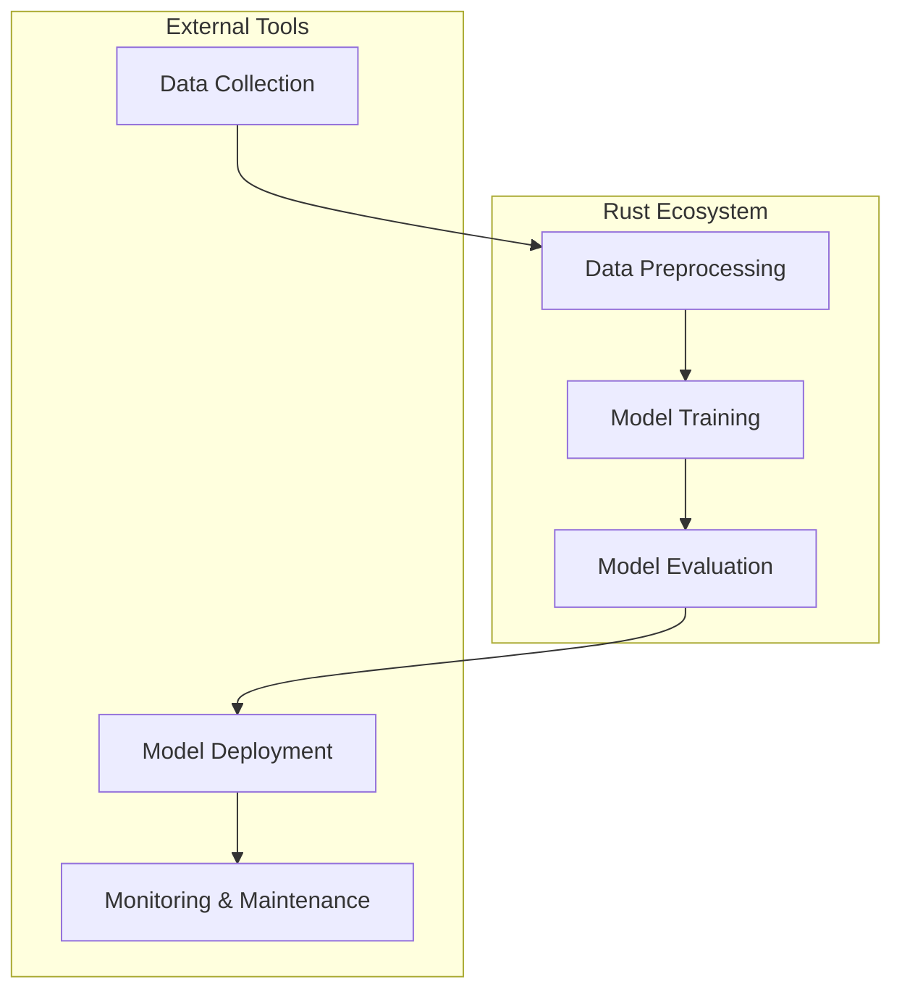

## 18.1. Overview of Machine Learning in Rust

Machine learning (ML) has become a cornerstone of modern technology, driving advancements in fields ranging from healthcare to finance. While languages like Python have traditionally dominated the ML landscape, Rust is emerging as a compelling alternative. In this section, we will explore the current state of machine learning in Rust, its growth, key libraries, benefits, challenges, and how it compares to more established ML languages.

### The Current State of Machine Learning in Rust

Rust, known for its performance and safety, is gaining traction in the machine learning community. Although still in its nascent stages compared to Python, Rust's ecosystem is rapidly evolving. The language's emphasis on memory safety and concurrency makes it an attractive choice for ML applications that require high performance and reliability.

#### Growth and Adoption

The adoption of Rust in machine learning is driven by several factors:

- **Performance**: Rust's ability to produce highly optimized binaries makes it suitable for computationally intensive tasks.
- **Safety**: Rust's ownership model ensures memory safety, reducing the risk of bugs that can plague ML applications.
- **Concurrency**: Rust's concurrency model allows for efficient parallel processing, a crucial aspect of ML workloads.

Despite these advantages, Rust's ML ecosystem is still growing. The community is actively developing libraries and frameworks to support various ML tasks, from data preprocessing to model deployment.

### Key Machine Learning Libraries and Frameworks in Rust

Several libraries and frameworks have emerged to support machine learning in Rust. Here are some of the most notable ones:

#### 1. `rust-learn`

`rust-learn` is a general-purpose machine learning library inspired by Python's `scikit-learn`. It provides a range of algorithms for classification, regression, and clustering. The library is designed to be easy to use, with a focus on performance and safety.

```rust
use rust_learn::prelude::*;
use rust_learn::linear_models::LogisticRegression;

fn main() {
    // Sample data
    let x = DenseMatrix::from_2d_array(&[
        &[1.0, 2.0],
        &[2.0, 3.0],
        &[3.0, 4.0],
    ]);
    let y = vec![0, 1, 0];

    // Create a logistic regression model
    let model = LogisticRegression::fit(&x, &y, Default::default()).unwrap();

    // Make predictions
    let predictions = model.predict(&x).unwrap();
    println!("{:?}", predictions);
}
```

#### 2. `linfa`

`linfa` is a comprehensive machine learning framework that aims to provide a suite of algorithms and utilities for data processing, model training, and evaluation. It is modular, allowing developers to use only the components they need.

#### 3. `tch-rs`

`tch-rs` is a Rust binding for PyTorch, enabling developers to leverage PyTorch's capabilities within Rust applications. This library is particularly useful for deep learning tasks.

#### 4. `ndarray`

While not exclusively an ML library, `ndarray` provides n-dimensional array support, which is essential for handling data in ML applications. It is often used in conjunction with other libraries to perform data manipulation and preprocessing.

### Benefits of Using Rust for Machine Learning

Rust offers several advantages for machine learning applications:

- **Performance**: Rust's performance is comparable to C and C++, making it suitable for high-performance ML tasks.
- **Safety**: The language's strict compile-time checks prevent common bugs, such as null pointer dereferencing and buffer overflows.
- **Concurrency**: Rust's concurrency model allows for efficient parallel processing, which is crucial for training large models.
- **Interoperability**: Rust can easily interface with C and Python, allowing developers to leverage existing ML libraries and tools.

### Challenges of Using Rust for Machine Learning

Despite its advantages, Rust also presents some challenges for ML development:

- **Ecosystem Maturity**: Rust's ML ecosystem is not as mature as Python's, which means fewer libraries and tools are available.
- **Learning Curve**: Rust's strict type system and ownership model can be challenging for developers new to the language.
- **Community Size**: The Rust ML community is smaller than those of more established languages, which can make finding support and resources more difficult.

### Comparing Rust's ML Capabilities with Python

Python has long been the go-to language for machine learning, thanks to its extensive libraries and ease of use. However, Rust offers several advantages that make it a viable alternative:

- **Performance**: Rust's performance is superior to Python's, making it suitable for tasks where speed is critical.
- **Safety**: Rust's memory safety features reduce the risk of bugs, which can be particularly beneficial in complex ML applications.
- **Concurrency**: Rust's concurrency model allows for more efficient parallel processing than Python's Global Interpreter Lock (GIL).

However, Python's extensive library ecosystem and ease of use make it the preferred choice for many ML practitioners, particularly for prototyping and experimentation.

### Setting the Context for Further Exploration

As we delve deeper into machine learning with Rust, we will explore specific libraries and frameworks in more detail, examine real-world use cases, and provide practical examples to help you get started with ML in Rust. Whether you're looking to leverage Rust's performance for high-stakes ML applications or simply curious about the language's capabilities, this guide will provide the insights and tools you need to succeed.

### Visualizing Rust's Role in Machine Learning

To better understand Rust's position in the machine learning landscape, let's visualize its ecosystem and how it interacts with other components.



**Figure 1**: This diagram illustrates the typical machine learning workflow, highlighting the stages where Rust can play a significant role, particularly in data preprocessing, model training, and evaluation.

### Try It Yourself

To get hands-on experience with machine learning in Rust, try modifying the `rust-learn` example provided earlier. Experiment with different algorithms or datasets to see how Rust handles various ML tasks. Consider integrating `tch-rs` for deep learning applications and explore how Rust's performance and safety features can enhance your ML projects.

### References and Further Reading

- [Rust Programming Language](https://www.rust-lang.org/)
- [rust-learn GitHub Repository](https://github.com/maciejkula/rustlearn)
- [linfa GitHub Repository](https://github.com/rust-ml/linfa)
- [tch-rs GitHub Repository](https://github.com/LaurentMazare/tch-rs)
- [ndarray GitHub Repository](https://github.com/rust-ndarray/ndarray)

### Knowledge Check

Before moving on to the next section, consider these questions to reinforce your understanding of machine learning in Rust:

- What are the key advantages of using Rust for machine learning?
- How does Rust's performance compare to Python's in ML applications?
- What are some of the challenges developers face when using Rust for ML?
- How can Rust's concurrency model benefit ML workloads?

### Embrace the Journey

Remember, this is just the beginning of your journey into machine learning with Rust. As you explore further, you'll discover more about Rust's capabilities and how it can enhance your ML projects. Keep experimenting, stay curious, and enjoy the journey!

## Quiz Time!



### What is one of the main advantages of using Rust for machine learning?

- [x] Performance comparable to C and C++
- [ ] Extensive library ecosystem
- [ ] Easy learning curve
- [ ] Large community size

> **Explanation:** Rust's performance is comparable to C and C++, making it suitable for high-performance ML tasks.

### Which library provides Rust bindings for PyTorch?

- [ ] rust-learn
- [ ] linfa
- [x] tch-rs
- [ ] ndarray

> **Explanation:** `tch-rs` is a Rust binding for PyTorch, enabling developers to leverage PyTorch's capabilities within Rust applications.

### What is a challenge of using Rust for machine learning?

- [ ] Extensive library ecosystem
- [x] Ecosystem maturity
- [ ] Easy learning curve
- [ ] Large community size

> **Explanation:** Rust's ML ecosystem is not as mature as Python's, which means fewer libraries and tools are available.

### How does Rust's concurrency model benefit ML workloads?

- [x] Efficient parallel processing
- [ ] Simplifies code structure
- [ ] Reduces memory usage
- [ ] Increases library availability

> **Explanation:** Rust's concurrency model allows for efficient parallel processing, which is crucial for training large models.

### What is `rust-learn` inspired by?

- [ ] TensorFlow
- [x] scikit-learn
- [ ] Keras
- [ ] PyTorch

> **Explanation:** `rust-learn` is a general-purpose machine learning library inspired by Python's `scikit-learn`.

### Which of the following is not a benefit of using Rust for ML?

- [ ] Performance
- [ ] Safety
- [ ] Concurrency
- [x] Extensive library ecosystem

> **Explanation:** While Rust offers performance, safety, and concurrency, its library ecosystem is not as extensive as Python's.

### What is a key feature of Rust that reduces the risk of bugs?

- [x] Memory safety
- [ ] Dynamic typing
- [ ] Global Interpreter Lock
- [ ] Extensive libraries

> **Explanation:** Rust's memory safety features reduce the risk of bugs, such as null pointer dereferencing and buffer overflows.

### Which library is used for n-dimensional array support in Rust?

- [ ] rust-learn
- [ ] linfa
- [ ] tch-rs
- [x] ndarray

> **Explanation:** `ndarray` provides n-dimensional array support, essential for handling data in ML applications.

### True or False: Rust's ML community is larger than Python's.

- [ ] True
- [x] False

> **Explanation:** The Rust ML community is smaller than Python's, which can make finding support and resources more difficult.

### What is a common use case for Rust in ML applications?

- [x] High-performance tasks
- [ ] Rapid prototyping
- [ ] Extensive library use
- [ ] Large community support

> **Explanation:** Rust's performance makes it suitable for high-performance ML tasks, where speed is critical.


