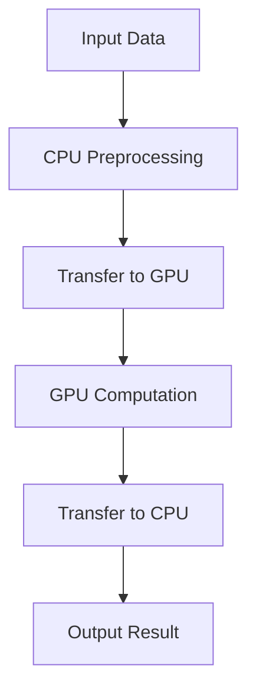

## 18.10. GPU Computing and Acceleration in Rust

In the realm of machine learning and data science, computational efficiency is paramount. As datasets grow larger and models become more complex, the demand for high-performance computing solutions increases. This is where Graphics Processing Units (GPUs) come into play. GPUs are designed to handle parallel operations efficiently, making them ideal for accelerating machine learning tasks. In this section, we will explore how Rust, a systems programming language known for its safety and performance, can be leveraged for GPU computing and acceleration.

### The Role of GPUs in Accelerating ML Computations

GPUs are specialized hardware designed to perform parallel processing. Unlike CPUs, which are optimized for sequential tasks, GPUs excel at handling multiple operations simultaneously. This makes them particularly effective for tasks such as matrix multiplications, which are common in machine learning algorithms.

#### Key Advantages of Using GPUs:

- **Parallelism**: GPUs can execute thousands of threads concurrently, significantly speeding up computations.
- **High Throughput**: They offer high memory bandwidth, allowing for faster data transfer and processing.
- **Energy Efficiency**: GPUs can perform more computations per watt compared to CPUs.

### Rust Bindings for GPU Programming

Rust provides several libraries and frameworks that allow developers to harness the power of GPUs. These include bindings for popular GPU programming interfaces like CUDA and OpenCL, as well as Rust-native solutions like `wgpu`.

#### Key Libraries:

- **`wgpu`**: A cross-platform graphics API that provides a safe and modern interface for GPU programming in Rust. It is part of the WebGPU standard and is designed to work on various platforms, including Windows, macOS, Linux, and the web.
- **`ocl`**: Provides bindings to the OpenCL API, allowing Rust programs to execute code on a wide range of GPU devices.
- **`cust`**: A Rust wrapper for CUDA, enabling developers to write GPU-accelerated code using NVIDIA's CUDA platform.

### Implementing GPU-Accelerated Computations in Rust

Let's dive into some practical examples of implementing GPU-accelerated computations in Rust using the aforementioned libraries.

#### Example 1: Matrix Multiplication with `wgpu`

Matrix multiplication is a fundamental operation in many machine learning algorithms. Here's how you can perform matrix multiplication using the `wgpu` crate:

```rust
// Import necessary crates
use wgpu::util::DeviceExt;

// Define the size of the matrices
const MATRIX_SIZE: usize = 512;

// Initialize the GPU device and queue
let instance = wgpu::Instance::new(wgpu::Backends::all());
let adapter = instance.request_adapter(&wgpu::RequestAdapterOptions::default()).await.unwrap();
let (device, queue) = adapter.request_device(&wgpu::DeviceDescriptor::default(), None).await.unwrap();

// Create buffers for the matrices
let matrix_a = vec![1.0f32; MATRIX_SIZE * MATRIX_SIZE];
let matrix_b = vec![1.0f32; MATRIX_SIZE * MATRIX_SIZE];
let matrix_c = vec![0.0f32; MATRIX_SIZE * MATRIX_SIZE];

let buffer_a = device.create_buffer_init(&wgpu::util::BufferInitDescriptor {
    label: Some("Matrix A"),
    contents: bytemuck::cast_slice(&matrix_a),
    usage: wgpu::BufferUsages::STORAGE,
});

let buffer_b = device.create_buffer_init(&wgpu::util::BufferInitDescriptor {
    label: Some("Matrix B"),
    contents: bytemuck::cast_slice(&matrix_b),
    usage: wgpu::BufferUsages::STORAGE,
});

let buffer_c = device.create_buffer_init(&wgpu::util::BufferInitDescriptor {
    label: Some("Matrix C"),
    contents: bytemuck::cast_slice(&matrix_c),
    usage: wgpu::BufferUsages::STORAGE | wgpu::BufferUsages::COPY_SRC,
});

// Define the compute shader
let shader = device.create_shader_module(&wgpu::ShaderModuleDescriptor {
    label: Some("Matrix Multiplication Shader"),
    source: wgpu::ShaderSource::Wgsl(include_str!("matrix_multiplication.wgsl").into()),
});

// Create the compute pipeline
let pipeline = device.create_compute_pipeline(&wgpu::ComputePipelineDescriptor {
    label: Some("Matrix Multiplication Pipeline"),
    layout: None,
    module: &shader,
    entry_point: "main",
});

// Execute the compute pipeline
let mut encoder = device.create_command_encoder(&wgpu::CommandEncoderDescriptor {
    label: Some("Matrix Multiplication Encoder"),
});

{
    let mut compute_pass = encoder.begin_compute_pass(&wgpu::ComputePassDescriptor {
        label: Some("Matrix Multiplication Pass"),
    });
    compute_pass.set_pipeline(&pipeline);
    compute_pass.set_bind_group(0, &bind_group, &[]);
    compute_pass.dispatch(MATRIX_SIZE as u32, MATRIX_SIZE as u32, 1);
}

queue.submit(Some(encoder.finish()));

// Read back the result
let buffer_slice = buffer_c.slice(..);
let mapping = buffer_slice.map_async(wgpu::MapMode::Read);
device.poll(wgpu::Maintain::Wait);
mapping.await.unwrap();
let result = buffer_slice.get_mapped_range();
let result_matrix: Vec<f32> = bytemuck::cast_slice(&result).to_vec();
```

In this example, we initialize a `wgpu` device and create buffers for the matrices. We then define a compute shader for matrix multiplication and execute it using a compute pipeline. Finally, we read back the result from the GPU.

#### Example 2: Vector Addition with `ocl`

The `ocl` crate provides bindings to the OpenCL API, allowing us to perform vector addition on the GPU:

```rust
// Import the ocl crate
use ocl::{ProQue, Buffer};

// Define the size of the vectors
const VECTOR_SIZE: usize = 1024;

// Create a ProQue (program + queue) for the OpenCL context
let pro_que = ProQue::builder()
    .src(r#"
        __kernel void add(__global const float* a, __global const float* b, __global float* result) {
            int idx = get_global_id(0);
            result[idx] = a[idx] + b[idx];
        }
    "#)
    .dims(VECTOR_SIZE)
    .build().unwrap();

// Create buffers for the vectors
let buffer_a = Buffer::<f32>::builder()
    .queue(pro_que.queue().clone())
    .flags(ocl::flags::MEM_READ_ONLY)
    .len(VECTOR_SIZE)
    .copy_host_slice(&vec![1.0f32; VECTOR_SIZE])
    .build().unwrap();

let buffer_b = Buffer::<f32>::builder()
    .queue(pro_que.queue().clone())
    .flags(ocl::flags::MEM_READ_ONLY)
    .len(VECTOR_SIZE)
    .copy_host_slice(&vec![2.0f32; VECTOR_SIZE])
    .build().unwrap();

let buffer_result = Buffer::<f32>::builder()
    .queue(pro_que.queue().clone())
    .flags(ocl::flags::MEM_WRITE_ONLY)
    .len(VECTOR_SIZE)
    .build().unwrap();

// Create and execute the kernel
let kernel = pro_que.kernel_builder("add")
    .arg(&buffer_a)
    .arg(&buffer_b)
    .arg(&buffer_result)
    .build().unwrap();

unsafe { kernel.enq().unwrap(); }

// Read the result
let mut result_vec = vec![0.0f32; VECTOR_SIZE];
buffer_result.read(&mut result_vec).enq().unwrap();
```

This example demonstrates how to set up an OpenCL context using `ocl`, create buffers for input and output vectors, and execute a kernel for vector addition.

### Challenges of GPU Programming and How Rust Addresses Them

GPU programming comes with its own set of challenges, including:

- **Memory Management**: Efficiently managing memory between the host (CPU) and device (GPU) is crucial for performance.
- **Concurrency**: Ensuring correct synchronization and avoiding race conditions in parallel code.
- **Debugging**: Debugging GPU code can be more complex than CPU code due to the parallel nature of execution.

Rust addresses these challenges through its strong emphasis on safety and concurrency:

- **Ownership and Borrowing**: Rust's ownership model helps prevent data races and ensures safe memory access.
- **Type Safety**: Rust's type system catches many errors at compile time, reducing runtime errors.
- **Concurrency Primitives**: Rust provides powerful concurrency primitives that can be leveraged in GPU programming.

### Performance Benchmarks and Comparisons with CPU Implementations

To truly appreciate the power of GPU acceleration, it's essential to compare performance benchmarks between GPU and CPU implementations. While specific benchmarks can vary based on the hardware and the nature of the task, GPUs generally outperform CPUs in tasks that can be parallelized.

#### Example Benchmark: Matrix Multiplication

Consider a matrix multiplication task with matrices of size 1024x1024. On a modern GPU, this task can be completed in a fraction of the time it would take on a CPU, thanks to the GPU's ability to perform many operations simultaneously.

### External Frameworks

Several external frameworks and libraries can further enhance GPU computing in Rust:

- **[`wgpu` crate](https://crates.io/crates/wgpu)**: Provides a safe and modern interface for GPU programming, supporting multiple platforms.
- **[`ocl` crate (OpenCL bindings)](https://crates.io/crates/ocl)**: Allows Rust programs to execute code on a wide range of GPU devices using OpenCL.
- **[`cust` crate (CUDA bindings)](https://github.com/denismerigoux/cust)**: A Rust wrapper for CUDA, enabling developers to write GPU-accelerated code using NVIDIA's CUDA platform.

### Try It Yourself

To deepen your understanding of GPU computing in Rust, try modifying the examples provided:

- **Experiment with Different Matrix Sizes**: Change the size of the matrices in the `wgpu` example and observe the performance impact.
- **Implement Additional Operations**: Extend the `ocl` example to perform other vector operations, such as subtraction or multiplication.
- **Explore Other Libraries**: Try using the `cust` crate to implement a simple CUDA kernel in Rust.

### Visualizing GPU Acceleration

To better understand how GPU acceleration works, let's visualize the process using a flowchart.



**Figure 1**: The flow of data in a GPU-accelerated computation. Data is preprocessed on the CPU, transferred to the GPU for computation, and then the results are transferred back to the CPU.

### Knowledge Check

Before we conclude, let's reinforce what we've learned with a few questions:

- What are the main advantages of using GPUs for machine learning tasks?
- How does Rust's ownership model help in GPU programming?
- What are some of the challenges associated with GPU programming?

### Embrace the Journey

Remember, GPU computing is a powerful tool in the arsenal of a Rust developer. As you continue to explore and experiment, you'll unlock new levels of performance and efficiency in your applications. Keep pushing the boundaries, stay curious, and enjoy the journey!

## Quiz Time!



### What is a primary advantage of using GPUs for machine learning tasks?

- [x] Parallelism
- [ ] Sequential processing
- [ ] Low power consumption
- [ ] High latency

> **Explanation:** GPUs are designed for parallel processing, which is ideal for machine learning tasks that require handling multiple operations simultaneously.

### Which Rust crate provides a safe and modern interface for GPU programming?

- [x] `wgpu`
- [ ] `ocl`
- [ ] `cust`
- [ ] `serde`

> **Explanation:** `wgpu` is a Rust crate that provides a safe and modern interface for GPU programming, supporting multiple platforms.

### How does Rust's ownership model benefit GPU programming?

- [x] Prevents data races
- [ ] Increases memory usage
- [ ] Reduces code readability
- [ ] Increases runtime errors

> **Explanation:** Rust's ownership model helps prevent data races and ensures safe memory access, which is crucial in parallel programming.

### What is a common challenge in GPU programming?

- [x] Memory management
- [ ] Sequential execution
- [ ] Low throughput
- [ ] High power consumption

> **Explanation:** Efficiently managing memory between the host (CPU) and device (GPU) is a common challenge in GPU programming.

### Which crate provides bindings to the OpenCL API in Rust?

- [x] `ocl`
- [ ] `wgpu`
- [ ] `cust`
- [ ] `tokio`

> **Explanation:** The `ocl` crate provides bindings to the OpenCL API, allowing Rust programs to execute code on a wide range of GPU devices.

### What is the role of the `cust` crate in Rust?

- [x] Provides CUDA bindings
- [ ] Provides OpenCL bindings
- [ ] Provides WebGPU bindings
- [ ] Provides HTTP bindings

> **Explanation:** The `cust` crate is a Rust wrapper for CUDA, enabling developers to write GPU-accelerated code using NVIDIA's CUDA platform.

### What is a typical use case for GPU acceleration in machine learning?

- [x] Matrix multiplication
- [ ] String manipulation
- [ ] File I/O operations
- [ ] Network requests

> **Explanation:** Matrix multiplication is a fundamental operation in many machine learning algorithms and benefits greatly from GPU acceleration.

### Which of the following is a Rust-native solution for GPU programming?

- [x] `wgpu`
- [ ] `cuda`
- [ ] `opencl`
- [ ] `serde`

> **Explanation:** `wgpu` is a Rust-native solution for GPU programming, providing a modern interface for graphics and compute tasks.

### What is a benefit of using GPUs over CPUs for certain tasks?

- [x] High throughput
- [ ] Lower cost
- [ ] Easier debugging
- [ ] Better sequential processing

> **Explanation:** GPUs offer high throughput, allowing for faster data transfer and processing, which is beneficial for parallelizable tasks.

### True or False: Rust's type system catches many errors at runtime.

- [ ] True
- [x] False

> **Explanation:** Rust's type system catches many errors at compile time, reducing runtime errors and improving code safety.


