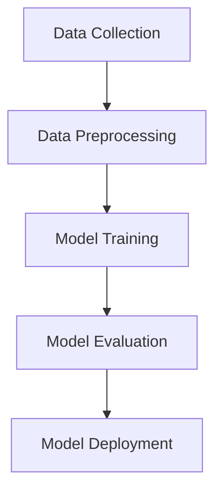

## 18.11. The Pipeline Pattern in ML Workflows

In the realm of machine learning (ML), the pipeline pattern is a powerful design approach that streamlines the workflow from data ingestion to model deployment. This pattern is particularly beneficial in Rust, a language known for its performance and safety features. In this section, we will explore how to implement the pipeline pattern in Rust, focusing on structuring code for sequential ML steps, building modular components, handling errors, and ensuring maintainability and scalability.

### Understanding the Pipeline Pattern

The pipeline pattern in ML workflows refers to a series of data processing steps, each transforming the data and passing it to the next step. This pattern is akin to an assembly line in a factory, where each station performs a specific task. In ML, these tasks typically include:

1. **Data Collection**: Gathering raw data from various sources.
2. **Data Preprocessing**: Cleaning and transforming data into a suitable format.
3. **Model Training**: Using processed data to train a machine learning model.
4. **Model Evaluation**: Assessing the model's performance.
5. **Model Deployment**: Integrating the model into a production environment.

### Structuring Code for ML Pipelines in Rust

To effectively implement the pipeline pattern in Rust, we need to structure our code to reflect these sequential steps. Rust's strong type system and ownership model make it an excellent choice for building robust and efficient ML pipelines.

#### Step 1: Data Collection

Data collection involves gathering data from various sources such as databases, APIs, or files. In Rust, we can use libraries like `reqwest` for HTTP requests or `csv` for reading CSV files.

```rust
use reqwest::blocking::get;
use std::error::Error;

fn fetch_data_from_api(url: &str) -> Result<String, Box<dyn Error>> {
    let response = get(url)?;
    let data = response.text()?;
    Ok(data)
}

fn main() -> Result<(), Box<dyn Error>> {
    let url = "https://api.example.com/data";
    let data = fetch_data_from_api(url)?;
    println!("Data fetched: {}", data);
    Ok(())
}
```

#### Step 2: Data Preprocessing

Data preprocessing is crucial for preparing data for model training. This step may involve cleaning, normalizing, or transforming data. Rust's `ndarray` library can be used for numerical operations.

```rust
use ndarray::Array2;

fn normalize_data(data: Array2<f64>) -> Array2<f64> {
    let mean = data.mean_axis(ndarray::Axis(0)).unwrap();
    let std_dev = data.std_axis(ndarray::Axis(0), 0.0);
    (data - &mean) / &std_dev
}

fn main() {
    let data = Array2::from_shape_vec((3, 3), vec![1.0, 2.0, 3.0, 4.0, 5.0, 6.0, 7.0, 8.0, 9.0]).unwrap();
    let normalized_data = normalize_data(data);
    println!("Normalized data: {:?}", normalized_data);
}
```

#### Step 3: Model Training

Model training involves using the preprocessed data to train a machine learning model. Rust's `linfa` library provides tools for building and training models.

```rust
use linfa::prelude::*;
use linfa_linear::LinearRegression;
use ndarray::Array2;

fn train_model(data: Array2<f64>, targets: Array2<f64>) -> Result<LinearRegression, Box<dyn Error>> {
    let model = LinearRegression::new();
    let fitted_model = model.fit(&data, &targets)?;
    Ok(fitted_model)
}

fn main() -> Result<(), Box<dyn Error>> {
    let data = Array2::from_shape_vec((3, 1), vec![1.0, 2.0, 3.0]).unwrap();
    let targets = Array2::from_shape_vec((3, 1), vec![2.0, 4.0, 6.0]).unwrap();
    let model = train_model(data, targets)?;
    println!("Model trained successfully");
    Ok(())
}
```

#### Step 4: Model Evaluation

Model evaluation assesses the performance of the trained model using metrics like accuracy or mean squared error.

```rust
fn evaluate_model(model: &LinearRegression, test_data: Array2<f64>, test_targets: Array2<f64>) -> f64 {
    let predictions = model.predict(&test_data).unwrap();
    let mse = predictions.mean_squared_error(&test_targets).unwrap();
    mse
}

fn main() -> Result<(), Box<dyn Error>> {
    let test_data = Array2::from_shape_vec((3, 1), vec![1.5, 2.5, 3.5]).unwrap();
    let test_targets = Array2::from_shape_vec((3, 1), vec![3.0, 5.0, 7.0]).unwrap();
    let model = train_model(test_data.clone(), test_targets.clone())?;
    let mse = evaluate_model(&model, test_data, test_targets);
    println!("Model evaluation - Mean Squared Error: {}", mse);
    Ok(())
}
```

#### Step 5: Model Deployment

Model deployment involves integrating the trained model into a production environment, often as a web service or API.

```rust
use actix_web::{web, App, HttpServer, Responder};

async fn predict(data: web::Json<Vec<f64>>) -> impl Responder {
    // Load the trained model and make predictions
    format!("Predicted values: {:?}", data)
}

#[actix_web::main]
async fn main() -> std::io::Result<()> {
    HttpServer::new(|| {
        App::new()
            .route("/predict", web::post().to(predict))
    })
    .bind("127.0.0.1:8080")?
    .run()
    .await
}
```

### Building Modular, Reusable Components

One of the key benefits of the pipeline pattern is the ability to build modular and reusable components. Each step in the pipeline can be encapsulated in a function or module, allowing for easy reuse and testing.

#### Example: Modular Data Preprocessing

```rust
mod data_preprocessing {
    use ndarray::Array2;

    pub fn clean_data(data: Array2<f64>) -> Array2<f64> {
        // Implement data cleaning logic
        data
    }

    pub fn transform_data(data: Array2<f64>) -> Array2<f64> {
        // Implement data transformation logic
        data
    }
}

fn main() {
    let data = Array2::from_shape_vec((3, 3), vec![1.0, 2.0, 3.0, 4.0, 5.0, 6.0, 7.0, 8.0, 9.0]).unwrap();
    let cleaned_data = data_preprocessing::clean_data(data.clone());
    let transformed_data = data_preprocessing::transform_data(cleaned_data);
    println!("Transformed data: {:?}", transformed_data);
}
```

### Error Handling and Logging in Pipelines

Error handling and logging are crucial for maintaining robust ML pipelines. Rust's `Result` and `Option` types provide a powerful mechanism for error handling, while crates like `log` and `env_logger` can be used for logging.

#### Error Handling Example

```rust
fn process_data(data: &str) -> Result<(), Box<dyn Error>> {
    if data.is_empty() {
        Err("Data is empty".into())
    } else {
        // Process data
        Ok(())
    }
}

fn main() {
    match process_data("") {
        Ok(_) => println!("Data processed successfully"),
        Err(e) => eprintln!("Error processing data: {}", e),
    }
}
```

#### Logging Example

```rust
use log::{info, warn};
use env_logger;

fn main() {
    env_logger::init();

    info!("Starting the data processing pipeline");
    warn!("This is a warning message");

    // Rest of the pipeline code
}
```

### Benefits of the Pipeline Pattern

The pipeline pattern offers several benefits in ML workflows:

- **Maintainability**: By breaking down the workflow into smaller, manageable steps, the code becomes easier to maintain and update.
- **Scalability**: Pipelines can be scaled horizontally by distributing tasks across multiple nodes or vertically by optimizing individual steps.
- **Reusability**: Modular components can be reused across different projects, reducing development time and effort.
- **Error Isolation**: Errors can be isolated to specific steps, making debugging and error handling more straightforward.

### Visualizing the Pipeline Pattern

To better understand the pipeline pattern, let's visualize it using a flowchart. This diagram represents the sequential flow of data through the pipeline steps.



**Figure 1**: Visualization of the ML Pipeline Pattern

### Try It Yourself

To deepen your understanding of the pipeline pattern, try modifying the code examples provided:

- **Experiment with Different Data Sources**: Modify the data collection step to fetch data from a different API or file format.
- **Implement Additional Preprocessing Steps**: Add more data preprocessing functions, such as feature scaling or encoding categorical variables.
- **Train Different Models**: Use the `linfa` library to train different types of models, such as decision trees or support vector machines.
- **Enhance Error Handling**: Implement more robust error handling and logging throughout the pipeline.

### Conclusion

The pipeline pattern is a powerful design approach for structuring machine learning workflows in Rust. By organizing the workflow into sequential steps, we can build modular, reusable components that are easy to maintain and scale. Rust's strong type system and error handling capabilities make it an excellent choice for implementing robust ML pipelines.

## Quiz Time!



### What is the primary purpose of the pipeline pattern in ML workflows?

- [x] To organize the workflow into sequential steps
- [ ] To increase the complexity of the code
- [ ] To reduce the performance of the application
- [ ] To make the code harder to maintain

> **Explanation:** The pipeline pattern organizes the workflow into sequential steps, making it easier to manage and maintain.

### Which Rust library is commonly used for numerical operations in ML workflows?

- [x] ndarray
- [ ] reqwest
- [ ] actix-web
- [ ] linfa

> **Explanation:** The `ndarray` library is used for numerical operations, such as matrix manipulations, in Rust.

### What is the role of the `Result` type in Rust?

- [x] To handle errors
- [ ] To store data
- [ ] To define functions
- [ ] To create threads

> **Explanation:** The `Result` type is used for error handling in Rust, allowing functions to return either a success or an error.

### How can you make a Rust ML pipeline more modular?

- [x] By encapsulating each step in a function or module
- [ ] By writing all code in a single function
- [ ] By avoiding the use of libraries
- [ ] By using global variables

> **Explanation:** Encapsulating each step in a function or module makes the pipeline more modular and reusable.

### What is a benefit of using the pipeline pattern in ML workflows?

- [x] Improved maintainability
- [ ] Increased code complexity
- [ ] Reduced performance
- [ ] Harder error handling

> **Explanation:** The pipeline pattern improves maintainability by organizing the workflow into manageable steps.

### Which crate can be used for logging in Rust?

- [x] log
- [ ] ndarray
- [ ] linfa
- [ ] actix-web

> **Explanation:** The `log` crate is used for logging in Rust applications.

### What is the purpose of the `env_logger` crate?

- [x] To initialize logging from environment variables
- [ ] To perform numerical operations
- [ ] To handle HTTP requests
- [ ] To train machine learning models

> **Explanation:** The `env_logger` crate initializes logging based on environment variables.

### What is a key advantage of modular components in ML pipelines?

- [x] Reusability across different projects
- [ ] Increased code complexity
- [ ] Reduced performance
- [ ] Harder error handling

> **Explanation:** Modular components can be reused across different projects, saving development time and effort.

### Which step in the ML pipeline involves assessing the model's performance?

- [x] Model Evaluation
- [ ] Data Collection
- [ ] Data Preprocessing
- [ ] Model Deployment

> **Explanation:** Model evaluation assesses the performance of the trained model using metrics like accuracy or mean squared error.

### True or False: The pipeline pattern can help isolate errors to specific steps.

- [x] True
- [ ] False

> **Explanation:** The pipeline pattern can help isolate errors to specific steps, making debugging and error handling more straightforward.


