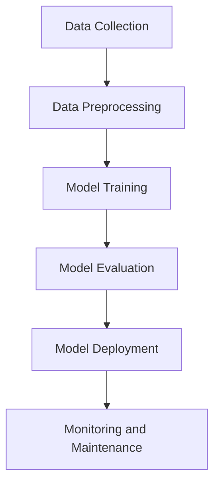

## 18.2. Libraries and Tools for Machine Learning (`rust-ml`, `linfa`)

Machine learning (ML) is a rapidly evolving field, and Rust is making its mark with robust libraries like `rust-ml` and `linfa`. These libraries provide the tools necessary to build efficient and reliable ML applications in Rust. In this section, we'll explore these libraries, their features, and how they can be used to implement common ML algorithms. We'll also discuss data handling, preprocessing, model evaluation, and integration with other tools.

### Introduction to `rust-ml` and `linfa`

#### `rust-ml`

The `rust-ml` organization is a collective effort to bring machine learning capabilities to the Rust ecosystem. It hosts several projects, including `linfa`, which is a comprehensive toolkit for ML in Rust. The goal of `rust-ml` is to provide a suite of libraries that are efficient, safe, and easy to use.

#### `linfa`

`linfa` is a Rust machine learning toolkit that aims to provide a comprehensive set of tools for building ML applications. It is inspired by Python's scikit-learn and offers a wide range of algorithms and utilities for data preprocessing, model training, and evaluation. `linfa` is modular, allowing developers to use only the components they need.

### Features and Capabilities

#### Core Features of `linfa`

- **Modular Design**: `linfa` is designed to be modular, allowing users to pick and choose the components they need for their specific use case.
- **Wide Range of Algorithms**: It supports various algorithms, including linear regression, logistic regression, k-means clustering, and more.
- **Data Preprocessing**: `linfa` provides tools for data normalization, standardization, and other preprocessing tasks.
- **Model Evaluation**: It includes utilities for evaluating model performance, such as cross-validation and metrics calculation.

#### Integration with Rust Ecosystem

- **Interoperability**: `linfa` integrates well with other Rust libraries, allowing seamless data handling and processing.
- **Performance**: Leveraging Rust's performance capabilities, `linfa` ensures efficient computation, making it suitable for large datasets.

### Implementing Common ML Algorithms

Let's explore how to implement some common machine learning algorithms using `linfa`.

#### Linear Regression with `linfa`

Linear regression is a fundamental algorithm in machine learning used for predicting a continuous target variable. Here's how you can implement it using `linfa`.

```rust
use linfa::prelude::*;
use linfa_linear::LinearRegression;
use ndarray::array;

fn main() {
    // Create a dataset
    let x = array![[1.0], [2.0], [3.0], [4.0]];
    let y = array![2.0, 3.0, 4.0, 5.0];

    // Fit a linear regression model
    let model = LinearRegression::default().fit(&x, &y).unwrap();

    // Predict new values
    let y_pred = model.predict(&x);

    println!("Predicted values: {:?}", y_pred);
}
```

In this example, we use `linfa_linear` to perform linear regression. The `fit` method trains the model, and `predict` is used to make predictions.

#### K-Means Clustering with `linfa`

K-means clustering is an unsupervised learning algorithm used to group data into clusters. Here's how you can implement it using `linfa`.

```rust
use linfa::prelude::*;
use linfa_clustering::KMeans;
use ndarray::array;

fn main() {
    // Create a dataset
    let data = array![[1.0, 2.0], [1.5, 1.8], [5.0, 8.0], [8.0, 8.0]];

    // Fit a k-means model
    let model = KMeans::params(2).fit(&data).unwrap();

    // Predict cluster memberships
    let memberships = model.predict(&data);

    println!("Cluster memberships: {:?}", memberships);
}
```

In this example, we use `linfa_clustering` to perform k-means clustering. The `params` method specifies the number of clusters, and `predict` assigns each data point to a cluster.

### Data Handling and Preprocessing

Data preprocessing is a crucial step in machine learning. `linfa` provides several utilities for handling and preprocessing data.

#### Normalization and Standardization

Normalization and standardization are common preprocessing techniques used to scale features to a similar range.

```rust
use linfa::prelude::*;
use linfa_preprocessing::StandardScaler;
use ndarray::array;

fn main() {
    // Create a dataset
    let data = array![[1.0, 2.0], [1.5, 1.8], [5.0, 8.0], [8.0, 8.0]];

    // Standardize the dataset
    let scaler = StandardScaler::fit(&data).unwrap();
    let standardized_data = scaler.transform(&data);

    println!("Standardized data: {:?}", standardized_data);
}
```

In this example, we use `linfa_preprocessing` to standardize the dataset. The `fit` method computes the mean and standard deviation, and `transform` scales the data.

### Model Evaluation

Evaluating the performance of a machine learning model is essential to ensure its effectiveness. `linfa` provides several utilities for model evaluation.

#### Cross-Validation

Cross-validation is a technique used to assess the generalizability of a model by partitioning the data into training and testing sets.

```rust
use linfa::prelude::*;
use linfa_linear::LinearRegression;
use linfa::dataset::Dataset;
use linfa::metrics::r2_score;
use ndarray::array;

fn main() {
    // Create a dataset
    let x = array![[1.0], [2.0], [3.0], [4.0]];
    let y = array![2.0, 3.0, 4.0, 5.0];
    let dataset = Dataset::new(x, y);

    // Perform cross-validation
    let model = LinearRegression::default();
    let scores = dataset.cross_validate(5, &model, r2_score).unwrap();

    println!("Cross-validation scores: {:?}", scores);
}
```

In this example, we use `linfa` to perform cross-validation on a linear regression model. The `cross_validate` method splits the data into 5 folds and computes the R² score for each fold.

### Integration with Other Tools

`linfa` and other `rust-ml` libraries integrate well with other Rust libraries and external tools, enhancing their capabilities.

#### Integration with `smartcore`

`smartcore` is another Rust library for machine learning that offers a wide range of algorithms. It can be used alongside `linfa` to extend the available tools.

#### Interoperability with Python

Rust's interoperability with Python through tools like `PyO3` allows developers to leverage Python's extensive ML ecosystem while benefiting from Rust's performance and safety.

### Maturity and Community Support

The `rust-ml` organization and `linfa` are relatively young compared to established ML libraries in other languages. However, they are actively developed and have a growing community. The libraries are well-documented, and contributors are responsive to issues and feature requests.

### Conclusion

Rust's machine learning libraries, such as `linfa` and `rust-ml`, provide powerful tools for building efficient and reliable ML applications. They offer a wide range of algorithms, data preprocessing utilities, and model evaluation techniques. While the ecosystem is still maturing, it shows great promise and is supported by an active community.

### Try It Yourself

Experiment with the examples provided in this section. Try modifying the datasets, changing algorithm parameters, or integrating with other Rust libraries. This hands-on approach will deepen your understanding of Rust's machine learning capabilities.

### Visualizing Rust's Machine Learning Workflow

Below is a diagram illustrating the typical workflow of a machine learning application using Rust libraries like `linfa`.



**Diagram Description**: This flowchart represents the typical stages of a machine learning application: data collection, preprocessing, model training, evaluation, deployment, and ongoing monitoring and maintenance.

## Quiz Time!



### Which Rust library is inspired by Python's scikit-learn?

- [x] linfa
- [ ] rust-ml
- [ ] smartcore
- [ ] PyO3

> **Explanation:** `linfa` is inspired by Python's scikit-learn and provides a comprehensive set of tools for machine learning in Rust.

### What is the primary goal of the `rust-ml` organization?

- [x] To provide a suite of libraries for machine learning in Rust
- [ ] To create a new programming language
- [ ] To develop web applications
- [ ] To build mobile applications

> **Explanation:** The `rust-ml` organization aims to provide a suite of libraries that bring machine learning capabilities to the Rust ecosystem.

### Which method is used to train a linear regression model in `linfa`?

- [x] fit
- [ ] train
- [ ] learn
- [ ] predict

> **Explanation:** The `fit` method is used to train a linear regression model in `linfa`.

### What does the `StandardScaler` do in `linfa`?

- [x] It standardizes the dataset by scaling features to have zero mean and unit variance.
- [ ] It normalizes the dataset to a range of 0 to 1.
- [ ] It reduces the dimensionality of the dataset.
- [ ] It clusters the dataset into groups.

> **Explanation:** The `StandardScaler` in `linfa` standardizes the dataset by scaling features to have zero mean and unit variance.

### Which of the following is a technique for evaluating model performance?

- [x] Cross-validation
- [ ] Clustering
- [ ] Normalization
- [ ] Standardization

> **Explanation:** Cross-validation is a technique used to evaluate the performance of a machine learning model by partitioning the data into training and testing sets.

### What is the purpose of the `predict` method in `linfa`?

- [x] To make predictions using a trained model
- [ ] To train a model
- [ ] To preprocess data
- [ ] To evaluate model performance

> **Explanation:** The `predict` method in `linfa` is used to make predictions using a trained model.

### How does `linfa` ensure efficient computation?

- [x] By leveraging Rust's performance capabilities
- [ ] By using Python's libraries
- [ ] By running on a virtual machine
- [ ] By using JavaScript

> **Explanation:** `linfa` ensures efficient computation by leveraging Rust's performance capabilities, making it suitable for large datasets.

### Which library can be used alongside `linfa` to extend available ML tools?

- [x] smartcore
- [ ] PyO3
- [ ] TensorFlow
- [ ] NumPy

> **Explanation:** `smartcore` is another Rust library for machine learning that can be used alongside `linfa` to extend the available tools.

### What is the benefit of Rust's interoperability with Python?

- [x] It allows developers to leverage Python's extensive ML ecosystem while benefiting from Rust's performance and safety.
- [ ] It enables Rust to run on Python interpreters.
- [ ] It allows Python code to be written in Rust syntax.
- [ ] It makes Rust a scripting language.

> **Explanation:** Rust's interoperability with Python allows developers to leverage Python's extensive ML ecosystem while benefiting from Rust's performance and safety.

### True or False: `linfa` is a mature library with a large community.

- [ ] True
- [x] False

> **Explanation:** While `linfa` is actively developed and has a growing community, it is still relatively young compared to established ML libraries in other languages.



Remember, this is just the beginning. As you progress, you'll build more complex and interactive machine learning applications. Keep experimenting, stay curious, and enjoy the journey!
