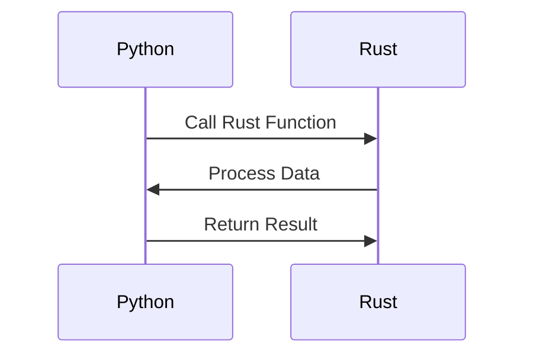

## 18.3. Interoperability with Python via `PyO3` and `rust-numpy`

In the realm of machine learning and data science, Python has established itself as a dominant language due to its simplicity and the vast ecosystem of libraries like NumPy, Pandas, and TensorFlow. However, Python's performance limitations can be a bottleneck in computationally intensive tasks. Rust, with its focus on performance and safety, offers a compelling alternative. By leveraging tools like `PyO3` and `rust-numpy`, we can bridge Rust and Python, combining the best of both worlds.

### Introduction to `PyO3` and `rust-numpy`

**PyO3** is a Rust library that facilitates the creation of Python bindings for Rust code. It allows Rust functions to be called from Python and vice versa, enabling seamless integration between the two languages. PyO3 provides a way to write Python extensions in Rust, offering a significant performance boost for computationally intensive tasks.

**rust-numpy** is a crate built on top of PyO3 that provides Rust bindings for NumPy, one of Python's most popular libraries for numerical computing. It allows Rust code to manipulate NumPy arrays, making it easier to integrate Rust's performance advantages into Python's data science workflows.

### Calling Python ML Libraries from Rust

To demonstrate how Rust can call Python libraries, let's consider an example where we use NumPy to perform a simple matrix multiplication. We'll write a Rust function that calls a Python function using PyO3.

#### Setting Up Your Environment

First, ensure you have Python and Rust installed on your system. You can install PyO3 and rust-numpy by adding the following dependencies to your `Cargo.toml`:

```toml
[dependencies]
pyo3 = { version = "0.15", features = ["extension-module"] }
numpy = "0.15"
```

#### Example: Matrix Multiplication

Let's write a Rust function that calls a Python function to perform matrix multiplication.

```rust
use pyo3::prelude::*;
use numpy::{PyArray2, IntoPyArray};

#[pyfunction]
fn multiply_matrices<'py>(py: Python<'py>, a: &PyArray2<f64>, b: &PyArray2<f64>) -> PyResult<&'py PyArray2<f64>> {
    let result = a.dot(b)?;
    Ok(result.into_pyarray(py))
}

#[pymodule]
fn rust_numpy_example(py: Python, m: &PyModule) -> PyResult<()> {
    m.add_function(wrap_pyfunction!(multiply_matrices, m)?)?;
    Ok(())
}
```

In this example, we define a Rust function `multiply_matrices` that takes two NumPy arrays as input and returns their product. The function uses the `dot` method from NumPy to perform the multiplication.

#### Building and Running the Example

To build the Rust extension, create a `setup.py` file in your project directory:

```python
from setuptools import setup
from setuptools_rust import RustExtension

setup(
    name="rust_numpy_example",
    version="0.1",
    rust_extensions=[RustExtension("rust_numpy_example.rust_numpy_example", "Cargo.toml", binding="pyo3")],
    packages=["rust_numpy_example"],
    zip_safe=False,
)
```

Run the following command to build and install the package:

```bash
$ python setup.py install
```

Now, you can use the Rust function in Python:

```python
import numpy as np
from rust_numpy_example import multiply_matrices

a = np.array([[1.0, 2.0], [3.0, 4.0]])
b = np.array([[5.0, 6.0], [7.0, 8.0]])

result = multiply_matrices(a, b)
print(result)
```

### Embedding Rust Code in Python Applications

Embedding Rust code in Python applications allows you to leverage Rust's performance for specific tasks while maintaining the flexibility of Python. This approach is particularly useful in scenarios where performance is critical, such as real-time data processing or complex numerical computations.

#### Example: A Rust-Powered Data Processing Pipeline

Consider a scenario where you need to process large datasets efficiently. You can write a Rust function to handle the computationally intensive parts of the pipeline and call it from Python.

```rust
use pyo3::prelude::*;
use numpy::{PyArray1, IntoPyArray};

#[pyfunction]
fn process_data<'py>(py: Python<'py>, data: &PyArray1<f64>) -> PyResult<&'py PyArray1<f64>> {
    let processed_data: Vec<f64> = data.as_slice()?.iter().map(|x| x * 2.0).collect();
    Ok(processed_data.into_pyarray(py))
}

#[pymodule]
fn rust_data_processor(py: Python, m: &PyModule) -> PyResult<()> {
    m.add_function(wrap_pyfunction!(process_data, m)?)?;
    Ok(())
}
```

In this example, the `process_data` function doubles each element in the input array. This simple operation demonstrates how Rust can efficiently handle data processing tasks.

### Performance Considerations and Data Exchange

When integrating Rust and Python, it's essential to consider the performance implications of data exchange between the two languages. While Rust offers significant performance advantages, the overhead of transferring data between Rust and Python can negate these benefits if not managed carefully.

#### Minimizing Data Transfer Overhead

To minimize data transfer overhead, consider the following strategies:

- **Batch Processing**: Process data in batches to reduce the number of data transfers.
- **Use Shared Memory**: Where possible, use shared memory to avoid copying data between Rust and Python.
- **Optimize Data Structures**: Use data structures that are efficient for both Rust and Python.

### Packaging and Distributing Rust-Python Hybrid Applications

Packaging and distributing Rust-Python hybrid applications can be challenging due to the need to manage dependencies for both languages. However, tools like `setuptools-rust` simplify this process by allowing you to build and distribute Rust extensions as Python packages.

#### Example: Packaging a Rust Extension

To package a Rust extension, create a `setup.py` file as shown earlier and use `setuptools-rust` to build and distribute the package. This approach ensures that your Rust code is compiled and linked correctly when the package is installed.

### External Frameworks

- [PyO3](https://pyo3.rs/): A Rust library for writing Python extensions in Rust.
- [`rust-numpy` crate](https://github.com/PyO3/rust-numpy): Rust bindings for NumPy, enabling Rust to manipulate NumPy arrays.

### Visualizing Rust-Python Interoperability

To better understand the interaction between Rust and Python, let's visualize the data flow using a sequence diagram.



**Diagram Description**: This sequence diagram illustrates the interaction between Python and Rust. Python calls a Rust function, Rust processes the data, and the result is returned to Python.

### Knowledge Check

- **What are the primary benefits of using Rust with Python?**
- **How can you minimize data transfer overhead between Rust and Python?**
- **What tools can you use to package Rust-Python hybrid applications?**

### Embrace the Journey

Remember, integrating Rust with Python is just the beginning. As you explore this powerful combination, you'll discover new ways to optimize your applications and leverage the strengths of both languages. Keep experimenting, stay curious, and enjoy the journey!

## Quiz Time!



### What is PyO3 used for in Rust?

- [x] Creating Python bindings for Rust code
- [ ] Compiling Rust code to Python bytecode
- [ ] Converting Python code to Rust
- [ ] Debugging Rust code in Python

> **Explanation:** PyO3 is a Rust library that facilitates the creation of Python bindings for Rust code, allowing Rust functions to be called from Python.

### What does the `rust-numpy` crate provide?

- [x] Rust bindings for NumPy
- [ ] A Python interpreter in Rust
- [ ] A Rust compiler for Python
- [ ] A GUI library for Rust

> **Explanation:** The `rust-numpy` crate provides Rust bindings for NumPy, enabling Rust to manipulate NumPy arrays.

### How can you minimize data transfer overhead between Rust and Python?

- [x] Process data in batches
- [x] Use shared memory
- [ ] Use separate processes
- [ ] Avoid using NumPy

> **Explanation:** Processing data in batches and using shared memory can help minimize data transfer overhead between Rust and Python.

### What tool can you use to package Rust extensions as Python packages?

- [x] setuptools-rust
- [ ] cargo
- [ ] pip
- [ ] conda

> **Explanation:** `setuptools-rust` is a tool that allows you to build and distribute Rust extensions as Python packages.

### What is the primary advantage of embedding Rust code in Python applications?

- [x] Leveraging Rust's performance for specific tasks
- [ ] Simplifying Python code
- [ ] Reducing Python's memory usage
- [ ] Increasing Python's syntax complexity

> **Explanation:** Embedding Rust code in Python applications allows you to leverage Rust's performance for specific tasks, such as computationally intensive operations.

### Which of the following is a strategy to optimize data structures for both Rust and Python?

- [x] Use efficient data structures
- [ ] Use only Python data structures
- [ ] Use only Rust data structures
- [ ] Avoid using data structures

> **Explanation:** Using efficient data structures that are suitable for both Rust and Python can help optimize performance.

### What is the role of `setup.py` in packaging Rust-Python applications?

- [x] It specifies how to build and distribute the package
- [ ] It compiles Rust code to Python
- [ ] It runs Python code in Rust
- [ ] It converts Python code to Rust

> **Explanation:** The `setup.py` file specifies how to build and distribute the package, including compiling and linking Rust code.

### How does PyO3 facilitate Rust-Python interoperability?

- [x] By allowing Rust functions to be called from Python
- [ ] By converting Rust code to Python
- [ ] By compiling Python code to Rust
- [ ] By debugging Python code in Rust

> **Explanation:** PyO3 facilitates Rust-Python interoperability by allowing Rust functions to be called from Python.

### What is a potential challenge when integrating Rust and Python?

- [x] Managing dependencies for both languages
- [ ] Writing Python code in Rust
- [ ] Compiling Python code to Rust
- [ ] Debugging Rust code in Python

> **Explanation:** Managing dependencies for both languages can be a challenge when integrating Rust and Python.

### True or False: Rust can be used to enhance the performance of Python applications.

- [x] True
- [ ] False

> **Explanation:** True. Rust can be used to enhance the performance of Python applications by handling computationally intensive tasks.


