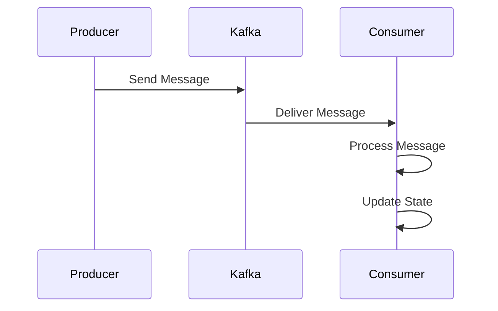

## 18.4. Streaming Data Processing for ML Applications

In the rapidly evolving field of machine learning (ML), the ability to process data in real-time is becoming increasingly important. Streaming data processing allows ML applications to handle continuous flows of data, enabling real-time analytics, online learning, and anomaly detection. In this section, we will explore how Rust, with its strong emphasis on performance and safety, can be leveraged to implement efficient streaming data processing workflows.

### The Importance of Real-Time Data in ML Applications

Real-time data processing is crucial for several ML applications:

- **Online Learning**: ML models that update continuously as new data arrives, allowing them to adapt to changing patterns.
- **Anomaly Detection**: Identifying unusual patterns or outliers in data streams, which is vital for fraud detection, network security, and system monitoring.
- **Real-Time Analytics**: Providing immediate insights from data as it is generated, which is essential for decision-making in dynamic environments.

### Processing Streaming Data Using Rust

Rust's concurrency model, memory safety, and performance make it an excellent choice for streaming data processing. Let's delve into how Rust can be used to process streaming data effectively.

#### Integrating with Streaming Platforms

To handle streaming data, we often integrate with platforms like Apache Kafka or Fluvio. These platforms provide the infrastructure to manage data streams efficiently.

##### Using the `rdkafka` Crate

The `rdkafka` crate is a Rust client for Apache Kafka, allowing us to produce and consume messages from Kafka topics. Here's a basic example of how to set up a Kafka consumer in Rust:

```rust
use rdkafka::consumer::{Consumer, StreamConsumer};
use rdkafka::ClientConfig;
use rdkafka::Message;
use futures::stream::StreamExt;

#[tokio::main]
async fn main() {
    let consumer: StreamConsumer = ClientConfig::new()
        .set("group.id", "example_group")
        .set("bootstrap.servers", "localhost:9092")
        .create()
        .expect("Consumer creation failed");

    consumer.subscribe(&["example_topic"]).expect("Subscription failed");

    let mut message_stream = consumer.start();

    while let Some(result) = message_stream.next().await {
        match result {
            Ok(message) => {
                if let Some(payload) = message.payload_view::<str>() {
                    println!("Received message: {:?}", payload);
                }
            }
            Err(e) => eprintln!("Error receiving message: {:?}", e),
        }
    }
}
```

In this example, we use the `rdkafka` crate to create a Kafka consumer that listens to messages from a specified topic. The `tokio` runtime is used to handle asynchronous operations.

##### Using Fluvio

Fluvio is an event streaming platform written in Rust, designed for high performance and ease of use. Here's how you can set up a simple Fluvio consumer:

```rust
use fluvio::{Fluvio, FluvioError, ConsumerConfig};

#[tokio::main]
async fn main() -> Result<(), FluvioError> {
    let fluvio = Fluvio::connect().await?;
    let consumer = fluvio
        .consumer("example_topic")
        .await?;

    let mut stream = consumer.stream(0).await?;

    while let Some(Ok(record)) = stream.next().await {
        let value = String::from_utf8_lossy(record.value());
        println!("Received: {}", value);
    }

    Ok(())
}
```

This example demonstrates how to connect to a Fluvio cluster and consume messages from a topic. Fluvio's API is designed to be straightforward, making it easy to integrate into Rust applications.

### Considerations for Latency, Throughput, and Scalability

When processing streaming data, it's essential to consider:

- **Latency**: The time it takes for data to be processed after it is received. Rust's low-level control over system resources helps minimize latency.
- **Throughput**: The amount of data processed in a given time. Rust's performance characteristics enable high throughput.
- **Scalability**: The ability to handle increasing amounts of data. Rust's concurrency model supports scalable applications.

### State Management and Windowing

In streaming data processing, managing state and applying windowing techniques are critical for aggregating and analyzing data over time.

#### State Management

State management involves keeping track of information across multiple data points. In Rust, state can be managed using data structures like `HashMap` or more advanced state management libraries.

#### Windowing

Windowing allows us to divide data streams into manageable chunks for processing. Common windowing strategies include:

- **Tumbling Windows**: Fixed-size, non-overlapping windows.
- **Sliding Windows**: Overlapping windows that slide over time.
- **Session Windows**: Windows based on periods of activity separated by inactivity.

Here's a simple example of a tumbling window implementation in Rust:

```rust
use std::collections::VecDeque;
use std::time::{Duration, Instant};

struct TumblingWindow {
    window_size: Duration,
    data: VecDeque<(Instant, i32)>,
}

impl TumblingWindow {
    fn new(window_size: Duration) -> Self {
        TumblingWindow {
            window_size,
            data: VecDeque::new(),
        }
    }

    fn add(&mut self, value: i32) {
        let now = Instant::now();
        self.data.push_back((now, value));
        self.evict_old_entries();
    }

    fn evict_old_entries(&mut self) {
        let now = Instant::now();
        while let Some(&(timestamp, _)) = self.data.front() {
            if now.duration_since(timestamp) > self.window_size {
                self.data.pop_front();
            } else {
                break;
            }
        }
    }

    fn sum(&self) -> i32 {
        self.data.iter().map(|&(_, value)| value).sum()
    }
}

fn main() {
    let mut window = TumblingWindow::new(Duration::new(10, 0));

    window.add(5);
    window.add(10);
    println!("Sum: {}", window.sum());

    std::thread::sleep(Duration::new(11, 0));
    window.add(15);
    println!("Sum after eviction: {}", window.sum());
}
```

This code defines a simple tumbling window that sums integers over a specified duration. The `evict_old_entries` method removes data points that fall outside the window.

### Try It Yourself

To deepen your understanding, try modifying the code examples:

- **Kafka Example**: Change the topic name and observe how the consumer behaves with different data.
- **Fluvio Example**: Experiment with different consumer configurations and observe the impact on performance.
- **Tumbling Window**: Implement a sliding window and compare its behavior to the tumbling window.

### Visualizing Streaming Data Processing

To better understand the flow of data in a streaming application, let's visualize the process using a sequence diagram.



This diagram illustrates the flow of data from a producer to a consumer through Kafka, highlighting the key steps in processing streaming data.

### References and Links

- [Apache Kafka Documentation](https://kafka.apache.org/documentation/)
- [Fluvio Documentation](https://www.fluvio.io/docs/)
- [rdkafka crate on crates.io](https://crates.io/crates/rdkafka)

### Knowledge Check

- What are the benefits of using Rust for streaming data processing?
- How does windowing help in managing streaming data?
- What are the differences between tumbling and sliding windows?

### Embrace the Journey

Remember, mastering streaming data processing in Rust is a journey. As you experiment with different techniques and tools, you'll gain a deeper understanding of how to build efficient, real-time ML applications. Keep exploring, stay curious, and enjoy the process!

## Quiz Time!



### What is the primary advantage of using Rust for streaming data processing?

- [x] Memory safety and performance
- [ ] Built-in garbage collection
- [ ] Dynamic typing
- [ ] Lack of concurrency support

> **Explanation:** Rust provides memory safety and high performance, which are crucial for efficient streaming data processing.

### Which crate is commonly used for integrating Rust with Apache Kafka?

- [x] `rdkafka`
- [ ] `serde`
- [ ] `tokio`
- [ ] `hyper`

> **Explanation:** The `rdkafka` crate is a Rust client for Apache Kafka, enabling message production and consumption.

### What is a key consideration when processing streaming data?

- [x] Latency
- [ ] Static typing
- [ ] Code readability
- [ ] Compilation time

> **Explanation:** Latency is crucial in streaming data processing to ensure timely data handling.

### What is the purpose of windowing in streaming data processing?

- [x] To divide data streams into manageable chunks
- [ ] To increase data redundancy
- [ ] To enhance data encryption
- [ ] To simplify data serialization

> **Explanation:** Windowing helps manage data streams by dividing them into chunks for processing.

### Which of the following is a type of windowing strategy?

- [x] Tumbling Windows
- [ ] Rotating Windows
- [ ] Circular Windows
- [ ] Expanding Windows

> **Explanation:** Tumbling windows are fixed-size, non-overlapping windows used in streaming data processing.

### How does Fluvio differ from Kafka?

- [x] Fluvio is written in Rust and designed for high performance
- [ ] Fluvio is a database management system
- [ ] Fluvio does not support event streaming
- [ ] Fluvio is a web framework

> **Explanation:** Fluvio is an event streaming platform written in Rust, focusing on high performance.

### What is a common use case for real-time data processing in ML?

- [x] Anomaly detection
- [ ] Static data analysis
- [ ] Batch processing
- [ ] Data archiving

> **Explanation:** Real-time data processing is often used for anomaly detection in ML applications.

### Which Rust feature aids in minimizing latency in streaming applications?

- [x] Low-level control over system resources
- [ ] Built-in garbage collection
- [ ] Dynamic typing
- [ ] Lack of concurrency support

> **Explanation:** Rust's low-level control over system resources helps minimize latency in streaming applications.

### What is the role of a Kafka consumer in a streaming application?

- [x] To receive and process messages from Kafka topics
- [ ] To produce messages to Kafka topics
- [ ] To manage Kafka clusters
- [ ] To store data in a database

> **Explanation:** A Kafka consumer receives and processes messages from Kafka topics.

### True or False: Sliding windows are non-overlapping windows used in streaming data processing.

- [ ] True
- [x] False

> **Explanation:** Sliding windows are overlapping windows that slide over time, unlike non-overlapping tumbling windows.


