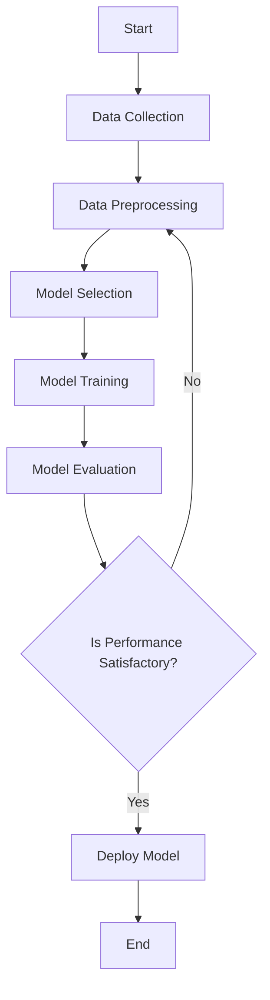

## 18.5. Building Predictive Models

In this section, we delve into the exciting world of building predictive models using Rust. Rust is not traditionally known for machine learning, but its ecosystem is rapidly evolving to support data science and machine learning tasks. We will explore how to leverage Rust libraries to build and train predictive models for regression, classification, and clustering tasks. We'll also cover essential data preprocessing steps, model evaluation metrics, and the unique challenges and solutions when working with Rust in machine learning model development.

### Introduction to Predictive Modeling in Rust

Predictive modeling involves using statistical techniques to predict future outcomes based on historical data. In Rust, several libraries are emerging to support machine learning tasks, such as `linfa`, `smartcore`, and `rust-learn`. These libraries provide implementations of popular algorithms like linear regression, decision trees, and k-means clustering.

#### Algorithms Supported by Rust ML Libraries

1. **Linear Regression**: A fundamental algorithm for regression tasks that models the relationship between a dependent variable and one or more independent variables.
2. **Decision Trees**: Used for both classification and regression tasks, decision trees split the data into branches to make predictions.
3. **K-Means Clustering**: A popular unsupervised learning algorithm used to partition data into k distinct clusters based on feature similarity.

### Data Preprocessing

Before building predictive models, it's crucial to preprocess the data to ensure the model's accuracy and efficiency. Data preprocessing involves several steps, including feature scaling, encoding categorical variables, and handling missing values.

#### Feature Scaling

Feature scaling is essential to ensure that all features contribute equally to the distance calculations in algorithms like k-means clustering. Common scaling techniques include:

- **Standardization**: Rescales features to have a mean of 0 and a standard deviation of 1.
- **Normalization**: Rescales features to a range of [0, 1].

```rust
// Example of feature scaling using the linfa-preprocessing crate
use linfa_preprocessing::StandardScaler;
use ndarray::array;

fn main() {
    let data = array![[1.0, 2.0], [3.0, 4.0], [5.0, 6.0]];
    let scaler = StandardScaler::fit(&data).unwrap();
    let scaled_data = scaler.transform(&data);
    println!("Scaled data: {:?}", scaled_data);
}
```

#### Encoding Categorical Variables

Categorical variables need to be converted into numerical format for most machine learning algorithms. Techniques include:

- **One-Hot Encoding**: Converts categorical variables into a binary matrix.
- **Label Encoding**: Assigns a unique integer to each category.

### Building and Training Models

Let's explore how to build and train predictive models using Rust libraries.

#### Linear Regression Example

```rust
use linfa::traits::Fit;
use linfa_linear::LinearRegression;
use ndarray::array;

fn main() {
    // Sample data: features and target
    let x = array![[1.0], [2.0], [3.0], [4.0]];
    let y = array![2.0, 3.0, 4.0, 5.0];

    // Create and train the linear regression model
    let model = LinearRegression::default().fit(&x, &y).unwrap();

    // Predict using the trained model
    let prediction = model.predict(&x);
    println!("Predictions: {:?}", prediction);
}
```

#### Decision Trees Example

```rust
use linfa_trees::DecisionTree;
use linfa::traits::Fit;
use ndarray::array;

fn main() {
    // Sample data: features and target
    let x = array![[1.0, 2.0], [2.0, 3.0], [3.0, 4.0], [4.0, 5.0]];
    let y = array![0, 1, 0, 1];

    // Create and train the decision tree model
    let model = DecisionTree::default().fit(&x, &y).unwrap();

    // Predict using the trained model
    let prediction = model.predict(&x);
    println!("Predictions: {:?}", prediction);
}
```

#### K-Means Clustering Example

```rust
use linfa_clustering::{KMeans, KMeansHyperParams};
use ndarray::array;

fn main() {
    // Sample data
    let data = array![[1.0, 2.0], [1.5, 1.8], [5.0, 8.0], [8.0, 8.0]];

    // Define the number of clusters
    let n_clusters = 2;

    // Create and train the k-means model
    let hyperparams = KMeansHyperParams::new(n_clusters);
    let model = KMeans::fit(&data, hyperparams).unwrap();

    // Predict cluster assignments
    let clusters = model.predict(&data);
    println!("Cluster assignments: {:?}", clusters);
}
```

### Evaluating Model Performance

Evaluating the performance of predictive models is crucial to ensure their effectiveness. Common evaluation metrics include:

- **Accuracy**: The ratio of correctly predicted instances to the total instances.
- **Precision**: The ratio of correctly predicted positive observations to the total predicted positives.
- **Recall**: The ratio of correctly predicted positive observations to all actual positives.

```rust
// Example of calculating accuracy
fn calculate_accuracy(predictions: &[usize], targets: &[usize]) -> f64 {
    let correct_predictions = predictions.iter().zip(targets.iter()).filter(|&(p, t)| p == t).count();
    correct_predictions as f64 / targets.len() as f64
}

fn main() {
    let predictions = vec![0, 1, 0, 1];
    let targets = vec![0, 1, 1, 1];
    let accuracy = calculate_accuracy(&predictions, &targets);
    println!("Accuracy: {:.2}%", accuracy * 100.0);
}
```

### Challenges and Solutions in Rust ML Development

Working with Rust for machine learning presents unique challenges, such as:

- **Limited Library Support**: Rust's ecosystem for machine learning is still growing, and some advanced algorithms may not be available.
- **Complexity of Data Handling**: Rust's strict type system and ownership model can make data manipulation more complex compared to languages like Python.
- **Performance Optimization**: While Rust is known for its performance, optimizing ML code for speed and memory usage requires careful consideration.

#### Solutions

- **Leverage Existing Libraries**: Use libraries like `linfa` and `smartcore` to access a wide range of algorithms and utilities.
- **Utilize Rust's Concurrency**: Rust's concurrency model can be leveraged to parallelize data processing and model training tasks.
- **Optimize Data Structures**: Use efficient data structures and algorithms to minimize memory usage and improve performance.

### Try It Yourself

Experiment with the provided code examples by modifying the datasets, adjusting hyperparameters, or implementing additional evaluation metrics. This hands-on approach will deepen your understanding of building predictive models in Rust.

### Visualizing the Workflow

To better understand the workflow of building predictive models in Rust, let's visualize the process using a flowchart.



This flowchart illustrates the iterative process of building predictive models, from data collection to deployment.

### References and Further Reading

- [Linfa Documentation](https://docs.rs/linfa/latest/linfa/)
- [Rust-Learn GitHub Repository](https://github.com/maciejkula/rustlearn)
- [SmartCore Documentation](https://docs.rs/smartcore/latest/smartcore/)

### Knowledge Check

1. What is the purpose of feature scaling in machine learning?
2. How does one-hot encoding differ from label encoding?
3. What are the key differences between linear regression and decision trees?
4. How can Rust's concurrency model be leveraged in machine learning?
5. What are some common challenges when using Rust for machine learning?

### Embrace the Journey

Building predictive models in Rust is an exciting journey that combines the power of Rust's performance with the potential of machine learning. As you explore this field, remember to stay curious, experiment with different techniques, and enjoy the process of learning and discovery.

## Quiz Time!



### What is the primary purpose of feature scaling in machine learning?

- [x] To ensure all features contribute equally to distance calculations
- [ ] To increase the size of the dataset
- [ ] To convert categorical variables into numerical format
- [ ] To remove outliers from the dataset

> **Explanation:** Feature scaling ensures that all features contribute equally to distance calculations, which is crucial for algorithms like k-means clustering.

### Which Rust library is commonly used for building predictive models?

- [x] linfa
- [ ] serde
- [ ] tokio
- [ ] hyper

> **Explanation:** The `linfa` library is commonly used for building predictive models in Rust.

### What is one-hot encoding used for?

- [x] Converting categorical variables into a binary matrix
- [ ] Scaling numerical features
- [ ] Handling missing values
- [ ] Reducing dataset size

> **Explanation:** One-hot encoding is used to convert categorical variables into a binary matrix, making them suitable for machine learning algorithms.

### Which algorithm is suitable for unsupervised learning tasks?

- [x] K-Means Clustering
- [ ] Linear Regression
- [ ] Decision Trees
- [ ] Logistic Regression

> **Explanation:** K-Means Clustering is suitable for unsupervised learning tasks, as it partitions data into clusters based on feature similarity.

### What is the main challenge of using Rust for machine learning?

- [x] Limited library support
- [ ] Lack of concurrency features
- [ ] Poor performance
- [ ] Inability to handle large datasets

> **Explanation:** One of the main challenges of using Rust for machine learning is the limited library support compared to more established languages like Python.

### How can Rust's concurrency model benefit machine learning tasks?

- [x] By parallelizing data processing and model training
- [ ] By simplifying data manipulation
- [ ] By reducing memory usage
- [ ] By increasing dataset size

> **Explanation:** Rust's concurrency model can be leveraged to parallelize data processing and model training tasks, improving efficiency.

### What is the purpose of model evaluation in machine learning?

- [x] To assess the effectiveness of a predictive model
- [ ] To increase the size of the dataset
- [ ] To convert categorical variables into numerical format
- [ ] To remove outliers from the dataset

> **Explanation:** Model evaluation is used to assess the effectiveness of a predictive model using metrics like accuracy, precision, and recall.

### Which metric is used to measure the ratio of correctly predicted positive observations to all actual positives?

- [x] Recall
- [ ] Accuracy
- [ ] Precision
- [ ] F1 Score

> **Explanation:** Recall measures the ratio of correctly predicted positive observations to all actual positives.

### What is the role of the `StandardScaler` in Rust's `linfa-preprocessing` crate?

- [x] To rescale features to have a mean of 0 and a standard deviation of 1
- [ ] To convert categorical variables into a binary matrix
- [ ] To handle missing values
- [ ] To reduce dataset size

> **Explanation:** The `StandardScaler` in Rust's `linfa-preprocessing` crate is used to rescale features to have a mean of 0 and a standard deviation of 1.

### True or False: Rust's strict type system and ownership model can make data manipulation more complex compared to languages like Python.

- [x] True
- [ ] False

> **Explanation:** Rust's strict type system and ownership model can indeed make data manipulation more complex compared to languages like Python, which are more flexible in handling data.


