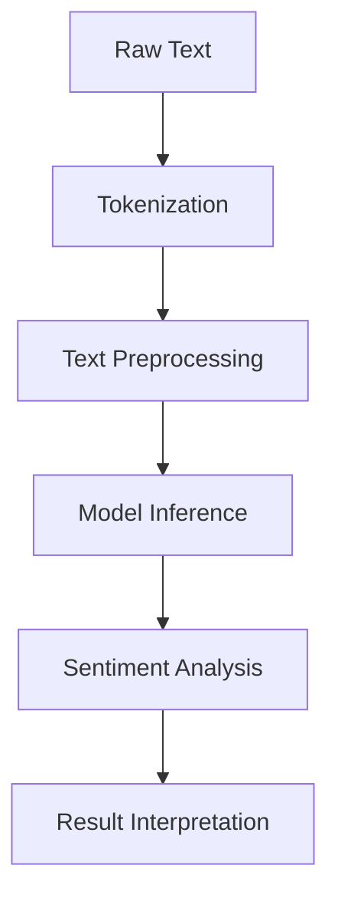

## 18.6. Natural Language Processing (NLP) with Rust

Natural Language Processing (NLP) is a crucial area in the field of artificial intelligence, focusing on the interaction between computers and humans through natural language. NLP enables machines to read, understand, and derive meaning from human languages, making it essential for applications like chatbots, sentiment analysis, language translation, and more.

### Importance of NLP and Common Applications

NLP is pivotal in transforming unstructured data into actionable insights. Here are some common applications:

- **Sentiment Analysis**: Understanding the sentiment behind user reviews or social media posts.
- **Machine Translation**: Translating text from one language to another.
- **Chatbots and Virtual Assistants**: Enabling conversational interfaces.
- **Text Summarization**: Condensing large documents into concise summaries.
- **Named Entity Recognition (NER)**: Identifying entities like names, dates, and locations in text.

### Rust Libraries for NLP

Rust, known for its performance and safety, is increasingly being used for NLP tasks. Several libraries facilitate NLP in Rust:

- **`rust-tokenizers`**: A library for tokenizing text, supporting various tokenization schemes.
- **`tch-rs`**: Rust bindings for PyTorch, enabling the use of deep learning models for NLP.
- **`rust-bert`**: A library for using pre-trained models from Hugging Face Transformers in Rust.

Let's explore these libraries and how they can be used for NLP tasks.

### Text Preprocessing with `rust-tokenizers`

Text preprocessing is a fundamental step in NLP, involving tasks like tokenization, stemming, and stopword removal. Tokenization is the process of converting a sequence of characters into a sequence of tokens. The `rust-tokenizers` crate provides efficient tokenization.

```rust
use rust_tokenizers::tokenizer::{BertTokenizer, Tokenizer};
use rust_tokenizers::vocab::BertVocab;

fn main() {
    // Load the BERT vocabulary
    let vocab = BertVocab::from_file("path/to/vocab.txt").unwrap();
    
    // Initialize the tokenizer
    let tokenizer = BertTokenizer::from_existing_vocab(vocab, false, false);

    // Tokenize a sentence
    let sentence = "Natural language processing with Rust is exciting!";
    let tokens = tokenizer.tokenize(sentence);

    println!("{:?}", tokens);
}
```

In this example, we load a BERT vocabulary and use the `BertTokenizer` to tokenize a sentence. The tokens are then printed, demonstrating how text can be prepared for further NLP tasks.

### Sentiment Analysis with `tch-rs`

Sentiment analysis involves determining the sentiment expressed in a piece of text. Using `tch-rs`, we can leverage PyTorch models for sentiment analysis.

```rust
use tch::{nn, Device, Tensor};
use tch::vision::imagenet;

fn main() {
    // Load a pre-trained sentiment analysis model
    let vs = nn::VarStore::new(Device::Cpu);
    let model = imagenet::vgg16(&vs.root());

    // Example text for sentiment analysis
    let text = "I love programming in Rust!";
    
    // Preprocess and convert text to tensor
    let input_tensor = preprocess_text(text);

    // Run the model
    let output = model.forward(&input_tensor);

    // Interpret the result
    let sentiment = interpret_output(output);
    println!("Sentiment: {:?}", sentiment);
}

fn preprocess_text(text: &str) -> Tensor {
    // Convert text to tensor (dummy implementation)
    Tensor::of_slice(&[1, 2, 3, 4])
}

fn interpret_output(output: Tensor) -> String {
    // Interpret the model output (dummy implementation)
    "Positive".to_string()
}
```

This example demonstrates how to load a pre-trained model and perform sentiment analysis on a given text. Note that `preprocess_text` and `interpret_output` are placeholders for actual implementations.

### Interfacing with Pre-trained Models and Embeddings

Pre-trained models and embeddings are crucial for NLP tasks, as they provide a foundation for understanding language. Rust can interface with these models using libraries like `rust-bert`.

```rust
use rust_bert::pipelines::sentiment::{SentimentModel, SentimentConfig};

fn main() {
    // Load a pre-trained sentiment model
    let config = SentimentConfig::default();
    let model = SentimentModel::new(config).unwrap();

    // Analyze sentiment
    let input = "Rust is a fantastic programming language!";
    let output = model.predict(&[input]);

    println!("{:?}", output);
}
```

In this example, we use `rust-bert` to load a pre-trained sentiment model and analyze the sentiment of a sentence. This demonstrates how Rust can leverage powerful pre-trained models for NLP tasks.

### Performance Considerations

When processing large text corpora, performance is a critical consideration. Rust's memory safety and concurrency features make it well-suited for handling large datasets efficiently. Here are some tips:

- **Use Efficient Data Structures**: Choose data structures that minimize memory usage and maximize performance.
- **Parallel Processing**: Utilize Rust's concurrency features to process data in parallel, reducing processing time.
- **Optimize Tokenization**: Use efficient tokenization libraries like `rust-tokenizers` to preprocess text quickly.

### Visualizing NLP Workflows

To better understand the flow of NLP tasks, let's visualize a typical NLP workflow using Mermaid.js.



This diagram illustrates the steps involved in processing text for sentiment analysis, from raw text to result interpretation.

### Try It Yourself

Experiment with the code examples provided by modifying the input text or using different models. Try implementing additional NLP tasks like named entity recognition or text summarization using Rust libraries.

### References and Links

- [rust-tokenizers crate](https://crates.io/crates/rust-tokenizers)
- [tch-rs (PyTorch bindings)](https://crates.io/crates/tch)
- [Hugging Face Transformers via Rust](https://github.com/guillaume-be/rust-bert)

### Knowledge Check

- What are some common applications of NLP?
- How can Rust be used for text preprocessing?
- What are the benefits of using pre-trained models in NLP?
- How does Rust's performance benefit NLP tasks?

### Embrace the Journey

Remember, this is just the beginning. As you explore NLP with Rust, you'll discover more advanced techniques and applications. Keep experimenting, stay curious, and enjoy the journey!

## Quiz Time!



### What is a common application of NLP?

- [x] Sentiment Analysis
- [ ] Image Recognition
- [ ] Video Processing
- [ ] Audio Synthesis

> **Explanation:** Sentiment analysis is a common application of NLP, focusing on determining the sentiment expressed in text.

### Which Rust library is used for tokenization?

- [x] rust-tokenizers
- [ ] tch-rs
- [ ] serde
- [ ] rayon

> **Explanation:** The `rust-tokenizers` library is used for tokenizing text in Rust.

### What is the purpose of the `tch-rs` library?

- [x] To provide PyTorch bindings for Rust
- [ ] To tokenize text
- [ ] To serialize data
- [ ] To manage concurrency

> **Explanation:** The `tch-rs` library provides PyTorch bindings for Rust, enabling the use of deep learning models.

### How can Rust interface with pre-trained NLP models?

- [x] Using libraries like rust-bert
- [ ] By writing models from scratch
- [ ] Through manual implementation
- [ ] By using only C++ libraries

> **Explanation:** Rust can interface with pre-trained NLP models using libraries like `rust-bert`.

### What is a benefit of using pre-trained models?

- [x] They provide a foundation for understanding language
- [ ] They require less data
- [ ] They are faster to train
- [ ] They are always more accurate

> **Explanation:** Pre-trained models provide a foundation for understanding language, making them useful for NLP tasks.

### What is a key performance consideration in NLP?

- [x] Efficient data structures
- [ ] Using only single-threaded processing
- [ ] Avoiding tokenization
- [ ] Ignoring memory usage

> **Explanation:** Using efficient data structures is a key performance consideration in NLP.

### How can Rust's concurrency features benefit NLP?

- [x] By enabling parallel processing
- [ ] By simplifying code
- [ ] By reducing memory usage
- [ ] By avoiding errors

> **Explanation:** Rust's concurrency features enable parallel processing, which can reduce processing time for NLP tasks.

### What is tokenization?

- [x] Converting text into tokens
- [ ] Compressing text
- [ ] Encrypting text
- [ ] Translating text

> **Explanation:** Tokenization is the process of converting text into tokens, which are used for further processing.

### Which library allows using Hugging Face Transformers in Rust?

- [x] rust-bert
- [ ] rust-tokenizers
- [ ] tch-rs
- [ ] serde

> **Explanation:** The `rust-bert` library allows using Hugging Face Transformers in Rust.

### Rust is well-suited for NLP tasks due to its memory safety and concurrency features.

- [x] True
- [ ] False

> **Explanation:** Rust's memory safety and concurrency features make it well-suited for handling large datasets efficiently in NLP tasks.




