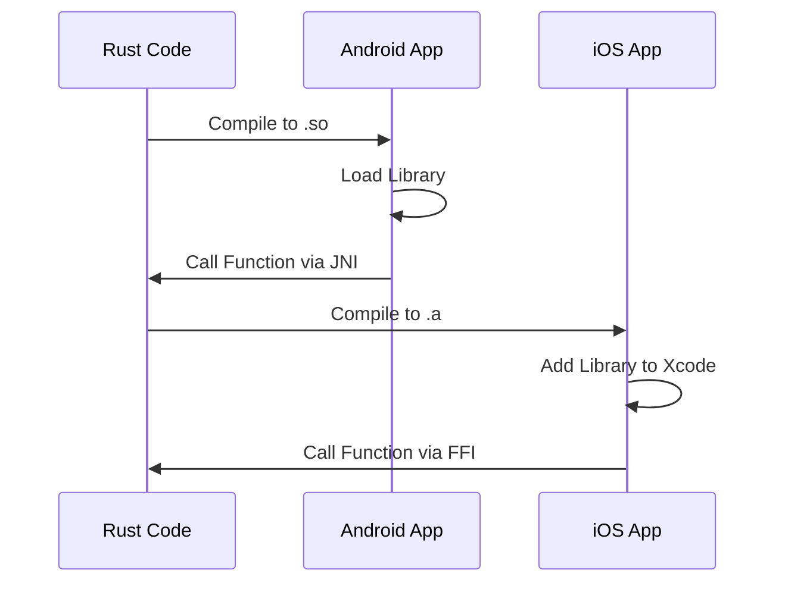

## 19.1. Rust for Mobile Platforms

As mobile applications continue to dominate the software landscape, developers are constantly seeking tools and languages that offer both performance and safety. Rust, known for its memory safety and concurrency features, is increasingly being considered for mobile development. In this section, we will explore Rust's capabilities in the context of mobile platforms, discuss why developers might choose Rust for mobile applications, and highlight the general approach for integrating Rust code into mobile platforms. We will also discuss the limitations and considerations unique to mobile development with Rust, setting the stage for deeper exploration in subsequent sections.

### Why Choose Rust for Mobile Development?

Rust offers several compelling reasons for mobile developers to consider it as a viable option:

1. **Performance**: Rust is designed for high performance, making it ideal for resource-constrained environments like mobile devices. Its zero-cost abstractions ensure that you can write high-level code without sacrificing speed.

2. **Memory Safety**: Rust's ownership model eliminates common bugs such as null pointer dereferencing and buffer overflows, which are critical in mobile applications where stability is paramount.

3. **Concurrency**: Rust's concurrency model allows developers to write safe concurrent code, which is essential for responsive mobile applications.

4. **Cross-Platform Code Sharing**: Rust enables code sharing between iOS and Android, reducing duplication and ensuring consistency across platforms.

5. **Interoperability**: Rust can easily interoperate with C and C++, making it possible to integrate with existing mobile codebases and libraries.

### Integrating Rust into Mobile Platforms

Integrating Rust into mobile applications involves several steps and considerations. Let's explore the general approach for both iOS and Android platforms.

#### Rust and Android

For Android development, Rust can be integrated using the Java Native Interface (JNI). Here's a step-by-step guide:

1. **Set Up the Rust Toolchain**: Ensure you have the Rust toolchain installed. You can use `rustup` to manage Rust versions and components.

2. **Create a Rust Library**: Use Cargo, Rust's package manager, to create a new library project.

   ```bash
   cargo new --lib my_rust_library
   ```

3. **Write Rust Code**: Implement the functionality you want to expose to Android in Rust.

   ```rust
   #[no_mangle]
   pub extern "C" fn add(a: i32, b: i32) -> i32 {
       a + b
   }
   ```

4. **Compile to a Shared Library**: Compile the Rust code to a shared library (`.so` file) that can be used by Android.

   ```bash
   cargo build --release --target aarch64-linux-android
   ```

5. **Integrate with Android**: Use the JNI to call Rust functions from Java or Kotlin. You will need to load the Rust library and define native methods.

   ```java
   public class RustIntegration {
       static {
           System.loadLibrary("my_rust_library");
       }

       public native int add(int a, int b);
   }
   ```

6. **Build and Run**: Build your Android project and run it on a device or emulator.

#### Rust and iOS

For iOS development, Rust can be integrated using the Foreign Function Interface (FFI). Here's how:

1. **Set Up the Rust Toolchain**: Ensure you have the Rust toolchain installed and configured for cross-compilation to iOS.

2. **Create a Rust Library**: Use Cargo to create a new library project.

   ```bash
   cargo new --lib my_rust_library
   ```

3. **Write Rust Code**: Implement the functionality you want to expose to iOS in Rust.

   ```rust
   #[no_mangle]
   pub extern "C" fn add(a: i32, b: i32) -> i32 {
       a + b
   }
   ```

4. **Compile to a Static Library**: Compile the Rust code to a static library (`.a` file) that can be used by iOS.

   ```bash
   cargo build --release --target aarch64-apple-ios
   ```

5. **Integrate with Xcode**: Add the Rust static library to your Xcode project and create a bridging header to expose Rust functions to Swift or Objective-C.

   ```objective-c
   int add(int a, int b);
   ```

6. **Build and Run**: Build your iOS project and run it on a device or simulator.

### Limitations and Considerations

While Rust offers many advantages for mobile development, there are also some limitations and considerations to keep in mind:

- **Tooling and Ecosystem**: The mobile development ecosystem for Rust is still maturing. While there are tools and libraries available, they may not be as comprehensive as those for more established mobile languages.

- **Learning Curve**: Rust's ownership model and strict compiler can be challenging for developers new to the language. However, the benefits in terms of safety and performance are worth the investment.

- **Integration Complexity**: Integrating Rust with mobile platforms requires knowledge of both Rust and the target platform's native development environment (e.g., JNI for Android, FFI for iOS).

- **Debugging and Profiling**: Debugging Rust code in a mobile context can be more complex than in traditional mobile development environments. Tools like `lldb` and `gdb` can be used, but may require additional setup.

### Visualizing Rust Integration with Mobile Platforms

To better understand how Rust integrates with mobile platforms, let's visualize the process using a sequence diagram.



**Diagram Description**: This sequence diagram illustrates the process of integrating Rust code into Android and iOS applications. For Android, Rust code is compiled into a shared library (`.so`) and accessed via JNI. For iOS, Rust code is compiled into a static library (`.a`) and accessed via FFI.

### Knowledge Check

Before we move on to the next section, let's reinforce what we've learned with a few questions:

- What are the primary benefits of using Rust for mobile development?
- How does Rust's ownership model contribute to memory safety in mobile applications?
- What are the steps involved in integrating Rust with an Android application?
- What challenges might developers face when integrating Rust with iOS?

### Embrace the Journey

Remember, this is just the beginning of your journey with Rust in mobile development. As you progress, you'll discover more advanced techniques and patterns that will enable you to build robust and performant mobile applications. Keep experimenting, stay curious, and enjoy the journey!

### References and Further Reading

- [Rust Programming Language](https://www.rust-lang.org/)
- [Rust and Android](https://developer.android.com/)
- [Rust and iOS](https://developer.apple.com/)
- [JNI Documentation](https://docs.oracle.com/javase/8/docs/technotes/guides/jni/)
- [FFI Documentation](https://doc.rust-lang.org/nomicon/ffi.html)

## Quiz Time!



### What is a primary benefit of using Rust for mobile development?

- [x] Performance
- [ ] High-level abstractions
- [ ] Built-in garbage collection
- [ ] Dynamic typing

> **Explanation:** Rust is known for its high performance, which is crucial for mobile applications.

### How does Rust ensure memory safety?

- [x] Ownership model
- [ ] Garbage collection
- [ ] Dynamic typing
- [ ] Manual memory management

> **Explanation:** Rust's ownership model ensures memory safety without the need for garbage collection.

### What is the role of JNI in Android development with Rust?

- [x] To interface Rust code with Java/Kotlin
- [ ] To compile Rust code
- [ ] To manage memory
- [ ] To handle user interface

> **Explanation:** JNI (Java Native Interface) is used to call Rust functions from Java or Kotlin.

### Which tool is used to manage Rust versions and components?

- [x] rustup
- [ ] cargo
- [ ] npm
- [ ] pip

> **Explanation:** `rustup` is the tool used to manage Rust versions and components.

### What is the file extension for a shared library in Android?

- [x] .so
- [ ] .dll
- [ ] .a
- [ ] .lib

> **Explanation:** Shared libraries in Android have the `.so` file extension.

### What is the file extension for a static library in iOS?

- [x] .a
- [ ] .so
- [ ] .dll
- [ ] .lib

> **Explanation:** Static libraries in iOS have the `.a` file extension.

### What is a challenge of using Rust for mobile development?

- [x] Integration complexity
- [ ] Lack of performance
- [ ] Poor memory management
- [ ] Limited concurrency support

> **Explanation:** Integrating Rust with mobile platforms can be complex due to the need to understand both Rust and the native development environment.

### Which Rust feature allows for safe concurrent code?

- [x] Concurrency model
- [ ] Garbage collection
- [ ] Dynamic typing
- [ ] Manual memory management

> **Explanation:** Rust's concurrency model allows developers to write safe concurrent code.

### What is the purpose of a bridging header in iOS development with Rust?

- [x] To expose Rust functions to Swift or Objective-C
- [ ] To compile Rust code
- [ ] To manage memory
- [ ] To handle user interface

> **Explanation:** A bridging header is used to expose Rust functions to Swift or Objective-C in iOS development.

### True or False: Rust can interoperate with C and C++.

- [x] True
- [ ] False

> **Explanation:** Rust can easily interoperate with C and C++, making it possible to integrate with existing mobile codebases and libraries.


