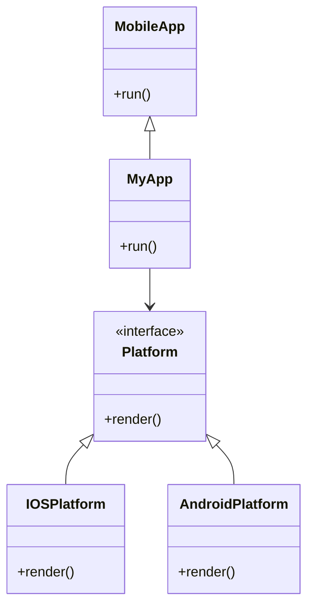

## 19.10. The Bridge Pattern in Mobile Integration

In the realm of mobile development, integrating Rust into native mobile codebases can be a powerful way to leverage Rust's performance and safety features. However, this integration can become complex, especially when dealing with platform-specific code. The Bridge Pattern offers a solution by separating the platform-specific code from the business logic, thus enhancing maintainability and scalability.

### Understanding the Bridge Pattern

The Bridge Pattern is a structural design pattern that decouples an abstraction from its implementation, allowing the two to vary independently. This pattern is particularly useful in scenarios where you need to separate high-level logic from platform-specific details, which is a common requirement in mobile development.

#### Key Participants

- **Abstraction**: Defines the interface for the high-level control logic. It maintains a reference to an implementer object.
- **Implementer**: Defines the interface for implementation classes. This interface doesn't need to match the Abstraction's interface. In fact, the two interfaces can be entirely different.
- **Concrete Abstraction**: Extends the Abstraction interface and maintains a reference to an implementer object.
- **Concrete Implementer**: Implements the Implementer interface and defines the platform-specific operations.

### Relevance to Mobile Development

In mobile development, the Bridge Pattern can be used to separate the business logic of an application from the platform-specific code. This separation is crucial when integrating Rust into mobile applications, as it allows developers to write platform-independent business logic in Rust while keeping platform-specific code in the native language (e.g., Swift for iOS, Kotlin for Android).

### Implementing the Bridge Pattern in Rust

To implement the Bridge Pattern in Rust for mobile integration, we need to define interfaces and abstraction layers that separate the business logic from platform-specific implementations.

#### Step 1: Define the Abstraction

The abstraction represents the high-level control logic of the application. In Rust, we can define this using a trait:

```rust
trait MobileApp {
    fn run(&self);
}
```

#### Step 2: Define the Implementer

The implementer defines the interface for platform-specific operations. Again, we use a trait in Rust:

```rust
trait Platform {
    fn render(&self);
}
```

#### Step 3: Create Concrete Implementers

Concrete implementers provide platform-specific implementations. For example, we can have separate implementations for iOS and Android:

```rust
struct IOSPlatform;

impl Platform for IOSPlatform {
    fn render(&self) {
        println!("Rendering on iOS");
    }
}

struct AndroidPlatform;

impl Platform for AndroidPlatform {
    fn render(&self) {
        println!("Rendering on Android");
    }
}
```

#### Step 4: Create the Concrete Abstraction

The concrete abstraction extends the abstraction interface and maintains a reference to an implementer object:

```rust
struct MyApp<T: Platform> {
    platform: T,
}

impl<T: Platform> MobileApp for MyApp<T> {
    fn run(&self) {
        println!("Running app logic");
        self.platform.render();
    }
}
```

### Benefits of Using the Bridge Pattern

- **Separation of Concerns**: By separating the business logic from platform-specific code, the Bridge Pattern enhances maintainability and scalability.
- **Flexibility**: The pattern allows for independent development and evolution of the abstraction and implementation.
- **Reusability**: Business logic written in Rust can be reused across different platforms, reducing duplication of effort.

### Potential Pitfalls and How to Avoid Them

- **Complexity**: The Bridge Pattern can introduce additional complexity, especially in small projects. It's important to evaluate whether the benefits outweigh the complexity in your specific use case.
- **Overhead**: The pattern may introduce some overhead due to the additional abstraction layers. However, this is often negligible compared to the benefits in large-scale applications.

### Try It Yourself

To experiment with the Bridge Pattern, try modifying the code examples to add new platform-specific implementations or extend the business logic. For instance, you could add a new platform for web applications or enhance the `run` method to include additional business logic.

### Visualizing the Bridge Pattern

To better understand the Bridge Pattern, let's visualize it using a class diagram:



This diagram illustrates the relationship between the abstraction (`MobileApp`), the implementer (`Platform`), and their concrete implementations (`IOSPlatform`, `AndroidPlatform`, `MyApp`).

### Conclusion

The Bridge Pattern is a powerful tool for integrating Rust into mobile applications, providing a clear separation between business logic and platform-specific code. By leveraging this pattern, developers can create scalable and maintainable mobile applications that benefit from Rust's performance and safety features.

Remember, this is just the beginning. As you progress, you'll build more complex and interactive mobile applications. Keep experimenting, stay curious, and enjoy the journey!

## Quiz Time!



### What is the primary purpose of the Bridge Pattern?

- [x] To separate an abstraction from its implementation.
- [ ] To combine multiple interfaces into one.
- [ ] To create a single interface for a set of interfaces.
- [ ] To provide a way to access the elements of an aggregate object sequentially.

> **Explanation:** The Bridge Pattern is used to separate an abstraction from its implementation, allowing the two to vary independently.

### In the context of mobile development, what does the Bridge Pattern help achieve?

- [x] Separation of business logic from platform-specific code.
- [ ] Integration of multiple libraries.
- [ ] Optimization of memory usage.
- [ ] Simplification of user interface design.

> **Explanation:** The Bridge Pattern helps separate business logic from platform-specific code, which is crucial in mobile development.

### Which of the following is a key participant in the Bridge Pattern?

- [x] Abstraction
- [ ] Adapter
- [ ] Proxy
- [ ] Singleton

> **Explanation:** The Abstraction is a key participant in the Bridge Pattern, defining the interface for the high-level control logic.

### How does the Bridge Pattern enhance maintainability?

- [x] By separating concerns and allowing independent development of abstraction and implementation.
- [ ] By reducing the number of classes in the system.
- [ ] By combining multiple functionalities into a single class.
- [ ] By simplifying the user interface.

> **Explanation:** The Bridge Pattern enhances maintainability by separating concerns, allowing the abstraction and implementation to be developed independently.

### What is a potential pitfall of using the Bridge Pattern?

- [x] Increased complexity
- [ ] Reduced performance
- [ ] Limited scalability
- [ ] Difficulty in debugging

> **Explanation:** The Bridge Pattern can introduce additional complexity, which is a potential pitfall.

### In Rust, how is the abstraction typically defined in the Bridge Pattern?

- [x] Using a trait
- [ ] Using a struct
- [ ] Using an enum
- [ ] Using a macro

> **Explanation:** In Rust, the abstraction in the Bridge Pattern is typically defined using a trait.

### What is the role of the Concrete Implementer in the Bridge Pattern?

- [x] To provide platform-specific implementations.
- [ ] To define the high-level control logic.
- [ ] To combine multiple interfaces into one.
- [ ] To simplify the user interface design.

> **Explanation:** The Concrete Implementer provides platform-specific implementations in the Bridge Pattern.

### How can the Bridge Pattern aid in scalability?

- [x] By allowing independent scaling of abstraction and implementation.
- [ ] By reducing the number of classes in the system.
- [ ] By combining multiple functionalities into a single class.
- [ ] By simplifying the user interface.

> **Explanation:** The Bridge Pattern aids in scalability by allowing the abstraction and implementation to be scaled independently.

### What is the benefit of using Rust in mobile integration?

- [x] Performance and safety features
- [ ] Simplified user interface design
- [ ] Reduced memory usage
- [ ] Enhanced graphics capabilities

> **Explanation:** Rust offers performance and safety features, which are beneficial in mobile integration.

### True or False: The Bridge Pattern is only applicable to mobile development.

- [ ] True
- [x] False

> **Explanation:** The Bridge Pattern is not limited to mobile development; it can be applied in various contexts where separation of abstraction and implementation is needed.


