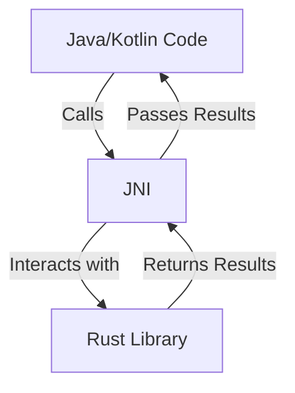

## 19.2. Integrating Rust with Android (JNI)

Integrating Rust with Android using the Java Native Interface (JNI) allows developers to leverage Rust's performance and safety features in Android applications. This integration enables native performance and code reusability, making it an attractive option for mobile developers. In this section, we'll explore how to set up a Rust library for Android, call Rust functions from Java/Kotlin code, and handle data types and memory management across the boundary.

### Understanding JNI

The Java Native Interface (JNI) is a framework that allows Java code running in the Java Virtual Machine (JVM) to call and be called by native applications and libraries written in other languages like C, C++, and Rust. JNI acts as a bridge between Java and native code, enabling seamless integration and interaction.

#### Key Concepts of JNI

- **Native Methods**: These are methods declared in Java but implemented in a native language.
- **JNI Environment**: Provides functions to interact with the JVM, manage memory, and handle exceptions.
- **JNI Types**: Includes types like `jint`, `jlong`, `jstring`, etc., which correspond to Java types.

### Setting Up a Rust Library for Android

To integrate Rust with Android, we need to create a Rust library that can be compiled for Android's architecture. This involves setting up the Rust toolchain, configuring the Android NDK, and using the `cargo-ndk` tool.

#### Step-by-Step Instructions

1. **Install the Android NDK**: Download and install the Android NDK from the [official website](https://developer.android.com/ndk).

2. **Set Up Rust Toolchain**: Ensure you have Rust installed. Use `rustup` to add the necessary targets for Android:
   ```bash
   rustup target add aarch64-linux-android armv7-linux-androideabi i686-linux-android
   ```

3. **Install Cargo-NDK**: This tool simplifies building Rust libraries for Android:
   ```bash
   cargo install cargo-ndk
   ```

4. **Create a New Rust Library**: Use Cargo to create a new library:
   ```bash
   cargo new --lib my_rust_lib
   cd my_rust_lib
   ```

5. **Configure Cargo.toml**: Add the `jni` crate to your dependencies:
   ```toml
   [dependencies]
   jni = "0.19"
   ```

6. **Write Rust Code**: Implement your Rust functions. Here's a simple example:
   ```rust
   #[no_mangle]
   pub extern "C" fn add_numbers(a: i32, b: i32) -> i32 {
       a + b
   }
   ```

7. **Build the Library for Android**: Use `cargo-ndk` to build the library:
   ```bash
   cargo ndk -t armeabi-v7a -t arm64-v8a -o ./jniLibs build --release
   ```

### Calling Rust Functions from Java/Kotlin

Once the Rust library is built, you can call its functions from Java or Kotlin code using JNI.

#### Example: Calling a Rust Function

1. **Load the Native Library**: In your Android app, load the library using `System.loadLibrary`:
   ```java
   static {
       System.loadLibrary("my_rust_lib");
   }
   ```

2. **Declare Native Methods**: Define the native methods in your Java class:
   ```java
   public class RustBridge {
       public native int addNumbers(int a, int b);
   }
   ```

3. **Use the Native Method**: Call the native method in your app:
   ```java
   RustBridge bridge = new RustBridge();
   int result = bridge.addNumbers(5, 10);
   System.out.println("Result from Rust: " + result);
   ```

### Handling Data Types and Memory Management

When integrating Rust with Android, it's crucial to manage data types and memory correctly to avoid leaks and crashes.

#### Data Type Mapping

- **Primitive Types**: Directly map between Java and Rust (e.g., `int` to `jint`).
- **Strings**: Use `JNIEnv` functions to convert between `jstring` and Rust strings.

#### Memory Management

- **Ownership and Borrowing**: Leverage Rust's ownership model to manage memory safely.
- **JNI Functions**: Use functions like `NewStringUTF` and `GetStringUTFChars` for string manipulation.

### Tools and Build Scripts

Several tools and scripts can simplify the integration process:

- **`cargo-ndk`**: Automates building Rust libraries for Android.
- **Gradle Scripts**: Configure your Android project's `build.gradle` to include the native library.

### Example Project Structure

Here's a typical project structure for integrating Rust with Android:

```
my_android_app/
├── app/
│   ├── src/
│   ├── build.gradle
│   └── jniLibs/
│       ├── armeabi-v7a/
│       └── arm64-v8a/
└── my_rust_lib/
    ├── src/
    ├── Cargo.toml
    └── target/
```

### Visualizing the Integration Process



*Figure: Interaction between Java/Kotlin code and Rust library via JNI.*

### Try It Yourself

Experiment with the code by modifying the Rust function to perform different operations, such as multiplication or string concatenation. Test the changes by calling the updated function from your Android app.

### External Resources

- [JNI Documentation](https://docs.oracle.com/javase/8/docs/technotes/guides/jni/)
- [Rust FFI Guide](https://doc.rust-lang.org/nomicon/ffi.html)
- [Android NDK Guide](https://developer.android.com/ndk/guides)

### Knowledge Check

- What is JNI, and why is it used in Rust-Android integration?
- How do you manage memory when passing data between Rust and Java?
- What tools can simplify building Rust libraries for Android?

### Embrace the Journey

Integrating Rust with Android using JNI opens up a world of possibilities for mobile developers. By leveraging Rust's performance and safety features, you can build robust and efficient Android applications. Remember, this is just the beginning. As you progress, you'll discover more advanced techniques and optimizations. Keep experimenting, stay curious, and enjoy the journey!

## Quiz Time!



### What is the primary purpose of JNI in Android development?

- [x] To allow Java code to interact with native code written in other languages.
- [ ] To compile Java code into native binaries.
- [ ] To replace the Android SDK.
- [ ] To provide a graphical interface for Android apps.

> **Explanation:** JNI enables Java code to call and be called by native applications and libraries, facilitating interaction between Java and native code.

### Which tool simplifies building Rust libraries for Android?

- [x] cargo-ndk
- [ ] rustup
- [ ] gradle
- [ ] jni

> **Explanation:** `cargo-ndk` is a tool that simplifies the process of building Rust libraries for Android by handling cross-compilation.

### How do you declare a native method in Java?

- [x] Using the `native` keyword in the method declaration.
- [ ] Using the `extern` keyword in the method declaration.
- [ ] By implementing the method in Rust.
- [ ] By using the `System.loadLibrary` function.

> **Explanation:** The `native` keyword is used in Java to declare a method that is implemented in native code.

### What is the role of the `System.loadLibrary` function?

- [x] It loads the native library into the Java application.
- [ ] It compiles the Rust code into a library.
- [ ] It initializes the Android NDK.
- [ ] It converts Java code to Rust.

> **Explanation:** `System.loadLibrary` is used to load a native library so that its functions can be called from Java code.

### Which Rust feature helps manage memory safely across the Java-Rust boundary?

- [x] Ownership and Borrowing
- [ ] Garbage Collection
- [ ] JNI Environment
- [ ] Java Virtual Machine

> **Explanation:** Rust's ownership and borrowing system ensures safe memory management, preventing leaks and crashes.

### What is the equivalent JNI type for a Java `int`?

- [x] `jint`
- [ ] `jlong`
- [ ] `jstring`
- [ ] `jboolean`

> **Explanation:** `jint` is the JNI type that corresponds to a Java `int`.

### Which crate is commonly used for Rust-JNI integration?

- [x] jni
- [ ] serde
- [ ] tokio
- [ ] rayon

> **Explanation:** The `jni` crate provides Rust bindings for the Java Native Interface, facilitating integration.

### What is the purpose of the `#[no_mangle]` attribute in Rust?

- [x] It prevents the Rust compiler from changing the function name during compilation.
- [ ] It enables garbage collection for the function.
- [ ] It allows the function to be called from Java.
- [ ] It optimizes the function for performance.

> **Explanation:** `#[no_mangle]` ensures that the function name remains unchanged, allowing it to be linked correctly from Java.

### How can you convert a `jstring` to a Rust string?

- [x] Using JNI functions like `GetStringUTFChars`.
- [ ] Directly casting it to a Rust `String`.
- [ ] Using the `System.loadLibrary` function.
- [ ] By declaring it as a `native` method.

> **Explanation:** JNI provides functions like `GetStringUTFChars` to convert `jstring` to Rust strings.

### True or False: JNI allows Java code to call native methods written in Rust.

- [x] True
- [ ] False

> **Explanation:** JNI is specifically designed to enable Java code to call and be called by native methods, including those written in Rust.


