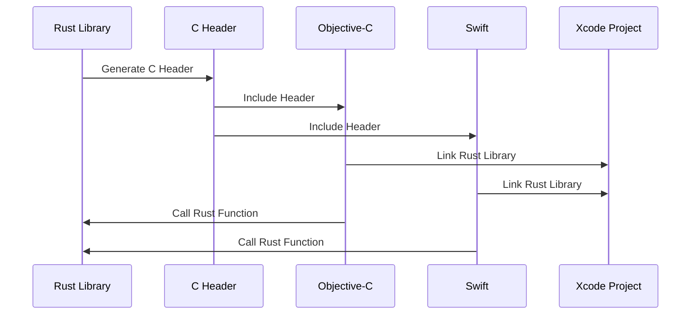

## 19.3. Integrating Rust with iOS (FFI)

Integrating Rust with iOS applications opens up a world of possibilities for developers looking to leverage Rust's performance and safety features in mobile environments. This section will guide you through the process of integrating Rust with iOS using the Foreign Function Interface (FFI), enabling seamless interoperability with Objective-C and Swift.

### Understanding FFI and Its Role in iOS Integration

The Foreign Function Interface (FFI) is a mechanism that allows code written in one programming language to call functions or use services written in another language. In the context of iOS development, FFI is crucial for integrating Rust with Objective-C and Swift, the primary languages used for iOS app development.

#### Key Concepts

- **FFI**: Allows Rust code to interact with C, Objective-C, and Swift by exposing Rust functions as C-compatible functions.
- **Objective-C/Swift Interoperability**: Objective-C and Swift can call C functions directly, which means Rust functions exposed via FFI can be called from these languages.
- **Static and Dynamic Libraries**: Rust code can be compiled into static or dynamic libraries that can be linked with iOS applications.

### Creating Rust Libraries for iOS

To integrate Rust with iOS, we first need to compile Rust code into a library that can be used in an iOS project. This involves setting up a Rust project and configuring it to target iOS architectures.

#### Setting Up the Rust Project

1. **Install Rust and Cargo**: Ensure you have Rust and Cargo installed on your development machine. You can download them from [rust-lang.org](https://www.rust-lang.org/).

2. **Create a New Rust Project**: Use Cargo to create a new library project.

   ```bash
   cargo new --lib my_rust_library
   cd my_rust_library
   ```

3. **Configure Cargo for iOS Targets**: Add iOS targets to your Rust toolchain.

   ```bash
   rustup target add aarch64-apple-ios x86_64-apple-ios
   ```

4. **Install `cargo-lipo`**: This tool helps in building universal libraries for iOS.

   ```bash
   cargo install cargo-lipo
   ```

#### Writing Rust Code

Let's write a simple Rust function that we want to expose to iOS:

```rust
// src/lib.rs

#[no_mangle]
pub extern "C" fn add_numbers(a: i32, b: i32) -> i32 {
    a + b
}
```

- **`#[no_mangle]`**: Prevents Rust from changing the function name during compilation.
- **`extern "C"`**: Specifies the C calling convention, making the function callable from C, Objective-C, and Swift.

#### Building the Rust Library

Use `cargo-lipo` to build the library for iOS:

```bash
cargo lipo --release
```

This command generates a universal library that includes both `aarch64` and `x86_64` architectures, suitable for iOS devices and simulators.

### Exposing Rust Functions to Swift/Objective-C

To call Rust functions from Swift or Objective-C, we need to create a C header file that declares the Rust functions. This is where the `cbindgen` crate comes in handy.

#### Generating C Bindings with `cbindgen`

1. **Add `cbindgen` to Your Project**: Install `cbindgen` to generate C header files.

   ```bash
   cargo install cbindgen
   ```

2. **Create a `cbindgen.toml` Configuration File**: Define how `cbindgen` should generate the header file.

   ```toml
   # cbindgen.toml
   language = "C"
   include_guard = "MY_RUST_LIBRARY_H"
   ```

3. **Generate the Header File**: Run `cbindgen` to create the header file.

   ```bash
   cbindgen --config cbindgen.toml --crate my_rust_library --output my_rust_library.h
   ```

#### Integrating with Xcode

1. **Create an Xcode Project**: Open Xcode and create a new iOS project.

2. **Add the Rust Library**: Drag the compiled Rust library (`libmy_rust_library.a`) and the generated header file (`my_rust_library.h`) into your Xcode project.

3. **Configure Build Settings**: Ensure the library is linked correctly by adding it to the "Link Binary with Libraries" section in your Xcode project settings.

4. **Call Rust Functions from Swift/Objective-C**: Use the generated header file to call Rust functions.

   ```objective-c
   // Objective-C
   #import "my_rust_library.h"

   int result = add_numbers(3, 4);
   NSLog(@"Result from Rust: %d", result);
   ```

   ```swift
   // Swift
   import Foundation

   let result = add_numbers(3, 4)
   print("Result from Rust: \\(result)")
   ```

### Data Type Conversions and Memory Safety

When integrating Rust with iOS, it's crucial to handle data type conversions and memory safety carefully.

#### Data Type Conversions

- **Primitive Types**: Rust's primitive types like `i32`, `f64`, etc., map directly to C types and can be used in Objective-C and Swift.
- **Strings**: Converting strings between Rust and Swift/Objective-C requires careful handling. Use C-style strings (`*const c_char`) for interoperability.

#### Memory Safety Considerations

- **Ownership and Borrowing**: Rust's ownership model ensures memory safety, but when interfacing with C, you must manually manage memory.
- **Avoiding Undefined Behavior**: Ensure that any pointers passed between Rust and iOS are valid and properly managed.

### Tooling and Build Configurations for iOS Targets

To streamline the integration process, several tools and configurations are essential:

- **`cargo-lipo`**: Automates the creation of universal libraries for iOS.
- **`cbindgen`**: Generates C header files for Rust libraries.
- **Xcode**: Configures build settings and manages dependencies.

#### Build Configurations

- **Universal Libraries**: Use `cargo-lipo` to create libraries that support both device and simulator architectures.
- **Header Files**: Ensure that the generated header files are included in your Xcode project.

### External Frameworks and Resources

- [Rust on iOS guide](https://github.com/TimNN/cargo-lipo): A comprehensive guide on using `cargo-lipo` for iOS development.
- [`cbindgen` crate](https://crates.io/crates/cbindgen): A tool for generating C bindings from Rust code.
- [Apple Developer Documentation for FFI](https://developer.apple.com/documentation/swift/swift_with_c_and_objective-c): Official documentation on using FFI with Swift and Objective-C.

### Visualizing the Integration Process

To better understand the integration process, let's visualize the workflow using a sequence diagram.



**Diagram Description**: This sequence diagram illustrates the process of integrating a Rust library with an iOS application. The Rust library generates a C header, which is included in Objective-C and Swift code. The Xcode project links the Rust library, allowing Objective-C and Swift to call Rust functions.

### Try It Yourself

Experiment with the integration process by modifying the Rust function to perform different operations. For example, try implementing a function that calculates the factorial of a number or performs string manipulations. Observe how changes in the Rust code are reflected in the iOS application.

### Knowledge Check

- How does FFI facilitate Rust integration with iOS?
- What are the key steps in creating a Rust library for iOS?
- How do you handle data type conversions between Rust and Swift/Objective-C?
- What tools are essential for building Rust libraries for iOS?

### Embrace the Journey

Integrating Rust with iOS using FFI is a powerful way to leverage Rust's capabilities in mobile applications. As you explore this integration, remember that this is just the beginning. With practice and experimentation, you'll unlock new possibilities for building high-performance, safe, and efficient iOS applications. Keep experimenting, stay curious, and enjoy the journey!

## Quiz Time!



### What is the primary role of FFI in integrating Rust with iOS?

- [x] To allow Rust code to interact with Objective-C and Swift
- [ ] To convert Rust code into Swift code
- [ ] To compile Rust code into a standalone iOS app
- [ ] To replace Objective-C with Rust

> **Explanation:** FFI allows Rust code to interact with Objective-C and Swift by exposing Rust functions as C-compatible functions.

### Which tool is used to build universal libraries for iOS in Rust?

- [x] `cargo-lipo`
- [ ] `cargo-ios`
- [ ] `rustup`
- [ ] `cbindgen`

> **Explanation:** `cargo-lipo` is used to build universal libraries for iOS, supporting multiple architectures.

### How do you expose a Rust function to be callable from Swift?

- [x] Use `#[no_mangle]` and `extern "C"`
- [ ] Use `#[swift]` attribute
- [ ] Compile Rust code directly into Swift
- [ ] Use `#[objc]` attribute

> **Explanation:** `#[no_mangle]` prevents name mangling, and `extern "C"` specifies the C calling convention, making the function callable from Swift.

### What is the purpose of `cbindgen` in Rust-iOS integration?

- [x] To generate C header files from Rust code
- [ ] To compile Rust code for iOS
- [ ] To convert Rust code into Objective-C
- [ ] To manage Rust dependencies

> **Explanation:** `cbindgen` generates C header files from Rust code, which are used to call Rust functions from Objective-C and Swift.

### Which Rust attribute prevents function name mangling?

- [x] `#[no_mangle]`
- [ ] `#[extern]`
- [ ] `#[c_compatible]`
- [ ] `#[ffi]`

> **Explanation:** `#[no_mangle]` prevents Rust from changing the function name during compilation.

### What is a key consideration when handling strings between Rust and iOS?

- [x] Use C-style strings for interoperability
- [ ] Convert strings directly to Swift strings
- [ ] Use Rust's `String` type directly
- [ ] Avoid using strings

> **Explanation:** C-style strings (`*const c_char`) are used for interoperability between Rust and iOS.

### Which of the following is NOT a step in integrating Rust with iOS?

- [ ] Compile Rust code into a library
- [ ] Generate a C header file
- [x] Convert Rust code into Java
- [ ] Link the library in Xcode

> **Explanation:** Converting Rust code into Java is not a step in integrating Rust with iOS.

### What is the role of `extern "C"` in Rust functions?

- [x] Specifies the C calling convention
- [ ] Converts Rust functions to C++
- [ ] Enables Rust functions to run on iOS
- [ ] Compiles Rust functions into Swift

> **Explanation:** `extern "C"` specifies the C calling convention, making Rust functions callable from C, Objective-C, and Swift.

### Which tool helps in generating universal libraries for iOS?

- [x] `cargo-lipo`
- [ ] `cargo-ios`
- [ ] `rustup`
- [ ] `cbindgen`

> **Explanation:** `cargo-lipo` helps in building universal libraries for iOS, supporting multiple architectures.

### True or False: Rust's ownership model ensures memory safety when interfacing with C.

- [x] True
- [ ] False

> **Explanation:** Rust's ownership model ensures memory safety, but when interfacing with C, you must manually manage memory to avoid undefined behavior.






