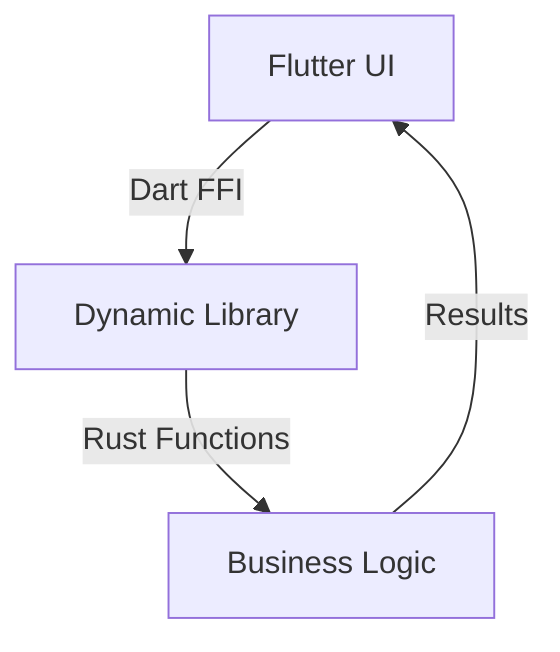

## 19.4. Cross-Platform Development with Rust and Flutter

Cross-platform mobile development has become increasingly popular as developers seek efficient ways to build applications that run seamlessly on multiple platforms. Flutter, a UI toolkit developed by Google, has emerged as a leading choice for creating natively compiled applications for mobile, web, and desktop from a single codebase. Meanwhile, Rust is renowned for its performance and safety, making it an excellent choice for the business logic layer in applications. In this section, we will explore how to leverage Rust in cross-platform mobile development with Flutter, combining Rust's performance with Flutter's UI capabilities.

### Introduction to Flutter

Flutter is an open-source UI software development kit (SDK) created by Google. It allows developers to build beautiful, natively compiled applications for mobile, web, and desktop from a single codebase. Flutter uses the Dart programming language and provides a rich set of pre-designed widgets that make it easy to create complex UIs.

#### Key Features of Flutter

- **Hot Reload**: Allows developers to see the results of code changes almost instantly without restarting the application.
- **Rich Widget Library**: Offers a comprehensive set of customizable widgets for building responsive UIs.
- **Single Codebase**: Enables the development of applications for multiple platforms using a single codebase.
- **High Performance**: Provides near-native performance by compiling to native ARM code.

### Integrating Rust with Flutter

While Flutter excels in UI development, Rust can be used to handle the business logic layer, providing performance and safety benefits. Integrating Rust with Flutter involves using Foreign Function Interface (FFI) to call Rust code from Dart.

#### Why Use Rust with Flutter?

- **Performance**: Rust's performance is comparable to C and C++, making it ideal for computationally intensive tasks.
- **Safety**: Rust's ownership model ensures memory safety without a garbage collector.
- **Code Sharing**: Rust code can be shared across mobile platforms and even with desktop applications.

#### Tools and Frameworks

- **Flutter Rust Bridge**: A tool that simplifies the integration of Rust with Flutter by generating bindings automatically.
- **FFI**: The Foreign Function Interface allows Dart to call native code written in languages like Rust.

### Setting Up a Flutter and Rust Project

To integrate Rust with Flutter, you need to set up a project that includes both Flutter and Rust components. Here's a step-by-step guide:

#### Step 1: Create a Flutter Project

1. Install Flutter SDK from the [official website](https://flutter.dev/docs/get-started/install).
2. Create a new Flutter project using the Flutter CLI:

   ```bash
   flutter create my_flutter_app
   ```

3. Navigate to the project directory:

   ```bash
   cd my_flutter_app
   ```

#### Step 2: Set Up Rust

1. Install Rust using [rustup](https://rustup.rs/):

   ```bash
   curl --proto '=https' --tlsv1.2 -sSf https://sh.rustup.rs | sh
   ```

2. Create a new Rust library inside the Flutter project:

   ```bash
   cargo new --lib my_rust_lib
   ```

3. Add the Rust library to the Flutter project by modifying the `pubspec.yaml` file to include the Rust library path.

#### Step 3: Integrate Rust with Flutter

1. Use the [Flutter Rust Bridge](https://github.com/fzyzcjy/flutter_rust_bridge) to generate bindings between Dart and Rust.
2. Add the necessary dependencies to the `Cargo.toml` file in the Rust library:

   ```toml
   [dependencies]
   flutter_rust_bridge = "0.1"
   ```

3. Write Rust functions that you want to expose to Flutter. For example:

   ```rust
   #[no_mangle]
   pub extern "C" fn add_numbers(a: i32, b: i32) -> i32 {
       a + b
   }
   ```

4. Use FFI in Dart to call the Rust function:

   ```dart
   import 'dart:ffi';
   import 'package:ffi/ffi.dart';

   typedef AddNumbersFunc = Int32 Function(Int32 a, Int32 b);
   typedef AddNumbers = int Function(int a, int b);

   void main() {
     final dylib = DynamicLibrary.open('path/to/rust/library');
     final AddNumbers addNumbers = dylib
         .lookup<NativeFunction<AddNumbersFunc>>('add_numbers')
         .asFunction();

     print('Sum: ${addNumbers(3, 4)}');
   }
   ```

### Benefits of Using Rust with Flutter

- **Performance**: Rust's performance is beneficial for tasks that require heavy computation or real-time processing.
- **Safety**: Rust's strong type system and ownership model prevent common bugs such as null pointer dereferencing and data races.
- **Code Reusability**: Rust code can be reused across different platforms, reducing development time and effort.
- **Interoperability**: Rust can easily interface with other languages and systems, making it a versatile choice for backend logic.

### Challenges and Solutions

#### Challenge 1: Complexity of FFI

FFI can be complex and error-prone, especially when dealing with different data types and memory management.

**Solution**: Use tools like [Flutter Rust Bridge](https://github.com/fzyzcjy/flutter_rust_bridge) to automate the generation of bindings and reduce manual errors.

#### Challenge 2: Debugging Across Languages

Debugging issues that span both Dart and Rust can be challenging.

**Solution**: Use logging and error handling extensively in both Dart and Rust to trace issues. Consider using tools like [lldb](https://lldb.llvm.org/) for debugging Rust code.

#### Challenge 3: Build and Deployment

Managing build configurations for both Flutter and Rust can be cumbersome.

**Solution**: Use build scripts and continuous integration tools to automate the build and deployment process.

### Code Example: A Simple Calculator

Let's create a simple calculator app using Flutter for the UI and Rust for the logic.

#### Rust Code

Create a Rust library with the following code:

```rust
#[no_mangle]
pub extern "C" fn add(a: i32, b: i32) -> i32 {
    a + b
}

#[no_mangle]
pub extern "C" fn subtract(a: i32, b: i32) -> i32 {
    a - b
}

#[no_mangle]
pub extern "C" fn multiply(a: i32, b: i32) -> i32 {
    a * b
}

#[no_mangle]
pub extern "C" fn divide(a: i32, b: i32) -> i32 {
    if b == 0 {
        return 0; // Handle division by zero
    }
    a / b
}
```

#### Dart Code

Use FFI to call the Rust functions from Dart:

```dart
import 'dart:ffi';
import 'package:ffi/ffi.dart';

typedef AddFunc = Int32 Function(Int32 a, Int32 b);
typedef SubtractFunc = Int32 Function(Int32 a, Int32 b);
typedef MultiplyFunc = Int32 Function(Int32 a, Int32 b);
typedef DivideFunc = Int32 Function(Int32 a, Int32 b);

class Calculator {
  final DynamicLibrary _dylib;

  Calculator(this._dylib);

  int add(int a, int b) {
    final AddFunc add = _dylib
        .lookup<NativeFunction<AddFunc>>('add')
        .asFunction();
    return add(a, b);
  }

  int subtract(int a, int b) {
    final SubtractFunc subtract = _dylib
        .lookup<NativeFunction<SubtractFunc>>('subtract')
        .asFunction();
    return subtract(a, b);
  }

  int multiply(int a, int b) {
    final MultiplyFunc multiply = _dylib
        .lookup<NativeFunction<MultiplyFunc>>('multiply')
        .asFunction();
    return multiply(a, b);
  }

  int divide(int a, int b) {
    final DivideFunc divide = _dylib
        .lookup<NativeFunction<DivideFunc>>('divide')
        .asFunction();
    return divide(a, b);
  }
}

void main() {
  final dylib = DynamicLibrary.open('path/to/rust/library');
  final calculator = Calculator(dylib);

  print('Add: ${calculator.add(10, 5)}');
  print('Subtract: ${calculator.subtract(10, 5)}');
  print('Multiply: ${calculator.multiply(10, 5)}');
  print('Divide: ${calculator.divide(10, 5)}');
}
```

### Visualizing the Integration

Below is a diagram illustrating the integration of Rust with Flutter using FFI:



**Diagram Description**: This diagram shows the flow of data between the Flutter UI and the Rust business logic. The Flutter UI communicates with the Rust library through Dart FFI, which calls the Rust functions and returns the results to the UI.

### Try It Yourself

To experiment with the code examples provided, try the following modifications:

- Add more mathematical operations in Rust and expose them to Dart.
- Create a more complex UI in Flutter to interact with the Rust functions.
- Implement error handling in Rust for edge cases like division by zero.

### Conclusion

Integrating Rust with Flutter for cross-platform development offers numerous benefits, including performance, safety, and code reusability. While there are challenges, such as managing FFI complexity and debugging across languages, tools like Flutter Rust Bridge can simplify the process. By leveraging Rust for business logic and Flutter for UI, developers can create efficient, high-performance applications that run seamlessly across multiple platforms.

### References and Further Reading

- [Flutter Rust Bridge](https://github.com/fzyzcjy/flutter_rust_bridge)
- [Flutter FFI Documentation](https://flutter.dev/docs/development/platform-integration/c-interop)
- [Rust FFI Guide](https://doc.rust-lang.org/nomicon/ffi.html)

## Quiz Time!



### What is Flutter primarily used for?

- [x] Building cross-platform applications
- [ ] Writing backend services
- [ ] Developing operating systems
- [ ] Creating databases

> **Explanation:** Flutter is a UI toolkit used for building natively compiled applications for mobile, web, and desktop from a single codebase.

### Which language does Flutter use for development?

- [x] Dart
- [ ] JavaScript
- [ ] Python
- [ ] Rust

> **Explanation:** Flutter uses the Dart programming language for development.

### What is the primary benefit of using Rust with Flutter?

- [x] Performance and safety
- [ ] Easier UI design
- [ ] Faster compilation times
- [ ] Larger community support

> **Explanation:** Rust provides performance and safety benefits, making it ideal for the business logic layer in applications.

### What tool simplifies the integration of Rust with Flutter?

- [x] Flutter Rust Bridge
- [ ] Dart SDK
- [ ] Cargo
- [ ] LLVM

> **Explanation:** Flutter Rust Bridge is a tool that simplifies the integration of Rust with Flutter by generating bindings automatically.

### What is FFI used for in the context of Flutter and Rust?

- [x] Calling native code from Dart
- [ ] Designing user interfaces
- [ ] Compiling Rust code
- [ ] Managing dependencies

> **Explanation:** FFI (Foreign Function Interface) is used to call native code, such as Rust, from Dart in Flutter applications.

### What is a challenge when integrating Rust with Flutter?

- [x] Complexity of FFI
- [ ] Lack of UI components
- [ ] Poor performance
- [ ] Limited platform support

> **Explanation:** The complexity of FFI can be a challenge when integrating Rust with Flutter, especially when dealing with different data types and memory management.

### How can you automate the build and deployment process for Flutter and Rust projects?

- [x] Use build scripts and CI tools
- [ ] Manually compile each time
- [ ] Use only Flutter tools
- [ ] Avoid using Rust

> **Explanation:** Using build scripts and continuous integration (CI) tools can automate the build and deployment process for projects involving both Flutter and Rust.

### What is the role of the DynamicLibrary class in Dart?

- [x] It loads native libraries for FFI
- [ ] It manages UI components
- [ ] It compiles Dart code
- [ ] It handles network requests

> **Explanation:** The DynamicLibrary class in Dart is used to load native libraries, such as those written in Rust, for use with FFI.

### What is the purpose of the `#[no_mangle]` attribute in Rust?

- [x] To prevent Rust from changing the function name
- [ ] To optimize performance
- [ ] To enable garbage collection
- [ ] To simplify error handling

> **Explanation:** The `#[no_mangle]` attribute prevents Rust from changing the function name during compilation, which is necessary for FFI to work correctly.

### True or False: Rust can only be used for backend development.

- [ ] True
- [x] False

> **Explanation:** False. Rust can be used for various purposes, including backend development, systems programming, and integrating with front-end frameworks like Flutter for cross-platform development.



Remember, this is just the beginning. As you progress, you'll build more complex and interactive applications. Keep experimenting, stay curious, and enjoy the journey!
