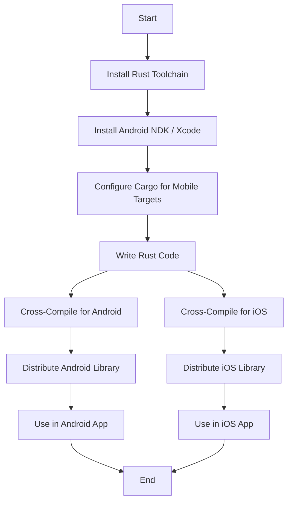

## 19.5. Building Mobile Libraries with Rust

In the ever-evolving landscape of mobile development, creating efficient, reusable, and portable code is paramount. Rust, with its emphasis on safety, performance, and concurrency, offers a compelling choice for building mobile libraries that can be shared across multiple applications and platforms. In this section, we will explore the advantages of using Rust for mobile libraries, provide guidelines for writing portable Rust code, and demonstrate how to compile and distribute Rust libraries for mobile targets.

### Advantages of Building Shared Libraries in Rust

Building shared libraries in Rust for mobile platforms offers several advantages:

1. **Safety and Reliability**: Rust's ownership model ensures memory safety without a garbage collector, reducing the likelihood of runtime errors and memory leaks.

2. **Performance**: Rust's zero-cost abstractions and efficient compilation to native code make it ideal for performance-critical mobile applications.

3. **Cross-Platform Compatibility**: Rust's ability to compile to various target architectures allows developers to create libraries that work seamlessly across iOS and Android.

4. **Concurrency**: Rust's concurrency model enables developers to write safe concurrent code, which is crucial for responsive mobile applications.

5. **Code Reuse**: By building shared libraries, developers can reuse code across different projects, reducing duplication and maintenance overhead.

### Guidelines for Writing Portable Rust Code

To ensure that your Rust code is portable and suitable for mobile platforms, consider the following guidelines:

- **Avoid Platform-Specific Code**: Use conditional compilation to separate platform-specific code from the main library logic. Rust's `cfg` attribute can be used to include or exclude code based on the target platform.

- **Minimize External Dependencies**: Keep external dependencies to a minimum to reduce the library's size and potential compatibility issues.

- **Use `no_std` When Possible**: For libraries that need to run in environments without a standard library, consider using the `no_std` feature to reduce dependencies.

- **Leverage Rust's FFI Capabilities**: Use Rust's Foreign Function Interface (FFI) to interact with platform-specific APIs or integrate with existing C/C++ code.

- **Design for Extensibility**: Ensure your library is designed with extensibility in mind, allowing developers to customize and extend functionality as needed.

### Compiling Rust Code for Mobile Targets

Compiling Rust code for mobile platforms involves cross-compilation, which allows you to build code for a target platform different from your development environment. Here's how you can set up cross-compilation for iOS and Android:

#### Setting Up Cross-Compilation for Android

1. **Install the Android NDK**: The Android Native Development Kit (NDK) provides the necessary tools to compile Rust code for Android.

2. **Configure Rust for Android Targets**: Add the Android target to your Rust toolchain using `rustup`:

   ```bash
   rustup target add aarch64-linux-android
   rustup target add armv7-linux-androideabi
   ```

3. **Set Up Cargo Configuration**: Create a `.cargo/config` file in your project directory to specify the linker and other build settings:

   ```toml
   [target.aarch64-linux-android]
   linker = "path/to/ndk/toolchains/llvm/prebuilt/linux-x86_64/bin/aarch64-linux-android21-clang"

   [target.armv7-linux-androideabi]
   linker = "path/to/ndk/toolchains/llvm/prebuilt/linux-x86_64/bin/armv7a-linux-androideabi21-clang"
   ```

4. **Build the Library**: Use Cargo to build your library for the specified Android targets:

   ```bash
   cargo build --target aarch64-linux-android --release
   cargo build --target armv7-linux-androideabi --release
   ```

#### Setting Up Cross-Compilation for iOS

1. **Install Xcode and Rust Toolchain**: Ensure you have Xcode installed and set up the Rust toolchain for iOS targets:

   ```bash
   rustup target add aarch64-apple-ios
   rustup target add x86_64-apple-ios
   ```

2. **Create a Cargo Configuration File**: Similar to Android, create a `.cargo/config` file for iOS:

   ```toml
   [target.aarch64-apple-ios]
   linker = "xcrun -sdk iphoneos clang"

   [target.x86_64-apple-ios]
   linker = "xcrun -sdk iphonesimulator clang"
   ```

3. **Build the Library**: Compile the library for iOS targets:

   ```bash
   cargo build --target aarch64-apple-ios --release
   cargo build --target x86_64-apple-ios --release
   ```

### Distributing Rust Libraries for Mobile Projects

Once your Rust library is compiled for mobile targets, you need to distribute it for use in mobile applications. Here are some common approaches:

- **Static and Dynamic Libraries**: Distribute your Rust library as a static (`.a`) or dynamic (`.so` or `.dylib`) library, which can be linked to mobile applications.

- **JNI for Android**: Use Java Native Interface (JNI) to call Rust functions from Java/Kotlin code in Android applications.

- **FFI for iOS**: Use Rust's FFI to expose Rust functions to Swift/Objective-C code in iOS applications.

- **Package Managers**: Consider using package managers like CocoaPods for iOS or Gradle for Android to distribute your library.

### Considerations for API Design and Versioning

When designing the API for your Rust library, consider the following:

- **Stability**: Ensure that your API is stable and well-documented, making it easy for developers to use and integrate into their projects.

- **Versioning**: Use semantic versioning to manage changes to your library's API, ensuring backward compatibility where possible.

- **Documentation**: Provide comprehensive documentation, including examples and usage guidelines, to help developers understand and use your library effectively.

- **Testing**: Implement thorough testing, including unit tests and integration tests, to ensure the reliability of your library.

### Example: Creating a Simple Rust Library for Mobile

Let's create a simple Rust library that provides basic mathematical operations and compile it for Android and iOS.

#### Step 1: Create a New Rust Library

Create a new Rust library project:

```bash
cargo new math_lib --lib
cd math_lib
```

#### Step 2: Implement the Library Functions

Edit the `src/lib.rs` file to add basic mathematical operations:

```rust
/// Adds two numbers.
pub fn add(a: i32, b: i32) -> i32 {
    a + b
}

/// Subtracts the second number from the first.
pub fn subtract(a: i32, b: i32) -> i32 {
    a - b
}

/// Multiplies two numbers.
pub fn multiply(a: i32, b: i32) -> i32 {
    a * b
}

/// Divides the first number by the second.
pub fn divide(a: i32, b: i32) -> Option<i32> {
    if b == 0 {
        None
    } else {
        Some(a / b)
    }
}
```

#### Step 3: Compile the Library for Android

Follow the steps outlined in the "Setting Up Cross-Compilation for Android" section to compile the library for Android targets.

#### Step 4: Compile the Library for iOS

Follow the steps outlined in the "Setting Up Cross-Compilation for iOS" section to compile the library for iOS targets.

#### Step 5: Distribute and Use the Library

- For Android, use JNI to call the Rust functions from Java/Kotlin.
- For iOS, use FFI to call the Rust functions from Swift/Objective-C.

### Visualizing the Cross-Compilation Process

To better understand the cross-compilation process, let's visualize it using a flowchart:



### Try It Yourself

Experiment with the provided code by adding more mathematical operations or optimizing the existing ones. Try compiling the library for different mobile targets and integrating it into a sample mobile application.

### Knowledge Check

- What are the benefits of using Rust for building mobile libraries?
- How can you ensure your Rust code is portable across different platforms?
- What are the steps involved in cross-compiling Rust code for Android and iOS?
- How can you distribute a Rust library for use in mobile applications?
- What considerations should you keep in mind when designing the API for a Rust library?

### Embrace the Journey

Building mobile libraries with Rust is an exciting journey that opens up new possibilities for code reuse and performance optimization. As you continue to explore Rust's capabilities, remember to experiment, learn from challenges, and enjoy the process of creating robust and efficient mobile solutions.

## Quiz Time!



### What is one of the main advantages of using Rust for mobile libraries?

- [x] Memory safety without a garbage collector
- [ ] Built-in garbage collection
- [ ] Automatic UI generation
- [ ] Native support for all mobile platforms

> **Explanation:** Rust provides memory safety without a garbage collector, which is crucial for mobile applications where performance and reliability are important.

### How can you ensure your Rust code is portable across different platforms?

- [x] Use conditional compilation with the `cfg` attribute
- [ ] Write platform-specific code only
- [ ] Use only the standard library
- [ ] Avoid using any external libraries

> **Explanation:** Conditional compilation with the `cfg` attribute allows you to include or exclude code based on the target platform, ensuring portability.

### Which tool is necessary for cross-compiling Rust code for Android?

- [x] Android NDK
- [ ] Xcode
- [ ] Visual Studio
- [ ] Eclipse

> **Explanation:** The Android Native Development Kit (NDK) provides the necessary tools to compile Rust code for Android.

### What is the purpose of the `.cargo/config` file in cross-compilation?

- [x] To specify the linker and build settings for target platforms
- [ ] To store application configuration settings
- [ ] To manage Rust dependencies
- [ ] To define the library's API

> **Explanation:** The `.cargo/config` file is used to specify the linker and other build settings for cross-compiling Rust code to different target platforms.

### How can you distribute a Rust library for use in iOS applications?

- [x] Use FFI to expose Rust functions to Swift/Objective-C
- [ ] Use JNI to call Rust functions from Java
- [ ] Compile the library as a `.jar` file
- [ ] Use a package manager like npm

> **Explanation:** Rust's Foreign Function Interface (FFI) can be used to expose Rust functions to Swift/Objective-C code in iOS applications.

### What is semantic versioning, and why is it important for Rust libraries?

- [x] A versioning system that helps manage API changes and backward compatibility
- [ ] A method for optimizing code performance
- [ ] A tool for compiling Rust code
- [ ] A library for handling JSON data

> **Explanation:** Semantic versioning is a versioning system that helps manage changes to a library's API, ensuring backward compatibility where possible.

### What is the benefit of using `no_std` in Rust libraries?

- [x] It reduces dependencies and allows the library to run in environments without a standard library
- [ ] It automatically optimizes the library for performance
- [ ] It provides a graphical user interface
- [ ] It enables network communication

> **Explanation:** Using `no_std` reduces dependencies and allows the library to run in environments without a standard library, which is useful for embedded or constrained environments.

### What is the role of Rust's FFI in mobile development?

- [x] To interact with platform-specific APIs or integrate with existing C/C++ code
- [ ] To automatically generate mobile user interfaces
- [ ] To manage memory allocation
- [ ] To compile Rust code for mobile platforms

> **Explanation:** Rust's Foreign Function Interface (FFI) is used to interact with platform-specific APIs or integrate with existing C/C++ code, which is essential for mobile development.

### Which of the following is a key consideration when designing the API for a Rust library?

- [x] Stability and comprehensive documentation
- [ ] Automatic code generation
- [ ] Built-in user authentication
- [ ] Real-time data processing

> **Explanation:** Ensuring that the API is stable and well-documented is crucial for making it easy for developers to use and integrate into their projects.

### True or False: Rust's concurrency model is beneficial for mobile applications.

- [x] True
- [ ] False

> **Explanation:** Rust's concurrency model enables developers to write safe concurrent code, which is crucial for responsive mobile applications.


