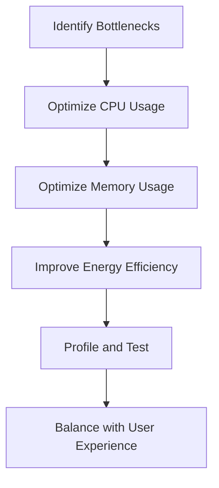

## 19.6. Performance Considerations for Mobile

In the realm of mobile development, performance is paramount. Mobile devices, unlike their desktop counterparts, are constrained by limited resources such as CPU power, memory, and battery life. As Rust developers, we must be mindful of these constraints and optimize our code to ensure smooth, efficient, and responsive applications. This section delves into strategies for optimizing Rust code for mobile platforms, focusing on CPU and memory usage, energy efficiency, and the balance between performance and user experience.

### Understanding Mobile Performance Characteristics

Mobile devices are inherently different from desktop systems. They are designed to be portable, which means they have to operate within the confines of limited hardware resources. Let's explore some key performance characteristics of mobile devices:

- **CPU Constraints**: Mobile CPUs are designed to balance performance with power consumption. They often have fewer cores and lower clock speeds compared to desktop CPUs.
- **Memory Limitations**: Mobile devices typically have less RAM, which necessitates efficient memory management to prevent applications from being terminated by the operating system.
- **Battery Life**: Energy efficiency is crucial as mobile devices rely on battery power. Applications that consume excessive energy can lead to a poor user experience.
- **Thermal Management**: Mobile devices can overheat if they run intensive tasks for extended periods, leading to throttling and reduced performance.

### Optimizing Rust Code for CPU and Memory Usage

To optimize Rust code for mobile devices, we need to focus on both CPU and memory usage. Here are some strategies to achieve this:

#### Efficient CPU Usage

1. **Leverage Rust's Zero-Cost Abstractions**: Rust provides zero-cost abstractions that allow you to write high-level code without incurring runtime overhead. Use iterators, closures, and other abstractions to write concise and efficient code.

2. **Minimize Computational Complexity**: Analyze your algorithms and data structures to ensure they are optimal. Use profiling tools to identify bottlenecks and optimize critical sections of your code.

3. **Parallelism and Concurrency**: Utilize Rust's concurrency features, such as threads and async/await, to take advantage of multi-core processors. However, be cautious of the overhead associated with context switching and synchronization.

4. **Avoid Blocking Operations**: In mobile applications, blocking operations can lead to unresponsive user interfaces. Use asynchronous programming to perform I/O operations without blocking the main thread.

#### Memory Management

1. **Ownership and Borrowing**: Rust's ownership model ensures memory safety without a garbage collector. Use ownership and borrowing effectively to manage memory and prevent leaks.

2. **Smart Pointers**: Use smart pointers like `Rc`, `Arc`, and `Box` to manage heap-allocated data. Choose the appropriate smart pointer based on your use case to minimize overhead.

3. **Avoid Unnecessary Cloning**: Cloning data can lead to increased memory usage. Use references and borrowing to avoid unnecessary copies.

4. **Optimize Data Structures**: Choose data structures that are memory-efficient. For example, use `Vec` instead of `LinkedList` for sequential data access.

### Writing Energy-Efficient Code

Energy efficiency is critical for mobile applications. Here are some tips to write energy-efficient Rust code:

1. **Reduce CPU Usage**: As mentioned earlier, optimizing CPU usage can lead to energy savings. Avoid busy-wait loops and use event-driven programming to minimize CPU activity.

2. **Efficient I/O Operations**: I/O operations can be energy-intensive. Use buffered I/O and asynchronous operations to reduce energy consumption.

3. **Minimize Network Usage**: Network operations consume significant energy. Optimize network requests by batching them and using efficient data formats.

4. **Use Hardware Acceleration**: Leverage hardware features such as GPU acceleration for tasks like graphics rendering and image processing to reduce CPU load and save energy.

### Profiling Tools for Mobile Platforms

Profiling is essential to identify performance bottlenecks and optimize your application. Here are some profiling tools available for mobile platforms:

- **Instruments (iOS)**: Instruments is a powerful profiling tool provided by Apple. It allows you to analyze CPU, memory, and energy usage of your iOS applications. [Learn more about Instruments](https://developer.apple.com/xcode/instruments/).

- **Android Profiler**: Android Studio provides a comprehensive profiler that helps you monitor CPU, memory, and network usage of your Android applications. [Learn more about Android Profiler](https://developer.android.com/studio/profile/).

### Balancing Performance with User Experience

While optimizing for performance, it's crucial to maintain a balance with user experience. Here are some considerations:

1. **Responsive UI**: Ensure that your application's user interface remains responsive by offloading heavy computations to background threads.

2. **Smooth Animations**: Optimize animations to run at a consistent frame rate. Use hardware acceleration and avoid complex calculations in the animation loop.

3. **Efficient Resource Loading**: Load resources such as images and data asynchronously to prevent blocking the UI thread.

4. **User Feedback**: Provide feedback to users during long operations, such as loading indicators or progress bars, to enhance the user experience.

### Try It Yourself

To reinforce your understanding, try optimizing a simple Rust application for mobile. Start by identifying performance bottlenecks using profiling tools, then apply the optimization strategies discussed above. Experiment with different data structures, algorithms, and concurrency models to see their impact on performance and energy efficiency.

### Visualizing Performance Optimization

To better understand the flow of performance optimization in mobile applications, consider the following diagram:

**Diagram Description**: This flowchart illustrates the process of optimizing a mobile application. Start by identifying performance bottlenecks, then optimize CPU and memory usage. Improve energy efficiency, profile and test the application, and finally balance performance with user experience.

### Key Takeaways

- Mobile devices have unique performance characteristics that require careful optimization.
- Efficient CPU and memory usage are crucial for mobile applications.
- Writing energy-efficient code can significantly enhance battery life.
- Profiling tools are essential for identifying and addressing performance bottlenecks.
- Balancing performance with user experience is key to successful mobile applications.

### References and Further Reading

- [Instruments (iOS profiling tool)](https://developer.apple.com/xcode/instruments/)
- [Android Profiler](https://developer.android.com/studio/profile/)
- [Rust Programming Language Documentation](https://doc.rust-lang.org/)

## Quiz Time!



### What is a key characteristic of mobile CPUs compared to desktop CPUs?

- [x] They are designed to balance performance with power consumption.
- [ ] They have more cores and higher clock speeds.
- [ ] They consume more energy.
- [ ] They are optimized for high-performance computing.

> **Explanation:** Mobile CPUs are designed to balance performance with power consumption to extend battery life.

### Which Rust feature helps manage memory without a garbage collector?

- [x] Ownership and Borrowing
- [ ] Smart Pointers
- [ ] Async/Await
- [ ] Pattern Matching

> **Explanation:** Rust's ownership and borrowing model ensures memory safety without a garbage collector.

### What is a benefit of using hardware acceleration in mobile applications?

- [x] It reduces CPU load and saves energy.
- [ ] It increases CPU usage.
- [ ] It makes applications slower.
- [ ] It consumes more battery.

> **Explanation:** Hardware acceleration leverages the GPU for tasks like graphics rendering, reducing CPU load and saving energy.

### What should you avoid to maintain a responsive UI in mobile applications?

- [x] Blocking operations on the main thread
- [ ] Asynchronous programming
- [ ] Event-driven programming
- [ ] Offloading computations to background threads

> **Explanation:** Blocking operations on the main thread can lead to an unresponsive UI.

### Which tool is used for profiling iOS applications?

- [x] Instruments
- [ ] Android Profiler
- [ ] Xcode Debugger
- [ ] Visual Studio Profiler

> **Explanation:** Instruments is a profiling tool provided by Apple for analyzing iOS applications.

### What is a strategy for optimizing network usage in mobile applications?

- [x] Batching network requests
- [ ] Sending requests individually
- [ ] Using uncompressed data formats
- [ ] Increasing the frequency of requests

> **Explanation:** Batching network requests reduces the number of network operations, saving energy.

### How can you minimize memory usage in Rust applications?

- [x] Avoid unnecessary cloning
- [ ] Use more smart pointers
- [ ] Increase heap allocation
- [ ] Use larger data structures

> **Explanation:** Avoiding unnecessary cloning reduces memory usage by preventing duplicate data.

### What is the role of profiling tools in mobile development?

- [x] Identifying performance bottlenecks
- [ ] Writing code
- [ ] Designing user interfaces
- [ ] Managing databases

> **Explanation:** Profiling tools help identify performance bottlenecks, allowing developers to optimize their applications.

### What is a key consideration when balancing performance with user experience?

- [x] Ensuring the UI remains responsive
- [ ] Maximizing CPU usage
- [ ] Increasing memory allocation
- [ ] Reducing network requests

> **Explanation:** Ensuring the UI remains responsive is crucial for a good user experience.

### True or False: Mobile devices typically have more RAM than desktop systems.

- [ ] True
- [x] False

> **Explanation:** Mobile devices typically have less RAM compared to desktop systems, necessitating efficient memory management.



Remember, optimizing Rust code for mobile is an ongoing process. As you continue to develop and refine your applications, keep experimenting with different strategies and tools. Stay curious, and enjoy the journey of creating efficient and responsive mobile applications with Rust!
