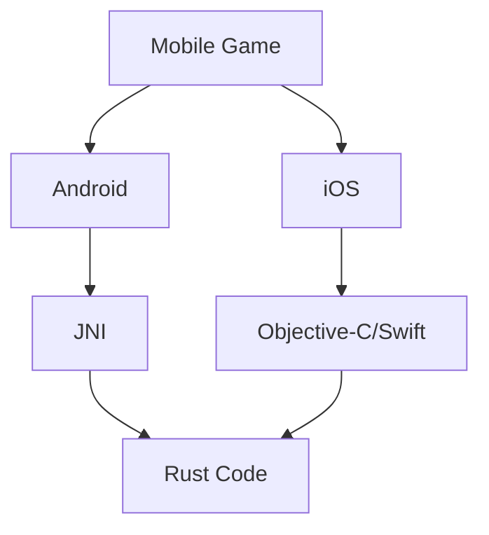

## 19.7. Rust in Mobile Game Development

### Introduction

Mobile game development presents unique challenges and opportunities. The constraints of mobile devices, such as limited processing power and battery life, demand efficient and performant code. Rust, with its focus on safety, concurrency, and performance, is an excellent choice for mobile game development. In this section, we will explore how Rust can be leveraged to develop mobile games, discuss the libraries and engines available, and provide practical examples of incorporating Rust into mobile game projects.

### Demands of Game Development on Mobile Devices

Mobile games require careful consideration of several factors:

- **Performance**: Mobile devices have limited CPU and GPU resources compared to desktops or consoles. Efficient use of these resources is crucial.
- **Battery Life**: Games should be optimized to minimize battery consumption.
- **Cross-Platform Compatibility**: Games often need to run on both Android and iOS, requiring cross-platform development strategies.
- **User Experience**: Smooth graphics rendering, responsive input handling, and immersive audio are essential for a good user experience.

Rust's performance characteristics make it well-suited to address these challenges, providing a robust foundation for mobile game development.

### Game Development Libraries and Engines Supporting Rust

Several game development libraries and engines support Rust, offering a range of features for mobile game development:

#### Bevy

[Bevy](https://bevyengine.org/) is a modern game engine built in Rust. It is designed to be simple, fast, and flexible, making it an excellent choice for mobile game development. Bevy supports cross-platform development, allowing you to target both Android and iOS.

- **Entity-Component-System (ECS)**: Bevy uses an ECS architecture, which is highly performant and scalable.
- **Cross-Platform**: Bevy supports multiple platforms, including mobile.
- **Modular Design**: Bevy's modular design allows you to include only the features you need, optimizing performance.

#### Amethyst

[Amethyst](https://amethyst.rs/) is another game engine built in Rust. It focuses on providing a data-driven game engine with a focus on performance and flexibility.

- **Data-Driven Architecture**: Amethyst's architecture allows for easy customization and extension.
- **Cross-Platform**: Amethyst supports Android and iOS, among other platforms.
- **Community and Support**: Amethyst has an active community and extensive documentation.

### Incorporating Rust into Mobile Game Projects

Incorporating Rust into mobile game projects involves several steps, from setting up the development environment to integrating Rust with platform-specific APIs.

#### Setting Up the Development Environment

To start developing mobile games with Rust, you'll need to set up your development environment:

1. **Install Rust**: Ensure you have the latest version of Rust installed. You can install Rust using [rustup](https://rustup.rs/).
2. **Set Up Android/iOS Toolchains**: For Android, you'll need the Android NDK and SDK. For iOS, you'll need Xcode and the iOS SDK.
3. **Cross-Compilation**: Use Rust's cross-compilation capabilities to build for mobile platforms. Tools like `cargo-ndk` can help with Android builds.

#### Integrating Rust with Mobile Platforms

Rust can be integrated with mobile platforms using Foreign Function Interface (FFI) to interact with platform-specific APIs.

- **Android**: Use the Java Native Interface (JNI) to call Rust code from Java/Kotlin. Libraries like `jni` can facilitate this integration.
- **iOS**: Use Objective-C or Swift to call Rust code. The `cbindgen` tool can generate C bindings for Rust code, which can be used in Objective-C or Swift.

### Handling Graphics Rendering, Input, and Audio

Handling graphics rendering, input, and audio are critical components of mobile game development. Rust provides several libraries and tools to manage these aspects efficiently.

#### Graphics Rendering

Graphics rendering in Rust can be achieved using libraries like `wgpu` or `gfx-rs`, which provide cross-platform graphics APIs.

- **wgpu**: A modern graphics API that supports Vulkan, Metal, and DirectX. It is designed for high performance and cross-platform compatibility.
- **gfx-rs**: A low-level graphics library that abstracts over multiple graphics APIs, providing a unified interface for rendering.

#### Input Handling

Input handling in mobile games involves capturing touch events, gestures, and other user interactions. Libraries like `winit` can be used to handle input events in a cross-platform manner.

- **winit**: A window handling library that supports input events across multiple platforms, including mobile.

#### Audio

Audio is an essential part of the gaming experience. Libraries like `rodio` or `cpal` can be used to handle audio playback in Rust.

- **rodio**: A high-level audio playback library that is easy to use and integrates well with Rust projects.
- **cpal**: A low-level audio library that provides cross-platform audio input and output.

### Cross-Platform Considerations and Performance Optimization

Cross-platform development and performance optimization are crucial for mobile games. Rust's features and ecosystem provide several advantages in these areas.

#### Cross-Platform Development

Rust's cross-platform capabilities allow you to write code once and deploy it on multiple platforms. By using libraries and tools that abstract platform-specific details, you can focus on game logic and features.

- **Conditional Compilation**: Use Rust's conditional compilation features to include platform-specific code only when necessary.
- **Platform Abstraction**: Use libraries that provide platform abstraction, allowing you to write platform-agnostic code.

#### Performance Optimization

Performance optimization is critical for mobile games to ensure smooth gameplay and efficient resource usage.

- **Profiling and Benchmarking**: Use tools like `cargo bench` and `criterion` to profile and benchmark your game, identifying performance bottlenecks.
- **Memory Management**: Rust's ownership model ensures memory safety and can help prevent memory leaks and other issues.
- **Concurrency**: Use Rust's concurrency features to parallelize tasks and improve performance.

### Code Example: Integrating Rust with Android

Let's look at a simple example of integrating Rust with an Android project using JNI.

```rust
// src/lib.rs

#[no_mangle]
pub extern "C" fn rust_function() -> i32 {
    // Perform some computation
    42
}
```

```java
// MainActivity.java

public class MainActivity extends AppCompatActivity {
    static {
        System.loadLibrary("rust_library");
    }

    public native int rustFunction();

    @Override
    protected void onCreate(Bundle savedInstanceState) {
        super.onCreate(savedInstanceState);
        setContentView(R.layout.activity_main);

        int result = rustFunction();
        Log.d("Rust", "Result from Rust: " + result);
    }
}
```

**Explanation**: In this example, we define a simple Rust function `rust_function` that returns an integer. We then use JNI to call this function from Java in an Android application.

### Try It Yourself

Experiment with the code example by modifying the Rust function to perform different computations or return different data types. Try integrating more complex Rust logic into your Android application.

### Visualizing Rust Integration with Mobile Platforms



**Diagram Description**: This diagram illustrates the integration of Rust with mobile platforms, showing how Rust code can be accessed from Android using JNI and from iOS using Objective-C or Swift.

### Knowledge Check

- What are the key challenges of mobile game development, and how does Rust address them?
- How can Rust be integrated with Android and iOS platforms?
- What libraries and tools are available for graphics rendering, input handling, and audio in Rust?
- How can you optimize performance in mobile games developed with Rust?

### Conclusion

Rust offers a powerful and efficient platform for mobile game development, providing the performance and safety needed to create high-quality games. By leveraging Rust's ecosystem of libraries and tools, developers can build cross-platform games that run smoothly on both Android and iOS. Remember, this is just the beginning. As you continue to explore Rust in mobile game development, you'll discover new techniques and optimizations that will enhance your games even further. Keep experimenting, stay curious, and enjoy the journey!

## Quiz Time!



### What is one of the main challenges of mobile game development that Rust addresses?

- [x] Performance optimization
- [ ] Limited storage space
- [ ] High-resolution graphics
- [ ] Complex user interfaces

> **Explanation:** Rust addresses performance optimization, which is crucial for mobile devices with limited resources.

### Which game engine is built in Rust and supports cross-platform development?

- [x] Bevy
- [ ] Unity
- [ ] Unreal Engine
- [ ] Godot

> **Explanation:** Bevy is a game engine built in Rust that supports cross-platform development.

### How can Rust be integrated with Android applications?

- [x] Using JNI (Java Native Interface)
- [ ] Using WebAssembly
- [ ] Using Python bindings
- [ ] Using HTML5

> **Explanation:** Rust can be integrated with Android applications using JNI to call Rust code from Java/Kotlin.

### Which library can be used for graphics rendering in Rust?

- [x] wgpu
- [ ] OpenGL
- [ ] DirectX
- [ ] Vulkan

> **Explanation:** `wgpu` is a modern graphics API in Rust that supports cross-platform graphics rendering.

### What is the purpose of the `cbindgen` tool in Rust?

- [x] To generate C bindings for Rust code
- [ ] To compile Rust code to WebAssembly
- [ ] To optimize Rust code for performance
- [ ] To manage Rust dependencies

> **Explanation:** `cbindgen` generates C bindings for Rust code, facilitating integration with C-based languages.

### Which library can be used for audio playback in Rust?

- [x] rodio
- [ ] SDL
- [ ] OpenAL
- [ ] FMOD

> **Explanation:** `rodio` is a high-level audio playback library in Rust.

### What is the role of `winit` in Rust game development?

- [x] Handling input events
- [ ] Rendering graphics
- [ ] Managing audio
- [ ] Compiling Rust code

> **Explanation:** `winit` is a library used for handling input events across multiple platforms.

### How can you optimize performance in Rust mobile games?

- [x] Profiling and benchmarking
- [ ] Increasing the frame rate
- [ ] Using more memory
- [ ] Adding more features

> **Explanation:** Profiling and benchmarking help identify performance bottlenecks and optimize the game.

### What is a benefit of using Rust's concurrency features in game development?

- [x] Improved performance through parallelization
- [ ] Simplified code structure
- [ ] Enhanced graphics quality
- [ ] Reduced code size

> **Explanation:** Rust's concurrency features allow for parallelization, improving performance.

### Rust's ownership model helps prevent which type of issue?

- [x] Memory leaks
- [ ] Syntax errors
- [ ] Logic errors
- [ ] Compilation errors

> **Explanation:** Rust's ownership model ensures memory safety, helping prevent memory leaks.


