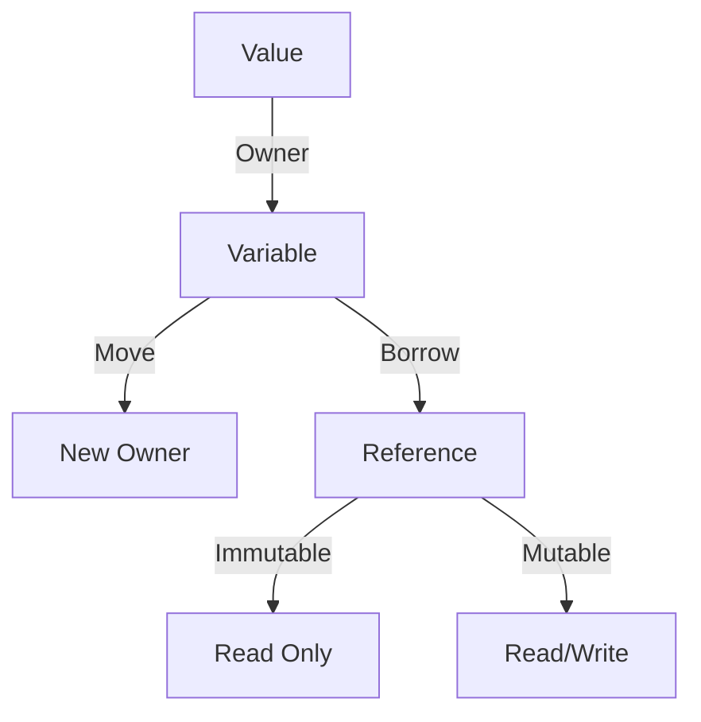

## 2.1. Ownership and Borrowing

In Rust, ownership and borrowing are foundational concepts that ensure memory safety and concurrency without a garbage collector. These principles are integral to Rust's design, enabling developers to write efficient and safe code. Let's delve into these concepts, understand their rules, and see how they prevent common programming errors.

### Understanding Ownership

Ownership is a unique feature of Rust that governs how memory is managed. Each value in Rust has a single owner, and when the owner goes out of scope, the value is automatically deallocated. This ensures that memory is efficiently managed without the need for a garbage collector.

#### Key Rules of Ownership

1. **Each value in Rust has a single owner.**
2. **When the owner goes out of scope, the value is dropped.**
3. **Values can be moved, but not copied, unless they implement the `Copy` trait.**

Consider the following example:

```rust
fn main() {
    let s1 = String::from("hello");
    let s2 = s1; // s1 is moved to s2

    // println!("{}", s1); // This line would cause a compile-time error
    println!("{}", s2);
}
```

In this code, `s1` is moved to `s2`. After the move, `s1` is no longer valid, and attempting to use it would result in a compile-time error. This prevents issues like double-free errors.

### Borrowing and References

Borrowing allows you to access data without taking ownership. Rust enforces borrowing rules to ensure memory safety and prevent data races.

#### Immutable Borrowing

You can borrow a value immutably, meaning you can read it but not modify it. Multiple immutable borrows are allowed simultaneously.

```rust
fn main() {
    let s = String::from("hello");

    let r1 = &s; // Immutable borrow
    let r2 = &s; // Another immutable borrow

    println!("{}, {}", r1, r2);
}
```

#### Mutable Borrowing

Mutable borrowing allows you to modify the borrowed value, but only one mutable borrow is allowed at a time to prevent data races.

```rust
fn main() {
    let mut s = String::from("hello");

    let r1 = &mut s; // Mutable borrow
    r1.push_str(", world");

    println!("{}", r1);
}
```

### Rules of Borrowing

1. **You can have either one mutable reference or any number of immutable references, but not both.**
2. **References must always be valid.**

These rules ensure that data races are impossible at compile time, making Rust a safe choice for concurrent programming.

### Lifetimes and Their Importance

Lifetimes are a way of describing the scope for which a reference is valid. Rust uses lifetimes to ensure that references do not outlive the data they point to.

Consider the following example:

```rust
fn longest<'a>(x: &'a str, y: &'a str) -> &'a str {
    if x.len() > y.len() {
        x
    } else {
        y
    }
}

fn main() {
    let string1 = String::from("long string is long");
    let string2 = "xyz";

    let result = longest(string1.as_str(), string2);
    println!("The longest string is {}", result);
}
```

In this function, the lifetime `'a` ensures that the returned reference is valid as long as both input references are valid.

### Preventing Common Errors

Rust's ownership and borrowing system prevents common errors such as:

- **Null pointers**: Rust does not have null references. Instead, it uses the `Option` type to represent a value that might be absent.
- **Dangling pointers**: Rust's borrow checker ensures that references are always valid.
- **Data races**: The borrowing rules prevent simultaneous mutable access, eliminating data races.

### Scenarios Where Ownership and Borrowing Are Crucial

1. **Concurrency**: Rust's borrowing rules ensure that data races are impossible, making it ideal for concurrent programming.
2. **Resource Management**: Ownership ensures that resources are released when they are no longer needed, preventing leaks.
3. **Interfacing with C**: When working with C libraries, understanding ownership and borrowing is crucial to managing memory safely.

### Visualizing Ownership and Borrowing

To better understand these concepts, let's visualize how ownership and borrowing work in Rust.



**Figure 1**: Visual representation of ownership and borrowing in Rust.

### Try It Yourself

Experiment with the following code snippets to deepen your understanding of ownership and borrowing:

1. **Modify the `main` function** to attempt multiple mutable borrows and observe the compiler error.
2. **Create a function** that takes both mutable and immutable references and see how Rust enforces borrowing rules.

### Further Reading

For more information on Rust's ownership and borrowing system, consider the following resources:

- [Rust Book: Ownership](https://doc.rust-lang.org/book/ch04-01-what-is-ownership.html)
- [Rust Reference: Borrowing](https://doc.rust-lang.org/reference/expressions/borrow.html)

### Summary

Ownership and borrowing are central to Rust's memory safety guarantees. By understanding these concepts, you can write efficient, safe, and concurrent Rust code. Remember, this is just the beginning. As you progress, you'll build more complex and interactive applications. Keep experimenting, stay curious, and enjoy the journey!

## Quiz Time!



### What is the primary purpose of ownership in Rust?

- [x] To manage memory safely without a garbage collector
- [ ] To allow multiple owners of a value
- [ ] To enable dynamic typing
- [ ] To enforce runtime checks

> **Explanation:** Ownership ensures memory is managed safely and efficiently without a garbage collector.

### What happens when a value is moved in Rust?

- [x] The original owner can no longer use the value
- [ ] The original owner retains access to the value
- [ ] The value is duplicated
- [ ] The value is deleted

> **Explanation:** When a value is moved, the original owner loses access to it, preventing double-free errors.

### How many mutable borrows are allowed at a time in Rust?

- [x] One
- [ ] Two
- [ ] Unlimited
- [ ] None

> **Explanation:** Only one mutable borrow is allowed at a time to prevent data races.

### What is a dangling pointer?

- [x] A reference to memory that has been deallocated
- [ ] A reference to a null value
- [ ] A reference to a mutable value
- [ ] A reference to a constant

> **Explanation:** A dangling pointer refers to memory that has been freed, which Rust prevents through its borrowing rules.

### What does the lifetime `'a` in a function signature represent?

- [x] The scope for which a reference is valid
- [ ] The age of a variable
- [ ] The type of a reference
- [ ] The size of a variable

> **Explanation:** Lifetimes in Rust describe the scope during which a reference is valid.

### Can you have multiple immutable borrows in Rust?

- [x] Yes
- [ ] No

> **Explanation:** Multiple immutable borrows are allowed simultaneously, as they do not cause data races.

### What is the `Option` type used for in Rust?

- [x] To represent a value that might be absent
- [ ] To enforce ownership
- [ ] To manage concurrency
- [ ] To define lifetimes

> **Explanation:** The `Option` type is used to represent values that might be absent, avoiding null pointers.

### What does Rust's borrow checker do?

- [x] Ensures references are always valid
- [ ] Compiles the code
- [ ] Manages memory allocation
- [ ] Enforces runtime checks

> **Explanation:** The borrow checker ensures that references are valid and prevent dangling pointers.

### What is a data race?

- [x] Simultaneous access to data from multiple threads, where at least one is a write
- [ ] A race between two functions
- [ ] A competition between variables
- [ ] A type of memory leak

> **Explanation:** A data race occurs when multiple threads access data simultaneously, and at least one access is a write, which Rust prevents.

### True or False: Rust allows null pointers.

- [ ] True
- [x] False

> **Explanation:** Rust does not allow null pointers, using the `Option` type instead to represent optional values.


