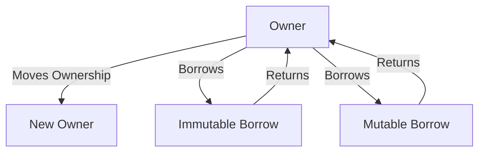

## 2.2. Memory Safety without Garbage Collection

Memory safety is a critical aspect of programming, especially in systems programming, where the consequences of memory errors can be severe. Rust offers a unique approach to memory safety by eliminating the need for a garbage collector (GC) while ensuring that programs are free from common memory-related errors such as null pointer dereferencing, buffer overflows, and use-after-free errors. In this section, we will explore how Rust achieves memory safety at compile time, compare it with garbage-collected languages, and highlight the performance benefits of Rust's approach.

### Understanding Memory Safety

Memory safety refers to the protection against errors that can occur when a program incorrectly manages memory. These errors can lead to undefined behavior, crashes, or security vulnerabilities. Common memory safety issues include:

- **Dangling Pointers**: Accessing memory that has already been freed.
- **Buffer Overflows**: Writing data beyond the allocated memory boundaries.
- **Null Pointer Dereferencing**: Attempting to access memory through a null pointer.
- **Memory Leaks**: Failing to release memory that is no longer needed.

Ensuring memory safety is crucial for building reliable and secure software. Traditionally, languages like C and C++ place the burden of memory management on the programmer, leading to potential errors. In contrast, languages like Java and C# use garbage collection to automate memory management, reducing the risk of memory leaks and other errors.

### Rust's Approach to Memory Safety

Rust takes a different path by enforcing memory safety through its ownership model, borrowing rules, and lifetimes, all of which are checked at compile time. This approach eliminates the need for a garbage collector and provides several advantages:

1. **Ownership**: Every value in Rust has a single owner, which is responsible for managing its memory. When the owner goes out of scope, the value is automatically deallocated.

2. **Borrowing**: Rust allows references to values without transferring ownership. Borrowing can be either mutable or immutable, but not both at the same time, ensuring data races are prevented in concurrent contexts.

3. **Lifetimes**: Rust uses lifetimes to track how long references are valid, preventing dangling references.

Let's delve deeper into these concepts with examples.

### Ownership in Rust

Ownership is the cornerstone of Rust's memory management. It ensures that each piece of memory has a single owner, which is responsible for its cleanup. Here's a simple example to illustrate ownership:

```rust
fn main() {
    let s1 = String::from("Hello, Rust!");
    let s2 = s1; // Ownership of the string is moved to s2

    // println!("{}", s1); // This line would cause a compile-time error
    println!("{}", s2); // s2 is now the owner of the string
}
```

In this example, the ownership of the string is transferred from `s1` to `s2`. Attempting to use `s1` after the transfer results in a compile-time error, preventing use-after-free errors.

### Borrowing and References

Borrowing allows functions to access data without taking ownership. Rust enforces borrowing rules to ensure safety:

- You can have either one mutable reference or any number of immutable references to a piece of data at a time.
- References must always be valid.

Here's an example demonstrating borrowing:

```rust
fn main() {
    let s = String::from("Hello, Rust!");

    let len = calculate_length(&s); // Borrowing s as an immutable reference
    println!("The length of '{}' is {}.", s, len);
}

fn calculate_length(s: &String) -> usize {
    s.len()
}
```

In this example, `calculate_length` borrows `s` without taking ownership, allowing `s` to be used after the function call.

### Lifetimes

Lifetimes are a way for Rust to track how long references are valid. They help prevent dangling references by ensuring that references do not outlive the data they point to. Here's a simple example:

```rust
fn longest<'a>(x: &'a str, y: &'a str) -> &'a str {
    if x.len() > y.len() {
        x
    } else {
        y
    }
}

fn main() {
    let string1 = String::from("long string is long");
    let string2 = "xyz";

    let result = longest(string1.as_str(), string2);
    println!("The longest string is '{}'.", result);
}
```

In this example, the function `longest` returns a reference with the same lifetime as the shortest of the input references, ensuring that the returned reference is always valid.

### Comparing Rust with Garbage-Collected Languages

Languages like Java and C# use garbage collection to manage memory automatically. While this approach simplifies memory management, it comes with trade-offs:

- **Performance Overhead**: Garbage collectors introduce runtime overhead, which can impact performance, especially in latency-sensitive applications.
- **Non-Deterministic Deallocation**: Memory is deallocated at the discretion of the garbage collector, which can lead to unpredictable pauses.

Rust's compile-time memory management offers several advantages:

- **Predictable Performance**: Memory is deallocated deterministically when the owner goes out of scope, resulting in more predictable performance.
- **No Runtime Overhead**: Since memory safety is enforced at compile time, there is no need for a garbage collector, reducing runtime overhead.
- **Fine-Grained Control**: Rust provides fine-grained control over memory allocation and deallocation, which is crucial for systems programming.

### Performance Benefits of Rust's Approach

Rust's approach to memory safety without garbage collection provides significant performance benefits:

1. **Low Latency**: Rust's deterministic memory management ensures low-latency performance, making it ideal for real-time systems.
2. **Efficient Resource Utilization**: By eliminating the need for a garbage collector, Rust reduces CPU and memory usage, leading to more efficient resource utilization.
3. **Scalability**: Rust's memory model scales well with multi-threaded applications, as it prevents data races and ensures safe concurrency.

### Code Example: Memory Management in Rust

Let's explore a more complex example that demonstrates Rust's memory management in action:

```rust
use std::collections::HashMap;

fn main() {
    let mut scores = HashMap::new();

    scores.insert(String::from("Blue"), 10);
    scores.insert(String::from("Yellow"), 50);

    let team_name = String::from("Blue");
    let score = scores.get(&team_name);

    match score {
        Some(&score) => println!("The score for {} is {}.", team_name, score),
        None => println!("No score found for {}.", team_name),
    }

    // Ownership of team_name is retained, and scores is safely accessed
}
```

In this example, we use a `HashMap` to store scores for different teams. The `get` method borrows a reference to the key, allowing us to access the score without taking ownership of the key or the map.

### Visualizing Rust's Memory Model

To better understand Rust's memory model, let's visualize the ownership and borrowing process:



This diagram illustrates how ownership can be moved or borrowed, ensuring memory safety through compile-time checks.

### References and Further Reading

For more information on Rust's memory model and safety features, consider exploring the following resources:

- [The Rust Programming Language Book](https://doc.rust-lang.org/book/)
- [Rust's Ownership and Borrowing](https://doc.rust-lang.org/book/ch04-00-understanding-ownership.html)
- [Rust's Lifetimes](https://doc.rust-lang.org/book/ch10-03-lifetime-syntax.html)

### Knowledge Check

- **Question**: What is the primary benefit of Rust's ownership model?
- **Exercise**: Modify the provided code examples to explore different ownership and borrowing scenarios.

### Embrace the Journey

Remember, mastering Rust's memory model is a journey. As you progress, you'll gain a deeper understanding of how to write safe and efficient code. Keep experimenting, stay curious, and enjoy the journey!

## Quiz Time!



### What is memory safety?

- [x] Protection against errors like null pointer dereferencing and buffer overflows
- [ ] A feature that allows memory to be automatically managed
- [ ] A mechanism for optimizing memory usage
- [ ] A runtime process for cleaning up unused memory

> **Explanation:** Memory safety involves protecting against common memory-related errors such as null pointer dereferencing and buffer overflows.

### How does Rust ensure memory safety without garbage collection?

- [x] Through compile-time checks using ownership, borrowing, and lifetimes
- [ ] By using a runtime garbage collector
- [ ] By manually managing memory allocation and deallocation
- [ ] By using a reference counting system

> **Explanation:** Rust uses compile-time checks with ownership, borrowing, and lifetimes to ensure memory safety without the need for a garbage collector.

### What is the main advantage of Rust's memory management model over garbage-collected languages?

- [x] Predictable performance and no runtime overhead
- [ ] Easier to write code
- [ ] Automatic memory management
- [ ] More flexible memory allocation

> **Explanation:** Rust's memory management model offers predictable performance and no runtime overhead, unlike garbage-collected languages.

### What happens when ownership is transferred in Rust?

- [x] The original owner can no longer access the value
- [ ] The original owner retains access to the value
- [ ] The value is duplicated
- [ ] The value is automatically deallocated

> **Explanation:** When ownership is transferred in Rust, the original owner can no longer access the value.

### What is borrowing in Rust?

- [x] Accessing data without taking ownership
- [ ] Transferring ownership of data
- [ ] Duplicating data
- [ ] Deallocating memory

> **Explanation:** Borrowing in Rust allows functions to access data without taking ownership.

### How does Rust prevent data races?

- [x] By allowing either one mutable reference or multiple immutable references at a time
- [ ] By using a garbage collector
- [ ] By manually locking data
- [ ] By duplicating data

> **Explanation:** Rust prevents data races by allowing either one mutable reference or multiple immutable references at a time.

### What is a lifetime in Rust?

- [x] A way to track how long references are valid
- [ ] A mechanism for automatic memory management
- [ ] A runtime process for cleaning up unused memory
- [ ] A feature for optimizing memory usage

> **Explanation:** Lifetimes in Rust track how long references are valid, preventing dangling references.

### What is the main disadvantage of garbage collection?

- [x] Performance overhead and non-deterministic deallocation
- [ ] Easier memory management
- [ ] Predictable performance
- [ ] Fine-grained control over memory

> **Explanation:** Garbage collection introduces performance overhead and non-deterministic deallocation.

### What is a dangling pointer?

- [x] A pointer that references memory that has been freed
- [ ] A pointer that references valid memory
- [ ] A pointer that is automatically managed
- [ ] A pointer that is duplicated

> **Explanation:** A dangling pointer references memory that has been freed, leading to potential errors.

### True or False: Rust uses a garbage collector to manage memory.

- [ ] True
- [x] False

> **Explanation:** Rust does not use a garbage collector; it relies on compile-time checks for memory safety.


