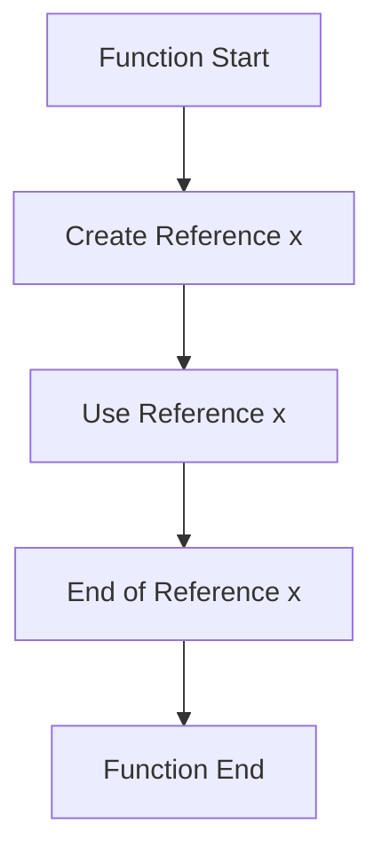

## 2.3. Lifetimes and Their Importance

In Rust, lifetimes are a fundamental concept that plays a crucial role in ensuring memory safety. They are part of Rust's unique approach to ownership and borrowing, which prevents common programming errors such as dangling pointers and data races. In this section, we will delve into the intricacies of lifetimes, how they relate to ownership and borrowing, and their importance in safe memory management.

### Understanding Lifetimes

Lifetimes in Rust are a way of describing the scope for which a reference is valid. They are not a runtime feature but a compile-time check that the Rust compiler uses to ensure that references do not outlive the data they point to. This is essential for preventing dangling references, which can lead to undefined behavior and security vulnerabilities.

#### Lifetimes and Ownership

Rust's ownership model is designed to manage memory safely and efficiently. Every value in Rust has a single owner, and when the owner goes out of scope, the value is dropped, freeing the associated memory. Lifetimes extend this model by ensuring that references to a value do not outlive the value itself.

#### Lifetimes and Borrowing

Borrowing in Rust allows you to create references to data without taking ownership. However, borrowing introduces the risk of dangling references if the data is dropped while a reference is still in use. Lifetimes are used to enforce borrowing rules, ensuring that references remain valid for the duration of their use.

### Lifetime Annotations

In many cases, Rust can infer lifetimes automatically. However, there are situations where you need to explicitly specify lifetimes using annotations. Lifetime annotations are a way to tell the compiler how different references relate to each other in terms of their lifetimes.

#### Syntax of Lifetime Annotations

Lifetime annotations are specified using an apostrophe followed by a name, such as `'a`. They are used in function signatures and struct definitions to indicate the relationships between the lifetimes of references.

```rust
fn longest<'a>(x: &'a str, y: &'a str) -> &'a str {
    if x.len() > y.len() {
        x
    } else {
        y
    }
}
```

In the above example, the function `longest` takes two string slices with the same lifetime `'a` and returns a string slice with the same lifetime. This ensures that the returned reference is valid as long as both input references are valid.

#### When Are Lifetime Annotations Necessary?

Lifetime annotations are necessary when the compiler cannot infer the lifetimes of references. This typically occurs in functions and methods where the relationships between input and output lifetimes are not clear.

### Lifetimes in Structs

Lifetimes can also be used in struct definitions to ensure that references within a struct do not outlive the struct itself.

```rust
struct Book<'a> {
    title: &'a str,
    author: &'a str,
}

impl<'a> Book<'a> {
    fn new(title: &'a str, author: &'a str) -> Self {
        Book { title, author }
    }
}
```

In this example, the `Book` struct holds references to strings, and the lifetime `'a` ensures that these references are valid for the duration of the `Book` instance.

### Common Lifetime-Related Compiler Errors

Rust's compiler is strict about lifetimes, and you may encounter errors related to lifetimes when writing Rust code. Understanding these errors and how to resolve them is crucial for effective Rust programming.

#### Example Error: "Missing Lifetime Specifier"

This error occurs when the compiler cannot infer the lifetimes of references and requires explicit annotations.

```rust
fn first_word(s: &str) -> &str {
    // Error: missing lifetime specifier
    let bytes = s.as_bytes();
    for (i, &item) in bytes.iter().enumerate() {
        if item == b' ' {
            return &s[0..i];
        }
    }
    &s[..]
}
```

To resolve this, you need to specify a lifetime for the input and output references:

```rust
fn first_word<'a>(s: &'a str) -> &'a str {
    let bytes = s.as_bytes();
    for (i, &item) in bytes.iter().enumerate() {
        if item == b' ' {
            return &s[0..i];
        }
    }
    &s[..]
}
```

#### Example Error: "Cannot Return Reference to Local Variable"

This error occurs when you attempt to return a reference to a local variable that will be dropped at the end of the function.

```rust
fn dangle() -> &String {
    // Error: cannot return reference to local variable
    let s = String::from("hello");
    &s
}
```

To fix this, you can return the `String` itself, transferring ownership:

```rust
fn no_dangle() -> String {
    let s = String::from("hello");
    s
}
```

### The Role of Lifetimes in Safe Memory Management

Lifetimes are a key part of Rust's memory safety guarantees. By ensuring that references are valid for the duration of their use, lifetimes prevent common errors such as use-after-free and data races. This makes Rust a powerful language for systems programming, where safety and performance are critical.

### Visualizing Lifetimes

To better understand lifetimes, let's visualize how they work in a simple function.



In this diagram, the reference `x` is created and used within the function. The lifetime of `x` is the duration between its creation and the end of its use. The Rust compiler ensures that `x` does not outlive the data it references.

### Try It Yourself

Experiment with the following code to deepen your understanding of lifetimes:

```rust
fn main() {
    let string1 = String::from("long string is long");
    let result;
    {
        let string2 = String::from("xyz");
        result = longest(string1.as_str(), string2.as_str());
        println!("The longest string is {}", result);
    }
    // Uncommenting the following line will cause a compile-time error
    // println!("The longest string is {}", result);
}

fn longest<'a>(x: &'a str, y: &'a str) -> &'a str {
    if x.len() > y.len() {
        x
    } else {
        y
    }
}
```

Try modifying the code to see how changing the lifetimes affects the program. For example, uncomment the last `println!` statement to observe the compiler error.

### Key Takeaways

- **Lifetimes ensure memory safety** by preventing dangling references and use-after-free errors.
- **Lifetime annotations** are necessary when the compiler cannot infer lifetimes.
- **Understanding common lifetime-related errors** is crucial for effective Rust programming.
- **Lifetimes are a compile-time feature** that enhances Rust's safety guarantees.

### Embrace the Journey

Remember, mastering lifetimes is a journey. As you continue to explore Rust, you'll encounter more complex scenarios where lifetimes play a crucial role. Keep experimenting, stay curious, and enjoy the process of learning Rust's unique approach to memory safety.

## Quiz Time!



### What is the primary purpose of lifetimes in Rust?

- [x] To ensure that references are valid and prevent dangling pointers.
- [ ] To manage memory allocation and deallocation.
- [ ] To optimize code execution speed.
- [ ] To enforce type safety.

> **Explanation:** Lifetimes in Rust are used to ensure that references are valid for the duration of their use, preventing dangling pointers and ensuring memory safety.

### When are lifetime annotations necessary in Rust?

- [x] When the compiler cannot infer the lifetimes of references.
- [ ] When defining any function in Rust.
- [ ] When using primitive data types.
- [ ] When writing comments in the code.

> **Explanation:** Lifetime annotations are necessary when the compiler cannot infer the lifetimes of references, typically in functions and methods with complex relationships between input and output lifetimes.

### What does the error "missing lifetime specifier" indicate?

- [x] The compiler cannot infer the lifetimes of references and requires explicit annotations.
- [ ] The code is missing a return statement.
- [ ] There is a syntax error in the code.
- [ ] The function is missing a parameter.

> **Explanation:** The "missing lifetime specifier" error occurs when the compiler cannot infer the lifetimes of references and requires explicit annotations to understand the relationships between them.

### How can you resolve the error "cannot return reference to local variable"?

- [x] By returning the owned value instead of a reference.
- [ ] By using a global variable.
- [ ] By adding more parameters to the function.
- [ ] By using a different data type.

> **Explanation:** The error "cannot return reference to local variable" can be resolved by returning the owned value itself, transferring ownership instead of returning a reference.

### What is the relationship between lifetimes and borrowing in Rust?

- [x] Lifetimes ensure that borrowed references remain valid for the duration of their use.
- [ ] Lifetimes are unrelated to borrowing.
- [ ] Lifetimes only apply to owned data.
- [ ] Lifetimes are used to manage memory allocation.

> **Explanation:** Lifetimes in Rust ensure that borrowed references remain valid for the duration of their use, preventing dangling references and ensuring memory safety.

### Which of the following is true about lifetimes in Rust?

- [x] Lifetimes are a compile-time feature.
- [ ] Lifetimes are a runtime feature.
- [ ] Lifetimes are used to optimize performance.
- [ ] Lifetimes are only used in embedded systems programming.

> **Explanation:** Lifetimes in Rust are a compile-time feature that the compiler uses to ensure memory safety by checking the validity of references.

### What does the lifetime annotation `'a` represent in a function signature?

- [x] It represents a named lifetime that can be used to relate the lifetimes of references.
- [ ] It represents the return type of the function.
- [ ] It represents a global variable.
- [ ] It represents a constant value.

> **Explanation:** The lifetime annotation `'a` in a function signature represents a named lifetime that can be used to relate the lifetimes of references, ensuring they are valid for the duration of their use.

### How do lifetimes contribute to Rust's memory safety guarantees?

- [x] By preventing dangling references and use-after-free errors.
- [ ] By managing memory allocation and deallocation.
- [ ] By optimizing code execution speed.
- [ ] By enforcing type safety.

> **Explanation:** Lifetimes contribute to Rust's memory safety guarantees by preventing dangling references and use-after-free errors, ensuring that references remain valid for the duration of their use.

### What is the role of lifetimes in struct definitions?

- [x] To ensure that references within a struct do not outlive the struct itself.
- [ ] To manage memory allocation for the struct.
- [ ] To optimize the performance of the struct.
- [ ] To enforce type safety within the struct.

> **Explanation:** Lifetimes in struct definitions ensure that references within a struct do not outlive the struct itself, preventing dangling references and ensuring memory safety.

### True or False: Lifetimes in Rust are a runtime feature.

- [ ] True
- [x] False

> **Explanation:** Lifetimes in Rust are a compile-time feature, not a runtime feature. They are used by the compiler to ensure memory safety by checking the validity of references.


