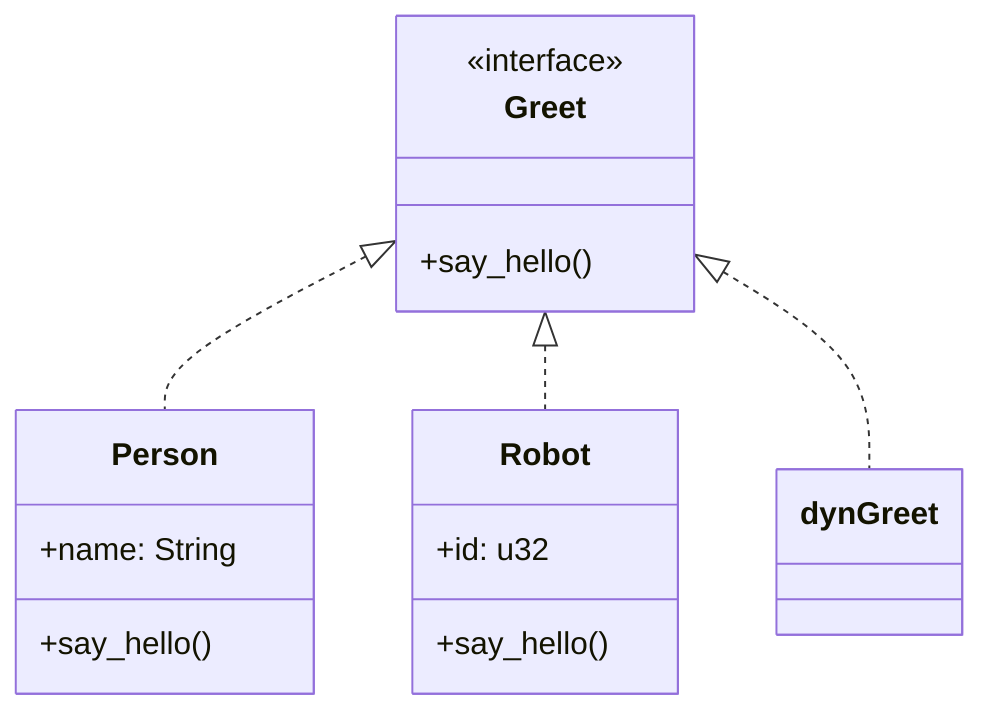

## 2.5. Traits and Trait Objects

In Rust, traits and trait objects are fundamental concepts that enable polymorphism and shared behavior. They allow developers to define a set of methods that can be implemented by different types, providing a powerful mechanism for code reuse and abstraction. In this section, we will explore the purpose of traits, how to declare and implement them, and how trait objects facilitate polymorphic behavior through dynamic dispatch.

### Understanding Traits in Rust

**Traits** in Rust are similar to interfaces in other programming languages. They define a collection of methods that a type must implement. Traits allow us to write code that can operate on different types, as long as those types implement the specified trait.

#### Defining Traits

To define a trait in Rust, use the `trait` keyword followed by the trait name and a block containing the method signatures. Here's a simple example:

```rust
trait Greet {
    fn say_hello(&self);
}
```

In this example, the `Greet` trait defines a single method, `say_hello`, which must be implemented by any type that wants to conform to the `Greet` trait.

#### Implementing Traits

To implement a trait for a specific type, use the `impl` keyword followed by the trait name for the type. Here's how you can implement the `Greet` trait for a `Person` struct:

```rust
struct Person {
    name: String,
}

impl Greet for Person {
    fn say_hello(&self) {
        println!("Hello, my name is {}!", self.name);
    }
}
```

In this implementation, the `Person` struct provides a concrete implementation of the `say_hello` method defined by the `Greet` trait.

### Static Dispatch vs. Dynamic Dispatch

Rust supports both static and dynamic dispatch, which are mechanisms for determining which method implementation to call at runtime.

#### Static Dispatch

**Static dispatch** occurs when the compiler knows the exact type of an object at compile time. It generates code that directly calls the method implementation. This is the default behavior in Rust and is highly efficient because it allows for inlining and other optimizations.

Here's an example of static dispatch:

```rust
fn greet_person(person: &impl Greet) {
    person.say_hello();
}

let person = Person { name: String::from("Alice") };
greet_person(&person);
```

In this example, the `greet_person` function takes a reference to any type that implements the `Greet` trait. The compiler knows the exact type at compile time, allowing for static dispatch.

#### Dynamic Dispatch

**Dynamic dispatch** is used when the exact type of an object is not known at compile time. Instead, a pointer to a trait object is used, and the method implementation is determined at runtime. This allows for polymorphic behavior but incurs a slight runtime cost.

To use dynamic dispatch, we use **trait objects**. A trait object is created by using a reference to a trait, such as `&dyn TraitName`. Here's an example:

```rust
fn greet_dyn(person: &dyn Greet) {
    person.say_hello();
}

let person = Person { name: String::from("Bob") };
greet_dyn(&person);
```

In this example, `greet_dyn` takes a reference to a trait object, allowing it to work with any type that implements the `Greet` trait. The exact method implementation is determined at runtime.

### Trait Objects and Polymorphism

Trait objects enable polymorphic behavior in Rust by allowing functions to operate on different types through a common interface. This is particularly useful in scenarios where you want to store or pass around objects of different types that share a common behavior.

#### Using Trait Objects

To create a trait object, use a reference to a trait, such as `&dyn TraitName` or `Box<dyn TraitName>`. Here's an example that demonstrates the use of trait objects:

```rust
fn main() {
    let person = Person { name: String::from("Charlie") };
    let greeters: Vec<&dyn Greet> = vec![&person];

    for greeter in greeters {
        greeter.say_hello();
    }
}
```

In this example, we create a vector of trait objects that can hold references to any type implementing the `Greet` trait. We then iterate over the vector and call the `say_hello` method on each trait object.

### Design Considerations and Best Practices

When using traits and trait objects in Rust, consider the following best practices:

- **Use Traits for Shared Behavior**: Define traits to encapsulate shared behavior across different types. This promotes code reuse and abstraction.
- **Prefer Static Dispatch When Possible**: Static dispatch is more efficient than dynamic dispatch. Use it when the exact type is known at compile time.
- **Use Trait Objects for Polymorphism**: When you need polymorphic behavior, use trait objects to enable dynamic dispatch.
- **Avoid Overusing Trait Objects**: While trait objects are powerful, they come with a runtime cost. Use them judiciously to balance flexibility and performance.

### Rust Unique Features

Rust's trait system is unique in several ways:

- **Trait Bounds**: Rust allows specifying trait bounds on generic types, ensuring that a type implements a specific trait. This is useful for writing generic functions and data structures.
- **Associated Types**: Traits can define associated types, which are placeholder types that are specified by the implementing type. This allows for more expressive and flexible trait definitions.
- **Default Implementations**: Traits can provide default implementations for methods, allowing types to override only the methods they need to customize.

### Differences and Similarities

Traits in Rust are similar to interfaces in languages like Java and C#. However, Rust's traits are more flexible due to features like associated types and default implementations. Unlike interfaces, traits can also be used for static dispatch, providing performance benefits.

### Try It Yourself

Experiment with the code examples provided in this section. Try modifying the `Person` struct to include additional fields, or implement the `Greet` trait for other types. Observe how static and dynamic dispatch affect the behavior of your code.

### Visualizing Traits and Trait Objects

To better understand the relationship between traits, trait objects, and types, consider the following diagram:



This diagram illustrates how the `Person` and `Robot` types implement the `Greet` trait, and how a trait object (`dyn Greet`) can be used to refer to any type that implements the `Greet` trait.

### References and Links

For further reading on traits and trait objects in Rust, consider the following resources:

- [Rust Book: Traits](https://doc.rust-lang.org/book/ch10-02-traits.html)
- [Rust Reference: Trait Objects](https://doc.rust-lang.org/reference/types/trait-object.html)
- [Rust by Example: Traits](https://doc.rust-lang.org/rust-by-example/trait.html)

### Knowledge Check

- What is the purpose of traits in Rust?
- How do trait objects enable polymorphic behavior?
- What is the difference between static and dynamic dispatch?
- When should you use trait objects instead of static dispatch?

### Embrace the Journey

Remember, mastering traits and trait objects is a journey. As you continue to explore Rust's powerful type system, you'll discover new ways to leverage traits for code reuse and abstraction. Keep experimenting, stay curious, and enjoy the journey!

## Quiz Time!



### What is a trait in Rust?

- [x] A collection of methods that a type can implement
- [ ] A type that can hold multiple values
- [ ] A function that returns a boolean
- [ ] A module that contains constants

> **Explanation:** A trait in Rust is a collection of methods that a type can implement, similar to interfaces in other languages.

### How do you create a trait object in Rust?

- [x] By using a reference to a trait, such as `&dyn TraitName`
- [ ] By using a struct with a trait field
- [ ] By implementing a trait for a type
- [ ] By using a macro to generate code

> **Explanation:** A trait object is created by using a reference to a trait, such as `&dyn TraitName`, allowing for dynamic dispatch.

### What is static dispatch?

- [x] A mechanism where the compiler knows the exact type at compile time
- [ ] A mechanism where the method implementation is determined at runtime
- [ ] A way to create trait objects
- [ ] A method of optimizing code for performance

> **Explanation:** Static dispatch occurs when the compiler knows the exact type at compile time, allowing for direct method calls.

### What is dynamic dispatch?

- [x] A mechanism where the method implementation is determined at runtime
- [ ] A mechanism where the compiler knows the exact type at compile time
- [ ] A way to create trait objects
- [ ] A method of optimizing code for performance

> **Explanation:** Dynamic dispatch occurs when the method implementation is determined at runtime, allowing for polymorphic behavior.

### Which of the following is a benefit of using traits in Rust?

- [x] Code reuse and abstraction
- [ ] Increased memory usage
- [ ] Slower runtime performance
- [ ] Reduced code readability

> **Explanation:** Traits promote code reuse and abstraction by allowing different types to share common behavior.

### What is the purpose of associated types in traits?

- [x] To allow for more expressive and flexible trait definitions
- [ ] To increase the runtime performance of trait objects
- [ ] To define default implementations for methods
- [ ] To specify trait bounds on generic types

> **Explanation:** Associated types in traits allow for more expressive and flexible trait definitions by providing placeholder types.

### How can you provide a default implementation for a trait method?

- [x] By defining the method body within the trait definition
- [ ] By implementing the trait for a specific type
- [ ] By using a macro to generate code
- [ ] By creating a trait object

> **Explanation:** A default implementation for a trait method can be provided by defining the method body within the trait definition.

### What is the primary use case for trait objects?

- [x] Enabling polymorphic behavior through dynamic dispatch
- [ ] Increasing compile-time performance
- [ ] Reducing memory usage
- [ ] Simplifying code syntax

> **Explanation:** Trait objects are primarily used to enable polymorphic behavior through dynamic dispatch.

### Which of the following is a characteristic of static dispatch?

- [x] It allows for inlining and other optimizations
- [ ] It incurs a runtime cost
- [ ] It requires the use of trait objects
- [ ] It is only available in dynamic languages

> **Explanation:** Static dispatch allows for inlining and other optimizations because the compiler knows the exact type at compile time.

### True or False: Traits in Rust are similar to interfaces in Java.

- [x] True
- [ ] False

> **Explanation:** Traits in Rust are similar to interfaces in Java, as they both define a collection of methods that a type must implement.


