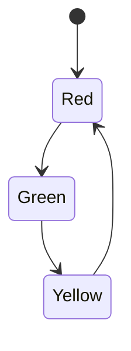

## 2.6. Pattern Matching and Enums

In Rust, pattern matching and enums are two fundamental features that contribute to the language's expressiveness and safety. They allow developers to write concise, readable, and robust code by leveraging type-safe variants and powerful matching capabilities. In this section, we will explore these features in depth, providing examples and discussing advanced techniques to help you master their use in your Rust programs.

### What is Pattern Matching?

Pattern matching in Rust is a mechanism that allows you to compare a value against a series of patterns and execute code based on which pattern matches. It is akin to a switch statement in other languages but is far more powerful and expressive. Pattern matching is used extensively in Rust for control flow, error handling, and working with complex data structures.

#### Advantages of Pattern Matching

- **Expressiveness**: Pattern matching allows you to concisely express complex branching logic.
- **Safety**: The Rust compiler checks that all possible cases are handled, reducing runtime errors.
- **Readability**: Code using pattern matching is often more readable and easier to understand.
- **Flexibility**: Supports a wide range of patterns, including literals, variables, wildcards, and more.

### Defining Enums in Rust

Enums, short for enumerations, are a way to define a type by enumerating its possible variants. Each variant can optionally have associated data, making enums a powerful tool for modeling complex data.

#### Basic Enum Definition

Let's start with a simple example of defining an enum:

```rust
enum Direction {
    North,
    South,
    East,
    West,
}
```

In this example, `Direction` is an enum with four variants: `North`, `South`, `East`, and `West`. These variants are simple and do not hold any additional data.

#### Enums with Associated Data

Enums can also have variants that carry data. This is useful for representing more complex states or data structures:

```rust
enum Message {
    Quit,
    Move { x: i32, y: i32 },
    Write(String),
    ChangeColor(i32, i32, i32),
}
```

Here, the `Message` enum has four variants. `Quit` has no data, `Move` has named fields `x` and `y`, `Write` holds a `String`, and `ChangeColor` holds three `i32` values.

### Using `match` Statements with Enums

The `match` statement is the primary tool for pattern matching in Rust. It allows you to match an enum value against its variants and execute code based on which variant is present.

#### Basic `match` Example

Let's see how we can use a `match` statement with the `Direction` enum:

```rust
fn print_direction(direction: Direction) {
    match direction {
        Direction::North => println!("Heading North!"),
        Direction::South => println!("Heading South!"),
        Direction::East => println!("Heading East!"),
        Direction::West => println!("Heading West!"),
    }
}
```

In this example, the `print_direction` function takes a `Direction` and prints a message based on the variant.

#### `match` with Enums and Associated Data

When matching enums with associated data, you can extract the data within the `match` arms:

```rust
fn process_message(msg: Message) {
    match msg {
        Message::Quit => println!("Quit message received."),
        Message::Move { x, y } => println!("Moving to coordinates: ({}, {})", x, y),
        Message::Write(text) => println!("Writing message: {}", text),
        Message::ChangeColor(r, g, b) => println!("Changing color to RGB({}, {}, {})", r, g, b),
    }
}
```

Here, the `process_message` function matches on the `Message` enum and extracts data from each variant, using it within the corresponding `match` arm.

### Advanced Pattern Matching Techniques

Rust's pattern matching capabilities extend beyond simple enum matching. Let's explore some advanced techniques that can further enhance your code.

#### Pattern Guards

Pattern guards allow you to add additional conditions to a pattern match. They are specified using the `if` keyword within a `match` arm.

```rust
fn describe_number(num: i32) {
    match num {
        n if n < 0 => println!("Negative number: {}", n),
        0 => println!("Zero"),
        n if n > 0 => println!("Positive number: {}", n),
        _ => println!("Unexpected case"),
    }
}
```

In this example, pattern guards are used to differentiate between negative and positive numbers.

#### Destructuring

Destructuring allows you to break down complex data structures into their components. This is particularly useful when working with tuples, structs, and enums with associated data.

```rust
struct Point {
    x: i32,
    y: i32,
}

fn print_point(point: Point) {
    let Point { x, y } = point;
    println!("Point coordinates: ({}, {})", x, y);
}
```

Here, the `Point` struct is destructured into its `x` and `y` components.

#### Combining Patterns

You can combine multiple patterns using the `|` operator, allowing you to match multiple cases with a single `match` arm.

```rust
fn is_vowel(c: char) -> bool {
    match c {
        'a' | 'e' | 'i' | 'o' | 'u' => true,
        _ => false,
    }
}
```

This function checks if a character is a vowel by matching it against multiple patterns.

### Real-World Use Cases

Pattern matching and enums are widely used in Rust for various real-world applications. Let's explore some scenarios where they simplify code and enhance readability.

#### Error Handling

Enums are often used to represent error types, and pattern matching is used to handle different error cases. This approach provides a clear and concise way to manage errors.

```rust
enum FileError {
    NotFound,
    PermissionDenied,
    Unknown,
}

fn handle_error(error: FileError) {
    match error {
        FileError::NotFound => println!("File not found."),
        FileError::PermissionDenied => println!("Permission denied."),
        FileError::Unknown => println!("An unknown error occurred."),
    }
}
```

#### State Machines

Enums and pattern matching are ideal for implementing state machines, where each state is represented by an enum variant.

```rust
enum TrafficLight {
    Red,
    Yellow,
    Green,
}

fn next_light(light: TrafficLight) -> TrafficLight {
    match light {
        TrafficLight::Red => TrafficLight::Green,
        TrafficLight::Yellow => TrafficLight::Red,
        TrafficLight::Green => TrafficLight::Yellow,
    }
}
```

This example models a simple traffic light state machine.

### Visualizing Pattern Matching and Enums

To better understand how pattern matching and enums work together, let's visualize the process using a state machine diagram.



**Caption**: This state machine diagram represents the transitions between traffic light states using enums and pattern matching.

### Try It Yourself

To solidify your understanding of pattern matching and enums, try modifying the examples provided. For instance, add a new variant to the `Message` enum and update the `process_message` function to handle it. Experiment with pattern guards and destructuring in different contexts.

### References and Further Reading

- [Rust Book: Enums](https://doc.rust-lang.org/book/ch06-01-defining-an-enum.html)
- [Rust Book: Pattern Matching](https://doc.rust-lang.org/book/ch18-00-patterns.html)
- [Rust Reference: Patterns](https://doc.rust-lang.org/reference/patterns.html)

### Knowledge Check

- What are the advantages of using pattern matching in Rust?
- How do you define an enum with associated data?
- What is a pattern guard, and how is it used in a `match` statement?
- How can destructuring be used with structs and enums?
- Provide a real-world example where pattern matching simplifies code.

### Embrace the Journey

Remember, mastering pattern matching and enums in Rust is a journey. As you continue to explore these features, you'll discover new ways to write expressive and robust code. Keep experimenting, stay curious, and enjoy the process!

## Quiz Time!



### What is the primary advantage of pattern matching in Rust?

- [x] It allows for expressive and concise branching logic.
- [ ] It is faster than other control flow mechanisms.
- [ ] It requires less memory.
- [ ] It is unique to Rust.

> **Explanation:** Pattern matching allows for expressive and concise branching logic, making code easier to read and maintain.

### How do you define an enum with associated data in Rust?

- [x] By specifying data types within the enum variants.
- [ ] By using a separate struct for each variant.
- [ ] By defining a tuple for each variant.
- [ ] By using a `match` statement.

> **Explanation:** Enums with associated data are defined by specifying data types within the enum variants.

### What is a pattern guard in Rust?

- [x] A condition added to a pattern match using the `if` keyword.
- [ ] A way to protect patterns from being matched.
- [ ] A method to optimize pattern matching.
- [ ] A special type of enum variant.

> **Explanation:** A pattern guard is a condition added to a pattern match using the `if` keyword to provide additional matching criteria.

### How can destructuring be used with structs in Rust?

- [x] By breaking down the struct into its individual fields.
- [ ] By converting the struct into an enum.
- [ ] By using a `match` statement.
- [ ] By defining a new struct.

> **Explanation:** Destructuring allows you to break down a struct into its individual fields for easier access and manipulation.

### Which operator is used to combine multiple patterns in a `match` statement?

- [x] The `|` operator.
- [ ] The `&` operator.
- [ ] The `+` operator.
- [ ] The `-` operator.

> **Explanation:** The `|` operator is used to combine multiple patterns in a `match` statement, allowing a single arm to match multiple cases.

### What is a common use case for enums in Rust?

- [x] Representing different states or variants of a type.
- [ ] Storing large amounts of data.
- [ ] Optimizing memory usage.
- [ ] Enhancing performance.

> **Explanation:** Enums are commonly used to represent different states or variants of a type, providing a clear and type-safe way to handle multiple cases.

### How does pattern matching enhance error handling in Rust?

- [x] By allowing different error cases to be handled concisely.
- [ ] By eliminating the need for error handling.
- [ ] By automatically resolving errors.
- [ ] By reducing the number of error cases.

> **Explanation:** Pattern matching allows different error cases to be handled concisely, making error handling more readable and maintainable.

### What is the purpose of the `_` pattern in a `match` statement?

- [x] To match any value not covered by other patterns.
- [ ] To match only specific values.
- [ ] To optimize pattern matching.
- [ ] To define a new pattern.

> **Explanation:** The `_` pattern is used to match any value not covered by other patterns, acting as a catch-all case.

### How can pattern matching be used in state machines?

- [x] By representing each state as an enum variant and using `match` to handle transitions.
- [ ] By using structs to define each state.
- [ ] By implementing a separate function for each state.
- [ ] By using pattern guards exclusively.

> **Explanation:** Pattern matching can be used in state machines by representing each state as an enum variant and using `match` to handle transitions between states.

### True or False: Pattern matching in Rust is limited to enums.

- [ ] True
- [x] False

> **Explanation:** False. Pattern matching in Rust is not limited to enums; it can be used with various data structures, including tuples, structs, and more.


