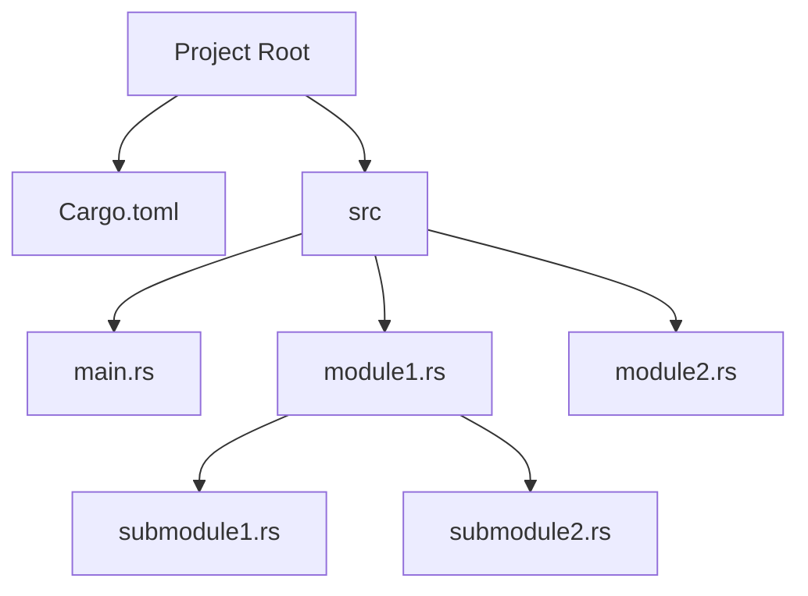

## 2.8. Modules and Crates

In the world of Rust programming, organizing and managing code efficiently is crucial for building scalable and maintainable applications. Rust provides a robust module system and a package manager called Cargo to help developers achieve this. In this section, we'll delve into the intricacies of Rust's modules and crates, exploring how they work, their benefits, and best practices for using them effectively.

### Understanding Modules in Rust

Modules in Rust are a way to organize code into separate namespaces, allowing you to group related functions, structs, enums, and other items together. This not only helps in keeping the codebase organized but also aids in encapsulation and reusability.

#### Defining and Using Modules

To define a module in Rust, you use the `mod` keyword. Here's a simple example:

```rust
// main.rs
mod math_operations {
    pub fn add(a: i32, b: i32) -> i32 {
        a + b
    }

    fn subtract(a: i32, b: i32) -> i32 {
        a - b
    }
}

fn main() {
    let sum = math_operations::add(5, 3);
    println!("Sum: {}", sum);
}
```

In this example, we define a module named `math_operations` with two functions: `add` and `subtract`. The `add` function is marked as `pub`, making it public and accessible from outside the module, while `subtract` remains private.

#### Visibility with `pub` and Private Items

By default, all items in a module are private. To expose an item outside the module, you need to use the `pub` keyword. This is crucial for controlling access to your code and ensuring that only the necessary parts are exposed.

```rust
mod library {
    pub fn public_function() {
        println!("This is a public function.");
    }

    fn private_function() {
        println!("This is a private function.");
    }
}

fn main() {
    library::public_function();
    // library::private_function(); // This will cause a compile error
}
```

In this example, `public_function` is accessible from outside the `library` module, while `private_function` is not.

### Organizing Code with Modules

Modules can be nested, allowing for a hierarchical organization of code. This is particularly useful for larger projects where grouping related functionality is necessary.

```rust
mod network {
    pub mod server {
        pub fn start() {
            println!("Server started.");
        }
    }

    mod client {
        pub fn connect() {
            println!("Client connected.");
        }
    }
}

fn main() {
    network::server::start();
    // network::client::connect(); // This will cause a compile error
}
```

Here, we have a `network` module with two nested modules: `server` and `client`. The `server` module is public, while the `client` module remains private.

### Modules and File System

Rust allows you to split modules into separate files, which is a common practice for larger projects. To do this, you create a file with the same name as the module.

```rust
// main.rs
mod math_operations;

fn main() {
    let sum = math_operations::add(5, 3);
    println!("Sum: {}", sum);
}

// math_operations.rs
pub fn add(a: i32, b: i32) -> i32 {
    a + b
}

fn subtract(a: i32, b: i32) -> i32 {
    a - b
}
```

In this setup, the `math_operations` module is defined in a separate file named `math_operations.rs`.

### Crates: The Building Blocks of Rust Projects

Crates are the fundamental unit of code distribution in Rust. A crate can be a binary or a library, and it serves as a package of Rust code. Crates are managed by Cargo, Rust's package manager and build system.

#### Creating and Using Crates

To create a new crate, you use Cargo's `new` command:

```bash
cargo new my_crate
```

This command creates a new directory named `my_crate` with a basic structure, including a `Cargo.toml` file and a `src` directory containing a `main.rs` file.

#### The Role of `Cargo.toml`

The `Cargo.toml` file is the manifest file for a Rust project. It contains metadata about the project, such as its name, version, authors, and dependencies.

```toml
[package]
name = "my_crate"
version = "0.1.0"
authors = ["Your Name <you@example.com>"]
edition = "2021"

[dependencies]
```

You can add dependencies by listing them under the `[dependencies]` section. For example, to add the `rand` crate, you would modify `Cargo.toml` as follows:

```toml
[dependencies]
rand = "0.8"
```

#### Using External Crates

Once you've added a dependency to `Cargo.toml`, you can use it in your code by including it with the `extern crate` declaration (though this is often not necessary in the 2018 edition and later) and importing the necessary items.

```rust
use rand::Rng;

fn main() {
    let mut rng = rand::thread_rng();
    let n: u8 = rng.gen();
    println!("Random number: {}", n);
}
```

### Advantages of Modular Code Organization

1. **Encapsulation**: Modules allow you to encapsulate functionality, exposing only what is necessary and hiding implementation details.
2. **Reusability**: By organizing code into modules and crates, you can easily reuse code across different projects.
3. **Maintainability**: A well-organized codebase is easier to maintain and extend.
4. **Collaboration**: Modular code organization facilitates collaboration among developers, as different teams can work on separate modules or crates.

### Best Practices for Using Modules and Crates

- **Keep Modules Focused**: Each module should have a clear purpose and contain related functionality.
- **Use Descriptive Names**: Choose names that clearly describe the module's purpose.
- **Limit Public API**: Expose only what is necessary to the outside world, keeping the rest private.
- **Document Your Code**: Use Rust's documentation features to provide clear and concise documentation for your modules and crates.
- **Leverage Cargo**: Use Cargo to manage dependencies, build, and test your projects efficiently.

### Visualizing Rust's Module System

To better understand how modules and crates work together, let's visualize the structure of a Rust project using a simple diagram.



**Diagram Description**: This diagram represents a typical Rust project structure. The project root contains the `Cargo.toml` file and a `src` directory. The `src` directory contains the main entry point (`main.rs`) and additional module files (`module1.rs`, `module2.rs`). Modules can have submodules, as shown with `submodule1.rs` and `submodule2.rs`.

### Try It Yourself

To solidify your understanding, try creating a small Rust project with multiple modules and a dependency on an external crate. Experiment with different module structures and visibility settings to see how they affect your code.

### References and Further Reading

- [The Rust Programming Language - Modules](https://doc.rust-lang.org/book/ch07-02-defining-modules-to-control-scope-and-privacy.html)
- [Cargo: The Rust Package Manager](https://doc.rust-lang.org/cargo/)
- [Rust by Example - Modules](https://doc.rust-lang.org/rust-by-example/mod.html)

### Knowledge Check

- What is the purpose of the `mod` keyword in Rust?
- How do you control the visibility of items in a module?
- What is the role of `Cargo.toml` in a Rust project?
- How can you add an external crate to your Rust project?
- What are the benefits of organizing code into modules and crates?

### Embrace the Journey

Remember, mastering modules and crates is just the beginning of your Rust journey. As you continue to explore Rust's features, you'll discover even more powerful ways to organize and manage your code. Keep experimenting, stay curious, and enjoy the journey!

## Quiz Time!



### What is the primary purpose of modules in Rust?

- [x] To organize code into separate namespaces
- [ ] To manage external dependencies
- [ ] To compile code into binaries
- [ ] To handle error management

> **Explanation:** Modules in Rust are used to organize code into separate namespaces, allowing for better encapsulation and organization.

### How do you make a function in a module accessible from outside the module?

- [x] Use the `pub` keyword
- [ ] Use the `extern` keyword
- [ ] Use the `crate` keyword
- [ ] Use the `mod` keyword

> **Explanation:** The `pub` keyword is used to make a function or item accessible from outside its module.

### What file is used to manage dependencies in a Rust project?

- [x] Cargo.toml
- [ ] main.rs
- [ ] lib.rs
- [ ] Cargo.lock

> **Explanation:** The `Cargo.toml` file is used to manage dependencies and metadata for a Rust project.

### Which command is used to create a new Rust crate?

- [x] `cargo new`
- [ ] `cargo build`
- [ ] `cargo init`
- [ ] `cargo run`

> **Explanation:** The `cargo new` command is used to create a new Rust crate with a basic project structure.

### What is the default visibility of items in a Rust module?

- [x] Private
- [ ] Public
- [ ] Protected
- [ ] Internal

> **Explanation:** By default, items in a Rust module are private and need to be explicitly marked as `pub` to be accessible from outside.

### How can you split a module into separate files in Rust?

- [x] Create a file with the same name as the module
- [ ] Use the `include!` macro
- [ ] Use the `extern crate` declaration
- [ ] Use the `use` keyword

> **Explanation:** To split a module into separate files, you create a file with the same name as the module.

### What is the main advantage of using crates in Rust?

- [x] Code reuse and distribution
- [ ] Faster compilation
- [ ] Simplified syntax
- [ ] Enhanced error handling

> **Explanation:** Crates allow for code reuse and distribution, making it easier to share and manage code across projects.

### What is the purpose of the `Cargo.lock` file?

- [x] To lock the versions of dependencies used in a project
- [ ] To define the project's main entry point
- [ ] To specify the project's license
- [ ] To manage the project's build scripts

> **Explanation:** The `Cargo.lock` file locks the versions of dependencies used in a project to ensure consistent builds.

### Which keyword is used to define a module in Rust?

- [x] `mod`
- [ ] `crate`
- [ ] `use`
- [ ] `extern`

> **Explanation:** The `mod` keyword is used to define a module in Rust.

### True or False: In Rust, a crate can only be a binary.

- [ ] True
- [x] False

> **Explanation:** A crate in Rust can be either a binary or a library, serving as a package of Rust code.


