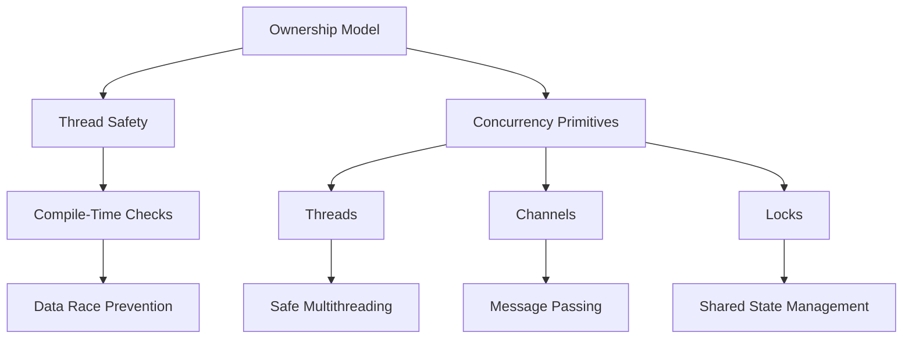

## 2.9. Fearless Concurrency in Rust

Concurrency is a powerful tool in programming that allows multiple computations to be performed simultaneously, potentially leading to more efficient and responsive applications. However, concurrency also introduces challenges, such as data races, deadlocks, and complex state management. Rust offers a unique approach to concurrency, providing developers with the ability to write concurrent programs without the fear of data races, thanks to its innovative ownership model and compile-time checks.

### Understanding Concurrency and Its Challenges

Concurrency involves executing multiple sequences of operations simultaneously. This can be achieved through multithreading, where multiple threads run concurrently within a single process. While concurrency can significantly improve performance, it also introduces several challenges:

- **Data Races**: Occur when two or more threads access shared data simultaneously, and at least one of the accesses is a write. This can lead to unpredictable behavior and bugs that are difficult to reproduce and fix.
- **Deadlocks**: Happen when two or more threads are blocked forever, waiting for each other to release resources.
- **Complex State Management**: Managing shared state across threads can be complex and error-prone, requiring careful synchronization.

### Rust's Ownership Model and Thread Safety

Rust's ownership model is central to its approach to concurrency. By enforcing strict rules about how data is accessed and modified, Rust ensures thread safety at compile time, eliminating data races. Here's how Rust's ownership model contributes to fearless concurrency:

- **Ownership and Borrowing**: Rust's ownership system ensures that data has a single owner at any given time, preventing multiple threads from modifying the same data simultaneously. Borrowing allows temporary access to data without transferring ownership, with strict rules to prevent data races.
- **Lifetimes**: Rust's lifetime annotations ensure that references are valid for the duration of their use, preventing dangling references and ensuring memory safety.

### Common Concurrency Primitives in Rust

Rust provides several concurrency primitives that enable developers to write safe and efficient concurrent programs:

#### Threads

Rust's standard library includes support for threads, allowing developers to spawn new threads to perform concurrent tasks. The `std::thread` module provides the necessary functionality to create and manage threads.

```rust
use std::thread;

fn main() {
    let handle = thread::spawn(|| {
        for i in 1..10 {
            println!("Hello from the spawned thread: {}", i);
        }
    });

    for i in 1..5 {
        println!("Hello from the main thread: {}", i);
    }

    handle.join().unwrap();
}
```

In this example, a new thread is spawned to print messages concurrently with the main thread. The `join` method is used to wait for the spawned thread to finish before the main thread exits.

#### Channels

Channels provide a way for threads to communicate by sending messages to each other. Rust's `std::sync::mpsc` module offers multi-producer, single-consumer channels, allowing multiple threads to send messages to a single receiver.

```rust
use std::sync::mpsc;
use std::thread;

fn main() {
    let (tx, rx) = mpsc::channel();

    thread::spawn(move || {
        let val = String::from("Hello from the thread");
        tx.send(val).unwrap();
    });

    let received = rx.recv().unwrap();
    println!("Received: {}", received);
}
```

In this example, a message is sent from a spawned thread to the main thread using a channel. The `recv` method blocks until a message is received.

#### Locks

Rust provides locks for managing shared state across threads. The `std::sync::Mutex` and `std::sync::RwLock` types offer mutual exclusion and read-write locks, respectively.

```rust
use std::sync::{Arc, Mutex};
use std::thread;

fn main() {
    let counter = Arc::new(Mutex::new(0));
    let mut handles = vec![];

    for _ in 0..10 {
        let counter = Arc::clone(&counter);
        let handle = thread::spawn(move || {
            let mut num = counter.lock().unwrap();
            *num += 1;
        });
        handles.push(handle);
    }

    for handle in handles {
        handle.join().unwrap();
    }

    println!("Result: {}", *counter.lock().unwrap());
}
```

Here, a `Mutex` is used to protect access to a shared counter. The `Arc` type is used to share ownership of the `Mutex` across threads.

### Safe Concurrency Patterns in Rust

Rust's ownership model and concurrency primitives enable several safe concurrency patterns:

- **Message Passing**: Use channels to pass messages between threads, avoiding shared state and reducing the risk of data races.
- **Scoped Threads**: Use Rust's `crossbeam` crate to create threads that are guaranteed to finish before the scope exits, ensuring safe access to local variables.
- **Parallel Iterators**: Use the `rayon` crate to perform data parallelism with minimal effort, leveraging Rust's type system to ensure safety.

### Rust's Unique Approach to Concurrency

Rust's approach to concurrency differs from other languages in several key ways:

- **Compile-Time Safety**: Rust's ownership model and type system provide compile-time guarantees of thread safety, eliminating data races and many common concurrency bugs.
- **No Garbage Collector**: Rust's lack of a garbage collector means that concurrency performance is predictable and efficient, without the overhead of garbage collection pauses.
- **Expressive Type System**: Rust's type system allows developers to express complex concurrency patterns safely and concisely.

### Benefits of Rust's Concurrency Model

Rust's concurrency model offers several benefits:

- **Safety**: Rust's compile-time checks ensure that concurrent programs are free of data races, providing a high level of safety.
- **Performance**: Rust's lack of a garbage collector and efficient concurrency primitives enable high-performance concurrent programs.
- **Expressiveness**: Rust's type system and ownership model allow developers to express complex concurrency patterns concisely and safely.

### Try It Yourself

To gain a deeper understanding of Rust's concurrency model, try modifying the examples provided:

- Experiment with creating multiple threads and using channels to communicate between them.
- Use a `Mutex` to protect access to a shared data structure and observe how Rust prevents data races.
- Explore the `rayon` crate to perform parallel computations on collections.

### Visualizing Rust's Concurrency Model

To better understand Rust's concurrency model, consider the following diagram, which illustrates how Rust's ownership model and concurrency primitives interact to ensure thread safety:



This diagram shows how Rust's ownership model and concurrency primitives work together to provide a safe and efficient concurrency model.

### References and Further Reading

For more information on Rust's concurrency model, consider the following resources:

- [The Rust Programming Language Book](https://doc.rust-lang.org/book/)
- [Rust by Example](https://doc.rust-lang.org/rust-by-example/)
- [Rust Concurrency Patterns](https://rust-unofficial.github.io/patterns/)

### Knowledge Check

To reinforce your understanding of Rust's concurrency model, consider the following questions:

- How does Rust's ownership model prevent data races?
- What are the benefits of using channels for communication between threads?
- How does Rust's approach to concurrency differ from other languages?

### Embrace the Journey

Remember, mastering concurrency in Rust is a journey. As you explore Rust's concurrency model, you'll gain a deeper understanding of how to write safe and efficient concurrent programs. Keep experimenting, stay curious, and enjoy the journey!

## Quiz Time!



### What is a data race?

- [x] A condition where two or more threads access shared data simultaneously, and at least one of the accesses is a write.
- [ ] A condition where a program runs out of memory.
- [ ] A condition where a program crashes due to an unhandled exception.
- [ ] A condition where a program runs slower than expected.

> **Explanation:** A data race occurs when two or more threads access shared data simultaneously, and at least one of the accesses is a write, leading to unpredictable behavior.

### How does Rust's ownership model contribute to thread safety?

- [x] By ensuring data has a single owner at any given time, preventing multiple threads from modifying the same data simultaneously.
- [ ] By allowing multiple threads to access data without restrictions.
- [ ] By using a garbage collector to manage memory.
- [ ] By providing a built-in debugger for concurrency issues.

> **Explanation:** Rust's ownership model ensures data has a single owner at any given time, preventing multiple threads from modifying the same data simultaneously, thus ensuring thread safety.

### What is the purpose of Rust's `Mutex` type?

- [x] To provide mutual exclusion for shared data, preventing data races.
- [ ] To allow multiple threads to modify data simultaneously.
- [ ] To manage memory allocation for threads.
- [ ] To provide a communication channel between threads.

> **Explanation:** Rust's `Mutex` type provides mutual exclusion for shared data, ensuring that only one thread can access the data at a time, preventing data races.

### How do channels facilitate communication between threads in Rust?

- [x] By allowing threads to send messages to each other, avoiding shared state.
- [ ] By providing direct access to shared memory.
- [ ] By synchronizing thread execution order.
- [ ] By managing thread lifetimes automatically.

> **Explanation:** Channels allow threads to send messages to each other, avoiding shared state and reducing the risk of data races.

### What is the benefit of using `Arc` with `Mutex` in Rust?

- [x] To share ownership of a `Mutex` across multiple threads safely.
- [ ] To increase the performance of mutex operations.
- [ ] To automatically unlock the mutex after use.
- [ ] To provide a communication channel between threads.

> **Explanation:** `Arc` (Atomic Reference Counting) allows multiple threads to share ownership of a `Mutex` safely, enabling concurrent access to shared data.

### What is a deadlock?

- [x] A condition where two or more threads are blocked forever, waiting for each other to release resources.
- [ ] A condition where a program runs out of memory.
- [ ] A condition where a program crashes due to an unhandled exception.
- [ ] A condition where a program runs slower than expected.

> **Explanation:** A deadlock occurs when two or more threads are blocked forever, waiting for each other to release resources, preventing further execution.

### How does Rust's `rayon` crate facilitate parallelism?

- [x] By providing parallel iterators that leverage Rust's type system for safety.
- [ ] By automatically distributing tasks across multiple threads.
- [ ] By managing memory allocation for parallel tasks.
- [ ] By providing a built-in debugger for parallelism issues.

> **Explanation:** Rust's `rayon` crate provides parallel iterators that leverage Rust's type system for safety, enabling data parallelism with minimal effort.

### What is the role of lifetimes in Rust's concurrency model?

- [x] To ensure references are valid for the duration of their use, preventing dangling references.
- [ ] To manage memory allocation for threads.
- [ ] To provide a communication channel between threads.
- [ ] To synchronize thread execution order.

> **Explanation:** Lifetimes in Rust ensure that references are valid for the duration of their use, preventing dangling references and ensuring memory safety.

### How does Rust's lack of a garbage collector benefit concurrency?

- [x] By providing predictable and efficient concurrency performance without garbage collection pauses.
- [ ] By increasing the performance of mutex operations.
- [ ] By automatically unlocking mutexes after use.
- [ ] By providing a built-in debugger for concurrency issues.

> **Explanation:** Rust's lack of a garbage collector provides predictable and efficient concurrency performance, as there are no garbage collection pauses that can impact thread execution.

### True or False: Rust's compile-time checks eliminate data races.

- [x] True
- [ ] False

> **Explanation:** True. Rust's compile-time checks, enforced by its ownership model, eliminate data races by ensuring that data is accessed safely across threads.




