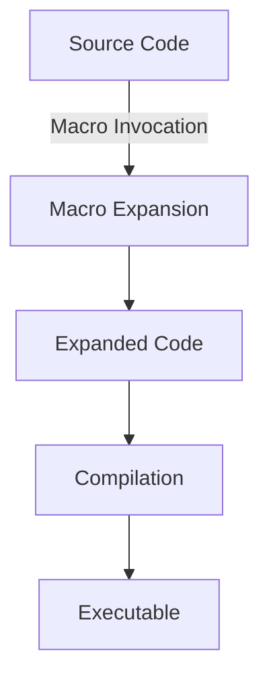

## 20.1. Introduction to Macros in Rust

In the world of programming, metaprogramming is a powerful concept that allows developers to write code that generates other code. This can lead to more efficient, reusable, and maintainable codebases. Rust, a systems programming language known for its safety and performance, provides a robust macro system that enables metaprogramming through code generation during compilation. In this section, we will explore Rust's macro system, focusing on its two main types: declarative and procedural macros. We will also discuss the motivations for using macros and provide simple examples to illustrate their usage.

### Understanding Metaprogramming

Metaprogramming is the practice of writing programs that can manipulate other programs or themselves. This is typically achieved by generating code at compile time or runtime, allowing developers to automate repetitive tasks, enforce consistency, and reduce boilerplate code. In Rust, macros are the primary tool for metaprogramming, enabling developers to extend the language's capabilities and create more expressive code.

### Rust's Macro System

Rust's macro system is divided into two main types: declarative macros and procedural macros. Each type serves different purposes and offers unique capabilities.

#### Declarative Macros (`macro_rules!`)

Declarative macros, also known as `macro_rules!` macros, are pattern-based macros that allow developers to define rules for transforming input tokens into output tokens. These macros are similar to templates and are used to generate code based on specific patterns.

**Example of a Declarative Macro:**

```rust
// Define a simple declarative macro to create a vector
macro_rules! create_vec {
    // Match a pattern with a single expression
    ($($x:expr),*) => {
        {
            let mut vec = Vec::new();
            $(
                vec.push($x);
            )*
            vec
        }
    };
}

fn main() {
    // Use the macro to create a vector
    let my_vec = create_vec![1, 2, 3, 4, 5];
    println!("{:?}", my_vec); // Output: [1, 2, 3, 4, 5]
}
```

In this example, the `create_vec!` macro takes a list of expressions and generates code to create a vector containing those expressions. The macro uses pattern matching to transform the input tokens into the desired output.

#### Procedural Macros

Procedural macros are more flexible and powerful than declarative macros. They allow developers to write functions that manipulate Rust's abstract syntax tree (AST) directly. Procedural macros are used for more complex code generation tasks and can be divided into three categories: custom derive macros, attribute macros, and function-like macros.

**Example of a Procedural Macro:**

```rust
// Define a procedural macro to implement a trait
use proc_macro::TokenStream;
use quote::quote;
use syn;

#[proc_macro_derive(HelloWorld)]
pub fn hello_world_derive(input: TokenStream) -> TokenStream {
    // Parse the input tokens into a syntax tree
    let ast = syn::parse(input).unwrap();

    // Build the trait implementation
    impl_hello_world(&ast)
}

fn impl_hello_world(ast: &syn::DeriveInput) -> TokenStream {
    let name = &ast.ident;
    let gen = quote! {
        impl HelloWorld for #name {
            fn hello_world() {
                println!("Hello, World! My name is {}!", stringify!(#name));
            }
        }
    };
    gen.into()
}
```

In this example, the procedural macro `HelloWorld` generates an implementation of the `HelloWorld` trait for any struct that derives it. The macro uses the `syn` crate to parse the input tokens and the `quote` crate to generate the output tokens.

### Motivations for Using Macros

Macros offer several benefits that make them an attractive tool for Rust developers:

1. **Code Reuse**: Macros allow developers to write reusable code snippets that can be applied in multiple contexts, reducing duplication and improving maintainability.

2. **Boilerplate Reduction**: By generating repetitive code automatically, macros help reduce boilerplate and make codebases more concise and readable.

3. **Domain-Specific Languages (DSLs)**: Macros can be used to create DSLs within Rust, enabling developers to express complex logic in a more natural and domain-specific way.

4. **Compile-Time Checks**: Macros operate at compile time, allowing developers to catch errors early and ensure that generated code adheres to Rust's strict safety and type-checking rules.

### Simple Examples of Macro Usage

Let's explore some simple examples to demonstrate how macros can be used in Rust.

**Example 1: A Macro for Repeated Code**

```rust
macro_rules! repeat {
    ($times:expr, $body:block) => {
        for _ in 0..$times {
            $body
        }
    };
}

fn main() {
    repeat!(3, {
        println!("This will be printed three times!");
    });
}
```

In this example, the `repeat!` macro takes a number and a block of code, executing the block the specified number of times. This eliminates the need to write repetitive loop code manually.

**Example 2: A Macro for Logging**

```rust
macro_rules! log {
    ($msg:expr) => {
        println!("[LOG]: {}", $msg);
    };
}

fn main() {
    log!("This is a log message.");
}
```

The `log!` macro simplifies logging by prefixing messages with a `[LOG]:` tag, making it easy to identify log output in the console.

### Visualizing Macro Expansion

To better understand how macros work, let's visualize the process of macro expansion in Rust. The following diagram illustrates the flow of macro expansion during compilation:



**Diagram Description**: This diagram shows the flow of macro expansion in Rust. The source code containing macro invocations is expanded into regular Rust code, which is then compiled into an executable.

### Setting the Context for Advanced Topics

Now that we have introduced the basics of Rust's macro system, we are ready to delve into more advanced topics in subsequent sections. We will explore the intricacies of declarative and procedural macros, discuss best practices for writing macros, and examine how macros can be used to create powerful abstractions and DSLs.

### References and Further Reading

- [The Rust Programming Language Book: Macros](https://doc.rust-lang.org/book/ch19-06-macros.html)
- [Rust Reference: Macros](https://doc.rust-lang.org/reference/macros.html)
- [Rust By Example: Macros](https://doc.rust-lang.org/rust-by-example/macros.html)

### Knowledge Check

- What are the two main types of macros in Rust?
- How do declarative macros differ from procedural macros?
- What are some motivations for using macros in Rust?
- Can you provide a simple example of a declarative macro?
- How do procedural macros manipulate Rust's abstract syntax tree?

### Embrace the Journey

Remember, this is just the beginning of your journey into Rust's macro system. As you progress, you'll discover more advanced techniques and patterns that will empower you to write more expressive and efficient Rust code. Keep experimenting, stay curious, and enjoy the journey!

## Quiz Time!



### What is metaprogramming?

- [x] Writing programs that generate other programs
- [ ] Writing programs that execute faster
- [ ] Writing programs that use less memory
- [ ] Writing programs that are easier to read

> **Explanation:** Metaprogramming involves writing code that can generate or manipulate other code, often at compile time.

### What are the two main types of macros in Rust?

- [x] Declarative and Procedural
- [ ] Functional and Object-Oriented
- [ ] Static and Dynamic
- [ ] Synchronous and Asynchronous

> **Explanation:** Rust macros are categorized into declarative (`macro_rules!`) and procedural macros.

### How do declarative macros work?

- [x] By pattern matching input tokens and transforming them into output tokens
- [ ] By executing code at runtime
- [ ] By directly manipulating the abstract syntax tree
- [ ] By optimizing code for performance

> **Explanation:** Declarative macros use pattern matching to transform input tokens into output tokens during compilation.

### What is a key benefit of using macros in Rust?

- [x] Reducing boilerplate code
- [ ] Increasing runtime speed
- [ ] Decreasing memory usage
- [ ] Simplifying syntax

> **Explanation:** Macros help reduce repetitive code, making codebases more concise and maintainable.

### Which crate is commonly used for parsing input tokens in procedural macros?

- [x] syn
- [ ] serde
- [ ] tokio
- [ ] rayon

> **Explanation:** The `syn` crate is used for parsing Rust's syntax tree in procedural macros.

### What is the purpose of the `quote` crate in procedural macros?

- [x] To generate Rust code from syntax trees
- [ ] To parse input tokens
- [ ] To execute code at runtime
- [ ] To optimize code for performance

> **Explanation:** The `quote` crate is used to generate Rust code from syntax trees in procedural macros.

### What is a common use case for procedural macros?

- [x] Implementing custom derive traits
- [ ] Optimizing runtime performance
- [ ] Reducing memory usage
- [ ] Simplifying syntax

> **Explanation:** Procedural macros are often used to implement custom derive traits, allowing for complex code generation.

### What does the `macro_rules!` keyword define?

- [x] A declarative macro
- [ ] A procedural macro
- [ ] A function
- [ ] A trait

> **Explanation:** The `macro_rules!` keyword is used to define declarative macros in Rust.

### True or False: Macros in Rust can only be used for code generation at runtime.

- [ ] True
- [x] False

> **Explanation:** Macros in Rust are used for code generation at compile time, not runtime.

### What is a benefit of compile-time checks in macros?

- [x] Catching errors early
- [ ] Increasing runtime speed
- [ ] Decreasing memory usage
- [ ] Simplifying syntax

> **Explanation:** Compile-time checks in macros help catch errors early, ensuring code safety and correctness.


