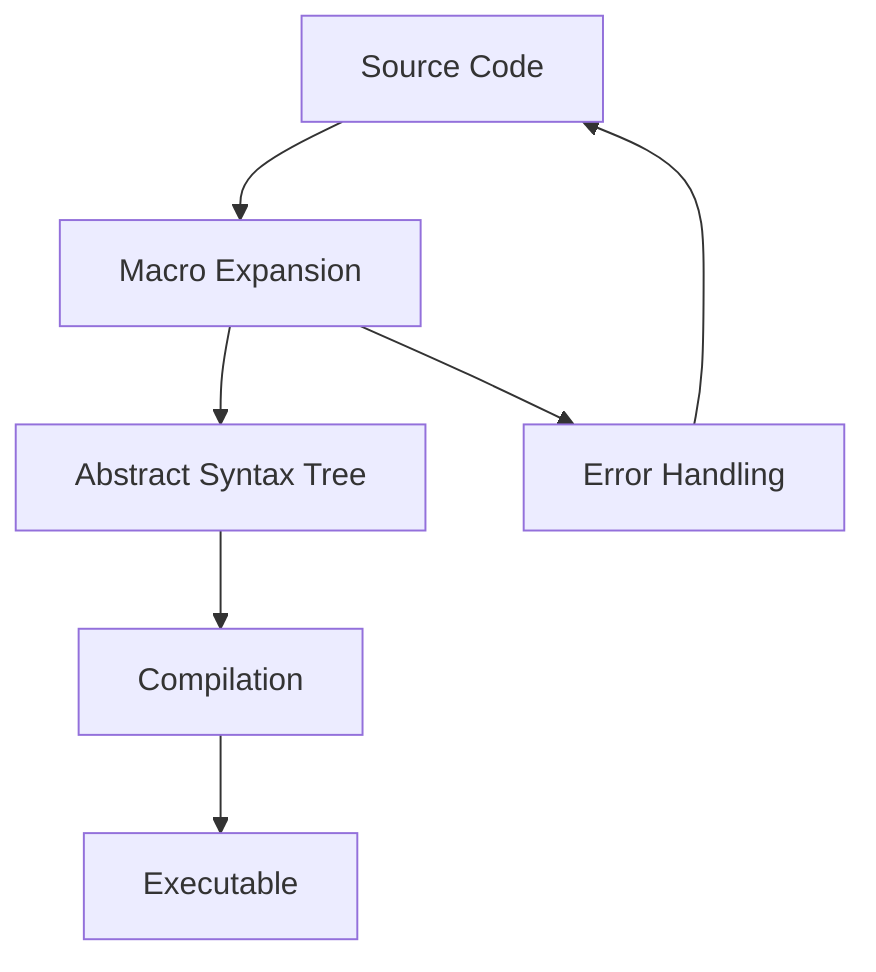

## 20.10. Practical Applications of Metaprogramming

Metaprogramming in Rust, primarily through the use of macros, offers powerful tools for developers to write more efficient, maintainable, and expressive code. In this section, we will delve into the practical applications of metaprogramming, examining how it can reduce boilerplate, improve code maintainability, and enable functionalities that would otherwise be challenging to implement. We will also explore real-world examples of libraries and applications that leverage macros effectively, such as `serde` and `tokio`. Finally, we will provide guidance on when to use macros versus other abstraction mechanisms, encouraging a balanced approach to metaprogramming.

### Understanding Metaprogramming in Rust

Metaprogramming refers to the practice of writing code that can generate or manipulate other code. In Rust, this is primarily achieved through macros, which come in two main forms: declarative macros (`macro_rules!`) and procedural macros. Declarative macros are pattern-based, allowing for concise code transformations, while procedural macros provide more flexibility by allowing custom code generation during compilation.

#### Key Benefits of Metaprogramming

1. **Boilerplate Reduction**: Macros can significantly reduce repetitive code, making it easier to maintain and less error-prone.
2. **Enhanced Code Maintainability**: By abstracting common patterns, macros help keep codebases clean and organized.
3. **Enabling Unique Functionalities**: Some functionalities, such as custom derive traits, are only possible through metaprogramming.
4. **Compile-Time Code Generation**: Macros can perform complex code transformations at compile time, improving runtime performance.

### Real-World Examples of Metaprogramming in Rust

#### `serde`: Serialization and Deserialization

`serde` is a widely-used Rust library for serialization and deserialization, heavily relying on macros to provide its functionality. It uses procedural macros to derive implementations of the `Serialize` and `Deserialize` traits for user-defined types, allowing for seamless conversion between Rust data structures and various data formats like JSON, YAML, and more.

```rust
use serde::{Serialize, Deserialize};

#[derive(Serialize, Deserialize)]
struct User {
    id: u32,
    name: String,
    email: String,
}

fn main() {
    let user = User {
        id: 1,
        name: "Alice".to_string(),
        email: "alice@example.com".to_string(),
    };

    // Serialize the user to a JSON string
    let json = serde_json::to_string(&user).unwrap();
    println!("Serialized: {}", json);

    // Deserialize the JSON string back to a User
    let deserialized_user: User = serde_json::from_str(&json).unwrap();
    println!("Deserialized: {:?}", deserialized_user);
}
```

**Key Takeaway**: `serde` demonstrates how macros can automate the implementation of complex traits, reducing boilerplate and enhancing code maintainability.

#### `tokio`: Asynchronous Programming

`tokio` is a runtime for writing asynchronous applications in Rust. It uses macros to simplify the creation of asynchronous functions and tasks, providing a more ergonomic API for developers.

```rust
use tokio::time::{sleep, Duration};

#[tokio::main]
async fn main() {
    println!("Starting task...");
    sleep(Duration::from_secs(1)).await;
    println!("Task completed!");
}
```

**Key Takeaway**: `tokio` showcases how macros can abstract away the complexities of asynchronous programming, making it more accessible and reducing the cognitive load on developers.

### Reducing Boilerplate with Macros

One of the primary motivations for using macros is to reduce boilerplate code. In Rust, repetitive patterns can be encapsulated within macros, allowing developers to focus on the unique aspects of their applications.

#### Example: Implementing a Custom Derive Macro

Suppose we want to create a custom derive macro that automatically implements a `Display` trait for any struct. This can be achieved using procedural macros.

```rust
use proc_macro::TokenStream;
use quote::quote;
use syn;

#[proc_macro_derive(CustomDisplay)]
pub fn custom_display_derive(input: TokenStream) -> TokenStream {
    let ast = syn::parse(input).unwrap();
    impl_custom_display(&ast)
}

fn impl_custom_display(ast: &syn::DeriveInput) -> TokenStream {
    let name = &ast.ident;
    let gen = quote! {
        impl std::fmt::Display for #name {
            fn fmt(&self, f: &mut std::fmt::Formatter) -> std::fmt::Result {
                write!(f, "{}", stringify!(#name))
            }
        }
    };
    gen.into()
}
```

**Key Takeaway**: Custom derive macros can automate the implementation of traits, reducing boilerplate and ensuring consistency across similar types.

### When to Use Macros vs. Other Abstraction Mechanisms

While macros are powerful, they are not always the best solution. Consider the following guidelines when deciding whether to use macros:

1. **Use Macros When**:
   - You need to reduce repetitive code patterns.
   - You require compile-time code generation.
   - You want to provide a more ergonomic API for complex functionalities.

2. **Consider Other Abstractions When**:
   - The functionality can be achieved with functions or traits.
   - The macro complexity outweighs its benefits.
   - Readability and maintainability are compromised.

### Visualizing Macro Usage in Rust

To better understand how macros fit into the Rust ecosystem, let's visualize their interaction with other components using a flowchart.



**Diagram Description**: This flowchart illustrates the process of macro expansion in Rust. The source code is first expanded by macros, transforming it into an abstract syntax tree (AST). The AST is then compiled into an executable. Any errors during macro expansion are fed back to the source code for correction.

### Encouraging Thoughtful Use of Metaprogramming

Metaprogramming is a powerful tool, but it should be used judiciously. Consider the following when incorporating macros into your Rust projects:

- **Weigh Costs and Benefits**: Evaluate whether the benefits of reduced boilerplate and enhanced functionality outweigh the potential complexity and maintenance challenges.
- **Prioritize Readability**: Ensure that macros do not obscure the logic of your code, making it difficult for others (or your future self) to understand.
- **Test Extensively**: Macros can introduce subtle bugs if not thoroughly tested. Ensure that your macro-generated code is covered by tests.

### Conclusion

Metaprogramming in Rust, through the use of macros, offers significant advantages in terms of reducing boilerplate, enhancing code maintainability, and enabling unique functionalities. By examining real-world examples like `serde` and `tokio`, we can see how macros can transform complex tasks into manageable abstractions. However, it is essential to use macros thoughtfully, balancing their power with the need for readable and maintainable code. As you continue your journey with Rust, consider metaprogramming as a valuable tool in your developer toolkit, ready to be employed when the situation calls for it.

## Quiz Time!



### What is a primary benefit of using macros in Rust?

- [x] Reducing boilerplate code
- [ ] Increasing runtime performance
- [ ] Simplifying error handling
- [ ] Enhancing security

> **Explanation:** Macros are primarily used to reduce boilerplate code, making it easier to maintain and less error-prone.

### Which library heavily relies on macros for serialization and deserialization in Rust?

- [x] serde
- [ ] tokio
- [ ] rayon
- [ ] hyper

> **Explanation:** `serde` uses macros to derive implementations of the `Serialize` and `Deserialize` traits for user-defined types.

### What type of macro is used for pattern-based code transformations in Rust?

- [x] Declarative macros
- [ ] Procedural macros
- [ ] Attribute macros
- [ ] Inline macros

> **Explanation:** Declarative macros (`macro_rules!`) are used for pattern-based code transformations in Rust.

### When should you consider using macros in Rust?

- [x] When you need to reduce repetitive code patterns
- [ ] When you want to increase runtime performance
- [ ] When you need to handle errors more effectively
- [ ] When you want to enhance security

> **Explanation:** Macros are best used to reduce repetitive code patterns and provide compile-time code generation.

### What is a potential downside of using macros in Rust?

- [x] Increased complexity and maintenance challenges
- [ ] Decreased runtime performance
- [ ] Reduced security
- [ ] Limited functionality

> **Explanation:** Macros can increase complexity and maintenance challenges if not used judiciously.

### Which of the following is a real-world example of a Rust library that uses macros?

- [x] tokio
- [ ] hyper
- [ ] rayon
- [ ] diesel

> **Explanation:** `tokio` uses macros to simplify the creation of asynchronous functions and tasks.

### What should you prioritize when using macros in Rust?

- [x] Readability
- [ ] Performance
- [ ] Security
- [ ] Error handling

> **Explanation:** Ensuring that macros do not obscure the logic of your code is crucial for maintainability.

### What is the role of procedural macros in Rust?

- [x] Custom code generation during compilation
- [ ] Pattern-based code transformations
- [ ] Error handling
- [ ] Security enhancements

> **Explanation:** Procedural macros allow for custom code generation during compilation, providing more flexibility than declarative macros.

### What is the primary purpose of the `serde` library in Rust?

- [x] Serialization and deserialization
- [ ] Asynchronous programming
- [ ] Parallel processing
- [ ] Network communication

> **Explanation:** `serde` is used for serialization and deserialization of Rust data structures.

### True or False: Macros can perform complex code transformations at runtime.

- [ ] True
- [x] False

> **Explanation:** Macros perform code transformations at compile time, not runtime.


