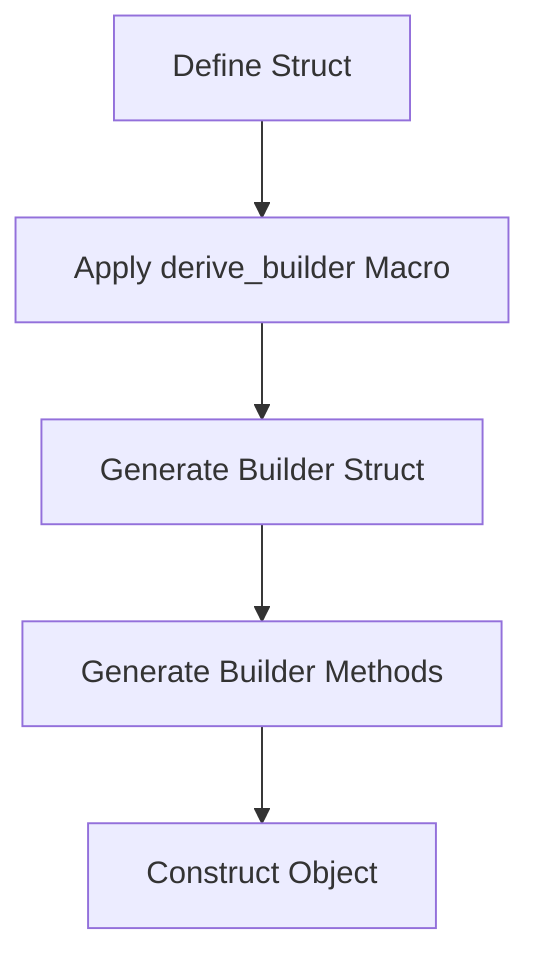

## 20.12. The Builder Pattern with Procedural Macros

In this section, we delve into the Builder Pattern, a creational design pattern that provides a flexible solution to constructing complex objects. We will explore how Rust's procedural macros can be leveraged to automate the creation of builder structs and methods, significantly reducing boilerplate code and enhancing maintainability.

### Understanding the Builder Pattern

**Intent**: The Builder Pattern is designed to separate the construction of a complex object from its representation, allowing the same construction process to create different representations.

**Benefits**:
- **Flexibility**: Allows for step-by-step construction of objects.
- **Clarity**: Makes the code more readable and maintainable by separating the construction logic from the object itself.
- **Immutability**: Facilitates the creation of immutable objects by setting all properties before the object is constructed.

### Procedural Macros in Rust

Procedural macros in Rust are a powerful feature that allows developers to write code that generates code. They operate on the abstract syntax tree (AST) of the code, enabling complex transformations and code generation. Procedural macros can be used to automate repetitive tasks, such as implementing the Builder Pattern.

### Automating the Builder Pattern with Procedural Macros

By using procedural macros, we can automate the creation of builder structs and methods, reducing the need for repetitive boilerplate code. This is particularly useful in Rust, where the type system and ownership model can make manual implementation of builders verbose.

#### Using the `derive_builder` Crate

The [`derive_builder`](https://crates.io/crates/derive_builder) crate is a popular choice for implementing the Builder Pattern in Rust. It provides a procedural macro that automatically generates builder methods for struct fields.

**Example**:

Let's consider a simple struct `User` with several fields:

```rust
use derive_builder::Builder;

#[derive(Builder, Debug)]
pub struct User {
    name: String,
    email: String,
    age: u32,
    active: bool,
}

fn main() {
    let user = UserBuilder::default()
        .name("Alice".to_string())
        .email("alice@example.com".to_string())
        .age(30)
        .active(true)
        .build()
        .unwrap();

    println!("{:?}", user);
}
```

**Explanation**:
- The `derive_builder` macro generates a `UserBuilder` struct with methods for setting each field.
- The `build` method constructs the `User` object, ensuring all required fields are set.

### Customization Options

The `derive_builder` crate offers several customization options to tailor the generated builder to specific needs:

- **Default Values**: You can specify default values for fields that are not explicitly set.
- **Optional Fields**: Use `Option<T>` for fields that are not mandatory.
- **Validation**: Implement custom validation logic in the `build` method to ensure the constructed object is valid.

**Example with Customization**:

```rust
use derive_builder::Builder;

#[derive(Builder, Debug)]
pub struct User {
    #[builder(default = "String::from(\"Unknown\")")]
    name: String,
    #[builder(default)]
    email: Option<String>,
    age: u32,
    #[builder(default = "true")]
    active: bool,
}

fn main() {
    let user = UserBuilder::default()
        .age(25)
        .build()
        .unwrap();

    println!("{:?}", user);
}
```

**Explanation**:
- The `name` field has a default value of `"Unknown"`.
- The `email` field is optional, represented by `Option<String>`.
- The `active` field defaults to `true`.

### Limitations and Considerations

While procedural macros and the `derive_builder` crate offer significant advantages, there are some limitations and considerations to keep in mind:

- **Complexity**: Procedural macros can introduce complexity, making the code harder to understand for those unfamiliar with macros.
- **Compile Time**: Code generation can increase compile times, especially for large projects.
- **Debugging**: Debugging macro-generated code can be challenging, as the generated code is not directly visible in the source files.

### Reducing Boilerplate and Improving Maintainability

The primary advantage of using procedural macros for the Builder Pattern is the reduction of boilerplate code. By automating the generation of builder methods, developers can focus on the core logic of their applications, improving maintainability and reducing the likelihood of errors.

### Rust's Unique Features

Rust's type system and ownership model make the Builder Pattern particularly useful. By ensuring that all fields are set before an object is constructed, the Builder Pattern helps maintain the immutability and safety guarantees that Rust provides.

### Differences and Similarities with Other Patterns

The Builder Pattern is often compared to the Factory Pattern. While both are creational patterns, the Builder Pattern is more suited for constructing complex objects with many optional parameters, whereas the Factory Pattern is used for creating objects without exposing the instantiation logic.

### Visualizing the Builder Pattern with Procedural Macros

To better understand how procedural macros automate the Builder Pattern, let's visualize the process:



**Diagram Explanation**:
- **Define Struct**: Start by defining the struct you want to build.
- **Apply derive_builder Macro**: Use the `derive_builder` macro to automate builder generation.
- **Generate Builder Struct**: The macro generates a builder struct.
- **Generate Builder Methods**: The macro generates methods for setting each field.
- **Construct Object**: Use the builder to construct the object.

### Try It Yourself

Experiment with the code examples provided by modifying the struct fields, adding default values, or implementing custom validation logic. This will help reinforce your understanding of the Builder Pattern and procedural macros in Rust.

### References and Further Reading

- [Rust Book: Procedural Macros](https://doc.rust-lang.org/book/ch19-06-macros.html)
- [derive_builder Crate Documentation](https://docs.rs/derive_builder/)
- [Rust Design Patterns](https://rust-unofficial.github.io/patterns/)

### Knowledge Check

- What are the benefits of using the Builder Pattern?
- How do procedural macros help in implementing the Builder Pattern?
- What are some customization options provided by the `derive_builder` crate?
- What are the limitations of using procedural macros?

### Embrace the Journey

Remember, mastering the Builder Pattern with procedural macros is just the beginning. As you progress, you'll discover more advanced techniques and patterns that will further enhance your Rust programming skills. Keep experimenting, stay curious, and enjoy the journey!

## Quiz Time!



### What is the primary benefit of using the Builder Pattern?

- [x] It allows for step-by-step construction of complex objects.
- [ ] It simplifies the implementation of singletons.
- [ ] It provides a way to clone objects.
- [ ] It enhances the performance of the application.

> **Explanation:** The Builder Pattern is designed to construct complex objects step-by-step, allowing for flexibility and clarity in the construction process.

### How do procedural macros assist in implementing the Builder Pattern in Rust?

- [x] They automate the generation of builder structs and methods.
- [ ] They provide runtime reflection capabilities.
- [ ] They enhance the performance of the application.
- [ ] They simplify the implementation of singletons.

> **Explanation:** Procedural macros in Rust can automate the generation of builder structs and methods, reducing boilerplate code and improving maintainability.

### Which crate is commonly used for implementing the Builder Pattern with procedural macros in Rust?

- [x] derive_builder
- [ ] serde
- [ ] tokio
- [ ] rayon

> **Explanation:** The `derive_builder` crate is a popular choice for implementing the Builder Pattern using procedural macros in Rust.

### What is a limitation of using procedural macros?

- [x] They can increase compile times.
- [ ] They provide runtime reflection capabilities.
- [ ] They enhance the performance of the application.
- [ ] They simplify the implementation of singletons.

> **Explanation:** Procedural macros can increase compile times, especially in large projects, due to the code generation process.

### What is a customization option provided by the `derive_builder` crate?

- [x] Specifying default values for fields.
- [ ] Providing runtime reflection capabilities.
- [ ] Enhancing the performance of the application.
- [ ] Simplifying the implementation of singletons.

> **Explanation:** The `derive_builder` crate allows specifying default values for fields, among other customization options.

### What is the primary advantage of using procedural macros for the Builder Pattern?

- [x] Reduction of boilerplate code.
- [ ] Providing runtime reflection capabilities.
- [ ] Enhancing the performance of the application.
- [ ] Simplifying the implementation of singletons.

> **Explanation:** Procedural macros reduce boilerplate code by automating the generation of builder methods, allowing developers to focus on core logic.

### What is a key feature of Rust that makes the Builder Pattern useful?

- [x] Rust's type system and ownership model.
- [ ] Rust's runtime reflection capabilities.
- [ ] Rust's performance optimization features.
- [ ] Rust's support for singletons.

> **Explanation:** Rust's type system and ownership model make the Builder Pattern useful by ensuring all fields are set before an object is constructed.

### How does the Builder Pattern differ from the Factory Pattern?

- [x] The Builder Pattern is suited for constructing complex objects with many optional parameters.
- [ ] The Builder Pattern simplifies the implementation of singletons.
- [ ] The Builder Pattern enhances the performance of the application.
- [ ] The Builder Pattern provides runtime reflection capabilities.

> **Explanation:** The Builder Pattern is more suited for constructing complex objects with many optional parameters, while the Factory Pattern is used for creating objects without exposing the instantiation logic.

### What is a challenge when using procedural macros?

- [x] Debugging macro-generated code can be challenging.
- [ ] Providing runtime reflection capabilities.
- [ ] Enhancing the performance of the application.
- [ ] Simplifying the implementation of singletons.

> **Explanation:** Debugging macro-generated code can be challenging, as the generated code is not directly visible in the source files.

### True or False: Procedural macros in Rust can provide runtime reflection capabilities.

- [ ] True
- [x] False

> **Explanation:** Procedural macros in Rust do not provide runtime reflection capabilities; they operate at compile time to generate code.


