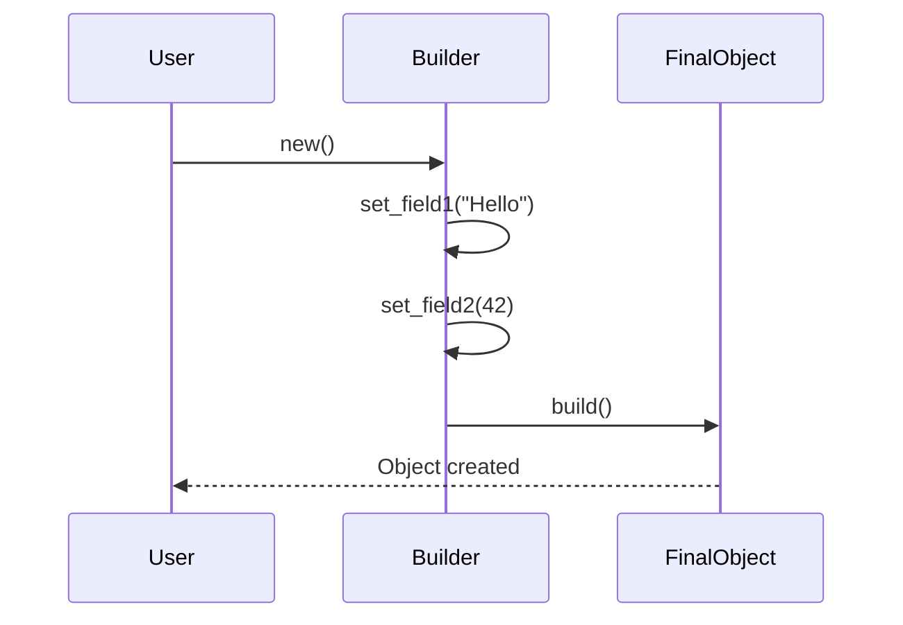

## 20.13. Implementing Fluent Interfaces

Fluent interfaces are a design pattern that allows for more readable and expressive code by chaining method calls. This pattern is particularly useful in Rust for creating APIs that are intuitive and easy to use. In this section, we will explore the concept of fluent interfaces, how to implement them in Rust, and best practices for maintaining clarity and consistency.

### What Are Fluent Interfaces?

Fluent interfaces are a style of API design that emphasizes readability and expressiveness. They allow developers to chain method calls in a way that resembles natural language, making the code more intuitive and easier to understand. This is achieved by having each method return the object it was called on, allowing for a sequence of method calls to be linked together.

#### Advantages of Fluent Interfaces

- **Readability**: Fluent interfaces make code more readable by allowing method calls to be chained in a logical sequence.
- **Expressiveness**: They enable developers to express complex operations in a concise and clear manner.
- **Ease of Use**: APIs designed with fluent interfaces are often easier to use, as they guide the developer through the available operations.

### Designing APIs with Method Chaining

To design an API that supports fluent interfaces, we need to ensure that each method returns the object it was called on. This allows for method chaining, where the output of one method becomes the input for the next.

#### Basic Example of Method Chaining

Let's start with a simple example of method chaining in Rust:

```rust
struct Builder {
    field1: String,
    field2: i32,
}

impl Builder {
    fn new() -> Self {
        Builder {
            field1: String::new(),
            field2: 0,
        }
    }

    fn set_field1(mut self, value: &str) -> Self {
        self.field1 = value.to_string();
        self
    }

    fn set_field2(mut self, value: i32) -> Self {
        self.field2 = value;
        self
    }

    fn build(self) -> Result<FinalObject, &'static str> {
        if self.field1.is_empty() || self.field2 == 0 {
            Err("Fields must be set")
        } else {
            Ok(FinalObject {
                field1: self.field1,
                field2: self.field2,
            })
        }
    }
}

struct FinalObject {
    field1: String,
    field2: i32,
}

fn main() {
    let result = Builder::new()
        .set_field1("Hello")
        .set_field2(42)
        .build();

    match result {
        Ok(obj) => println!("Object created with field1: {}, field2: {}", obj.field1, obj.field2),
        Err(e) => println!("Error: {}", e),
    }
}
```

In this example, we have a `Builder` struct with methods that set fields and return `self`, allowing us to chain these methods together. The `build` method finalizes the object creation.

### Using Macros to Simplify Fluent Interfaces

Rust's macro system can be leveraged to simplify the implementation of fluent interfaces. Macros can automate repetitive code patterns, making the API easier to maintain and extend.

#### Example with Macros

Here's how we can use macros to streamline the creation of fluent interfaces:

```rust
macro_rules! fluent_builder {
    ($name:ident, $($field:ident: $type:ty),*) => {
        struct $name {
            $($field: $type),*
        }

        impl $name {
            fn new() -> Self {
                $name {
                    $($field: Default::default()),*
                }
            }

            $(
                fn $field(mut self, value: $type) -> Self {
                    self.$field = value;
                    self
                }
            )*

            fn build(self) -> Result<FinalObject, &'static str> {
                // Custom validation logic
                Ok(FinalObject {
                    $($field: self.$field),*
                })
            }
        }
    };
}

fluent_builder!(Builder, field1: String, field2: i32);

fn main() {
    let result = Builder::new()
        .field1("Hello".to_string())
        .field2(42)
        .build();

    match result {
        Ok(obj) => println!("Object created with field1: {}, field2: {}", obj.field1, obj.field2),
        Err(e) => println!("Error: {}", e),
    }
}
```

In this example, the `fluent_builder!` macro generates a struct and its associated methods, reducing boilerplate code and ensuring consistency across similar builders.

### Best Practices for Fluent Interfaces

When implementing fluent interfaces, it's important to maintain clarity and consistency. Here are some best practices to consider:

- **Consistent Method Naming**: Use consistent naming conventions for methods to make the API intuitive.
- **Error Handling**: Ensure that errors are handled gracefully, providing clear messages to the user.
- **Documentation**: Document the API thoroughly to guide users on how to use the fluent interface effectively.
- **Avoid Ambiguity**: Ensure that method calls are unambiguous and that the sequence of calls is logical.

### Potential Pitfalls

While fluent interfaces offer many advantages, there are potential pitfalls to be aware of:

- **Ambiguous Method Calls**: Ensure that method names and their order of execution are clear to avoid confusion.
- **Reduced Code Clarity**: Overusing method chaining can lead to code that is difficult to read and maintain.
- **Complex Error Handling**: Chained methods can make it harder to handle errors, especially if intermediate states are invalid.

### Rust Unique Features

Rust's ownership model and type system provide unique advantages when implementing fluent interfaces. The ability to enforce compile-time checks ensures that method chains are safe and that resources are managed efficiently.

### Differences and Similarities

Fluent interfaces are similar to the builder pattern, but they focus more on readability and expressiveness. While both patterns involve method chaining, fluent interfaces emphasize a natural language style.

### Try It Yourself

Experiment with the examples provided by modifying the fields and methods. Try adding new fields to the `Builder` struct and see how the macro simplifies the process. Consider implementing error handling for invalid states in the method chain.

### Visualizing Fluent Interfaces

To better understand the flow of method chaining in fluent interfaces, let's visualize it using a sequence diagram:



This diagram illustrates the sequence of method calls in a fluent interface, highlighting the flow from initialization to object creation.

### References and Links

For further reading on fluent interfaces and method chaining, consider the following resources:

- [Rust Programming Language](https://doc.rust-lang.org/book/)
- [Design Patterns in Rust](https://rust-unofficial.github.io/patterns/)
- [Macros in Rust](https://doc.rust-lang.org/reference/macros.html)

### Knowledge Check

To reinforce your understanding of fluent interfaces, consider the following questions:

- What are the main advantages of using fluent interfaces?
- How can macros simplify the implementation of fluent interfaces in Rust?
- What are some potential pitfalls of using fluent interfaces?

### Embrace the Journey

Remember, implementing fluent interfaces is just one way to enhance the readability and expressiveness of your Rust code. As you continue to explore Rust's capabilities, you'll discover even more powerful patterns and techniques. Keep experimenting, stay curious, and enjoy the journey!

## Quiz Time!



### What is a fluent interface?

- [x] A design pattern that allows method chaining for readability and expressiveness.
- [ ] A pattern that focuses on data immutability.
- [ ] A way to handle errors in Rust.
- [ ] A method for optimizing performance.

> **Explanation:** Fluent interfaces allow for method chaining, making code more readable and expressive.

### What is the main advantage of using method chaining in fluent interfaces?

- [x] It enhances code readability and expressiveness.
- [ ] It reduces the need for error handling.
- [ ] It improves performance.
- [ ] It simplifies memory management.

> **Explanation:** Method chaining in fluent interfaces enhances readability and expressiveness by allowing a sequence of method calls.

### How can macros help in implementing fluent interfaces in Rust?

- [x] By automating repetitive code patterns.
- [ ] By improving runtime performance.
- [ ] By handling errors automatically.
- [ ] By enforcing strict type checks.

> **Explanation:** Macros can automate repetitive code patterns, making the implementation of fluent interfaces easier and more consistent.

### What is a potential pitfall of using fluent interfaces?

- [x] Reduced code clarity due to excessive chaining.
- [ ] Increased memory usage.
- [ ] Difficulty in handling concurrency.
- [ ] Lack of type safety.

> **Explanation:** Excessive method chaining can lead to reduced code clarity, making it harder to read and maintain.

### Which Rust feature is particularly beneficial for implementing fluent interfaces?

- [x] Ownership model and type system.
- [ ] Garbage collection.
- [ ] Dynamic typing.
- [ ] Reflection.

> **Explanation:** Rust's ownership model and type system provide compile-time checks that ensure method chains are safe and resources are managed efficiently.

### What should be avoided when designing fluent interfaces?

- [x] Ambiguous method calls.
- [ ] Consistent method naming.
- [ ] Clear documentation.
- [ ] Graceful error handling.

> **Explanation:** Ambiguous method calls should be avoided to ensure that the sequence of method calls is clear and logical.

### What is the relationship between fluent interfaces and the builder pattern?

- [x] Fluent interfaces focus more on readability and expressiveness.
- [ ] Fluent interfaces are a subset of the builder pattern.
- [ ] Fluent interfaces are unrelated to the builder pattern.
- [ ] Fluent interfaces are more efficient than the builder pattern.

> **Explanation:** While both involve method chaining, fluent interfaces emphasize readability and expressiveness.

### How can you ensure that a fluent interface is intuitive?

- [x] Use consistent method naming and clear documentation.
- [ ] Focus solely on performance optimization.
- [ ] Avoid using macros.
- [ ] Minimize error handling.

> **Explanation:** Consistent method naming and clear documentation help make a fluent interface intuitive and easy to use.

### What is a key benefit of using macros in fluent interfaces?

- [x] Reducing boilerplate code.
- [ ] Increasing runtime speed.
- [ ] Simplifying error handling.
- [ ] Enhancing memory management.

> **Explanation:** Macros reduce boilerplate code, making the implementation of fluent interfaces more efficient and maintainable.

### True or False: Fluent interfaces can only be implemented in object-oriented languages.

- [ ] True
- [x] False

> **Explanation:** Fluent interfaces can be implemented in various programming paradigms, including Rust, which is not strictly object-oriented.


