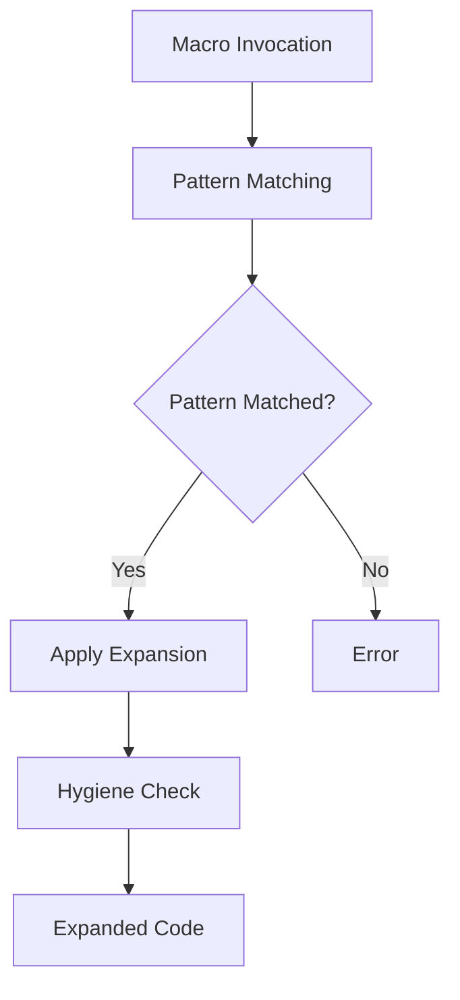

## 20.2. Declarative Macros (`macro_rules!`)

In the world of Rust programming, macros are a powerful tool that allow developers to write code that writes other code. This metaprogramming capability can lead to more efficient, reusable, and expressive code. In this section, we will dive deep into declarative macros, specifically focusing on `macro_rules!`, which is the primary way to define macros in Rust.

### Understanding `macro_rules!`

Declarative macros in Rust, defined using `macro_rules!`, allow you to match patterns in code and generate new code based on those patterns. Unlike procedural macros, which are more complex and involve writing Rust code that manipulates Rust code, declarative macros are simpler and rely on pattern matching.

#### How `macro_rules!` Works

A `macro_rules!` macro is essentially a set of rules that describe how to transform input syntax into output syntax. These rules are defined using patterns, which are matched against the input code. When a match is found, the corresponding transformation is applied.

Here's a basic example of a `macro_rules!` macro:

```rust
macro_rules! say_hello {
    () => {
        println!("Hello, world!");
    };
}

fn main() {
    say_hello!(); // This will print "Hello, world!"
}
```

In this example, the `say_hello!` macro takes no arguments and simply expands to a `println!` statement.

### Syntax Details and Common Patterns

The syntax for `macro_rules!` can be quite flexible, allowing for a variety of patterns and transformations. Let's explore some of the common patterns used in declarative macros.

#### Basic Syntax

The basic syntax for defining a macro using `macro_rules!` is as follows:

```rust
macro_rules! macro_name {
    (pattern) => {
        expansion
    };
}
```

- **Pattern**: This is the part of the macro that matches the input. It can include literals, identifiers, and special pattern variables.
- **Expansion**: This is the code that the macro generates when the pattern is matched.

#### Pattern Variables

Pattern variables are placeholders in the macro pattern that can match different types of syntax. They are denoted by a `$` followed by an identifier and a type specifier:

- **`$ident:ident`**: Matches an identifier.
- **`$expr:expr`**: Matches an expression.
- **`$ty:ty`**: Matches a type.
- **`$pat:pat`**: Matches a pattern.
- **`$stmt:stmt`**: Matches a statement.
- **`$block:block`**: Matches a block of code.
- **`$item:item`**: Matches an item (e.g., function, struct).
- **`$meta:meta`**: Matches a meta item (e.g., attribute).

Here's an example using pattern variables:

```rust
macro_rules! create_function {
    ($name:ident) => {
        fn $name() {
            println!("Function {} was called", stringify!($name));
        }
    };
}

create_function!(foo);

fn main() {
    foo(); // This will print "Function foo was called"
}
```

In this example, the macro `create_function!` takes an identifier and creates a function with that name.

#### Repetition

Macros can also include repetition patterns, which allow you to match and expand multiple occurrences of a pattern. Repetition is denoted by `$(...)` followed by a repetition operator (`*`, `+`, or `?`):

- **`*`**: Zero or more repetitions.
- **`+`**: One or more repetitions.
- **`?`**: Zero or one repetition.

Here's an example of a macro using repetition:

```rust
macro_rules! print_all {
    ($($arg:expr),*) => {
        $(
            println!("{}", $arg);
        )*
    };
}

fn main() {
    print_all!("Hello", "world", 42);
    // This will print:
    // Hello
    // world
    // 42
}
```

### Hygienic Macros and Macro Expansion

One of the key features of Rust's macros is hygiene. Hygienic macros ensure that the variables and identifiers within a macro do not interfere with those outside the macro. This prevents common issues like name clashes and makes macros safer to use.

#### How Rust Handles Macro Expansion

When a macro is invoked, Rust performs the following steps:

1. **Pattern Matching**: The macro's patterns are matched against the input code.
2. **Expansion**: If a pattern matches, the corresponding expansion is applied.
3. **Hygiene**: Rust ensures that the expanded code does not interfere with the surrounding code by renaming identifiers as needed.

This process allows macros to be both powerful and safe, reducing the risk of unintended side effects.

### Creating Useful Macros

Now that we understand the basics of `macro_rules!`, let's explore some practical examples of creating useful macros.

#### Custom `println!` Alternative

Let's create a macro that prints a message with a custom prefix:

```rust
macro_rules! log {
    ($level:expr, $($arg:tt)*) => {
        println!("[{}] {}", $level, format!($($arg)*));
    };
}

fn main() {
    log!("INFO", "This is an info message");
    log!("ERROR", "This is an error message");
    // This will print:
    // [INFO] This is an info message
    // [ERROR] This is an error message
}
```

In this example, the `log!` macro takes a log level and a message, and prints them with a custom format.

#### Small Domain-Specific Languages (DSLs)

Macros can also be used to create small DSLs that simplify repetitive tasks. For example, let's create a macro for defining simple HTML elements:

```rust
macro_rules! html {
    ($tag:ident, $($content:expr),*) => {
        format!("<{}>{}</{}>", stringify!($tag), $($content),*, stringify!($tag))
    };
}

fn main() {
    let paragraph = html!(p, "This is a paragraph.");
    println!("{}", paragraph);
    // This will print:
    // <p>This is a paragraph.</p>
}
```

This `html!` macro allows you to define HTML elements with a simple syntax, making it easier to generate HTML code.

### Limitations and Best Practices

While `macro_rules!` is a powerful tool, it has some limitations and best practices to consider:

#### Limitations

- **Complexity**: Macros can become complex and hard to read if overused. It's important to keep them simple and focused.
- **Debugging**: Debugging macros can be challenging, as errors in macro expansion may not be immediately obvious.
- **Error Messages**: The error messages generated by macros can be cryptic, making it difficult to diagnose issues.

#### Best Practices

- **Use Sparingly**: Use macros only when they provide a clear benefit, such as reducing boilerplate or creating a DSL.
- **Document**: Clearly document the purpose and usage of each macro to aid understanding and maintenance.
- **Test**: Thoroughly test macros to ensure they behave as expected in different scenarios.
- **Avoid Side Effects**: Design macros to be free of side effects, ensuring they do not alter the state of the program unexpectedly.

### Visualizing Macro Expansion

To better understand how macros work, let's visualize the process of macro expansion using a flowchart.



**Figure 1**: This flowchart illustrates the process of macro expansion in Rust, from invocation to the generation of expanded code.

### References and Links

For further reading on Rust macros, consider the following resources:

- [The Rust Programming Language - Macros](https://doc.rust-lang.org/book/ch19-06-macros.html)
- [Rust Reference - Macros](https://doc.rust-lang.org/reference/macros.html)
- [Rust by Example - Macros](https://doc.rust-lang.org/rust-by-example/macros.html)

### Knowledge Check

Let's reinforce what we've learned with some questions and exercises.

1. **What is the primary purpose of `macro_rules!` in Rust?**
2. **Explain the concept of hygienic macros. Why is it important?**
3. **Create a macro that generates a function to add two numbers.**
4. **What are some common patterns used in `macro_rules!`?**
5. **How does Rust handle macro expansion to ensure safety?**

### Embrace the Journey

Remember, mastering macros is just one step in your Rust journey. As you continue to explore Rust's capabilities, you'll find that macros can greatly enhance your productivity and code quality. Keep experimenting, stay curious, and enjoy the journey!

### Quiz Time!



### What is the primary purpose of `macro_rules!` in Rust?

- [x] To define macros that transform input syntax into output syntax.
- [ ] To handle memory management automatically.
- [ ] To provide a runtime for executing Rust code.
- [ ] To compile Rust code into machine code.

> **Explanation:** `macro_rules!` is used to define macros that transform input syntax into output syntax, allowing for code generation.

### What is a key feature of Rust's macros that ensures safety?

- [x] Hygiene
- [ ] Garbage Collection
- [ ] Dynamic Typing
- [ ] Reflection

> **Explanation:** Hygiene ensures that variables and identifiers within a macro do not interfere with those outside the macro, preventing name clashes.

### Which repetition operator allows zero or more repetitions in a macro?

- [x] `*`
- [ ] `+`
- [ ] `?`
- [ ] `!`

> **Explanation:** The `*` operator allows zero or more repetitions in a macro pattern.

### How can you match an identifier in a macro pattern?

- [x] `$ident:ident`
- [ ] `$expr:expr`
- [ ] `$ty:ty`
- [ ] `$pat:pat`

> **Explanation:** `$ident:ident` is used to match an identifier in a macro pattern.

### What is a common use case for macros in Rust?

- [x] Reducing boilerplate code
- [ ] Managing memory allocation
- [ ] Handling concurrency
- [ ] Compiling Rust code

> **Explanation:** Macros are commonly used to reduce boilerplate code by generating repetitive code patterns.

### What does the `log!` macro in the example do?

- [x] Prints a message with a custom prefix
- [ ] Logs errors to a file
- [ ] Sends messages over a network
- [ ] Compiles code into a binary

> **Explanation:** The `log!` macro prints a message with a custom prefix, as shown in the example.

### What is a limitation of using macros in Rust?

- [x] Complexity and readability
- [ ] Lack of type safety
- [ ] Poor performance
- [ ] Limited platform support

> **Explanation:** Macros can become complex and hard to read if overused, which is a limitation to consider.

### What is the purpose of the hygiene check in macro expansion?

- [x] To prevent name clashes and ensure safety
- [ ] To optimize performance
- [ ] To manage memory allocation
- [ ] To handle concurrency

> **Explanation:** The hygiene check prevents name clashes and ensures that macros do not interfere with surrounding code.

### How does Rust ensure that macros do not interfere with surrounding code?

- [x] By renaming identifiers as needed
- [ ] By using garbage collection
- [ ] By compiling macros separately
- [ ] By using dynamic typing

> **Explanation:** Rust renames identifiers as needed to ensure that macros do not interfere with surrounding code.

### True or False: Macros in Rust can have side effects.

- [x] True
- [ ] False

> **Explanation:** While macros can have side effects, it is best practice to design them to be free of side effects to avoid unexpected behavior.


