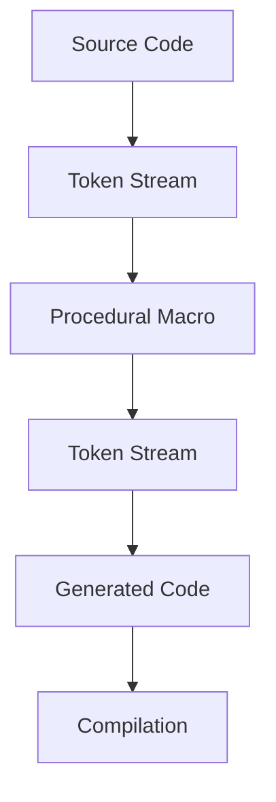

## 20.3. Procedural Macros and Derive Macros

### Introduction

In the world of Rust programming, macros are a powerful tool that allows developers to write code that writes other code. This metaprogramming capability can significantly enhance productivity and maintainability by automating repetitive tasks and enabling more expressive code. In this section, we will delve into procedural macros, a more advanced form of macros in Rust, and explore their capabilities, including custom derive macros.

### Procedural Macros vs. Declarative Macros

Before we dive into procedural macros, it's essential to understand the distinction between procedural and declarative macros. Declarative macros, often referred to as `macro_rules!`, are pattern-based and allow you to define macros by specifying patterns to match against the input tokens. They are powerful but limited to pattern matching and substitution.

Procedural macros, on the other hand, provide a more flexible and powerful way to manipulate Rust code. They operate on the abstract syntax tree (AST) of the code, allowing for more complex transformations. Procedural macros are written as Rust functions that take a token stream as input and produce a token stream as output. This capability makes them suitable for tasks that go beyond the capabilities of declarative macros.

### Types of Procedural Macros

Rust provides three kinds of procedural macros:

1. **Derive Macros**: These are used to automatically implement traits for structs and enums. They are invoked with the `#[derive]` attribute.

2. **Attribute-like Macros**: These macros are similar to derive macros but can be applied to items like functions, structs, or modules. They are invoked with a custom attribute, e.g., `#[my_macro]`.

3. **Function-like Macros**: These macros resemble function calls and are invoked using a syntax similar to function calls, e.g., `my_macro!(...)`.

Let's explore each type in detail.

### Derive Macros

Derive macros are perhaps the most commonly used procedural macros. They allow you to automatically implement traits for your types. For example, the `#[derive(Debug)]` macro automatically implements the `Debug` trait for a struct or enum, enabling you to print it using the `{:?}` formatter.

#### Writing a Custom Derive Macro

To write a custom derive macro, you need to create a new Rust crate of type `proc-macro`. Here's a step-by-step guide:

1. **Create a new crate**:

   ```bash
   cargo new my_derive_macro --lib
   cd my_derive_macro
   ```

2. **Add the `proc-macro` crate type** in `Cargo.toml`:

   ```toml
   [lib]
   proc-macro = true
   ```

3. **Implement the derive macro** in `src/lib.rs`:

   ```rust
   extern crate proc_macro;
   use proc_macro::TokenStream;
   use quote::quote;
   use syn;

   #[proc_macro_derive(MyTrait)]
   pub fn my_trait_derive(input: TokenStream) -> TokenStream {
       // Parse the input tokens into a syntax tree
       let ast = syn::parse(input).unwrap();

       // Build the trait implementation
       impl_my_trait(&ast)
   }

   fn impl_my_trait(ast: &syn::DeriveInput) -> TokenStream {
       let name = &ast.ident;
       let gen = quote! {
           impl MyTrait for #name {
               fn my_function(&self) {
                   println!("MyTrait is implemented for {}", stringify!(#name));
               }
           }
       };
       gen.into()
   }
   ```

4. **Use the derive macro** in another crate:

   ```rust
   use my_derive_macro::MyTrait;

   #[derive(MyTrait)]
   struct MyStruct;

   fn main() {
       let instance = MyStruct;
       instance.my_function();
   }
   ```

In this example, we created a custom derive macro `MyTrait` that implements a trait for any struct that uses it. The `syn` crate is used to parse the input tokens, and the `quote` crate is used to generate the output tokens.

#### Parsing Token Streams and Generating Code

Procedural macros work by manipulating token streams. The `proc_macro` crate provides the `TokenStream` type, which represents a sequence of tokens. The `syn` crate is commonly used to parse these tokens into a more manageable syntax tree, while the `quote` crate is used to generate Rust code from this syntax tree.

Here's a simple example of parsing a token stream:

```rust
extern crate proc_macro;
use proc_macro::TokenStream;
use syn::{parse_macro_input, DeriveInput};

#[proc_macro_derive(Example)]
pub fn example_derive(input: TokenStream) -> TokenStream {
    // Parse the input tokens into a syntax tree
    let input = parse_macro_input!(input as DeriveInput);

    // Extract the name of the struct or enum
    let name = input.ident;

    // Generate code
    let expanded = quote! {
        impl Example for #name {
            fn example_method(&self) {
                println!("Example method called on {}", stringify!(#name));
            }
        }
    };

    // Convert the generated code into a TokenStream
    TokenStream::from(expanded)
}
```

### Attribute-like Macros

Attribute-like macros are similar to derive macros but offer more flexibility. They can be applied to a wider range of items, such as functions, structs, or modules. They are invoked using a custom attribute.

Here's an example of an attribute-like macro:

```rust
extern crate proc_macro;
use proc_macro::TokenStream;
use quote::quote;
use syn::{parse_macro_input, ItemFn};

#[proc_macro_attribute]
pub fn my_attribute(_attr: TokenStream, item: TokenStream) -> TokenStream {
    // Parse the input tokens into a syntax tree
    let input = parse_macro_input!(item as ItemFn);

    // Extract the function name
    let name = &input.sig.ident;

    // Generate code
    let expanded = quote! {
        fn #name() {
            println!("Function {} is called", stringify!(#name));
        }
    };

    // Convert the generated code into a TokenStream
    TokenStream::from(expanded)
}
```

In this example, the `my_attribute` macro can be applied to functions, and it modifies the function to print a message when called.

### Function-like Macros

Function-like macros are invoked using a syntax similar to function calls. They are the most flexible type of procedural macros and can be used to generate arbitrary code.

Here's an example of a function-like macro:

```rust
extern crate proc_macro;
use proc_macro::TokenStream;
use quote::quote;
use syn::{parse_macro_input, LitStr};

#[proc_macro]
pub fn my_macro(input: TokenStream) -> TokenStream {
    // Parse the input tokens into a syntax tree
    let input = parse_macro_input!(input as LitStr);

    // Extract the string literal
    let message = input.value();

    // Generate code
    let expanded = quote! {
        println!("Macro says: {}", #message);
    };

    // Convert the generated code into a TokenStream
    TokenStream::from(expanded)
}
```

In this example, the `my_macro` function-like macro takes a string literal as input and generates code to print that string.

### Use Cases for Procedural Macros

Procedural macros are powerful tools that can be used in various scenarios:

- **Code Generation**: Automatically generate boilerplate code, such as trait implementations.
- **Domain-Specific Languages (DSLs)**: Create custom syntax for specific domains.
- **Code Transformation**: Modify existing code to add additional functionality or optimizations.
- **Custom Attributes**: Implement custom behaviors for functions, structs, or modules.

### Choosing Procedural Macros Over Declarative Macros

While declarative macros are suitable for simple pattern matching and substitution tasks, procedural macros are the better choice for more complex code transformations. Use procedural macros when you need to:

- Perform complex parsing and code generation.
- Implement custom derive behaviors.
- Apply transformations that require access to the syntax tree.

### Visualizing Procedural Macro Workflow

To better understand how procedural macros work, let's visualize the workflow using a Mermaid.js diagram:



**Diagram Description**: This diagram illustrates the workflow of a procedural macro. The source code is first converted into a token stream, which is then processed by the procedural macro. The macro generates a new token stream, which is converted into generated code and compiled.

### Conclusion

Procedural macros in Rust provide a powerful mechanism for metaprogramming, enabling developers to write code that writes code. By understanding and leveraging procedural macros, you can automate repetitive tasks, create custom syntax, and enhance the expressiveness of your Rust programs. Remember, this is just the beginning. As you progress, you'll discover even more creative ways to use procedural macros in your projects. Keep experimenting, stay curious, and enjoy the journey!

## Quiz Time!



### What is the primary difference between procedural and declarative macros in Rust?

- [x] Procedural macros operate on the abstract syntax tree, while declarative macros use pattern matching.
- [ ] Declarative macros operate on the abstract syntax tree, while procedural macros use pattern matching.
- [ ] Procedural macros are simpler and less powerful than declarative macros.
- [ ] Declarative macros are used for code generation, while procedural macros are not.

> **Explanation:** Procedural macros operate on the abstract syntax tree (AST), allowing for more complex transformations, while declarative macros use pattern matching for simpler tasks.

### Which crate type must be specified in `Cargo.toml` to create a procedural macro?

- [x] proc-macro
- [ ] library
- [ ] binary
- [ ] executable

> **Explanation:** The `proc-macro` crate type must be specified in `Cargo.toml` to create a procedural macro.

### What is the purpose of the `quote` crate in procedural macros?

- [x] To generate Rust code from a syntax tree.
- [ ] To parse token streams into a syntax tree.
- [ ] To provide pattern matching capabilities.
- [ ] To execute macros at runtime.

> **Explanation:** The `quote` crate is used to generate Rust code from a syntax tree, allowing for code generation in procedural macros.

### What kind of procedural macro is invoked with a custom attribute?

- [x] Attribute-like macro
- [ ] Derive macro
- [ ] Function-like macro
- [ ] Declarative macro

> **Explanation:** Attribute-like macros are invoked with a custom attribute and can be applied to items like functions, structs, or modules.

### Which of the following is NOT a type of procedural macro in Rust?

- [ ] Derive macro
- [ ] Attribute-like macro
- [ ] Function-like macro
- [x] Pattern-like macro

> **Explanation:** Pattern-like macro is not a type of procedural macro in Rust. The three types are derive, attribute-like, and function-like macros.

### What is the role of the `syn` crate in procedural macros?

- [x] To parse token streams into a syntax tree.
- [ ] To generate Rust code from a syntax tree.
- [ ] To provide runtime execution of macros.
- [ ] To optimize compiled code.

> **Explanation:** The `syn` crate is used to parse token streams into a syntax tree, which is essential for manipulating code in procedural macros.

### How are function-like macros invoked in Rust?

- [x] Using a syntax similar to function calls.
- [ ] Using a custom attribute.
- [ ] Using the `#[derive]` attribute.
- [ ] Using pattern matching.

> **Explanation:** Function-like macros are invoked using a syntax similar to function calls, allowing for flexible code generation.

### Which procedural macro type is most suitable for automatically implementing traits?

- [x] Derive macro
- [ ] Attribute-like macro
- [ ] Function-like macro
- [ ] Declarative macro

> **Explanation:** Derive macros are most suitable for automatically implementing traits for structs and enums.

### True or False: Procedural macros can only be used for code generation.

- [ ] True
- [x] False

> **Explanation:** Procedural macros can be used for code generation, code transformation, creating DSLs, and implementing custom attributes, among other tasks.

### What is the first step in writing a custom derive macro?

- [x] Create a new Rust crate of type `proc-macro`.
- [ ] Implement the macro logic in `main.rs`.
- [ ] Use the `macro_rules!` syntax.
- [ ] Define a custom attribute for the macro.

> **Explanation:** The first step in writing a custom derive macro is to create a new Rust crate of type `proc-macro`.


