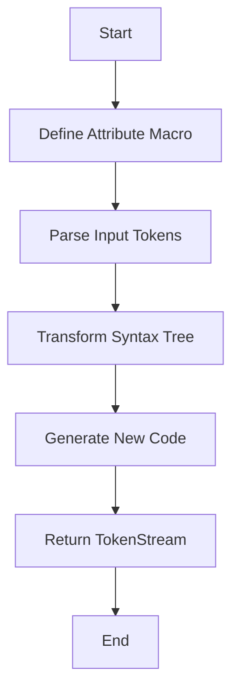

## 20.4. Attribute Macros

Attribute macros in Rust are a powerful feature that allows developers to write custom attributes that can modify code in complex ways. They are a type of procedural macro that can be applied to various Rust constructs, such as functions, structs, and modules, to transform or generate code at compile time. In this section, we will delve into how attribute macros work, how to write and use them, potential use cases, and considerations for macro expansion and code readability.

### Understanding Attribute Macros

Attribute macros are defined using the `proc_macro` crate, which provides the necessary tools to create procedural macros in Rust. They are invoked using the `#[attribute_name]` syntax and can be applied to items like functions, structs, or modules. When the Rust compiler encounters an attribute macro, it invokes the macro's code, which can then transform the annotated item.

#### How Attribute Macros Work

Attribute macros operate by taking the annotated code as input, processing it, and producing new code as output. This process involves parsing the input code into a syntax tree, manipulating the tree, and then generating the transformed code. The `proc_macro` crate provides the `TokenStream` type, which represents the input and output of a procedural macro.

Here's a simple example of an attribute macro that logs the execution of a function:

```rust
// Import necessary crates
use proc_macro::TokenStream;
use quote::quote;
use syn::{parse_macro_input, ItemFn};

// Define the attribute macro
#[proc_macro_attribute]
pub fn log_execution(_attr: TokenStream, item: TokenStream) -> TokenStream {
    // Parse the input tokens into a syntax tree
    let input = parse_macro_input!(item as ItemFn);
    let fn_name = &input.sig.ident;
    let fn_block = &input.block;

    // Generate the new function with logging
    let expanded = quote! {
        fn #fn_name() {
            println!("Executing function: {}", stringify!(#fn_name));
            #fn_block
        }
    };

    // Return the generated tokens
    TokenStream::from(expanded)
}
```

In this example, the `log_execution` macro takes a function as input, adds a logging statement, and returns the modified function. The `quote!` macro is used to generate the new function code, and `syn` is used to parse the input tokens.

### Writing and Using Attribute Macros

To write an attribute macro, you need to create a new Rust crate with the `proc-macro` attribute. This crate will contain the macro definition and any necessary dependencies, such as `syn` and `quote`.

#### Step-by-Step Guide to Creating an Attribute Macro

1. **Create a New Crate**: Start by creating a new library crate with the `proc-macro` attribute.

   ```bash
   cargo new my_macro --lib
   ```

2. **Add Dependencies**: Add `proc-macro`, `syn`, and `quote` to your `Cargo.toml`.

   ```toml
   [dependencies]
   proc-macro = "1.0"
   syn = "1.0"
   quote = "1.0"
   ```

3. **Define the Macro**: Implement the macro logic in the `lib.rs` file.

   ```rust
   extern crate proc_macro;
   use proc_macro::TokenStream;
   use quote::quote;
   use syn::{parse_macro_input, ItemFn};

   #[proc_macro_attribute]
   pub fn log_execution(_attr: TokenStream, item: TokenStream) -> TokenStream {
       let input = parse_macro_input!(item as ItemFn);
       let fn_name = &input.sig.ident;
       let fn_block = &input.block;

       let expanded = quote! {
           fn #fn_name() {
               println!("Executing function: {}", stringify!(#fn_name));
               #fn_block
           }
       };

       TokenStream::from(expanded)
   }
   ```

4. **Use the Macro**: In another crate, add your macro crate as a dependency and use the macro.

   ```rust
   // main.rs
   use my_macro::log_execution;

   #[log_execution]
   fn my_function() {
       println!("Hello, world!");
   }

   fn main() {
       my_function();
   }
   ```

When you run this code, the output will include the log message from the macro, demonstrating how the macro modifies the function behavior.

### Potential Use Cases for Attribute Macros

Attribute macros can be used in various scenarios to enhance code functionality or simplify repetitive tasks. Some common use cases include:

- **Logging and Monitoring**: Automatically inject logging or monitoring code into functions or methods.
- **Validation**: Add validation logic to structs or functions, such as checking input parameters.
- **Serialization/Deserialization**: Automatically generate serialization or deserialization code for data structures.
- **Code Generation**: Generate boilerplate code, such as getters and setters for struct fields.

### Considerations for Macro Expansion and Code Readability

While attribute macros offer powerful capabilities, they also introduce complexity to the codebase. It's essential to consider the following when using attribute macros:

- **Readability**: Macros can obscure the original code, making it harder to understand. Ensure that the macro's purpose and behavior are well-documented.
- **Debugging**: Debugging macro-generated code can be challenging. Use tools like `cargo expand` to inspect the expanded code and understand the transformations.
- **Performance**: Attribute macros can impact compile times, especially if they perform complex transformations. Optimize macro logic to minimize performance overhead.

### Limitations and How to Work Within Them

Attribute macros have some limitations that developers should be aware of:

- **Limited Context**: Macros operate on the syntax tree and do not have access to runtime information. They cannot perform dynamic checks or access external resources.
- **Complexity**: Writing complex macros requires a deep understanding of Rust's syntax and the `proc_macro` API. Start with simple macros and gradually build complexity.
- **Error Handling**: Macros should provide clear error messages to help users understand issues with macro usage.

### Visualizing Attribute Macro Workflow

To better understand how attribute macros work, let's visualize the workflow using a Mermaid.js diagram:



**Diagram Description**: This flowchart illustrates the process of defining an attribute macro, parsing input tokens, transforming the syntax tree, generating new code, and returning the modified `TokenStream`.

### Try It Yourself

To gain hands-on experience with attribute macros, try modifying the example macro to include additional functionality, such as timing the function execution or conditionally logging based on an attribute parameter.

### References and Links

- [Rust Reference on Procedural Macros](https://doc.rust-lang.org/reference/procedural-macros.html)
- [The `proc_macro` crate documentation](https://doc.rust-lang.org/proc_macro/)
- [Syn crate documentation](https://docs.rs/syn/)
- [Quote crate documentation](https://docs.rs/quote/)

### Knowledge Check

- What are attribute macros, and how do they differ from other types of macros in Rust?
- How can attribute macros be used to inject logging into functions?
- What are some potential use cases for attribute macros in Rust development?
- What considerations should be taken into account when using attribute macros?
- How can you visualize the workflow of an attribute macro?

### Embrace the Journey

Remember, mastering attribute macros is a journey. As you experiment and explore, you'll discover new ways to leverage their power in your Rust projects. Keep learning, stay curious, and enjoy the process!

## Quiz Time!



### What is the primary purpose of attribute macros in Rust?

- [x] To modify code at compile time
- [ ] To execute code at runtime
- [ ] To manage memory allocation
- [ ] To handle error propagation

> **Explanation:** Attribute macros are used to modify code at compile time by transforming or generating new code.

### Which crate provides the necessary tools to create procedural macros in Rust?

- [x] proc_macro
- [ ] serde
- [ ] tokio
- [ ] rayon

> **Explanation:** The `proc_macro` crate provides the tools needed to create procedural macros, including attribute macros.

### What is the syntax used to invoke an attribute macro in Rust?

- [x] #[attribute_name]
- [ ] #[macro_use]
- [ ] #[derive]
- [ ] #[macro_export]

> **Explanation:** Attribute macros are invoked using the `#[attribute_name]` syntax.

### What is a common use case for attribute macros?

- [x] Injecting logging into functions
- [ ] Managing memory allocation
- [ ] Handling network requests
- [ ] Performing runtime checks

> **Explanation:** Attribute macros can be used to inject logging or other code into functions at compile time.

### What tool can be used to inspect the expanded code of a macro?

- [x] cargo expand
- [ ] cargo build
- [ ] cargo run
- [ ] cargo test

> **Explanation:** `cargo expand` is a tool that allows developers to inspect the expanded code of a macro.

### What is a limitation of attribute macros?

- [x] They cannot perform dynamic checks
- [ ] They can only be used on structs
- [ ] They require runtime information
- [ ] They are only available in nightly Rust

> **Explanation:** Attribute macros operate on the syntax tree and cannot perform dynamic checks or access runtime information.

### How can attribute macros impact code readability?

- [x] They can obscure the original code
- [ ] They always improve code readability
- [ ] They have no effect on readability
- [ ] They simplify complex code

> **Explanation:** Attribute macros can obscure the original code, making it harder to understand without proper documentation.

### What should be considered when using attribute macros?

- [x] Performance impact on compile times
- [ ] Memory usage at runtime
- [ ] Network latency
- [ ] File I/O operations

> **Explanation:** Attribute macros can impact compile times, so it's important to consider their performance impact.

### True or False: Attribute macros have access to runtime information.

- [ ] True
- [x] False

> **Explanation:** Attribute macros do not have access to runtime information; they operate on the syntax tree at compile time.

### What is the first step in creating an attribute macro?

- [x] Create a new library crate with the proc-macro attribute
- [ ] Write the macro logic in the main.rs file
- [ ] Add the macro to the Cargo.toml file
- [ ] Compile the macro using cargo build

> **Explanation:** The first step in creating an attribute macro is to create a new library crate with the `proc-macro` attribute.


