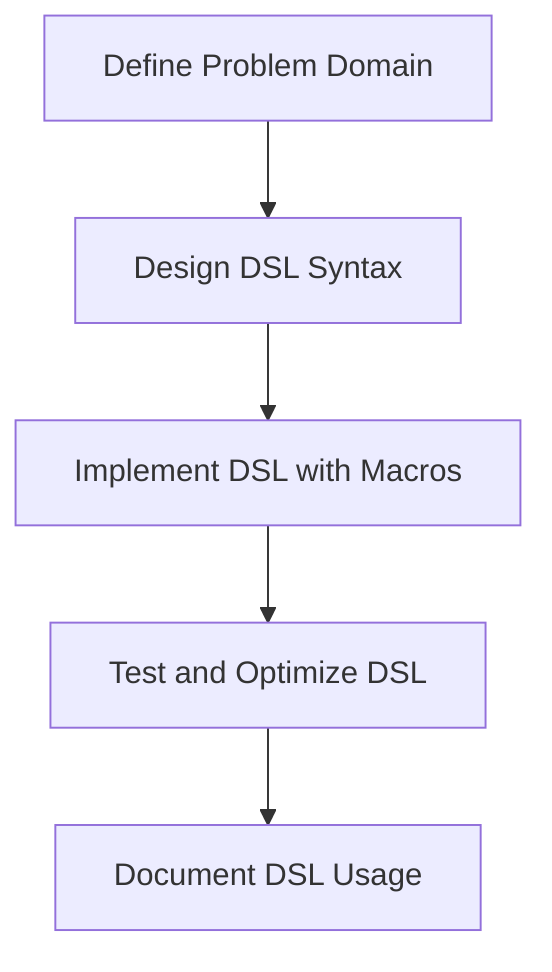

## 20.7. Creating Domain-Specific Languages (DSLs)

Domain-Specific Languages (DSLs) are specialized mini-languages tailored to a specific problem domain. They provide a more expressive and concise way to solve domain-specific problems compared to general-purpose programming languages. In Rust, DSLs can be implemented using macros, which allow for powerful metaprogramming capabilities. This section will guide you through the process of creating DSLs in Rust, using examples and best practices to enhance expressiveness and safety.

### What is a Domain-Specific Language (DSL)?

A Domain-Specific Language is a programming language or specification language dedicated to a particular problem domain, a particular problem representation technique, and/or a particular solution technique. Unlike general-purpose programming languages, DSLs are designed to be highly expressive within their domain, often sacrificing generality for ease of use and efficiency in specific tasks.

#### Why Use DSLs?

- **Expressiveness**: DSLs allow developers to express solutions in terms that are closer to the problem domain, making code more readable and maintainable.
- **Efficiency**: DSLs can be optimized for specific tasks, leading to more efficient execution.
- **Safety**: By constraining the language to a specific domain, DSLs can enforce domain-specific rules and invariants, reducing the likelihood of errors.

### Examples of DSLs in Rust

Rust provides several examples of DSLs, particularly through the use of macros and libraries that facilitate DSL creation.

#### Regex Literals

The `regex` crate in Rust provides a macro for compiling regular expressions at compile time. This is a classic example of a DSL embedded within Rust:

```rust
use regex::Regex;

fn main() {
    let re = Regex::new(r"^\d{4}-\d{2}-\d{2}$").unwrap();
    assert!(re.is_match("2024-11-25"));
}
```

In this example, the regular expression syntax acts as a DSL for pattern matching strings.

#### Parser Combinators with `nom`

The `nom` crate is a powerful parser combinator library in Rust that allows you to build complex parsers using a DSL-like syntax:

```rust
use nom::{
    IResult,
    bytes::complete::tag,
    sequence::tuple,
};

fn parse_date(input: &str) -> IResult<&str, (&str, &str, &str)> {
    tuple((tag("2024"), tag("-"), tag("11")))(input)
}

fn main() {
    let result = parse_date("2024-11-25");
    assert!(result.is_ok());
}
```

Here, `nom` provides a DSL for parsing strings, allowing you to compose simple parsers into more complex ones.

### How Macros Enable DSLs in Rust

Macros in Rust are a powerful tool for metaprogramming, allowing you to write code that writes code. This capability is crucial for creating DSLs, as it enables you to extend the language with domain-specific constructs.

#### Declarative Macros

Declarative macros, defined using `macro_rules!`, allow you to define patterns that match specific code structures and transform them into other code structures. This is useful for creating simple DSLs:

```rust
macro_rules! calculate {
    (eval $e:expr) => {
        {
            let val: usize = $e; // Ensure the expression is evaluated as a usize
            println!("{} = {}", stringify!($e), val);
        }
    };
}

fn main() {
    calculate!(eval 1 + 2 * 3);
}
```

In this example, the `calculate!` macro acts as a simple DSL for evaluating and printing arithmetic expressions.

#### Procedural Macros

Procedural macros provide even more power and flexibility, allowing you to manipulate Rust syntax trees directly. This is ideal for more complex DSLs:

```rust
use proc_macro::TokenStream;

#[proc_macro]
pub fn my_dsl(input: TokenStream) -> TokenStream {
    // Process the input TokenStream and generate Rust code
    input
}
```

Procedural macros can be used to create DSLs that require more sophisticated parsing and transformation logic.

### Best Practices for Designing DSLs

When designing a DSL in Rust, consider the following best practices:

- **Intuitiveness**: Ensure that the DSL syntax is intuitive and closely aligned with the problem domain.
- **Consistency**: Maintain consistency with Rust's syntax and semantics to reduce the learning curve.
- **Error Handling**: Provide clear and informative error messages to help users diagnose and fix issues.
- **Documentation**: Document the DSL thoroughly, including examples and use cases.
- **Performance**: Optimize the DSL for performance, especially if it will be used in performance-critical applications.

### Trade-offs in Complexity and Compile Times

Creating DSLs in Rust can introduce complexity, both in terms of the DSL implementation and the compile times. Consider the following trade-offs:

- **Complexity**: DSLs can make code more complex, especially if the DSL syntax diverges significantly from Rust's syntax.
- **Compile Times**: Macros and procedural macros can increase compile times, especially if they involve complex transformations or generate large amounts of code.

### External Frameworks

Several external frameworks can assist in creating DSLs in Rust:

- **[`nom` crate](https://crates.io/crates/nom)**: A parser combinator library that facilitates the creation of DSLs for parsing tasks.
- **[Regex macros](https://rust-lang-nursery.github.io/regex/macro.regex.html)**: Provides compile-time regular expression support, acting as a DSL for pattern matching.

### Try It Yourself

To get hands-on experience with creating DSLs in Rust, try modifying the examples provided. For instance, extend the `calculate!` macro to support more complex arithmetic operations or create a new DSL using `nom` for parsing a custom data format.

### Visualizing DSL Creation in Rust

Below is a diagram illustrating the process of creating a DSL in Rust using macros:



This flowchart outlines the key steps in creating a DSL, from defining the problem domain to documenting the DSL for users.

### Summary

Creating DSLs in Rust using macros and other features allows you to build expressive and safe solutions for specific problem domains. By leveraging Rust's powerful metaprogramming capabilities, you can design intuitive and efficient DSLs that enhance code readability and maintainability. Remember to balance the benefits of DSLs with the potential trade-offs in complexity and compile times.

## Quiz Time!



### What is a Domain-Specific Language (DSL)?

- [x] A specialized mini-language tailored to a specific problem domain.
- [ ] A general-purpose programming language.
- [ ] A type of compiler optimization.
- [ ] A library for handling network requests.

> **Explanation:** A DSL is a specialized language designed for a specific problem domain, offering expressiveness and efficiency within that domain.

### Which Rust feature is commonly used to create DSLs?

- [x] Macros
- [ ] Traits
- [ ] Enums
- [ ] Structs

> **Explanation:** Macros in Rust provide powerful metaprogramming capabilities, enabling the creation of DSLs.

### What is the `nom` crate used for in Rust?

- [x] Building parsers using a DSL-like syntax.
- [ ] Handling asynchronous I/O.
- [ ] Managing memory allocation.
- [ ] Performing mathematical calculations.

> **Explanation:** The `nom` crate is a parser combinator library that allows you to build parsers using a DSL-like syntax.

### What is a key benefit of using DSLs?

- [x] Increased expressiveness within a specific domain.
- [ ] Reduced code readability.
- [ ] Increased compile times.
- [ ] Decreased performance.

> **Explanation:** DSLs increase expressiveness by allowing developers to write code that closely aligns with the problem domain.

### What is a potential trade-off when using DSLs in Rust?

- [x] Increased compile times.
- [ ] Decreased code readability.
- [ ] Reduced expressiveness.
- [ ] Increased memory usage.

> **Explanation:** DSLs, especially those implemented with macros, can increase compile times due to complex code transformations.

### How do declarative macros differ from procedural macros?

- [x] Declarative macros use pattern matching, while procedural macros manipulate syntax trees.
- [ ] Declarative macros are more powerful than procedural macros.
- [ ] Procedural macros are easier to write than declarative macros.
- [ ] Declarative macros are used for error handling.

> **Explanation:** Declarative macros use pattern matching to transform code, while procedural macros allow direct manipulation of Rust's syntax trees.

### Which of the following is a best practice for designing DSLs?

- [x] Ensure the DSL syntax is intuitive and closely aligned with the problem domain.
- [ ] Make the DSL syntax as complex as possible.
- [ ] Avoid documenting the DSL.
- [ ] Ignore performance considerations.

> **Explanation:** Designing an intuitive DSL syntax that aligns with the problem domain is crucial for usability and adoption.

### What is the purpose of the `regex` crate in Rust?

- [x] To provide a DSL for pattern matching strings.
- [ ] To manage memory allocation.
- [ ] To handle network requests.
- [ ] To perform mathematical calculations.

> **Explanation:** The `regex` crate provides a DSL for pattern matching strings using regular expressions.

### What is a common use case for procedural macros in Rust?

- [x] Creating complex DSLs that require sophisticated parsing.
- [ ] Managing memory allocation.
- [ ] Handling network requests.
- [ ] Performing mathematical calculations.

> **Explanation:** Procedural macros are used to create complex DSLs by manipulating Rust's syntax trees directly.

### True or False: DSLs are always faster than general-purpose programming languages.

- [ ] True
- [x] False

> **Explanation:** DSLs are not always faster; they are optimized for specific tasks within their domain but may not be as fast for general-purpose tasks.



Remember, creating DSLs in Rust is an exciting journey that combines creativity with technical expertise. As you explore this path, you'll discover new ways to express solutions and enhance the safety and efficiency of your code. Keep experimenting, stay curious, and enjoy the journey!
