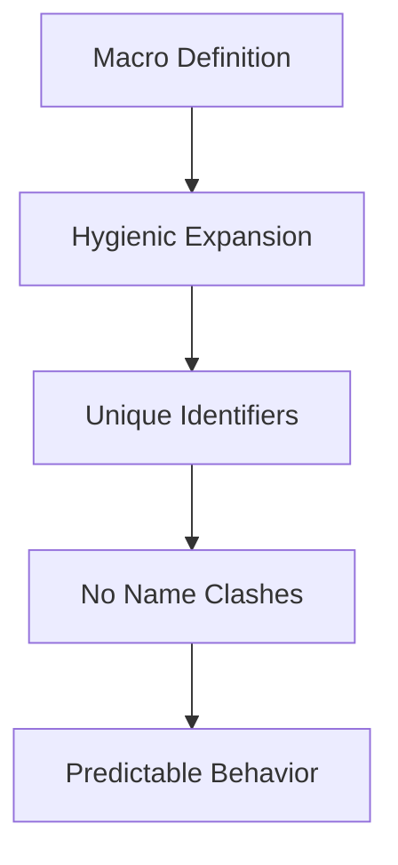

## 20.8. Macro Hygiene and Best Practices

In the world of Rust programming, macros are a powerful tool that allows developers to write code that writes other code. This metaprogramming capability can lead to more concise, efficient, and expressive code. However, with great power comes great responsibility. One of the key challenges when working with macros is ensuring that they do not introduce name conflicts or unexpected behaviors in the code. This is where the concept of macro hygiene comes into play.

### Understanding Macro Hygiene

Macro hygiene refers to the rules and practices that prevent macros from inadvertently capturing or interfering with identifiers in the surrounding code. Rust enforces macro hygiene to ensure that macros behave predictably and do not cause unintended side effects.

#### How Rust Enforces Macro Hygiene

Rust's macro system is designed to be hygienic by default. This means that when you define a macro, the identifiers within the macro are distinct from those in the surrounding code. Rust achieves this by using a technique called "hygienic macro expansion," which ensures that the names introduced by a macro do not clash with names in the code where the macro is used.

For example, consider the following macro definition:

```rust
macro_rules! create_function {
    ($func_name:ident) => {
        fn $func_name() {
            println!("This is a function named: {}", stringify!($func_name));
        }
    };
}

create_function!(hello);
hello();
```

In this example, the macro `create_function!` generates a function with the name provided as an argument. Thanks to Rust's hygienic macro system, the generated function name `hello` does not interfere with other identifiers in the code.

### Variable Capture and How to Prevent It

Variable capture occurs when a macro unintentionally captures a variable from its surrounding context, leading to unexpected behavior. This can happen if a macro uses an identifier that is also used in the code where the macro is invoked.

Consider the following example:

```rust
macro_rules! capture_example {
    () => {
        let x = 10;
        println!("Inside macro: x = {}", x);
    };
}

fn main() {
    let x = 5;
    capture_example!();
    println!("Outside macro: x = {}", x);
}
```

In this case, the macro `capture_example!` introduces a new variable `x` within its scope. However, if the macro were to inadvertently use an existing variable `x` from the surrounding context, it could lead to unexpected results.

#### Preventing Variable Capture

To prevent variable capture, follow these guidelines:

1. **Use Unique Identifiers**: When defining macros, use unique identifiers that are unlikely to clash with those in the surrounding code. This can be achieved by using prefixes or suffixes.

2. **Leverage Rust's Hygiene**: Trust Rust's hygienic macro system to handle most cases of variable capture. However, be mindful of the identifiers you introduce within macros.

3. **Explicitly Specify Paths**: Use the `::` syntax to access global paths and avoid capturing local variables. This ensures that the macro uses the intended identifiers.

### Guidelines for Writing Hygienic Macros

Writing hygienic macros requires careful consideration and adherence to best practices. Here are some guidelines to help you write macros that are safe and predictable:

#### 1. Use Descriptive Names

Choose descriptive names for macro variables and identifiers to reduce the likelihood of name clashes. This is especially important for macros that introduce new variables or functions.

```rust
macro_rules! add_prefix {
    ($prefix:expr, $name:ident) => {
        let prefixed_name = format!("{}_{}", $prefix, stringify!($name));
        println!("Prefixed name: {}", prefixed_name);
    };
}
```

#### 2. Avoid Using Common Identifiers

Avoid using common identifiers like `x`, `y`, or `temp` within macros, as these are more likely to clash with variables in the surrounding code.

#### 3. Use Scoping Constructs

Use scoping constructs like blocks or modules to limit the scope of identifiers introduced by macros. This helps prevent accidental capture of variables from the surrounding context.

```rust
macro_rules! scoped_macro {
    () => {
        {
            let scoped_var = 42;
            println!("Scoped variable: {}", scoped_var);
        }
    };
}
```

#### 4. Test Macros Thoroughly

Test macros thoroughly in different contexts to ensure they behave as expected and do not introduce name conflicts. Consider edge cases and scenarios where variable capture might occur.

### Techniques for Accessing Global Paths

When writing macros, you may need to access global paths to avoid capturing local variables. The `::` syntax allows you to specify global paths explicitly.

```rust
macro_rules! use_global {
    () => {
        ::std::println!("Using global println!");
    };
}

fn main() {
    use_global!();
}
```

In this example, the macro `use_global!` uses the global `println!` macro from the standard library, ensuring that it does not capture any local `println` functions.

### Predictable Macro Behavior

Predictable macro behavior is crucial for maintaining code readability and reliability. Here are some tips to ensure that your macros behave predictably:

1. **Document Macro Behavior**: Clearly document the behavior and purpose of your macros. This helps other developers understand how the macro works and what to expect when using it.

2. **Limit Side Effects**: Minimize side effects within macros to ensure that they do not alter the state of the program in unexpected ways.

3. **Use Macros Judiciously**: Use macros judiciously and only when they provide a clear benefit. Overuse of macros can lead to complex and hard-to-maintain code.

### Code Example: Writing a Hygienic Macro

Let's write a hygienic macro that calculates the square of a number. We'll ensure that the macro does not capture any variables from the surrounding context.

```rust
macro_rules! square {
    ($x:expr) => {
        {
            let result = $x * $x;
            result
        }
    };
}

fn main() {
    let num = 4;
    let squared = square!(num);
    println!("The square of {} is {}", num, squared);
}
```

In this example, the `square!` macro calculates the square of a given expression. The use of a block ensures that the variable `result` is scoped within the macro, preventing any capture of variables from the surrounding context.

### Try It Yourself

Now that we've explored macro hygiene and best practices, try modifying the `square!` macro to calculate the cube of a number. Experiment with different expressions and observe how the macro behaves.

### Visualizing Macro Hygiene

To better understand macro hygiene, let's visualize how Rust's hygienic macro system works using a diagram.



**Diagram Description**: This diagram illustrates the process of hygienic macro expansion in Rust. The macro definition undergoes hygienic expansion, resulting in unique identifiers that prevent name clashes and ensure predictable behavior.

### References and Further Reading

- [Rust Macros by Example](https://doc.rust-lang.org/book/ch19-06-macros.html)
- [Rust Reference: Macros](https://doc.rust-lang.org/reference/macros.html)
- [The Little Book of Rust Macros](https://danielkeep.github.io/tlborm/book/index.html)

### Knowledge Check

- What is macro hygiene, and why is it important in Rust?
- How does Rust's hygienic macro system prevent variable capture?
- What are some best practices for writing hygienic macros?
- How can you access global paths within a macro to avoid variable capture?
- Why is it important to document the behavior of macros?

### Embrace the Journey

Remember, mastering macros in Rust is a journey. As you continue to explore and experiment with macros, you'll gain a deeper understanding of their power and potential. Keep practicing, stay curious, and enjoy the process of writing clean, efficient, and hygienic macros!

## Quiz Time!



### What is macro hygiene in Rust?

- [x] A system that prevents macros from causing name conflicts or unexpected behaviors.
- [ ] A method for optimizing macro performance.
- [ ] A technique for writing macros in fewer lines of code.
- [ ] A way to ensure macros are compatible with all Rust versions.

> **Explanation:** Macro hygiene ensures that macros do not cause name conflicts or unexpected behaviors by using unique identifiers.

### How does Rust enforce macro hygiene?

- [x] By using hygienic macro expansion to create unique identifiers.
- [ ] By requiring macros to be written in a specific syntax.
- [ ] By limiting the number of macros in a program.
- [ ] By automatically testing macros for errors.

> **Explanation:** Rust uses hygienic macro expansion to ensure that identifiers within macros do not clash with those in the surrounding code.

### What is variable capture in the context of macros?

- [x] When a macro unintentionally captures a variable from its surrounding context.
- [ ] When a macro fails to compile due to syntax errors.
- [ ] When a macro is used in multiple places in a program.
- [ ] When a macro generates too much code.

> **Explanation:** Variable capture occurs when a macro unintentionally uses a variable from its surrounding context, leading to unexpected behavior.

### How can you prevent variable capture in macros?

- [x] Use unique identifiers and leverage Rust's hygienic macro system.
- [ ] Write macros in a separate file.
- [ ] Use only global variables in macros.
- [ ] Avoid using macros altogether.

> **Explanation:** Using unique identifiers and relying on Rust's hygienic macro system helps prevent variable capture.

### What is the purpose of using the `::` syntax in macros?

- [x] To access global paths and avoid capturing local variables.
- [ ] To define new macros within existing ones.
- [ ] To optimize the performance of macros.
- [ ] To ensure macros are compatible with older Rust versions.

> **Explanation:** The `::` syntax allows macros to access global paths, preventing the capture of local variables.

### Why is it important to document macro behavior?

- [x] To help other developers understand how the macro works and what to expect.
- [ ] To increase the performance of the macro.
- [ ] To ensure the macro is compatible with all Rust versions.
- [ ] To reduce the size of the macro code.

> **Explanation:** Documenting macro behavior helps other developers understand its purpose and expected behavior.

### What is a best practice for writing hygienic macros?

- [x] Use descriptive names and avoid common identifiers.
- [ ] Write macros in a separate module.
- [ ] Use as few lines of code as possible.
- [ ] Avoid using any variables in macros.

> **Explanation:** Using descriptive names and avoiding common identifiers reduces the likelihood of name clashes.

### How can you test macros thoroughly?

- [x] Test macros in different contexts and consider edge cases.
- [ ] Write macros in a separate file.
- [ ] Use only global variables in macros.
- [ ] Avoid using macros altogether.

> **Explanation:** Testing macros in different contexts and considering edge cases ensures they behave as expected.

### What is the benefit of using scoping constructs in macros?

- [x] To limit the scope of identifiers introduced by macros.
- [ ] To increase the performance of macros.
- [ ] To ensure macros are compatible with all Rust versions.
- [ ] To reduce the size of the macro code.

> **Explanation:** Scoping constructs help prevent accidental capture of variables from the surrounding context.

### True or False: Overuse of macros can lead to complex and hard-to-maintain code.

- [x] True
- [ ] False

> **Explanation:** Overuse of macros can make code complex and difficult to maintain, so they should be used judiciously.


