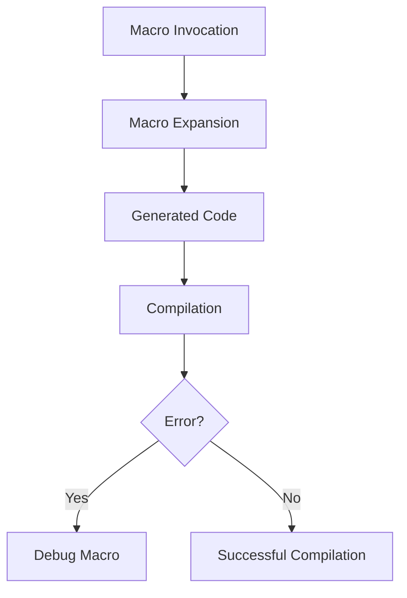

## 20.9. Debugging Macros

Macros in Rust are a powerful tool for metaprogramming, allowing developers to write code that writes code. However, debugging macros can be challenging due to their complexity and the way they transform code. In this section, we will explore techniques and best practices for debugging macros in Rust, helping you resolve issues and understand macro expansions effectively.

### Challenges Unique to Debugging Macros

Debugging macros in Rust presents unique challenges compared to debugging regular code. Here are some of the key challenges:

- **Complexity of Expansions**: Macros can expand into complex code, making it difficult to trace the source of errors.
- **Lack of Direct Debugging Tools**: Traditional debugging tools may not provide insights into macro expansions.
- **Error Messages**: Compiler error messages related to macros can be cryptic and hard to interpret.
- **Code Generation**: Understanding the generated code from macros requires a deep understanding of both the macro and the context in which it is used.

### Techniques for Debugging Macros

To effectively debug macros, you can use a combination of compiler flags, tools, and strategies. Let's explore these techniques in detail.

#### Using Compiler Flags

Rust provides several compiler flags that can help you inspect macro expansions and understand how they transform your code.

1. **`-Z macro-backtrace`**: This flag provides a backtrace of macro invocations leading to an error. It is particularly useful when you encounter an error in the expanded code and need to trace it back to the macro that caused it.

   ```bash
   rustc -Z macro-backtrace your_file.rs
   ```

2. **`--pretty=expanded`**: This flag allows you to view the expanded code generated by macros. It is an invaluable tool for understanding how macros transform your code.

   ```bash
   rustc --pretty=expanded your_file.rs
   ```

   **Example**: Consider a simple macro that generates a function.

   ```rust
   macro_rules! create_function {
       ($name:ident) => {
           fn $name() {
               println!("Function {} called", stringify!($name));
           }
       };
   }

   create_function!(foo);
   ```

   Using `--pretty=expanded`, you can see the expanded code:

   ```rust
   fn foo() {
       println!("Function {} called", "foo");
   }
   ```

#### Inspecting Macro Expansions

Understanding the expanded code is crucial for debugging macros. Here are some steps to inspect macro expansions effectively:

- **Use `cargo expand`**: The `cargo expand` command is a convenient way to view macro expansions in your project. It provides a detailed view of the expanded code, making it easier to identify issues.

  ```bash
  cargo install cargo-expand
  cargo expand
  ```

- **Analyze the Expanded Code**: Once you have the expanded code, analyze it to identify any discrepancies or errors. Look for unexpected transformations or missing elements that could cause issues.

#### Tools and IDE Support

Several tools and IDEs offer support for debugging macros in Rust. Here are some that can enhance your debugging experience:

- **Rust Analyzer**: Rust Analyzer is an IDE plugin that provides features like code completion, inline documentation, and macro expansion previews. It can help you understand how macros transform your code directly within your editor.

- **IntelliJ Rust**: The IntelliJ Rust plugin offers similar features, including macro expansion previews and error highlighting. It integrates seamlessly with IntelliJ IDEA, providing a robust environment for Rust development.

#### Strategies for Writing Test Cases for Macros

Testing macros is an essential part of ensuring their correctness and reliability. Here are some strategies for writing effective test cases for macros:

- **Use `#[test]` Functions**: Write test functions that use the macro and verify the expected behavior. This approach allows you to test the macro in isolation and ensure it produces the correct output.

  ```rust
  #[cfg(test)]
  mod tests {
      use super::*;

      create_function!(test_func);

      #[test]
      fn test_macro_output() {
          test_func(); // Verify the output manually or use assertions
      }
  }
  ```

- **Test Edge Cases**: Consider edge cases and unusual inputs that could cause the macro to behave unexpectedly. Write test cases to cover these scenarios and ensure the macro handles them gracefully.

- **Use Compile-Fail Tests**: For macros that should produce compile-time errors under certain conditions, use compile-fail tests to verify that the errors are generated as expected.

### Visualizing Macro Expansions

To further aid in understanding macro expansions, we can use diagrams to visualize the transformation process. Below is a simple flowchart representing the macro expansion process.



**Diagram Description**: This flowchart illustrates the process of macro expansion in Rust. The macro invocation leads to macro expansion, generating code that is then compiled. If errors occur, debugging the macro is necessary; otherwise, the compilation is successful.

### Knowledge Check

Before we conclude, let's reinforce our understanding with a few questions:

- What are the key challenges in debugging macros in Rust?
- How can the `-Z macro-backtrace` flag help in debugging macros?
- What is the purpose of the `--pretty=expanded` flag?
- How can tools like Rust Analyzer aid in debugging macros?
- What strategies can you use to write test cases for macros?

### Embrace the Journey

Debugging macros in Rust can be a challenging but rewarding experience. By understanding the techniques and tools available, you can effectively resolve issues and harness the full power of macros in your Rust projects. Remember, this is just the beginning. As you continue to explore Rust's metaprogramming capabilities, you'll gain deeper insights and develop more sophisticated macros. Keep experimenting, stay curious, and enjoy the journey!

### References and Links

- [Rust Reference: Macros](https://doc.rust-lang.org/reference/macros.html)
- [Rust Compiler Flags](https://doc.rust-lang.org/rustc/command-line-arguments.html)
- [Cargo Expand](https://github.com/dtolnay/cargo-expand)
- [Rust Analyzer](https://rust-analyzer.github.io/)
- [IntelliJ Rust Plugin](https://www.jetbrains.com/rust/)

## Quiz Time!



### What is a key challenge in debugging macros in Rust?

- [x] Complexity of expansions
- [ ] Lack of syntax highlighting
- [ ] Limited IDE support
- [ ] Absence of compiler flags

> **Explanation:** The complexity of expansions is a key challenge because macros can generate complex code that is difficult to trace.

### Which compiler flag provides a backtrace of macro invocations?

- [x] `-Z macro-backtrace`
- [ ] `--pretty=expanded`
- [ ] `-Z macro-trace`
- [ ] `--show-macros`

> **Explanation:** The `-Z macro-backtrace` flag provides a backtrace of macro invocations leading to an error.

### What does the `--pretty=expanded` flag do?

- [x] Shows the expanded code generated by macros
- [ ] Highlights syntax errors in macros
- [ ] Provides a backtrace of macro invocations
- [ ] Compiles macros separately

> **Explanation:** The `--pretty=expanded` flag shows the expanded code generated by macros, helping developers understand transformations.

### Which tool can be used to view macro expansions in a Rust project?

- [x] `cargo expand`
- [ ] `cargo test`
- [ ] `cargo build`
- [ ] `cargo run`

> **Explanation:** `cargo expand` is a tool that allows you to view macro expansions in a Rust project.

### What is a strategy for testing macros?

- [x] Use `#[test]` functions
- [ ] Write macros in separate files
- [ ] Avoid using macros in tests
- [ ] Use macros only in production code

> **Explanation:** Using `#[test]` functions is a strategy for testing macros by verifying their expected behavior.

### How can Rust Analyzer aid in debugging macros?

- [x] By providing macro expansion previews
- [ ] By compiling macros separately
- [ ] By generating test cases for macros
- [ ] By highlighting syntax errors

> **Explanation:** Rust Analyzer aids in debugging macros by providing macro expansion previews directly within the editor.

### What is an advantage of using compile-fail tests for macros?

- [x] Verifying that macros produce expected compile-time errors
- [ ] Ensuring macros run faster
- [ ] Simplifying macro syntax
- [ ] Reducing code size

> **Explanation:** Compile-fail tests are used to verify that macros produce expected compile-time errors under certain conditions.

### What does the `cargo expand` command do?

- [x] Displays the expanded code of macros
- [ ] Runs tests for macros
- [ ] Compiles macros separately
- [ ] Optimizes macro performance

> **Explanation:** The `cargo expand` command displays the expanded code of macros, helping developers understand transformations.

### True or False: Macros in Rust can generate complex code that is difficult to trace.

- [x] True
- [ ] False

> **Explanation:** True. Macros can generate complex code, making it challenging to trace the source of errors.

### What is the purpose of using diagrams in debugging macros?

- [x] To visualize the macro expansion process
- [ ] To replace code comments
- [ ] To simplify macro syntax
- [ ] To generate test cases

> **Explanation:** Diagrams are used to visualize the macro expansion process, aiding in understanding transformations.


