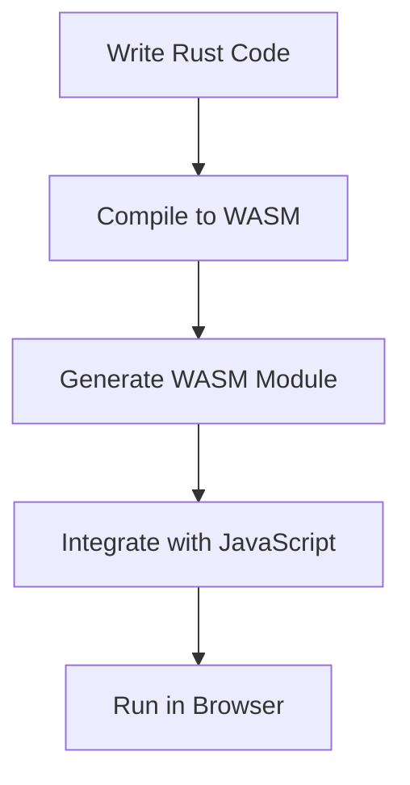

## 21.1. WebAssembly (WASM) and Rust

### Introduction to WebAssembly (WASM)

WebAssembly (WASM) is a binary instruction format for a stack-based virtual machine. It is designed to be a portable compilation target for programming languages, enabling high-performance applications to run on the web. WASM is a game-changer in web development, allowing developers to run code written in languages like C, C++, and Rust at near-native speed in the browser. This capability opens up new possibilities for web applications, including complex games, data visualization tools, and performance-critical applications.

#### Significance of WebAssembly

WebAssembly is significant because it bridges the gap between native applications and web applications. It provides a way to execute code at near-native speed, which is crucial for applications that require intensive computation or real-time processing. WASM is also designed to be safe and sandboxed, ensuring that it runs securely within the web environment.

### Rust and WebAssembly: A Perfect Match

Rust is a systems programming language known for its safety, speed, and concurrency. It is particularly well-suited for compiling to WebAssembly due to its focus on performance and memory safety. Rust's ownership model ensures that memory is managed safely without a garbage collector, which aligns perfectly with the goals of WebAssembly.

#### Benefits of Using Rust for WASM

1. **Performance**: Rust's zero-cost abstractions and efficient memory management make it ideal for performance-critical applications.
2. **Safety**: Rust's strong type system and ownership model prevent many common bugs, such as null pointer dereferencing and buffer overflows.
3. **Concurrency**: Rust's concurrency model allows developers to write safe concurrent code, which is essential for high-performance applications.
4. **Interoperability**: Rust can easily interoperate with JavaScript, allowing developers to leverage existing JavaScript libraries and frameworks.

### Compiling Rust to WebAssembly

To compile Rust code to WebAssembly, you need to set up a Rust project with the appropriate target. The Rust toolchain provides a `wasm32-unknown-unknown` target for compiling to WebAssembly. Let's walk through the process of creating a simple Rust application that compiles to WASM and runs in the browser.

#### Setting Up the Environment

First, ensure you have the Rust toolchain installed. You can install the WebAssembly target using the following command:

```bash
rustup target add wasm32-unknown-unknown
```

#### Creating a Rust Project

Create a new Rust project using Cargo, Rust's package manager and build system:

```bash
cargo new wasm_example
cd wasm_example
```

#### Writing Rust Code

Let's write a simple Rust function that adds two numbers:

```rust
// src/lib.rs

#[no_mangle]
pub extern "C" fn add(a: i32, b: i32) -> i32 {
    a + b
}
```

The `#[no_mangle]` attribute prevents Rust from changing the function name during compilation, ensuring it can be called from JavaScript.

#### Building the Project

Build the project for the WebAssembly target:

```bash
cargo build --target wasm32-unknown-unknown --release
```

This command generates a `.wasm` file in the `target/wasm32-unknown-unknown/release` directory.

### Tools for Rust and WASM Development

Several tools facilitate the development of Rust applications that compile to WebAssembly. Two of the most popular tools are `wasm-pack` and `wasm-bindgen`.

#### wasm-pack

`wasm-pack` is a tool that streamlines the process of compiling Rust to WebAssembly and packaging it for use in JavaScript applications. It automates many of the steps involved in building, testing, and publishing WASM modules.

To install `wasm-pack`, run:

```bash
cargo install wasm-pack
```

You can then use `wasm-pack` to build your project:

```bash
wasm-pack build
```

This command generates a package that can be easily integrated into JavaScript applications.

#### wasm-bindgen

`wasm-bindgen` is a library and CLI tool that facilitates communication between Rust and JavaScript. It allows Rust code to call JavaScript functions and vice versa, making it easier to integrate Rust and JavaScript codebases.

To use `wasm-bindgen`, add it as a dependency in your `Cargo.toml`:

```toml
[dependencies]
wasm-bindgen = "0.2"
```

Then, use `wasm-bindgen` to annotate Rust functions that should be exposed to JavaScript:

```rust
use wasm_bindgen::prelude::*;

#[wasm_bindgen]
pub fn greet(name: &str) -> String {
    format!("Hello, {}!", name)
}
```

### Running Rust WASM in the Browser

To run Rust-generated WebAssembly in the browser, you need to set up an HTML and JavaScript environment that loads and executes the WASM module.

#### HTML and JavaScript Setup

Create an `index.html` file:

```html
<!DOCTYPE html>
<html lang="en">
<head>
    <meta charset="UTF-8">
    <meta name="viewport" content="width=device-width, initial-scale=1.0">
    <title>Rust WASM Example</title>
</head>
<body>
    <h1>Rust and WebAssembly</h1>
    <button id="greet">Greet</button>
    <script type="module">
        import init, { greet } from './pkg/wasm_example.js';

        async function run() {
            await init();
            document.getElementById('greet').addEventListener('click', () => {
                alert(greet('World'));
            });
        }

        run();
    </script>
</body>
</html>
```

This HTML file imports the JavaScript module generated by `wasm-pack` and sets up an event listener to call the `greet` function when the button is clicked.

### Use Cases for Rust and WASM

Rust and WebAssembly can be effectively applied in various scenarios, including:

1. **Browser-Based Games**: High-performance games that require fast execution and low latency.
2. **Visualization Tools**: Applications that render complex graphics or process large datasets.
3. **Performance-Critical Applications**: Applications that require intensive computation, such as image processing or scientific simulations.

### Interoperability with JavaScript

One of the key features of WebAssembly is its ability to interoperate with JavaScript. This interoperability allows developers to leverage existing JavaScript libraries and frameworks while writing performance-critical code in Rust.

#### Handling Data Between Rust and JavaScript

Data can be passed between Rust and JavaScript using `wasm-bindgen`. For example, you can pass strings, numbers, and arrays between the two languages. Here's an example of passing an array from JavaScript to Rust:

```rust
use wasm_bindgen::prelude::*;

#[wasm_bindgen]
pub fn sum_array(arr: &[i32]) -> i32 {
    arr.iter().sum()
}
```

In JavaScript, you can call this function with an array:

```javascript
import init, { sum_array } from './pkg/wasm_example.js';

async function run() {
    await init();
    const result = sum_array(new Int32Array([1, 2, 3, 4, 5]));
    console.log(`Sum: ${result}`);
}

run();
```

### Visualizing Rust and WASM Interaction

To better understand the interaction between Rust and WebAssembly, let's visualize the process using a flowchart.



**Figure 1**: The process of compiling Rust to WebAssembly and running it in the browser.

### Conclusion

WebAssembly and Rust together provide a powerful platform for building high-performance web applications. By leveraging Rust's safety and performance features, developers can create applications that run efficiently in the browser. Tools like `wasm-pack` and `wasm-bindgen` simplify the development process, making it easier to integrate Rust and JavaScript codebases.

### Embrace the Journey

Remember, this is just the beginning. As you progress, you'll build more complex and interactive web applications. Keep experimenting, stay curious, and enjoy the journey!

### References and Links

- [WebAssembly Official Site](https://webassembly.org/)
- [wasm-pack Documentation](https://rustwasm.github.io/wasm-pack/)
- [wasm-bindgen Documentation](https://rustwasm.github.io/wasm-bindgen/)
- [MDN WebAssembly Guide](https://developer.mozilla.org/en-US/docs/WebAssembly)

## Quiz Time!



### What is WebAssembly (WASM)?

- [x] A binary instruction format for a stack-based virtual machine
- [ ] A JavaScript framework for building web applications
- [ ] A Rust library for web development
- [ ] A tool for compiling JavaScript to native code

> **Explanation:** WebAssembly is a binary instruction format designed for a stack-based virtual machine, enabling high-performance applications to run on the web.

### Why is Rust well-suited for compiling to WebAssembly?

- [x] Rust's performance and memory safety features
- [ ] Rust's garbage collection capabilities
- [ ] Rust's dynamic typing system
- [ ] Rust's built-in web server

> **Explanation:** Rust's performance and memory safety features make it ideal for compiling to WebAssembly, as it ensures efficient and safe execution.

### Which tool is used to streamline the process of compiling Rust to WebAssembly?

- [x] wasm-pack
- [ ] cargo
- [ ] npm
- [ ] webpack

> **Explanation:** wasm-pack is a tool that streamlines the process of compiling Rust to WebAssembly and packaging it for use in JavaScript applications.

### What is the role of wasm-bindgen in Rust and WebAssembly development?

- [x] Facilitates communication between Rust and JavaScript
- [ ] Compiles Rust code to JavaScript
- [ ] Provides a web server for Rust applications
- [ ] Manages Rust dependencies

> **Explanation:** wasm-bindgen facilitates communication between Rust and JavaScript, allowing functions to be called across the two languages.

### How can you pass an array from JavaScript to Rust using wasm-bindgen?

- [x] By using an Int32Array in JavaScript
- [ ] By converting the array to a string
- [ ] By using JSON.stringify
- [ ] By using a JavaScript object

> **Explanation:** You can pass an array from JavaScript to Rust using an Int32Array, which is compatible with Rust's array handling.

### What is a common use case for Rust and WebAssembly?

- [x] Browser-based games
- [ ] Static web pages
- [ ] Server-side rendering
- [ ] Database management

> **Explanation:** Browser-based games are a common use case for Rust and WebAssembly due to their performance requirements.

### Which Rust attribute prevents function name mangling during compilation?

- [x] #[no_mangle]
- [ ] #[inline]
- [ ] #[derive]
- [ ] #[cfg]

> **Explanation:** The #[no_mangle] attribute prevents Rust from changing the function name during compilation, ensuring it can be called from JavaScript.

### What is the primary benefit of using WebAssembly in web applications?

- [x] Near-native execution speed
- [ ] Easier debugging
- [ ] Simplified code structure
- [ ] Reduced file size

> **Explanation:** The primary benefit of using WebAssembly is its ability to execute code at near-native speed, which is crucial for performance-critical applications.

### True or False: WebAssembly allows running code written in languages like C, C++, and Rust at near-native speed in the browser.

- [x] True
- [ ] False

> **Explanation:** True. WebAssembly allows running code written in languages like C, C++, and Rust at near-native speed in the browser.

### Which command adds the WebAssembly target to the Rust toolchain?

- [x] rustup target add wasm32-unknown-unknown
- [ ] cargo install wasm-pack
- [ ] rustc --target wasm32
- [ ] cargo build --wasm

> **Explanation:** The command rustup target add wasm32-unknown-unknown adds the WebAssembly target to the Rust toolchain.


