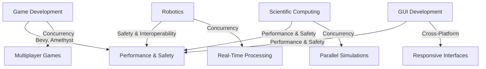

## 21.10. Rust in Unconventional Domains: Game Development and Beyond

Rust, known for its safety and performance, is making waves in domains traditionally dominated by other languages. This section explores Rust's application in unconventional areas like game development, robotics, scientific computing, and GUI development. We'll delve into how Rust's features benefit these domains, examine challenges, and highlight success stories.

### Rust in Game Development

Game development is a domain where performance and safety are paramount. Rust's memory safety without a garbage collector and its ability to produce highly performant code make it an attractive choice for game developers.

#### Benefits of Rust in Game Development

1. **Memory Safety**: Rust's ownership model ensures memory safety, preventing common bugs like null pointer dereferencing and buffer overflows.
2. **Concurrency**: Rust's concurrency model allows developers to write safe concurrent code, crucial for modern games that require parallel processing.
3. **Performance**: Rust's performance is comparable to C++, making it suitable for resource-intensive applications like games.

#### Game Engines in Rust

Several game engines have emerged in the Rust ecosystem, providing developers with powerful tools to create games.

##### Bevy Game Engine

[Bevy](https://bevyengine.org/) is a data-driven game engine built in Rust. It emphasizes modularity and simplicity, making it easy to use and extend.

- **ECS Architecture**: Bevy uses an Entity-Component-System (ECS) architecture, which decouples data from behavior, allowing for flexible and efficient game design.
- **Cross-Platform**: Bevy supports multiple platforms, including Windows, macOS, Linux, and WebAssembly.
- **Extensibility**: Bevy's modular design allows developers to add custom functionality easily.

```rust
// A simple Bevy application
use bevy::prelude::*;

fn main() {
    App::build()
        .add_plugins(DefaultPlugins)
        .add_startup_system(setup.system())
        .run();
}

fn setup(mut commands: Commands) {
    commands.spawn_bundle(OrthographicCameraBundle::new_2d());
    commands.spawn_bundle(SpriteBundle {
        sprite: Sprite {
            color: Color::rgb(0.25, 0.75, 0.75),
            ..Default::default()
        },
        ..Default::default()
    });
}
```

> **Try It Yourself**: Modify the color values in the `Sprite` to see how it affects the rendered sprite.

##### Amethyst Game Engine

[Amethyst](https://amethyst.rs/) is another popular game engine in Rust, known for its flexibility and power.

- **ECS and Data-Oriented Design**: Amethyst also uses ECS, promoting a data-oriented design that improves performance and scalability.
- **Networking**: Amethyst provides built-in support for networking, making it easier to develop multiplayer games.
- **Tooling**: Amethyst offers a suite of tools for asset management, scripting, and more.

```rust
// A basic Amethyst application
use amethyst::{
    prelude::*,
    renderer::{
        plugins::{RenderFlat2D, RenderToWindow},
        types::DefaultBackend,
        RenderingBundle,
    },
    utils::application_root_dir,
};

fn main() -> amethyst::Result<()> {
    let app_root = application_root_dir()?;
    let display_config_path = app_root.join("config/display.ron");

    let game_data = GameDataBuilder::default()
        .with_bundle(
            RenderingBundle::<DefaultBackend>::new()
                .with_plugin(RenderToWindow::from_config_path(display_config_path)?)
                .with_plugin(RenderFlat2D::default()),
        )?;

    let mut game = Application::new(app_root, ExampleState, game_data)?;
    game.run();

    Ok(())
}

struct ExampleState;

impl SimpleState for ExampleState {}
```

> **Try It Yourself**: Experiment with different rendering plugins to see how they affect the game's graphics.

#### Challenges in Game Development with Rust

1. **Learning Curve**: Rust's strict compiler can be challenging for newcomers, but it ensures code safety and reliability.
2. **Ecosystem Maturity**: While growing, Rust's game development ecosystem is not as mature as C++ or Unity, requiring developers to sometimes build custom solutions.

#### Success Stories

- **Embark Studios**: Embark Studios uses Rust for game development, leveraging its safety and performance to build scalable and reliable games.
- **Veloren**: An open-world multiplayer voxel RPG built with Rust, showcasing the language's capability in handling complex game logic and networking.

### Rust in Robotics

Robotics is another domain where Rust's safety and performance shine. The language's ability to handle low-level hardware interactions safely makes it ideal for robotics applications.

#### Benefits of Rust in Robotics

1. **Safety**: Rust's safety guarantees prevent common bugs that can lead to hardware malfunctions.
2. **Concurrency**: Robotics applications often require concurrent processing, which Rust handles efficiently.
3. **Interoperability**: Rust's Foreign Function Interface (FFI) allows seamless integration with C libraries, common in robotics.

#### Challenges in Robotics with Rust

1. **Hardware Support**: While growing, Rust's support for various hardware platforms is still developing.
2. **Community and Resources**: The robotics community in Rust is smaller compared to other languages, but it's rapidly expanding.

#### Success Stories

- **TockOS**: An operating system for embedded systems and IoT devices, written in Rust, demonstrating its applicability in robotics.
- **Robotics Operating System (ROS) 2**: Rust is being explored as a language for ROS 2, highlighting its potential in robotics.

### Rust in Scientific Computing

Scientific computing requires high performance and precision, areas where Rust excels.

#### Benefits of Rust in Scientific Computing

1. **Performance**: Rust's performance is on par with C and Fortran, traditional languages in scientific computing.
2. **Safety**: Rust's safety features prevent bugs that can lead to incorrect computations.
3. **Concurrency**: Rust's concurrency model allows for efficient parallel processing, crucial for scientific simulations.

#### Challenges in Scientific Computing with Rust

1. **Library Support**: While growing, Rust's library ecosystem for scientific computing is not as extensive as Python or MATLAB.
2. **Community**: The scientific computing community in Rust is smaller but growing, with increasing contributions from academia and industry.

#### Success Stories

- **SciRust**: A scientific computing library in Rust, providing tools for linear algebra, statistics, and more.
- **Rust-Bio**: A bioinformatics library in Rust, showcasing its applicability in scientific research.

### Rust in GUI Development

GUI development is another unconventional domain where Rust is making inroads.

#### Benefits of Rust in GUI Development

1. **Performance**: Rust's performance ensures smooth and responsive user interfaces.
2. **Safety**: Rust's safety guarantees prevent common bugs that can lead to application crashes.
3. **Cross-Platform**: Rust's cross-platform capabilities allow developers to build GUIs for multiple operating systems.

#### Challenges in GUI Development with Rust

1. **Library Support**: While growing, Rust's GUI library ecosystem is not as mature as JavaScript or C#.
2. **Community**: The GUI development community in Rust is smaller but expanding, with increasing contributions from developers.

#### Success Stories

- **Druid**: A data-first Rust-native UI toolkit, demonstrating Rust's capability in building modern GUIs.
- **Tauri**: A toolkit for building cross-platform desktop applications with Rust, showcasing its versatility in GUI development.

### Conclusion

Rust is proving its versatility in unconventional domains like game development, robotics, scientific computing, and GUI development. Its safety, performance, and concurrency features make it an attractive choice for developers looking to build reliable and efficient applications. While challenges exist, the growing community and ecosystem are paving the way for Rust's adoption in these areas.

### Visualizing Rust's Impact

Let's visualize Rust's impact across these domains using a simple diagram:



> **Diagram Explanation**: This diagram illustrates how Rust's core features benefit various unconventional domains, highlighting its versatility and impact.

### Embrace the Journey

Remember, this is just the beginning. As you explore Rust in these unconventional domains, you'll discover new possibilities and challenges. Keep experimenting, stay curious, and enjoy the journey!

## Quiz Time!



### What is a key benefit of using Rust in game development?

- [x] Memory safety without a garbage collector
- [ ] Built-in game engine support
- [ ] Automatic UI generation
- [ ] Native support for VR

> **Explanation:** Rust's memory safety without a garbage collector is a significant advantage in game development, preventing common bugs.

### Which game engine uses an Entity-Component-System architecture?

- [x] Bevy
- [x] Amethyst
- [ ] Unity
- [ ] Unreal Engine

> **Explanation:** Both Bevy and Amethyst use an Entity-Component-System architecture, promoting flexible and efficient game design.

### What is a challenge faced when using Rust in robotics?

- [x] Hardware support
- [ ] Lack of concurrency support
- [ ] Poor performance
- [ ] Inability to interface with C libraries

> **Explanation:** Hardware support is a challenge in robotics with Rust, as the ecosystem is still developing.

### Which Rust library is used for scientific computing?

- [x] SciRust
- [ ] NumPy
- [ ] TensorFlow
- [ ] PyTorch

> **Explanation:** SciRust is a library for scientific computing in Rust, providing tools for linear algebra and statistics.

### What is a benefit of using Rust in GUI development?

- [x] Performance
- [x] Safety
- [ ] Built-in GUI designer
- [ ] Automatic cross-platform deployment

> **Explanation:** Rust's performance and safety are key benefits in GUI development, ensuring smooth and reliable interfaces.

### Which toolkit is used for building cross-platform desktop applications with Rust?

- [x] Tauri
- [ ] Electron
- [ ] Qt
- [ ] GTK

> **Explanation:** Tauri is a toolkit for building cross-platform desktop applications with Rust, showcasing its versatility.

### What is a challenge in scientific computing with Rust?

- [x] Library support
- [ ] Lack of concurrency
- [ ] Poor performance
- [ ] Inability to handle large datasets

> **Explanation:** Library support is a challenge in scientific computing with Rust, as the ecosystem is still growing.

### Which domain benefits from Rust's concurrency model?

- [x] Game Development
- [x] Robotics
- [x] Scientific Computing
- [ ] None of the above

> **Explanation:** Rust's concurrency model benefits game development, robotics, and scientific computing, allowing for efficient parallel processing.

### What is a success story in Rust's application in game development?

- [x] Veloren
- [ ] Minecraft
- [ ] Fortnite
- [ ] Call of Duty

> **Explanation:** Veloren is a success story in Rust's application in game development, showcasing its capability in handling complex game logic.

### Rust's safety features prevent which common bug?

- [x] Null pointer dereferencing
- [ ] Syntax errors
- [ ] Compilation errors
- [ ] Network latency

> **Explanation:** Rust's safety features prevent null pointer dereferencing, a common bug in many programming languages.




