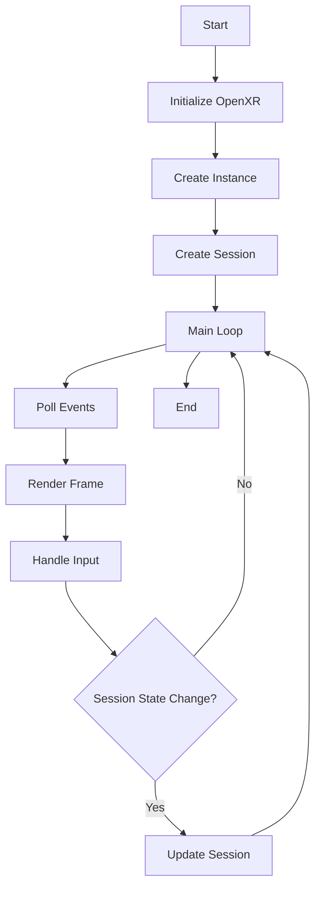

## 21.12. Rust in Augmented and Virtual Reality

Augmented Reality (AR) and Virtual Reality (VR) are transformative technologies reshaping how we interact with digital content. These technologies require immense computational power and precision, making performance and safety paramount. Rust, with its unique features, offers compelling advantages for AR/VR development. In this section, we will explore Rust's role in AR/VR, discuss its benefits, and examine the tools and frameworks that support AR/VR development in Rust.

### Introduction to AR and VR Technologies

**Augmented Reality (AR)** overlays digital information onto the real world, enhancing the user's perception of their environment. **Virtual Reality (VR)**, on the other hand, immerses users in a fully digital environment, often requiring specialized hardware like VR headsets.

Both AR and VR demand high-performance computing to render complex graphics in real-time, handle user inputs, and maintain a seamless experience. These requirements pose significant challenges, particularly in terms of latency, rendering speed, and cross-platform compatibility.

### Rust's Performance Benefits in AR/VR

Rust is renowned for its performance and safety, making it an excellent choice for AR/VR development. Here are some key benefits:

- **Memory Safety**: Rust's ownership model ensures memory safety without a garbage collector, reducing latency and improving performance.
- **Concurrency**: Rust's concurrency model allows developers to write safe concurrent code, crucial for handling multiple inputs and rendering tasks simultaneously.
- **Zero-Cost Abstractions**: Rust's abstractions do not incur runtime overhead, allowing developers to write high-level code without sacrificing performance.

### Rust in AR/VR Projects

Several projects have successfully leveraged Rust for AR/VR development. For instance, the [Bevy game engine](https://bevyengine.org/) is a popular choice for building interactive 3D applications, including AR/VR experiences. Bevy's ECS (Entity Component System) architecture, combined with Rust's performance, makes it ideal for real-time applications.

Another example is the [Amethyst game engine](https://amethyst.rs/), which, although now deprecated, laid the groundwork for Rust in game development and inspired other projects.

### Frameworks and Libraries for AR/VR in Rust

Rust's ecosystem includes several frameworks and libraries that facilitate AR/VR development:

- **`glium`**: An OpenGL wrapper for Rust, `glium` provides a safe and high-level interface for OpenGL, making it easier to render complex graphics. [Explore `glium` on crates.io](https://crates.io/crates/glium).

- **OpenXR Bindings**: The [Rust OpenXR bindings](https://github.com/Ralith/openxrs) provide access to the OpenXR API, a standard for VR and AR applications. These bindings enable developers to create cross-platform AR/VR applications with Rust.

- **`winit`**: A window handling library that supports event-driven programming, crucial for handling user inputs in AR/VR applications.

- **`nalgebra`**: A linear algebra library for Rust, `nalgebra` is essential for 3D graphics and physics calculations in AR/VR.

### Challenges in AR/VR Development with Rust

Despite its advantages, Rust faces several challenges in AR/VR development:

- **Rendering**: Real-time rendering in AR/VR is demanding, requiring efficient use of graphics APIs like OpenGL or Vulkan. Rust's ecosystem is still maturing in this area, with ongoing efforts to improve support for these APIs.

- **Input Handling**: AR/VR applications must handle a wide range of inputs, from motion controllers to eye-tracking. Rust's type system can help manage these inputs safely, but developers must carefully design their systems to accommodate diverse input methods.

- **Cross-Platform Support**: AR/VR applications often need to run on multiple platforms, from desktop PCs to mobile devices. Rust's cross-platform capabilities are strong, but developers must still navigate platform-specific challenges, such as different hardware capabilities and operating system APIs.

### Future Prospects of Rust in AR/VR Development

The future of Rust in AR/VR development is promising. As the ecosystem matures, we can expect:

- **Improved Tooling**: Continued development of tools and libraries will make Rust more accessible for AR/VR developers, reducing the learning curve and increasing productivity.

- **Broader Adoption**: As more developers recognize Rust's benefits, we can expect broader adoption in the AR/VR industry, leading to more robust and performant applications.

- **Innovative Applications**: Rust's safety and performance will enable the creation of innovative AR/VR applications that push the boundaries of what's possible, from immersive educational experiences to cutting-edge entertainment.

### Code Example: Basic OpenXR Application in Rust

Let's explore a simple example of using Rust with OpenXR to create a basic VR application. This example demonstrates setting up an OpenXR instance and session.

```rust
use openxr as xr;
use std::ffi::CString;

fn main() -> Result<(), xr::sys::Result> {
    // Create an OpenXR instance
    let entry = xr::Entry::linked();
    let app_info = xr::ApplicationInfo {
        application_name: CString::new("Rust VR App").unwrap(),
        application_version: 1,
        engine_name: CString::new("Rust Engine").unwrap(),
        engine_version: 1,
    };
    let instance = entry.create_instance(&app_info, &[])?;

    // Create a session
    let system = instance.system(xr::FormFactor::HEAD_MOUNTED_DISPLAY)?;
    let session = instance.create_session(system, &xr::GraphicsBinding::None)?;

    println!("OpenXR session created successfully!");

    // Main loop (simplified)
    loop {
        // Poll events and handle input
        // Render frames
        // Handle session state changes
    }

    Ok(())
}
```

**Explanation**:
- We start by creating an OpenXR instance using the `openxr` crate.
- We define application and engine information using `xr::ApplicationInfo`.
- We create a session for a head-mounted display (HMD), which is common in VR applications.
- The main loop would typically handle events, render frames, and manage session state changes.

### Try It Yourself

Experiment with the code example by modifying the application and engine names, or by adding additional functionality such as rendering a simple 3D object or handling user input.

### Visualizing Rust's Role in AR/VR

To better understand Rust's role in AR/VR development, let's visualize the typical workflow of an AR/VR application using Rust.



**Diagram Explanation**:
- The diagram illustrates the typical flow of an AR/VR application using Rust and OpenXR.
- The process begins with initializing OpenXR and creating an instance and session.
- The main loop handles events, renders frames, and manages session state changes.

### References and Links

- [OpenXR Specification](https://www.khronos.org/openxr/)
- [Rust OpenXR Bindings](https://github.com/Ralith/openxrs)
- [Bevy Game Engine](https://bevyengine.org/)
- [glium on crates.io](https://crates.io/crates/glium)

### Knowledge Check

- What are the key benefits of using Rust for AR/VR development?
- How does Rust's ownership model contribute to memory safety in AR/VR applications?
- What are some challenges developers face when using Rust for AR/VR development?

### Embrace the Journey

Remember, this is just the beginning. As you explore Rust's potential in AR/VR development, you'll discover new possibilities and challenges. Keep experimenting, stay curious, and enjoy the journey!

## Quiz Time!



### What is a key advantage of using Rust for AR/VR development?

- [x] Memory safety without garbage collection
- [ ] Built-in support for VR headsets
- [ ] Automatic cross-platform compatibility
- [ ] Native support for all AR/VR hardware

> **Explanation:** Rust's ownership model ensures memory safety without the need for a garbage collector, which is crucial for performance in AR/VR applications.

### Which Rust library provides a safe interface for OpenGL?

- [x] `glium`
- [ ] `nalgebra`
- [ ] `winit`
- [ ] `openxrs`

> **Explanation:** `glium` is an OpenGL wrapper for Rust, providing a safe and high-level interface for OpenGL.

### What is the purpose of the Rust OpenXR bindings?

- [x] To provide access to the OpenXR API for AR/VR applications
- [ ] To create 2D graphics in Rust
- [ ] To handle network communication in Rust
- [ ] To manage file I/O in Rust

> **Explanation:** The Rust OpenXR bindings provide access to the OpenXR API, enabling developers to create cross-platform AR/VR applications.

### What is a common challenge in AR/VR development with Rust?

- [x] Real-time rendering
- [ ] Lack of concurrency support
- [ ] Poor memory management
- [ ] Limited input handling

> **Explanation:** Real-time rendering is a demanding task in AR/VR development, requiring efficient use of graphics APIs.

### Which library is essential for 3D graphics and physics calculations in Rust?

- [x] `nalgebra`
- [ ] `glium`
- [ ] `winit`
- [ ] `openxrs`

> **Explanation:** `nalgebra` is a linear algebra library for Rust, essential for 3D graphics and physics calculations.

### What does the main loop in an AR/VR application typically handle?

- [x] Events, rendering, and session state changes
- [ ] File I/O and network communication
- [ ] Memory allocation and deallocation
- [ ] Database queries and updates

> **Explanation:** The main loop in an AR/VR application typically handles events, rendering, and session state changes.

### What is a future prospect of Rust in AR/VR development?

- [x] Improved tooling and broader adoption
- [ ] Built-in support for all AR/VR hardware
- [ ] Automatic performance optimization
- [ ] Elimination of all rendering challenges

> **Explanation:** As the Rust ecosystem matures, we can expect improved tooling and broader adoption in the AR/VR industry.

### Which game engine is popular for building interactive 3D applications in Rust?

- [x] Bevy
- [ ] Unity
- [ ] Unreal Engine
- [ ] Godot

> **Explanation:** The Bevy game engine is popular for building interactive 3D applications, including AR/VR experiences, in Rust.

### True or False: Rust's abstractions incur significant runtime overhead.

- [x] False
- [ ] True

> **Explanation:** Rust's abstractions are zero-cost, meaning they do not incur runtime overhead.

### What is a typical use case for the `winit` library in Rust?

- [x] Handling window events and user inputs
- [ ] Performing network communication
- [ ] Managing file I/O
- [ ] Rendering 3D graphics

> **Explanation:** `winit` is a window handling library that supports event-driven programming, crucial for handling user inputs in AR/VR applications.


