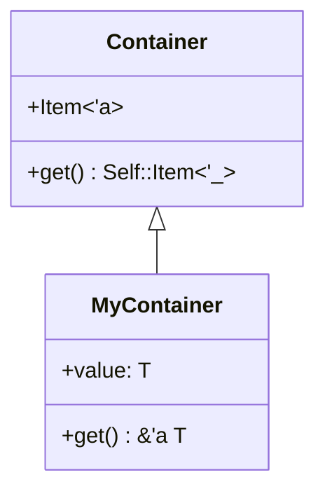
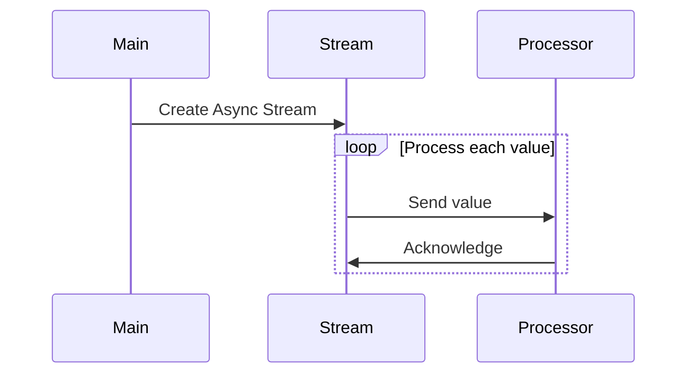

## 21.13. Exploring Rust's Future Features (GATs, Async Streams)

As Rust continues to evolve, new features are introduced to enhance its capabilities and address the needs of modern software development. Two such features on the horizon are Generic Associated Types (GATs) and Async Streams. In this section, we'll delve into these features, exploring what they are, their current status, and how they can revolutionize Rust programming.

### Understanding Generic Associated Types (GATs)

#### What Are GATs?

Generic Associated Types (GATs) are an extension of Rust's existing associated types feature, allowing for more expressive and flexible abstractions. In Rust, associated types are a way to define a type within a trait that is tied to the trait's implementation. GATs take this a step further by allowing these associated types to be generic themselves.

#### Current Status of GATs

As of the latest updates, GATs are still under active development and are not yet stabilized in Rust. They are part of ongoing discussions and proposals within the Rust community, with the aim of eventually integrating them into the stable language. You can track the progress and discussions on GATs through the [Rust RFCs](https://rust-lang.github.io/rfcs/).

#### How GATs Enable More Expressive Abstractions

GATs allow for more complex relationships between types, enabling developers to write more generic and reusable code. Let's consider an example to illustrate this:

```rust
trait Container {
    type Item<'a>;

    fn get(&self) -> Self::Item<'_>;
}

struct MyContainer<T> {
    value: T,
}

impl<T> Container for MyContainer<T> {
    type Item<'a> = &'a T;

    fn get(&self) -> Self::Item<'_> {
        &self.value
    }
}
```

In this example, `Container` is a trait with a generic associated type `Item<'a>`. The `MyContainer` struct implements this trait, specifying that `Item<'a>` is a reference to `T`. This allows `MyContainer` to return a reference to its contained value, demonstrating how GATs can be used to express complex type relationships.

### Exploring Async Streams

#### What Are Async Streams?

Async Streams are an extension of Rust's asynchronous programming model, allowing for the production and consumption of asynchronous sequences of values. They are akin to iterators but designed to work in an asynchronous context, enabling developers to handle streams of data without blocking the execution of their programs.

#### Current Status of Async Streams

Async Streams are also under active development and are not yet fully stabilized in Rust. They are being tracked and discussed in the Rust community, with ongoing efforts to refine their design and implementation. For more information, you can follow the [Async Streams Tracking Issue](https://github.com/rust-lang/rust/issues/50547).

#### How Async Streams Improve Asynchronous Programming Patterns

Async Streams provide a powerful abstraction for handling asynchronous data flows. They allow developers to work with sequences of data that are produced over time, without blocking the main execution thread. Here's a simple example of how Async Streams might be used:

```rust
use futures::stream::{self, StreamExt};

async fn process_stream() {
    let stream = stream::iter(vec![1, 2, 3, 4, 5]);

    stream.for_each(|value| async move {
        println!("Processing value: {}", value);
    }).await;
}
```

In this example, we create an asynchronous stream of integers and process each value asynchronously. The `for_each` method allows us to handle each item in the stream as it becomes available, demonstrating the non-blocking nature of Async Streams.

### Potential Benefits and Use Cases

#### Benefits of GATs

- **Increased Flexibility**: GATs allow for more flexible and expressive trait definitions, enabling developers to create more generic and reusable abstractions.
- **Improved Code Reusability**: By allowing associated types to be generic, GATs enable the creation of more reusable code components.
- **Enhanced Type Safety**: GATs provide a way to express complex type relationships, improving type safety and reducing the likelihood of runtime errors.

#### Benefits of Async Streams

- **Non-Blocking Data Processing**: Async Streams enable the handling of data sequences without blocking the main execution thread, improving the responsiveness of applications.
- **Scalable Data Handling**: By allowing for the asynchronous processing of data streams, Async Streams facilitate the development of scalable applications that can handle large volumes of data.
- **Improved Asynchronous Patterns**: Async Streams provide a more natural way to work with asynchronous data flows, improving the readability and maintainability of asynchronous code.

### Encouraging Engagement with Rust's Evolution

As Rust continues to evolve, it's important for developers to stay updated with the latest features and contribute to discussions within the community. By engaging with the Rust community, developers can help shape the future of the language and ensure that it continues to meet the needs of modern software development.

### Try It Yourself

To get hands-on experience with GATs and Async Streams, consider experimenting with the examples provided in this section. Try modifying the code to explore different use cases and see how these features can be applied to your own projects.

### Visualizing GATs and Async Streams

To better understand the concepts of GATs and Async Streams, let's visualize their relationships and workflows using Mermaid.js diagrams.

#### Visualizing GATs



*Diagram 1: This diagram illustrates the relationship between the `Container` trait and the `MyContainer` struct, highlighting the use of a generic associated type.*

#### Visualizing Async Streams



*Diagram 2: This sequence diagram shows the flow of data in an Async Stream, demonstrating how values are processed asynchronously.*

### References and Links

For further reading and to stay updated with the latest developments in Rust, consider exploring the following resources:

- [Rust RFCs](https://rust-lang.github.io/rfcs/)
- [Async Streams Tracking Issue](https://github.com/rust-lang/rust/issues/50547)

### Knowledge Check

To reinforce your understanding of GATs and Async Streams, consider the following questions and exercises:

- How do GATs differ from regular associated types in Rust?
- What are some potential use cases for Async Streams in real-world applications?
- Experiment with the provided code examples by adding new features or modifying existing ones.

### Embrace the Journey

Remember, this is just the beginning. As Rust continues to evolve, new features and capabilities will emerge, offering even more opportunities for innovation and creativity. Stay curious, keep experimenting, and enjoy the journey of mastering Rust's future features!

## Quiz Time!



### What are Generic Associated Types (GATs) in Rust?

- [x] An extension of associated types allowing them to be generic.
- [ ] A new type of data structure in Rust.
- [ ] A feature for handling asynchronous data.
- [ ] A replacement for Rust's existing trait system.

> **Explanation:** GATs extend associated types by allowing them to be generic, enabling more expressive abstractions.

### How do Async Streams differ from regular iterators?

- [x] They work in an asynchronous context.
- [ ] They are faster than regular iterators.
- [ ] They are used for synchronous data processing.
- [ ] They replace the need for iterators in Rust.

> **Explanation:** Async Streams are designed for asynchronous data flows, unlike regular iterators which are synchronous.

### What is the current status of GATs in Rust?

- [x] They are under active development and not yet stabilized.
- [ ] They are fully stabilized and available in Rust.
- [ ] They have been deprecated.
- [ ] They are only available in nightly Rust.

> **Explanation:** GATs are still under development and discussions within the Rust community.

### Which of the following is a benefit of using Async Streams?

- [x] Non-blocking data processing.
- [ ] Increased memory usage.
- [ ] Slower execution times.
- [ ] Reduced code readability.

> **Explanation:** Async Streams allow for non-blocking data processing, improving application responsiveness.

### What is a potential use case for GATs?

- [x] Creating more reusable and generic abstractions.
- [ ] Handling asynchronous data flows.
- [ ] Improving memory allocation.
- [ ] Simplifying error handling.

> **Explanation:** GATs enable more flexible and reusable trait definitions, enhancing code reusability.

### How can developers stay updated with Rust's evolution?

- [x] Engaging with the Rust community and following RFCs.
- [ ] Ignoring new features and focusing on stable releases.
- [ ] Only using Rust's stable features.
- [ ] Avoiding discussions on future features.

> **Explanation:** Engaging with the community and following RFCs helps developers stay informed about Rust's evolution.

### What is the purpose of the `for_each` method in Async Streams?

- [x] To process each item in the stream asynchronously.
- [ ] To block the main execution thread.
- [ ] To convert streams to iterators.
- [ ] To handle synchronous data processing.

> **Explanation:** The `for_each` method allows for asynchronous processing of each item in the stream.

### Which diagram best represents the flow of data in an Async Stream?

- [x] Sequence diagram showing asynchronous data processing.
- [ ] Class diagram showing type relationships.
- [ ] Flowchart showing synchronous operations.
- [ ] State diagram showing state transitions.

> **Explanation:** A sequence diagram effectively represents the asynchronous flow of data in an Async Stream.

### What is the main advantage of GATs over regular associated types?

- [x] They allow associated types to be generic.
- [ ] They simplify error handling.
- [ ] They improve memory allocation.
- [ ] They replace the need for traits.

> **Explanation:** GATs enhance associated types by allowing them to be generic, providing more flexibility.

### True or False: Async Streams are fully stabilized in Rust.

- [ ] True
- [x] False

> **Explanation:** Async Streams are still under development and not yet fully stabilized in Rust.


