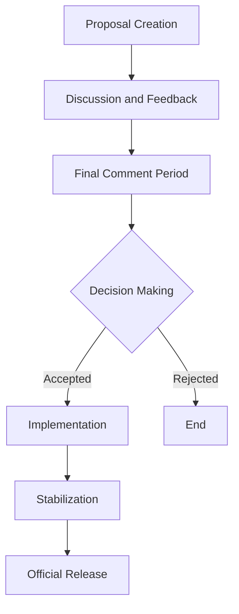

## 21.15. Evolving Standards and the Rust RFC Process

In the ever-evolving landscape of programming languages, Rust stands out not only for its technical features but also for its unique approach to language development. At the heart of this approach is the Rust RFC (Request for Comments) process, a structured method that allows the community to propose, discuss, and implement changes to the language. This section delves into the intricacies of the Rust RFC process, its significance, and how you can become a part of Rust's vibrant community.

### Understanding the Rust RFC Process

The Rust RFC process is a formalized method for proposing changes to the Rust language, libraries, and tools. It serves as a platform for collaboration and discussion among developers, ensuring that changes are well-considered and beneficial to the community. Here's a step-by-step breakdown of how the process works:

1. **Proposal Creation**: Anyone can create an RFC proposal. This involves writing a detailed document that outlines the proposed change, its rationale, potential impact, and any alternatives considered.

2. **Discussion and Feedback**: Once submitted, the RFC is open for discussion. Community members, including Rust team members, provide feedback, ask questions, and suggest improvements. This phase is crucial for refining the proposal and addressing any concerns.

3. **Final Comment Period (FCP)**: After thorough discussion, the RFC enters the Final Comment Period. This is a last call for feedback before a decision is made.

4. **Decision Making**: The relevant Rust team (e.g., language, library, or tooling team) reviews the RFC and decides whether to accept, reject, or request further revisions.

5. **Implementation**: If accepted, the RFC is implemented in the Rust language or ecosystem. This may involve writing code, updating documentation, and ensuring compatibility with existing features.

6. **Stabilization**: New features are initially introduced as unstable, allowing for further testing and feedback. Once deemed stable, they become part of the official Rust release.

### The Role of the Community

The Rust community plays a pivotal role in the RFC process. By contributing ideas, providing feedback, and participating in discussions, community members help shape the future of Rust. This collaborative approach ensures that Rust evolves in a way that meets the needs of its users while maintaining its core principles of safety, concurrency, and performance.

#### Community Contributions

- **Proposing RFCs**: Community members are encouraged to propose RFCs for new features, improvements, or changes. This democratizes the development process and allows for a diverse range of ideas.

- **Participating in Discussions**: Engaging in RFC discussions is a valuable way to contribute. By providing feedback, asking questions, and suggesting alternatives, community members help refine proposals and ensure they are robust.

- **Implementing Changes**: Once an RFC is accepted, community members can contribute to its implementation. This may involve writing code, updating documentation, or testing new features.

### Notable Past RFCs and Their Impact

Over the years, several RFCs have significantly impacted Rust's development. Here are a few notable examples:

- **RFC 1123: Non-Lexical Lifetimes (NLL)**: This RFC introduced a more flexible borrowing system, reducing the need for explicit lifetime annotations and making Rust easier to use.

- **RFC 1937: The `?` Operator**: This proposal added the `?` operator for error handling, simplifying the process of propagating errors and improving code readability.

- **RFC 2585: Async/Await**: This RFC brought asynchronous programming to Rust, enabling developers to write non-blocking code more easily and efficiently.

These RFCs demonstrate how the process facilitates the introduction of powerful features that enhance Rust's capabilities and usability.

### Getting Involved in the RFC Process

If you're interested in contributing to Rust's development, getting involved in the RFC process is a great way to start. Here's how you can participate:

1. **Stay Informed**: Follow the [Rust RFCs Repository](https://github.com/rust-lang/rfcs) to stay updated on new proposals and discussions.

2. **Join the Discussion**: Participate in discussions on the Rust Internals forum or GitHub. Share your thoughts, ask questions, and provide feedback on RFCs.

3. **Propose an RFC**: If you have an idea for improving Rust, consider writing an RFC. Follow the [Guide to the RFC Process](https://github.com/rust-lang/rfcs#rust-rfcs) to learn how to create and submit a proposal.

4. **Contribute to Implementation**: Once an RFC is accepted, contribute to its implementation by writing code, testing features, or updating documentation.

### The Importance of Community Collaboration

Community collaboration is at the core of the Rust RFC process. By working together, developers can create a language that is not only technically robust but also aligned with the needs and values of its users. This collaborative spirit fosters innovation, inclusivity, and a sense of ownership among community members.

### Visualizing the RFC Process

To better understand the RFC process, let's visualize it using a flowchart:

**Figure 1**: The Rust RFC Process Flowchart

This flowchart illustrates the key stages of the RFC process, from proposal creation to official release, highlighting the collaborative nature of Rust's development.

### Conclusion

The Rust RFC process is a testament to the power of community-driven development. By providing a structured framework for proposing and discussing changes, it ensures that Rust continues to evolve in a way that benefits its users. Whether you're a seasoned Rustacean or new to the language, getting involved in the RFC process is a rewarding way to contribute to Rust's future.

### External Resources

For more information on the Rust RFC process, check out these resources:

- [Rust RFCs Repository](https://github.com/rust-lang/rfcs)
- [Guide to the RFC Process](https://github.com/rust-lang/rfcs#rust-rfcs)

### Knowledge Check

Before we wrap up, let's reinforce what we've learned with a few questions:

1. What is the purpose of the Rust RFC process?
2. How can community members contribute to the RFC process?
3. Name a notable RFC and its impact on Rust.
4. What are the steps involved in the RFC process?
5. Why is community collaboration important in open-source projects?

### Embrace the Journey

Remember, this is just the beginning. As you engage with the Rust community and participate in the RFC process, you'll gain valuable insights and contribute to the evolution of a language that is shaping the future of systems programming. Keep exploring, stay curious, and enjoy the journey!

## Quiz Time!



### What is the primary purpose of the Rust RFC process?

- [x] To propose and discuss changes to the Rust language and ecosystem.
- [ ] To manage Rust's release schedule.
- [ ] To provide a platform for reporting bugs.
- [ ] To enforce coding standards in Rust projects.

> **Explanation:** The Rust RFC process is designed to propose and discuss changes to the Rust language, libraries, and tools, ensuring that they are well-considered and beneficial to the community.

### How can community members participate in the RFC process?

- [x] By proposing RFCs.
- [x] By participating in discussions.
- [x] By contributing to the implementation of accepted RFCs.
- [ ] By managing Rust's version control system.

> **Explanation:** Community members can propose RFCs, engage in discussions, and contribute to the implementation of accepted proposals, playing a vital role in Rust's development.

### Which RFC introduced the `?` operator for error handling in Rust?

- [ ] RFC 1123
- [x] RFC 1937
- [ ] RFC 2585
- [ ] RFC 2112

> **Explanation:** RFC 1937 introduced the `?` operator, simplifying error handling in Rust by allowing for easier propagation of errors.

### What happens during the Final Comment Period (FCP) in the RFC process?

- [x] It serves as a last call for feedback before a decision is made.
- [ ] It is when the RFC is implemented.
- [ ] It is when the RFC is rejected.
- [ ] It is when the RFC is published in the official Rust documentation.

> **Explanation:** The Final Comment Period is the last opportunity for feedback before the relevant Rust team makes a decision on the RFC.

### Why is community collaboration important in open-source projects like Rust?

- [x] It fosters innovation and inclusivity.
- [x] It ensures the language evolves to meet user needs.
- [ ] It reduces the need for documentation.
- [ ] It simplifies the coding process.

> **Explanation:** Community collaboration fosters innovation, inclusivity, and ensures that the language evolves in a way that aligns with the needs and values of its users.

### What is the first step in the Rust RFC process?

- [x] Proposal Creation
- [ ] Discussion and Feedback
- [ ] Final Comment Period
- [ ] Implementation

> **Explanation:** The first step in the Rust RFC process is Proposal Creation, where a detailed document outlining the proposed change is written.

### What is a key benefit of the Rust RFC process?

- [x] It allows for a diverse range of ideas to be considered.
- [ ] It speeds up the implementation of new features.
- [ ] It reduces the number of bugs in Rust.
- [ ] It limits the number of contributors to the Rust project.

> **Explanation:** The RFC process allows for a diverse range of ideas to be considered, ensuring that changes are well-considered and beneficial to the community.

### How does the RFC process ensure new features are robust?

- [x] Through community discussion and feedback.
- [ ] By limiting the number of RFCs submitted.
- [ ] By requiring all RFCs to be implemented immediately.
- [ ] By having a single person make all decisions.

> **Explanation:** Community discussion and feedback help refine proposals and ensure new features are robust and well-considered.

### What is the role of the relevant Rust team in the RFC process?

- [x] To review and decide on the acceptance of RFCs.
- [ ] To write all RFC proposals.
- [ ] To implement all accepted RFCs.
- [ ] To manage the Rust community forums.

> **Explanation:** The relevant Rust team reviews RFCs and decides whether to accept, reject, or request further revisions.

### True or False: Anyone can propose an RFC in the Rust community.

- [x] True
- [ ] False

> **Explanation:** True. Anyone can propose an RFC, allowing for a wide range of ideas and contributions from the community.


