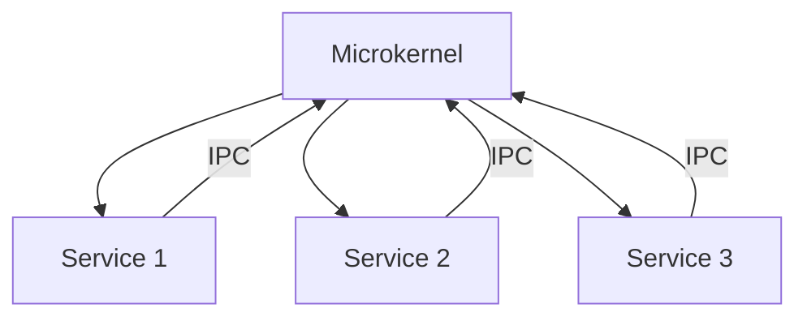

## 21.16. The Microkernel Architecture Pattern

The Microkernel architecture pattern is a fundamental design approach in systems programming, particularly in the development of operating systems. This pattern emphasizes a minimalistic core, known as the microkernel, which provides essential services such as communication between processes and basic resource management. Additional functionalities are implemented as separate modules or services that interact with the microkernel. In this section, we will explore the principles of the Microkernel architecture, its benefits and drawbacks, and how Rust's unique features make it an ideal language for implementing microkernel-based systems.

### Principles of the Microkernel Architecture

The Microkernel architecture is built on the following core principles:

1. **Minimal Core Functionality**: The microkernel itself contains only the most essential services required for the system to function. This typically includes low-level address space management, thread management, and inter-process communication (IPC).

2. **Extensibility**: Additional services and functionalities are implemented as user-space processes or modules. This allows for easy updates and modifications without affecting the core system.

3. **Isolation and Security**: By running most services in user space, the microkernel architecture enhances system security and stability. Faults in one service do not directly affect others or the core kernel.

4. **Communication via IPC**: Inter-process communication is a critical aspect of the microkernel architecture, enabling different modules to interact with each other and the core kernel.

5. **Portability**: The minimalistic nature of the microkernel makes it easier to port across different hardware architectures.

### Benefits of Microkernel-Based Systems

- **Modularity**: The separation of core functionalities from additional services allows for a modular design, making it easier to maintain and extend the system.

- **Reliability and Security**: Running services in user space reduces the risk of system crashes and enhances security by isolating faults.

- **Flexibility**: New services can be added or existing ones modified without altering the core kernel, allowing for greater flexibility in system design.

- **Portability**: The small size of the microkernel makes it easier to adapt to different hardware platforms.

### Drawbacks of Microkernel-Based Systems

- **Performance Overhead**: The reliance on IPC for communication between the kernel and user-space services can introduce performance overhead compared to monolithic kernels.

- **Complexity in Design**: Designing a microkernel system requires careful planning to ensure efficient communication and resource management.

### Implementing Microkernels in Rust

Rust's emphasis on safety, concurrency, and low-level control makes it an excellent choice for implementing microkernel architectures. Let's explore how Rust's features facilitate microkernel development.

#### Rust's Safety and Concurrency

Rust's ownership model and type system ensure memory safety without the need for a garbage collector. This is crucial in systems programming, where performance and reliability are paramount. Rust's concurrency model, which prevents data races at compile time, is particularly beneficial for microkernel systems that rely heavily on concurrent processes.

#### Low-Level Control

Rust provides low-level control over system resources, allowing developers to write efficient and performant code. This is essential for implementing the core functionalities of a microkernel, such as thread management and IPC.

#### Example: A Simple Microkernel in Rust

Let's consider a simple example of a microkernel implemented in Rust. This example will focus on basic thread management and IPC.

```rust
use std::sync::{Arc, Mutex};
use std::thread;

// Define a simple message structure for IPC
struct Message {
    sender: String,
    content: String,
}

// Define a microkernel structure
struct Microkernel {
    message_queue: Arc<Mutex<Vec<Message>>>,
}

impl Microkernel {
    fn new() -> Self {
        Microkernel {
            message_queue: Arc::new(Mutex::new(Vec::new())),
        }
    }

    // Function to send a message
    fn send_message(&self, message: Message) {
        let mut queue = self.message_queue.lock().unwrap();
        queue.push(message);
    }

    // Function to receive a message
    fn receive_message(&self) -> Option<Message> {
        let mut queue = self.message_queue.lock().unwrap();
        queue.pop()
    }
}

fn main() {
    let kernel = Microkernel::new();

    // Simulate a service sending a message
    let sender_kernel = kernel.clone();
    let sender_thread = thread::spawn(move || {
        let message = Message {
            sender: String::from("Service A"),
            content: String::from("Hello from Service A"),
        };
        sender_kernel.send_message(message);
    });

    // Simulate a service receiving a message
    let receiver_kernel = kernel.clone();
    let receiver_thread = thread::spawn(move || {
        if let Some(message) = receiver_kernel.receive_message() {
            println!("Received message from {}: {}", message.sender, message.content);
        }
    });

    sender_thread.join().unwrap();
    receiver_thread.join().unwrap();
}
```

In this example, we define a simple `Microkernel` structure with a message queue for IPC. Services can send and receive messages through the microkernel, demonstrating basic inter-process communication.

### Real-World Applications and Operating Systems

One of the most notable examples of a microkernel-based operating system implemented in Rust is [Redox OS](https://www.redox-os.org/). Redox OS is designed to be secure, reliable, and efficient, leveraging Rust's safety features to build a modern microkernel operating system. It demonstrates how Rust can be used to create a robust and extensible system architecture.

### Considerations for Performance, Security, and Extensibility

When designing a microkernel system in Rust, consider the following:

- **Performance**: Optimize IPC mechanisms to minimize overhead. Rust's low-level control can help fine-tune performance-critical sections of the code.

- **Security**: Leverage Rust's safety features to prevent common vulnerabilities such as buffer overflows and data races. Isolate services to enhance security.

- **Extensibility**: Design the system with modularity in mind, allowing for easy addition and modification of services. Rust's trait system can facilitate the implementation of extensible interfaces.

### Visualizing the Microkernel Architecture

To better understand the Microkernel architecture, let's visualize its structure using a Mermaid.js diagram.



This diagram illustrates the core microkernel interacting with various services through IPC. Each service operates independently in user space, communicating with the microkernel as needed.

### Conclusion

The Microkernel architecture pattern offers a modular, secure, and flexible approach to system design. Rust's unique features make it an ideal language for implementing microkernel-based systems, providing safety, concurrency, and low-level control. By understanding the principles and benefits of the Microkernel architecture, developers can build robust and extensible systems that leverage Rust's strengths.

### Further Reading

For more information on microkernel architectures and Rust, consider exploring the following resources:

- [Redox OS](https://www.redox-os.org/)
- [The Rust Programming Language](https://doc.rust-lang.org/book/)
- [Operating System Design: The Xinu Approach](https://www.cs.purdue.edu/homes/comer/xinu/)

## Quiz Time!



### What is the primary function of a microkernel in a system architecture?

- [x] To provide minimal core services such as IPC and resource management
- [ ] To handle all system functionalities within the kernel
- [ ] To manage user interfaces and applications
- [ ] To serve as a database management system

> **Explanation:** The microkernel provides minimal core services, focusing on essential functionalities like IPC and resource management, while other services run in user space.

### Which of the following is a benefit of the microkernel architecture?

- [x] Modularity
- [ ] Increased complexity
- [ ] Higher performance overhead
- [ ] Centralized control

> **Explanation:** The microkernel architecture is known for its modularity, allowing for easy maintenance and extension of the system.

### What is a common drawback of microkernel-based systems?

- [x] Performance overhead due to IPC
- [ ] Lack of modularity
- [ ] Poor security
- [ ] Inflexibility

> **Explanation:** Microkernel-based systems can experience performance overhead due to the reliance on IPC for communication between the kernel and user-space services.

### How does Rust's ownership model benefit microkernel development?

- [x] It ensures memory safety without a garbage collector
- [ ] It allows for dynamic typing
- [ ] It simplifies syntax for beginners
- [ ] It provides built-in GUI components

> **Explanation:** Rust's ownership model ensures memory safety without the need for a garbage collector, which is crucial for systems programming.

### What is the role of IPC in a microkernel architecture?

- [x] To enable communication between the kernel and user-space services
- [ ] To manage graphical user interfaces
- [ ] To store data in databases
- [ ] To compile code

> **Explanation:** IPC (Inter-Process Communication) is used to enable communication between the kernel and user-space services in a microkernel architecture.

### Which Rust feature is particularly beneficial for concurrency in microkernel systems?

- [x] Rust's concurrency model that prevents data races
- [ ] Rust's dynamic typing
- [ ] Rust's built-in GUI libraries
- [ ] Rust's garbage collector

> **Explanation:** Rust's concurrency model prevents data races at compile time, which is beneficial for systems that rely heavily on concurrent processes.

### What is a real-world example of a microkernel-based operating system implemented in Rust?

- [x] Redox OS
- [ ] Windows OS
- [ ] macOS
- [ ] Linux

> **Explanation:** Redox OS is a real-world example of a microkernel-based operating system implemented in Rust.

### How does the microkernel architecture enhance system security?

- [x] By isolating services in user space
- [ ] By centralizing all functionalities in the kernel
- [ ] By using a monolithic design
- [ ] By eliminating the need for IPC

> **Explanation:** The microkernel architecture enhances security by isolating services in user space, reducing the impact of faults.

### What is the primary advantage of using Rust for microkernel development?

- [x] Safety and low-level control
- [ ] Built-in GUI components
- [ ] Dynamic typing
- [ ] High-level abstractions

> **Explanation:** Rust provides safety and low-level control, making it ideal for microkernel development.

### True or False: The microkernel architecture is less portable than monolithic kernels.

- [ ] True
- [x] False

> **Explanation:** The microkernel architecture is generally more portable due to its minimalistic core, making it easier to adapt to different hardware platforms.



Remember, this is just the beginning. As you progress, you'll build more complex and interactive systems. Keep experimenting, stay curious, and enjoy the journey!
