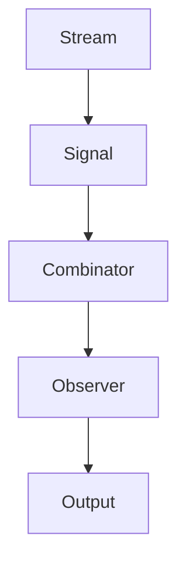

## 21.2. Functional Reactive Programming in Rust

Functional Reactive Programming (FRP) is a programming paradigm for reactive programming using the building blocks of functional programming. It is particularly useful for applications that require responsive and event-driven architectures, such as GUIs, real-time data processing, and game development. In this section, we will explore how Rust's features support FRP paradigms and how you can implement FRP in Rust using libraries like `frp-rs` and `carboxyl`.

### Understanding Functional Reactive Programming

FRP is a way to model dynamic systems that change over time. It allows developers to express the logic of data flows and transformations in a declarative manner, making it easier to reason about complex interactions and state changes. The core concepts of FRP include:

- **Streams**: Represent sequences of events over time.
- **Signals**: Represent time-varying values.
- **Combinators**: Functions that transform streams and signals.

#### Benefits of FRP

- **Declarative Code**: FRP allows you to describe what the program should accomplish rather than how to accomplish it, leading to cleaner and more maintainable code.
- **Composability**: FRP systems are highly composable, allowing you to build complex behaviors from simple components.
- **Automatic Propagation**: Changes in input automatically propagate through the system, reducing the need for manual state management.

### Rust's Support for FRP Paradigms

Rust's strong type system, ownership model, and concurrency support make it an excellent choice for implementing FRP. Here are some Rust features that align well with FRP:

- **Ownership and Borrowing**: Ensures memory safety and prevents data races, which is crucial for reactive systems.
- **Pattern Matching**: Allows for expressive handling of different event types and states.
- **Traits and Generics**: Enable the creation of flexible and reusable FRP components.

### Implementing FRP in Rust

To implement FRP in Rust, we can use libraries such as `frp-rs` and `carboxyl`. These libraries provide abstractions for streams, signals, and combinators, allowing you to build reactive systems efficiently.

#### Using `frp-rs`

`frp-rs` is a library designed to facilitate FRP in Rust. It provides a simple API for creating and transforming streams and signals.

```rust
use frp_rs::{Signal, Stream};

fn main() {
    // Create a stream of integers
    let mut stream = Stream::new();

    // Create a signal that sums the stream's values
    let sum_signal = stream.fold(0, |acc, x| acc + x);

    // Listen for changes in the signal
    sum_signal.observe(|sum| {
        println!("Current sum: {}", sum);
    });

    // Emit values into the stream
    stream.emit(1);
    stream.emit(2);
    stream.emit(3);
}
```

In this example, we create a stream of integers and a signal that computes the sum of the stream's values. The `observe` method allows us to react to changes in the signal.

#### Using `carboxyl`

`carboxyl` is another Rust library for FRP, offering a more comprehensive set of features for building reactive systems.

```rust
use carboxyl::{Sink, Stream};

fn main() {
    // Create a sink to emit events
    let (sink, stream) = Stream::new();

    // Transform the stream by doubling each value
    let doubled_stream = stream.map(|x| x * 2);

    // Subscribe to the transformed stream
    let subscription = doubled_stream.subscribe(|x| {
        println!("Doubled value: {}", x);
    });

    // Emit values into the sink
    sink.send(1);
    sink.send(2);
    sink.send(3);

    // Ensure the subscription is kept alive
    drop(subscription);
}
```

Here, we use `carboxyl` to create a stream and transform it by doubling each value. The `subscribe` method allows us to react to each transformed value.

### Modeling Data Flows and Reactive Streams

In FRP, data flows are modeled as streams and signals. Streams represent sequences of events, while signals represent values that change over time. By using combinators, you can transform and combine streams and signals to build complex reactive systems.

#### Example: Real-Time Data Processing

Let's consider a real-time data processing example where we process sensor data using FRP.

```rust
use frp_rs::{Signal, Stream};

fn main() {
    // Create a stream for sensor data
    let mut sensor_stream = Stream::new();

    // Create a signal to compute the average of the last 5 readings
    let average_signal = sensor_stream
        .window(5)
        .map(|window| window.iter().sum::<f64>() / window.len() as f64);

    // Observe the average signal
    average_signal.observe(|average| {
        println!("Average sensor reading: {:.2}", average);
    });

    // Emit sensor readings
    sensor_stream.emit(10.0);
    sensor_stream.emit(12.0);
    sensor_stream.emit(11.0);
    sensor_stream.emit(13.0);
    sensor_stream.emit(14.0);
}
```

In this example, we create a stream for sensor data and a signal to compute the average of the last five readings. The `window` combinator allows us to work with a sliding window of data.

### Applications of FRP in Rust

FRP can be applied in various domains, including:

- **GUI Development**: FRP simplifies the management of user interactions and state changes in graphical user interfaces.
- **Real-Time Data Processing**: FRP is well-suited for processing streams of data in real-time, such as sensor data or financial market data.
- **Game Development**: FRP can be used to model game logic and interactions in a declarative manner.

#### GUI Development Example

Let's explore how FRP can be used in GUI development with Rust.

```rust
use frp_rs::{Signal, Stream};
use some_gui_library::{Button, Label, Window};

fn main() {
    // Create a button and a label
    let button = Button::new("Click me");
    let label = Label::new("Button not clicked");

    // Create a stream for button clicks
    let click_stream = Stream::new();

    // Update the label text on button click
    let label_signal = click_stream.map(|_| "Button clicked");
    label_signal.observe(|text| {
        label.set_text(text);
    });

    // Connect the button click event to the stream
    button.on_click(move || {
        click_stream.emit(());
    });

    // Create a window and add the button and label
    let window = Window::new("FRP GUI Example");
    window.add(&button);
    window.add(&label);

    // Run the GUI application
    window.run();
}
```

In this example, we create a simple GUI with a button and a label. The label text updates whenever the button is clicked, demonstrating how FRP can simplify event handling in GUIs.

### Challenges and Considerations

While FRP offers many benefits, there are challenges and considerations to keep in mind when applying FRP in Rust:

- **Complexity**: FRP can introduce complexity, especially in large systems with many interconnected streams and signals.
- **Performance**: Reactive systems can incur performance overhead due to the propagation of changes. It's important to profile and optimize critical paths.
- **Learning Curve**: FRP requires a shift in mindset from imperative programming, which can be challenging for developers new to the paradigm.

### Visualizing FRP in Rust

To better understand how FRP works in Rust, let's visualize the flow of data and events using a Mermaid.js diagram.



**Diagram Description**: This diagram illustrates the flow of data in an FRP system. Events are emitted into a stream (A), which are then transformed into a signal (B). The signal is processed by a combinator (C), and the results are observed by an observer (D), producing the final output (E).

### Conclusion

Functional Reactive Programming in Rust offers a powerful paradigm for building responsive and event-driven applications. By leveraging Rust's unique features and libraries like `frp-rs` and `carboxyl`, you can create systems that are both expressive and efficient. As you explore FRP in Rust, remember to consider the challenges and embrace the journey of learning this exciting paradigm.

### Further Reading

- [FRP in Rust with `frp-rs`](https://github.com/zesterer/frp)
- [Carboxyl: Functional Reactive Programming in Rust](https://github.com/aepsil0n/carboxyl)
- [Rust Programming Language](https://www.rust-lang.org/)

## Quiz Time!



### What is Functional Reactive Programming (FRP)?

- [x] A programming paradigm for reactive programming using functional programming principles.
- [ ] A type of object-oriented programming.
- [ ] A method for optimizing database queries.
- [ ] A design pattern for web development.

> **Explanation:** FRP is a programming paradigm that combines reactive programming with functional programming principles.

### Which Rust feature is particularly beneficial for FRP?

- [x] Ownership and Borrowing
- [ ] Garbage Collection
- [ ] Dynamic Typing
- [ ] Reflection

> **Explanation:** Rust's ownership and borrowing model ensures memory safety and prevents data races, which is crucial for reactive systems.

### What is a stream in FRP?

- [x] A sequence of events over time.
- [ ] A static data structure.
- [ ] A type of database.
- [ ] A network protocol.

> **Explanation:** In FRP, a stream represents a sequence of events that occur over time.

### What library can be used for FRP in Rust?

- [x] `frp-rs`
- [ ] `serde`
- [ ] `tokio`
- [ ] `actix`

> **Explanation:** `frp-rs` is a library designed to facilitate Functional Reactive Programming in Rust.

### What is a signal in FRP?

- [x] A time-varying value.
- [ ] A static configuration file.
- [ ] A type of network packet.
- [ ] A database query.

> **Explanation:** In FRP, a signal represents a value that changes over time.

### What is the main benefit of using FRP?

- [x] Declarative code and automatic propagation of changes.
- [ ] Faster execution time.
- [ ] Easier debugging.
- [ ] Reduced memory usage.

> **Explanation:** FRP allows for declarative code and automatic propagation of changes, making it easier to manage complex interactions.

### What is a combinator in FRP?

- [x] A function that transforms streams and signals.
- [ ] A type of database index.
- [ ] A network protocol.
- [ ] A GUI component.

> **Explanation:** Combinators are functions that transform streams and signals in FRP.

### What is a common application of FRP?

- [x] GUI Development
- [ ] Database Management
- [ ] File Compression
- [ ] Network Security

> **Explanation:** FRP is commonly used in GUI development to manage user interactions and state changes.

### What is a challenge of using FRP?

- [x] Complexity and performance overhead.
- [ ] Lack of libraries.
- [ ] Incompatibility with Rust.
- [ ] Limited use cases.

> **Explanation:** FRP can introduce complexity and performance overhead, especially in large systems.

### True or False: FRP in Rust can be used for real-time data processing.

- [x] True
- [ ] False

> **Explanation:** FRP is well-suited for real-time data processing, allowing for efficient handling of streams of data.



Remember, this is just the beginning. As you progress, you'll build more complex and interactive applications using FRP in Rust. Keep experimenting, stay curious, and enjoy the journey!
