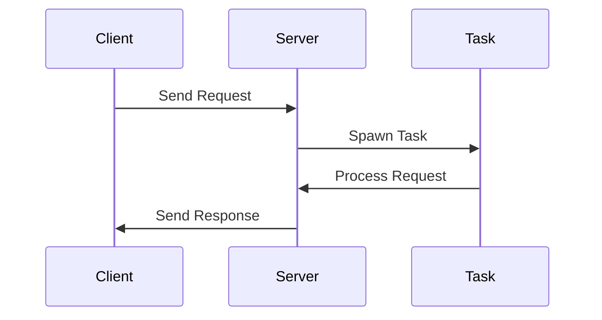

## 21.3. Event-Driven Architecture with `async`/`await`

### Introduction to Event-Driven Architecture

Event-driven architecture (EDA) is a design paradigm in which the flow of the program is determined by events such as user actions, sensor outputs, or messages from other programs. This architecture is particularly beneficial for applications that require high scalability and responsiveness, such as network servers, IoT applications, and real-time data processing systems.

**Advantages of Event-Driven Architecture:**

- **Scalability:** EDA allows applications to handle a large number of events concurrently, making it suitable for high-load environments.
- **Responsiveness:** By reacting to events as they occur, applications can provide timely responses to user actions or system changes.
- **Decoupling:** Components in an event-driven system are loosely coupled, which enhances modularity and flexibility.

### Rust's `async`/`await` for Non-Blocking Asynchronous Code

Rust's `async`/`await` syntax is a powerful tool for writing non-blocking, asynchronous code. It allows developers to write code that appears synchronous but is executed asynchronously, enabling efficient use of system resources.

**Key Concepts:**

- **Async Functions:** Functions that return a `Future`, which represents a value that may not be available yet.
- **Awaiting Futures:** The `await` keyword is used to pause the execution of an async function until the future is ready.
- **Non-Blocking Execution:** Async functions do not block the thread they run on, allowing other tasks to execute concurrently.

### Building Event-Driven Applications with `async`/`await`

Let's explore how to build an event-driven application using Rust's `async`/`await` syntax. We'll use the Tokio runtime, a popular asynchronous runtime for Rust, to manage our async tasks.

#### Example: A Simple Event-Driven Network Server

```rust
use tokio::net::TcpListener;
use tokio::prelude::*;

#[tokio::main]
async fn main() -> Result<(), Box<dyn std::error::Error>> {
    // Bind a TCP listener to the address
    let listener = TcpListener::bind("127.0.0.1:8080").await?;

    println!("Server running on 127.0.0.1:8080");

    loop {
        // Accept an incoming connection
        let (mut socket, _) = listener.accept().await?;

        // Spawn a new task to handle the connection
        tokio::spawn(async move {
            let mut buf = [0; 1024];

            // Read data from the socket
            match socket.read(&mut buf).await {
                Ok(n) if n == 0 => return, // Connection closed
                Ok(n) => {
                    // Echo the data back to the client
                    if socket.write_all(&buf[0..n]).await.is_err() {
                        eprintln!("Failed to write to socket");
                    }
                }
                Err(e) => eprintln!("Failed to read from socket; err = {:?}", e),
            }
        });
    }
}
```

**Explanation:**

- **TcpListener:** Listens for incoming TCP connections.
- **tokio::spawn:** Spawns a new asynchronous task to handle each connection.
- **Non-blocking I/O:** The server can handle multiple connections concurrently without blocking.

### Runtimes and Frameworks Supporting Event-Driven Paradigms

Rust's ecosystem provides several runtimes and frameworks that facilitate event-driven programming:

- **[Tokio](https://tokio.rs/):** A runtime for writing reliable, asynchronous, and scalable applications. It provides utilities for working with asynchronous I/O, timers, and more.
- **[async-std](https://async.rs/):** An asynchronous version of the Rust standard library, providing a familiar API for async programming.

### Best Practices for Event-Driven Systems

When building event-driven systems, consider the following best practices:

- **Concurrency Management:** Use async runtimes like Tokio to manage task scheduling and execution.
- **Error Propagation:** Handle errors gracefully using Rust's `Result` and `Option` types.
- **Resource Management:** Ensure resources such as file handles and network connections are properly managed and released.

### Real-World Applications

Event-driven architecture is widely used in various domains:

- **Network Servers:** Handle multiple client connections concurrently without blocking.
- **IoT Applications:** React to sensor data and control devices in real-time.
- **Real-Time Data Processing:** Process streams of data as they arrive, enabling timely insights and actions.

### Visualizing Event-Driven Architecture

Below is a diagram illustrating the flow of an event-driven application using `async`/`await`:



**Diagram Explanation:**

- **Client:** Initiates a request to the server.
- **Server:** Spawns a new task to handle the request.
- **Task:** Processes the request asynchronously and sends a response back to the client.

### Try It Yourself

Experiment with the provided code example by modifying the server to handle different types of requests or by implementing additional features such as logging or authentication. This hands-on approach will deepen your understanding of event-driven architecture and asynchronous programming in Rust.

### Conclusion

Rust's `async`/`await` syntax, combined with powerful runtimes like Tokio, makes it an excellent choice for building efficient and scalable event-driven applications. By leveraging these tools, developers can create systems that are responsive, scalable, and maintainable.

### References and Further Reading

- [Tokio Documentation](https://tokio.rs/docs/)
- [async-std Documentation](https://async.rs/docs/)
- [Rust Async Book](https://rust-lang.github.io/async-book/)

## Quiz Time!



### What is the primary benefit of using event-driven architecture?

- [x] Scalability and responsiveness
- [ ] Simplicity and ease of use
- [ ] Reduced code complexity
- [ ] Improved security

> **Explanation:** Event-driven architecture is known for its scalability and responsiveness, making it ideal for high-load environments.

### Which keyword is used to pause the execution of an async function until a future is ready?

- [ ] async
- [x] await
- [ ] future
- [ ] spawn

> **Explanation:** The `await` keyword is used to pause the execution of an async function until the future is ready.

### What does the `tokio::spawn` function do?

- [x] Spawns a new asynchronous task
- [ ] Blocks the current thread
- [ ] Terminates an async function
- [ ] Creates a new TCP listener

> **Explanation:** `tokio::spawn` is used to spawn a new asynchronous task, allowing concurrent execution.

### Which of the following is a popular runtime for writing asynchronous applications in Rust?

- [ ] std
- [x] Tokio
- [ ] sync
- [ ] async

> **Explanation:** Tokio is a popular runtime for writing asynchronous applications in Rust.

### What is the role of a `Future` in Rust's async programming?

- [x] Represents a value that may not be available yet
- [ ] Blocks the execution of a function
- [ ] Terminates an async task
- [ ] Creates a new thread

> **Explanation:** A `Future` represents a value that may not be available yet, allowing for non-blocking execution.

### What is the main advantage of using non-blocking I/O in event-driven systems?

- [x] Allows handling multiple connections concurrently
- [ ] Simplifies code structure
- [ ] Reduces memory usage
- [ ] Increases security

> **Explanation:** Non-blocking I/O allows handling multiple connections concurrently, improving scalability and responsiveness.

### Which of the following is NOT a benefit of event-driven architecture?

- [ ] Scalability
- [ ] Responsiveness
- [ ] Decoupling
- [x] Increased complexity

> **Explanation:** While event-driven architecture offers many benefits, it can increase complexity due to the need to manage events and state.

### What is the purpose of the `TcpListener` in the provided code example?

- [x] Listens for incoming TCP connections
- [ ] Sends data to clients
- [ ] Manages task scheduling
- [ ] Handles error propagation

> **Explanation:** `TcpListener` is used to listen for incoming TCP connections in the provided code example.

### True or False: Rust's `async`/`await` syntax allows for blocking execution of code.

- [ ] True
- [x] False

> **Explanation:** Rust's `async`/`await` syntax allows for non-blocking execution of code, enabling efficient use of system resources.

### Which framework provides an asynchronous version of the Rust standard library?

- [ ] Tokio
- [x] async-std
- [ ] std
- [ ] sync

> **Explanation:** `async-std` provides an asynchronous version of the Rust standard library, offering a familiar API for async programming.



Remember, this is just the beginning. As you progress, you'll build more complex and interactive applications. Keep experimenting, stay curious, and enjoy the journey!
