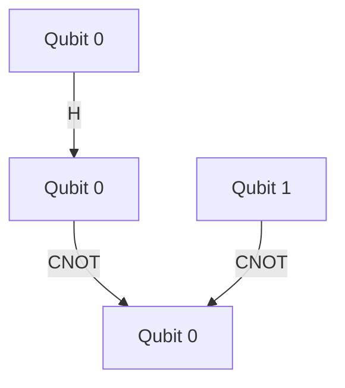

## 21.4. Quantum Computing and Rust

### Introduction to Quantum Computing

Quantum computing is an exciting and rapidly evolving field that leverages the principles of quantum mechanics to perform computations that are infeasible for classical computers. Unlike classical bits, which can be either 0 or 1, quantum bits, or qubits, can exist in superpositions of states, allowing quantum computers to process a vast amount of information simultaneously. This capability holds the promise of revolutionizing fields such as cryptography, optimization, and complex system simulations.

### Significance of Quantum Computing

Quantum computing's significance lies in its potential to solve problems that are currently intractable for classical computers. For instance, quantum algorithms like Shor's algorithm can factor large numbers exponentially faster than the best-known classical algorithms, posing both opportunities and challenges for cryptography. Similarly, quantum simulations can model complex molecular and chemical interactions, potentially leading to breakthroughs in drug discovery and materials science.

### Rust's Role in Quantum Computing

Rust, known for its performance, safety, and concurrency features, is increasingly being explored as a language for quantum computing applications. Rust's memory safety guarantees, without the need for a garbage collector, make it an attractive choice for developing high-performance quantum computing software. Additionally, Rust's strong type system and concurrency model can help manage the complexity inherent in quantum computing tasks.

### Current State of Quantum Computing Libraries in Rust

Several libraries and tools have emerged to facilitate quantum computing in Rust. These libraries aim to provide the necessary abstractions and interfaces to work with quantum algorithms and hardware.

#### `qcgpu`

[`qcgpu`](https://github.com/QCGPU/QCGPU) is a Rust library designed for simulating quantum circuits. It provides a high-performance simulator that leverages Rust's concurrency features to efficiently simulate quantum operations. The library is designed to be easy to use, allowing developers to define quantum circuits and execute them with minimal overhead.

```rust
use qcgpu::state::State;

// Create a new quantum state with 3 qubits
let mut state = State::new(3);

// Apply a Hadamard gate to the first qubit
state.h(0);

// Measure the state
let result = state.measure();
println!("Measurement result: {:?}", result);
```

In this example, we create a quantum state with three qubits, apply a Hadamard gate to the first qubit, and then measure the state. The `qcgpu` library handles the underlying complexity, allowing us to focus on the quantum logic.

#### Rust Qiskit Bindings

The [Rust Qiskit bindings](https://github.com/Qiskit-openqasm/qiskit-rust) provide an interface to the Qiskit framework, a popular open-source quantum computing library developed by IBM. These bindings enable Rust developers to leverage Qiskit's extensive set of tools for quantum circuit design, simulation, and execution on real quantum hardware.

```rust
use qiskit_rust::QuantumCircuit;

// Create a new quantum circuit with 2 qubits
let mut circuit = QuantumCircuit::new(2);

// Add gates to the circuit
circuit.h(0);
circuit.cx(0, 1);

// Execute the circuit on a simulator
let result = circuit.execute();
println!("Circuit execution result: {:?}", result);
```

This example demonstrates how to create a simple quantum circuit using the Rust Qiskit bindings, apply gates, and execute the circuit on a simulator.

### Benefits of Rust for Quantum Computing Applications

Rust's unique features offer several benefits for quantum computing applications:

- **Performance**: Rust's zero-cost abstractions and efficient memory management make it ideal for high-performance quantum simulations.
- **Safety**: Rust's ownership model and compile-time checks prevent common programming errors, such as data races and null pointer dereferences, which are crucial in the complex domain of quantum computing.
- **Concurrency**: Rust's concurrency model allows developers to efficiently manage parallel computations, which are often required in quantum simulations and algorithms.

### Future Prospects and Challenges

The integration of Rust with quantum computing is still in its early stages, but the future looks promising. As quantum hardware continues to evolve, Rust's performance and safety features will become increasingly valuable. However, challenges remain, such as the need for more mature libraries and tools, as well as the complexity of quantum algorithms themselves.

### Visualizing Quantum Circuits

To better understand quantum circuits, let's visualize a simple circuit using a diagram. This circuit applies a Hadamard gate followed by a CNOT gate.



**Diagram Description**: This diagram represents a quantum circuit with two qubits. The first qubit undergoes a Hadamard transformation, creating a superposition, and then a CNOT gate entangles the two qubits.

### Knowledge Check

- **Question**: What is the primary advantage of using Rust for quantum computing applications?
  - **Answer**: Rust's performance and safety features make it ideal for high-performance and error-free quantum computing applications.

### Try It Yourself

Experiment with the provided code examples by modifying the number of qubits or the gates applied. Observe how these changes affect the measurement results and gain a deeper understanding of quantum circuit behavior.

### Conclusion

Rust's role in quantum computing is an exciting frontier, combining the language's strengths with the revolutionary potential of quantum technology. As the field progresses, Rust's contributions to quantum computing will likely expand, offering developers a powerful toolset for tackling complex quantum challenges.

### Quiz Time!



### What is a qubit?

- [x] A quantum bit that can exist in superpositions of states
- [ ] A classical bit that can be either 0 or 1
- [ ] A unit of measurement in quantum computing
- [ ] A type of quantum gate

> **Explanation:** A qubit is a fundamental unit of quantum information, capable of existing in multiple states simultaneously.

### Which Rust feature is particularly beneficial for quantum computing?

- [x] Memory safety without garbage collection
- [ ] Dynamic typing
- [ ] Built-in garbage collector
- [ ] Weak type system

> **Explanation:** Rust's memory safety without garbage collection ensures high performance and prevents common programming errors.

### What does the `qcgpu` library provide?

- [x] A high-performance simulator for quantum circuits
- [ ] A graphical interface for designing quantum circuits
- [ ] A hardware interface for quantum computers
- [ ] A database for storing quantum algorithms

> **Explanation:** `qcgpu` is a Rust library that simulates quantum circuits efficiently.

### What is the purpose of the Rust Qiskit bindings?

- [x] To interface with the Qiskit framework for quantum computing
- [ ] To provide a graphical user interface for quantum circuit design
- [ ] To simulate classical circuits
- [ ] To compile Rust code into quantum machine code

> **Explanation:** The Rust Qiskit bindings allow Rust developers to use Qiskit's tools for quantum computing.

### What is a Hadamard gate used for in quantum computing?

- [x] Creating superpositions
- [ ] Measuring qubits
- [ ] Entangling qubits
- [ ] Resetting qubits

> **Explanation:** A Hadamard gate creates superpositions, allowing qubits to exist in multiple states.

### What is the significance of quantum computing?

- [x] Solving problems intractable for classical computers
- [ ] Replacing classical computers entirely
- [ ] Simplifying classical algorithms
- [ ] Eliminating the need for classical programming languages

> **Explanation:** Quantum computing can solve complex problems that classical computers cannot handle efficiently.

### Which of the following is a challenge in combining Rust with quantum computing?

- [x] The need for more mature libraries and tools
- [ ] Rust's lack of performance
- [ ] Rust's inability to handle concurrency
- [ ] The absence of a type system in Rust

> **Explanation:** While Rust offers many benefits, the quantum computing ecosystem in Rust is still developing.

### What does a CNOT gate do in a quantum circuit?

- [x] Entangles two qubits
- [ ] Measures a qubit
- [ ] Creates a superposition
- [ ] Resets a qubit

> **Explanation:** A CNOT gate is used to entangle two qubits, a fundamental operation in quantum computing.

### How does Rust's concurrency model benefit quantum computing?

- [x] Efficiently manages parallel computations
- [ ] Eliminates the need for parallel computations
- [ ] Simplifies quantum algorithms
- [ ] Provides a graphical interface for concurrency

> **Explanation:** Rust's concurrency model allows for efficient parallel computations, which are often required in quantum simulations.

### True or False: Rust's ownership model prevents data races in quantum computing applications.

- [x] True
- [ ] False

> **Explanation:** Rust's ownership model ensures memory safety and prevents data races, which is crucial in complex quantum computing tasks.



Remember, this is just the beginning. As you explore the intersection of Rust and quantum computing, you'll uncover more possibilities and challenges. Keep experimenting, stay curious, and enjoy the journey!
