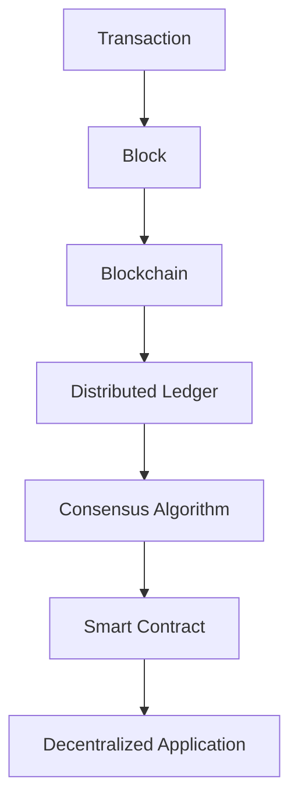

## 21.5. Blockchain and Distributed Ledger Technologies

Blockchain technology has emerged as a revolutionary force in the digital world, offering a decentralized and secure method for recording transactions and managing data. In this section, we will explore how Rust, with its unique features and capabilities, is becoming a popular choice for developing blockchain applications and distributed ledger technologies.

### Understanding Blockchain Technology

Blockchain is a distributed ledger technology that records transactions across multiple computers in such a way that the registered transactions cannot be altered retroactively. This ensures transparency and security, making blockchain an ideal solution for various applications, including cryptocurrencies, supply chain management, and more.

#### Key Concepts in Blockchain

- **Decentralization**: Unlike traditional databases, a blockchain is decentralized, meaning no single entity has control over the entire network.
- **Immutability**: Once a transaction is recorded on the blockchain, it cannot be changed or deleted.
- **Consensus Algorithms**: These are protocols used to achieve agreement on a single data value among distributed processes or systems. Examples include Proof of Work (PoW) and Proof of Stake (PoS).
- **Smart Contracts**: Self-executing contracts with the terms of the agreement directly written into code. They automatically enforce and execute the terms of the contract.

### Why Rust for Blockchain Development?

Rust is gaining traction in the blockchain space due to its emphasis on safety, performance, and concurrency. Here are some reasons why Rust is a preferred choice for blockchain development:

- **Memory Safety**: Rust's ownership model ensures memory safety without needing a garbage collector, preventing common bugs such as null pointer dereferencing and buffer overflows.
- **Concurrency**: Rust's concurrency model allows developers to write safe concurrent code, which is crucial for blockchain applications that require high throughput and low latency.
- **Performance**: Rust's performance is comparable to C and C++, making it suitable for high-performance applications like blockchain.
- **Community and Ecosystem**: Rust has a growing community and a rich ecosystem of libraries and tools that support blockchain development.

### Notable Blockchain Projects in Rust

Several blockchain projects have been developed using Rust, showcasing its capabilities in this domain.

#### Parity Ethereum

[Parity Ethereum](https://github.com/openethereum/openethereum) is a fast and secure Ethereum client written in Rust. It is designed to be highly modular and customizable, allowing developers to build their own blockchain solutions on top of Ethereum.

#### Substrate

[Substrate](https://substrate.dev/) is a framework for building blockchains, developed by Parity Technologies. It provides developers with the tools to create custom blockchains with minimal effort. Substrate's modular architecture allows developers to choose the components they need, such as consensus algorithms and networking protocols.

### Tools and Frameworks for Blockchain Development in Rust

Rust offers a variety of tools and frameworks that facilitate blockchain development:

- **Substrate**: As mentioned, Substrate is a powerful framework for building blockchains. It provides a set of pre-built modules and a flexible runtime environment.
- **Parity Ethereum**: This Ethereum client is a robust platform for building decentralized applications (dApps) and smart contracts.
- **RustCrypto**: A collection of cryptographic algorithms implemented in Rust, essential for blockchain security.
- **Tokio**: An asynchronous runtime for Rust, useful for building scalable network applications, including blockchain nodes.

### Key Concepts in Blockchain Development with Rust

#### Smart Contracts

Smart contracts are a crucial component of blockchain technology. They are self-executing contracts with the terms of the agreement directly written into code. Rust's safety and performance make it an excellent choice for developing smart contracts.

#### Consensus Algorithms

Consensus algorithms are protocols that ensure all nodes in a blockchain network agree on the state of the blockchain. Rust's concurrency model allows for the efficient implementation of consensus algorithms, such as PoW and PoS.

#### Decentralized Applications (dApps)

dApps are applications that run on a blockchain network rather than a centralized server. Rust's performance and safety features make it an ideal choice for developing dApps that require high security and reliability.

### Best Practices and Considerations in Blockchain Development with Rust

- **Security**: Ensure that your blockchain application is secure by leveraging Rust's safety features and using cryptographic libraries like RustCrypto.
- **Performance Optimization**: Optimize your code for performance by taking advantage of Rust's zero-cost abstractions and efficient memory management.
- **Concurrency**: Use Rust's concurrency model to build scalable and efficient blockchain applications.
- **Testing**: Thoroughly test your blockchain application to ensure it functions correctly and securely. Use Rust's testing tools, such as `cargo test`, to automate testing.

### Visualizing Blockchain Architecture

To better understand how blockchain works, let's visualize a simple blockchain architecture using a Mermaid.js diagram.



**Diagram Description**: This diagram represents the flow of a transaction through a blockchain system. A transaction is added to a block, which becomes part of the blockchain. The blockchain is a distributed ledger that uses a consensus algorithm to validate transactions. Smart contracts automate processes within the blockchain, enabling decentralized applications.

### Code Example: Implementing a Simple Blockchain in Rust

Let's implement a simple blockchain in Rust to demonstrate how Rust's features can be leveraged in blockchain development.

```rust
use std::collections::HashMap;
use std::time::{SystemTime, UNIX_EPOCH};

#[derive(Debug, Clone)]
struct Block {
    index: u32,
    timestamp: u128,
    data: String,
    previous_hash: String,
    hash: String,
}

impl Block {
    fn new(index: u32, data: String, previous_hash: String) -> Self {
        let timestamp = SystemTime::now().duration_since(UNIX_EPOCH).unwrap().as_millis();
        let hash = format!("{:x}", md5::compute(format!("{}{}{}{}", index, timestamp, data, previous_hash)));
        Block {
            index,
            timestamp,
            data,
            previous_hash,
            hash,
        }
    }
}

struct Blockchain {
    chain: Vec<Block>,
}

impl Blockchain {
    fn new() -> Self {
        let genesis_block = Block::new(0, "Genesis Block".to_string(), "0".to_string());
        Blockchain {
            chain: vec![genesis_block],
        }
    }

    fn add_block(&mut self, data: String) {
        let last_block = self.chain.last().unwrap();
        let new_block = Block::new(last_block.index + 1, data, last_block.hash.clone());
        self.chain.push(new_block);
    }
}

fn main() {
    let mut blockchain = Blockchain::new();
    blockchain.add_block("Block 1 Data".to_string());
    blockchain.add_block("Block 2 Data".to_string());

    for block in blockchain.chain {
        println!("{:?}", block);
    }
}
```

**Code Explanation**: This code defines a simple blockchain with a `Block` struct and a `Blockchain` struct. Each block contains an index, timestamp, data, previous hash, and hash. The `Blockchain` struct manages a chain of blocks, starting with a genesis block. The `add_block` method adds new blocks to the chain.

### Try It Yourself

Experiment with the code by modifying the data in the blocks or adding more blocks to the blockchain. Observe how the hash of each block changes with different data.

### Best Practices for Blockchain Development in Rust

- **Leverage Rust's Safety Features**: Use Rust's ownership and borrowing system to prevent memory-related bugs.
- **Optimize for Performance**: Take advantage of Rust's zero-cost abstractions and efficient memory management to optimize your blockchain application.
- **Use Cryptographic Libraries**: Ensure the security of your blockchain application by using cryptographic libraries like RustCrypto.
- **Test Thoroughly**: Use Rust's testing tools to automate testing and ensure the correctness and security of your blockchain application.

### Conclusion

Rust's unique features make it an excellent choice for blockchain development. Its safety, performance, and concurrency capabilities allow developers to build secure and efficient blockchain applications. By leveraging Rust's tools and frameworks, developers can create innovative solutions in the blockchain space.

### Further Reading

- [Substrate Documentation](https://substrate.dev/docs/en/)
- [Parity Ethereum GitHub Repository](https://github.com/openethereum/openethereum)
- [RustCrypto Libraries](https://github.com/RustCrypto)

## Quiz Time!



### What is a key feature of blockchain technology?

- [x] Immutability
- [ ] Centralization
- [ ] Volatility
- [ ] Anonymity

> **Explanation:** Immutability ensures that once a transaction is recorded on the blockchain, it cannot be altered.

### Why is Rust a popular choice for blockchain development?

- [x] Safety and performance
- [ ] Lack of community support
- [ ] High-level abstractions
- [ ] Dynamic typing

> **Explanation:** Rust is known for its safety and performance, making it suitable for blockchain development.

### What is a smart contract?

- [x] A self-executing contract with terms written into code
- [ ] A legal document
- [ ] A type of cryptocurrency
- [ ] A consensus algorithm

> **Explanation:** Smart contracts are self-executing contracts with the terms of the agreement directly written into code.

### Which framework is used for building blockchains in Rust?

- [x] Substrate
- [ ] React
- [ ] Django
- [ ] Angular

> **Explanation:** Substrate is a framework for building blockchains in Rust.

### What is the role of consensus algorithms in blockchain?

- [x] To achieve agreement on a single data value among distributed processes
- [ ] To encrypt data
- [ ] To manage user accounts
- [ ] To create smart contracts

> **Explanation:** Consensus algorithms ensure all nodes in a blockchain network agree on the state of the blockchain.

### Which Rust library is used for cryptographic algorithms?

- [x] RustCrypto
- [ ] Tokio
- [ ] Actix
- [ ] Diesel

> **Explanation:** RustCrypto is a collection of cryptographic algorithms implemented in Rust.

### What is the purpose of the `add_block` method in the provided code example?

- [x] To add new blocks to the blockchain
- [ ] To remove blocks from the blockchain
- [ ] To encrypt block data
- [ ] To validate transactions

> **Explanation:** The `add_block` method adds new blocks to the blockchain.

### What is a decentralized application (dApp)?

- [x] An application that runs on a blockchain network
- [ ] A centralized web application
- [ ] A mobile app
- [ ] A desktop application

> **Explanation:** dApps are applications that run on a blockchain network rather than a centralized server.

### Which consensus algorithm is commonly used in blockchain?

- [x] Proof of Work (PoW)
- [ ] Proof of Concept (PoC)
- [ ] Proof of Identity (PoI)
- [ ] Proof of Authority (PoA)

> **Explanation:** Proof of Work (PoW) is a commonly used consensus algorithm in blockchain.

### Rust's concurrency model is beneficial for blockchain development because it allows for:

- [x] Safe concurrent code
- [ ] Dynamic typing
- [ ] High-level abstractions
- [ ] Centralized control

> **Explanation:** Rust's concurrency model allows developers to write safe concurrent code, which is crucial for blockchain applications.



Remember, this is just the beginning. As you delve deeper into blockchain development with Rust, you'll discover more advanced techniques and patterns. Keep experimenting, stay curious, and enjoy the journey!
