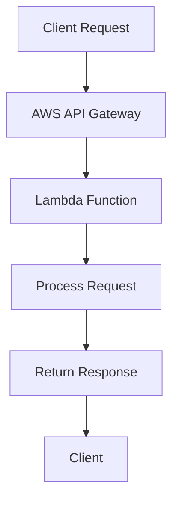

## 21.7. Serverless Architecture with Rust

Serverless computing has revolutionized the way developers build and deploy applications by abstracting away the complexities of server management. In this section, we will explore how Rust, a systems programming language known for its performance and safety, can be effectively utilized in serverless architectures. We will delve into the benefits, challenges, and best practices of using Rust in serverless environments, with a focus on platforms like AWS Lambda and Cloudflare Workers.

### Understanding Serverless Computing

Serverless computing is a cloud computing execution model where the cloud provider dynamically manages the allocation of machine resources. The term "serverless" is a bit of a misnomer; servers are still involved, but developers do not need to manage them. Instead, they focus on writing code that responds to events, such as HTTP requests or database changes.

#### Benefits of Serverless Computing

- **Cost Efficiency**: Pay only for the compute time you consume. There are no charges when your code is not running.
- **Scalability**: Automatically scales with the number of requests, handling thousands of concurrent executions.
- **Reduced Operational Complexity**: No need to provision, scale, or manage servers.
- **Focus on Code**: Developers can concentrate on writing business logic without worrying about infrastructure.

### Rust in Serverless Architectures

Rust's performance and safety features make it an excellent choice for serverless applications. Its zero-cost abstractions and memory safety without a garbage collector ensure efficient execution, which is crucial in environments where resources are billed per execution time.

#### Why Use Rust for Serverless?

- **Performance**: Rust's compiled binaries are fast and efficient, reducing execution time and cost.
- **Safety**: Rust's strict compile-time checks prevent many common bugs, such as null pointer dereferencing and data races.
- **Concurrency**: Rust's ownership model makes it easier to write concurrent code, which can be beneficial in handling multiple requests simultaneously.

### Writing Serverless Functions in Rust

To deploy serverless functions in Rust, we can use platforms like AWS Lambda and Cloudflare Workers. Let's explore how to set up and deploy a simple Rust function on these platforms.

#### AWS Lambda with Rust

AWS Lambda is a popular serverless computing service that supports Rust through the AWS Lambda Rust Runtime. Here's how you can set up a Rust project for AWS Lambda:

1. **Install the AWS CLI and SAM CLI**: These tools are necessary for deploying and managing Lambda functions.

2. **Create a New Rust Project**: Use Cargo to create a new Rust project.

   ```bash
   cargo new my_lambda_function
   cd my_lambda_function
   ```

3. **Add Dependencies**: Update `Cargo.toml` to include the AWS Lambda Rust Runtime.

   ```toml
   [dependencies]
   lambda_runtime = "0.3"
   serde = "1.0"
   serde_json = "1.0"
   ```

4. **Write the Lambda Function**: Implement the function handler in `src/main.rs`.

   ```rust
   use lambda_runtime::{handler_fn, Context, Error};
   use serde_json::{Value};

   #[tokio::main]
   async fn main() -> Result<(), Error> {
       let func = handler_fn(my_handler);
       lambda_runtime::run(func).await?;
       Ok(())
   }

   async fn my_handler(event: Value, _: Context) -> Result<Value, Error> {
       Ok(event)
   }
   ```

5. **Build and Deploy**: Use the SAM CLI to build and deploy your function.

   ```bash
   sam build
   sam deploy --guided
   ```

#### Cloudflare Workers with Rust

Cloudflare Workers allow you to run serverless functions at the edge, providing low-latency responses. Here's how to deploy a Rust function using Cloudflare Workers:

1. **Install Wrangler**: Cloudflare's CLI tool for managing Workers.

   ```bash
   npm install -g @cloudflare/wrangler
   ```

2. **Create a New Worker**: Use Wrangler to generate a new project.

   ```bash
   wrangler generate my_worker --type=rust
   cd my_worker
   ```

3. **Build the Worker**: Compile the Rust code to WebAssembly.

   ```bash
   wrangler build
   ```

4. **Deploy the Worker**: Publish your Worker to Cloudflare's network.

   ```bash
   wrangler publish
   ```

### Challenges in Serverless Environments

While serverless architectures offer many benefits, they also come with unique challenges:

- **Cold Starts**: The delay that occurs when a serverless function is invoked after being idle. Rust's fast startup time can mitigate this issue, but it's still a consideration.
- **Statelessness**: Serverless functions are inherently stateless, meaning they cannot retain data between invocations. Use external storage solutions like AWS S3 or DynamoDB for state persistence.
- **Resource Limits**: Serverless platforms impose limits on execution time, memory, and payload size. Optimize your Rust code to stay within these constraints.

### Performance Advantages of Rust in Serverless

Rust's performance characteristics make it particularly well-suited for serverless environments:

- **Low Latency**: Rust's efficient execution reduces the time taken to process requests.
- **Memory Efficiency**: Rust's lack of a garbage collector means less overhead and more predictable performance.
- **Concurrency**: Rust's ability to handle concurrent tasks efficiently can improve throughput in serverless applications.

### Best Practices for Optimizing Rust Serverless Functions

To get the most out of Rust in serverless environments, consider the following best practices:

- **Minimize Cold Starts**: Use techniques like keeping functions warm or optimizing startup code to reduce cold start latency.
- **Efficient Error Handling**: Use Rust's `Result` and `Option` types for robust error handling.
- **Optimize Dependencies**: Keep your `Cargo.toml` lean by only including necessary dependencies.
- **Profile and Benchmark**: Use tools like `cargo bench` to identify bottlenecks and optimize performance.
- **Security**: Ensure your functions are secure by validating inputs and using secure coding practices.

### Try It Yourself

Experiment with the provided code examples by modifying the function logic or adding new features. Deploy your changes to see how they perform in a serverless environment. Consider integrating with other AWS services or Cloudflare features to extend functionality.

### Visualizing Serverless Architecture with Rust

Below is a diagram illustrating the flow of a serverless function in AWS Lambda:



**Diagram Description**: This flowchart represents the lifecycle of a serverless function in AWS Lambda. A client request is routed through the AWS API Gateway to the Lambda function, which processes the request and returns a response to the client.

### References and Links

- [AWS Lambda Rust Runtime](https://github.com/awslabs/aws-lambda-rust-runtime)
- [Cloudflare Workers (with Rust)](https://developers.cloudflare.com/workers/learning/using-rust)
- [Rust Programming Language](https://www.rust-lang.org/)
- [Serverless Computing on AWS](https://aws.amazon.com/serverless/)

### Knowledge Check

- **What are the main benefits of using serverless computing?**
- **How does Rust's performance impact serverless function execution?**
- **What are some challenges specific to serverless environments?**
- **How can you minimize cold starts in serverless functions?**

### Embrace the Journey

Remember, this is just the beginning. As you explore serverless architectures with Rust, you'll discover new ways to optimize and enhance your applications. Keep experimenting, stay curious, and enjoy the journey!

## Quiz Time!



### What is a key benefit of serverless computing?

- [x] Cost efficiency
- [ ] Manual server management
- [ ] Fixed resource allocation
- [ ] Static scaling

> **Explanation:** Serverless computing is cost-efficient because you only pay for the compute time you consume.

### Which Rust feature is particularly beneficial for serverless environments?

- [x] Memory safety without garbage collection
- [ ] Manual memory management
- [ ] High-level abstractions
- [ ] Dynamic typing

> **Explanation:** Rust's memory safety without garbage collection ensures efficient execution, which is crucial in serverless environments.

### What is a common challenge in serverless architectures?

- [x] Cold starts
- [ ] Unlimited execution time
- [ ] Stateful functions
- [ ] High fixed costs

> **Explanation:** Cold starts are a common challenge in serverless architectures, as they introduce latency when a function is invoked after being idle.

### How can you deploy a Rust function on AWS Lambda?

- [x] Using the AWS Lambda Rust Runtime
- [ ] Directly uploading Rust source code
- [ ] Using Docker containers only
- [ ] Through Cloudflare Workers

> **Explanation:** The AWS Lambda Rust Runtime allows you to deploy Rust functions on AWS Lambda.

### What is a best practice for optimizing Rust serverless functions?

- [x] Minimize dependencies
- [ ] Use global variables
- [ ] Avoid error handling
- [ ] Increase payload size

> **Explanation:** Minimizing dependencies helps reduce the size of the deployment package and improves performance.

### Which tool is used to manage Cloudflare Workers?

- [x] Wrangler
- [ ] Cargo
- [ ] SAM CLI
- [ ] AWS CLI

> **Explanation:** Wrangler is the CLI tool used to manage Cloudflare Workers.

### What is a benefit of using Rust in serverless functions?

- [x] Low latency
- [ ] High memory usage
- [ ] Slow startup time
- [ ] Complex error handling

> **Explanation:** Rust's efficient execution results in low latency, which is beneficial for serverless functions.

### What is a characteristic of serverless functions?

- [x] Statelessness
- [ ] Stateful execution
- [ ] Fixed resource allocation
- [ ] Manual scaling

> **Explanation:** Serverless functions are stateless, meaning they cannot retain data between invocations.

### Which of the following is a Rust library for AWS Lambda?

- [x] lambda_runtime
- [ ] tokio
- [ ] serde
- [ ] hyper

> **Explanation:** The `lambda_runtime` library is used for writing AWS Lambda functions in Rust.

### True or False: Serverless functions automatically scale with the number of requests.

- [x] True
- [ ] False

> **Explanation:** Serverless functions automatically scale to handle the number of incoming requests.




