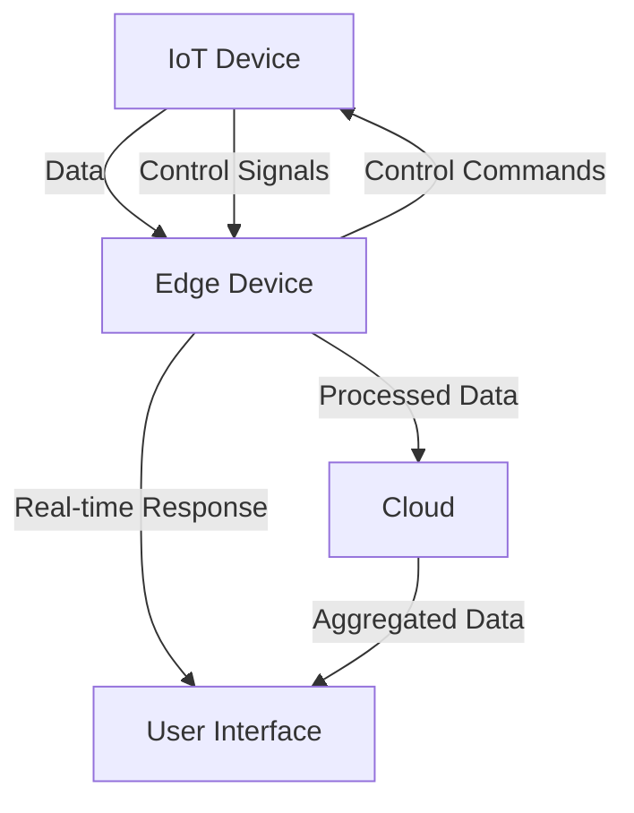

## 21.8. Edge Computing and IoT

### Introduction to Edge Computing and IoT

Edge computing is a distributed computing paradigm that brings computation and data storage closer to the location where it is needed, improving response times and saving bandwidth. In the context of the Internet of Things (IoT), edge computing is crucial as it allows data processing to occur at or near the data source, such as sensors or IoT devices, rather than relying on a centralized data center. This proximity reduces latency, enhances real-time data processing, and minimizes the amount of data that needs to be transmitted over the network.

### Why Rust for Edge Computing and IoT?

Rust is an ideal language for edge computing and IoT applications due to its unique combination of features:

- **Memory Safety**: Rust's ownership model ensures memory safety without a garbage collector, making it suitable for resource-constrained environments.
- **Performance**: Rust offers performance comparable to C and C++, which is critical for real-time processing on edge devices.
- **Concurrency**: Rust's concurrency model allows for safe and efficient parallel processing, essential for handling multiple data streams from IoT devices.
- **Low-Level Control**: Rust provides low-level access to hardware, enabling developers to write efficient code for embedded systems.

### Building Applications for Edge Devices Using Rust

Let's explore how to build a simple IoT application using Rust. We'll create a temperature monitoring system that reads data from a sensor and processes it locally on an edge device.

#### Setting Up the Environment

First, ensure that you have Rust installed on your system. You can install Rust using [rustup](https://rustup.rs/), the recommended tool for managing Rust versions and associated tools.

```bash
curl --proto '=https' --tlsv1.2 -sSf https://sh.rustup.rs | sh
```

#### Creating a New Rust Project

Create a new Rust project using Cargo, Rust's package manager and build system.

```bash
cargo new temperature_monitor
cd temperature_monitor
```

#### Implementing the Temperature Monitoring System

We'll simulate reading temperature data from a sensor and processing it locally.

```rust
use std::thread;
use std::time::Duration;

// Simulate reading temperature from a sensor
fn read_temperature() -> f32 {
    // In a real-world scenario, this function would interface with hardware
    22.5 // Returning a dummy temperature value
}

fn main() {
    loop {
        let temperature = read_temperature();
        println!("Current temperature: {}°C", temperature);

        // Process the temperature data
        if temperature > 25.0 {
            println!("Warning: High temperature detected!");
        }

        // Sleep for 5 seconds before reading the temperature again
        thread::sleep(Duration::from_secs(5));
    }
}
```

This simple application continuously reads temperature data and prints a warning if the temperature exceeds a certain threshold. In a real-world scenario, you would replace the `read_temperature` function with actual sensor interfacing code.

### Frameworks and Tools for IoT Development in Rust

Rust offers several frameworks and libraries that facilitate IoT development:

- **`librespot`**: An open-source client library for Spotify, demonstrating Rust's capability in handling complex streaming protocols.
- **`libp2p`**: A modular network stack for peer-to-peer applications, useful for decentralized IoT networks.
- **`tokio`**: An asynchronous runtime for Rust, enabling efficient I/O operations, crucial for handling multiple IoT devices.

#### Example: Using `libp2p` for IoT Networking

`libp2p` can be used to create a peer-to-peer network of IoT devices. Here's a basic example of setting up a simple peer-to-peer communication using `libp2p`.

```rust
use libp2p::{
    core::upgrade,
    futures::StreamExt,
    identity,
    noise::{Keypair, NoiseConfig, X25519Spec},
    swarm::Swarm,
    tcp::TcpConfig,
    yamux::YamuxConfig,
    Multiaddr, PeerId, Transport,
};

fn main() {
    // Generate a random keypair for the local peer
    let local_key = identity::Keypair::generate_ed25519();
    let local_peer_id = PeerId::from(local_key.public());
    println!("Local peer id: {:?}", local_peer_id);

    // Create a TCP transport
    let transport = TcpConfig::new()
        .upgrade(upgrade::Version::V1)
        .authenticate(NoiseConfig::xx(Keypair::<X25519Spec>::new().into_authentic(&local_key).unwrap()))
        .multiplex(YamuxConfig::default())
        .boxed();

    // Create a Swarm to manage peers and events
    let mut swarm = Swarm::new(transport, (), local_peer_id.clone());

    // Listen on a random port
    let listen_addr: Multiaddr = "/ip4/0.0.0.0/tcp/0".parse().unwrap();
    Swarm::listen_on(&mut swarm, listen_addr).unwrap();

    // Event loop
    let mut rt = tokio::runtime::Runtime::new().unwrap();
    rt.block_on(async {
        loop {
            match swarm.select_next_some().await {
                _ => {}
            }
        }
    });
}
```

This example sets up a basic peer-to-peer network using `libp2p`. You can extend this to handle specific IoT communication protocols and data exchange.

### Challenges in Edge Computing and IoT

Developing applications for edge computing and IoT presents several challenges:

- **Resource Constraints**: Edge devices often have limited processing power, memory, and storage. Rust's efficiency helps mitigate these constraints.
- **Connectivity**: IoT devices may experience intermittent connectivity. Designing robust communication protocols is essential.
- **Security**: Ensuring data security and device integrity is critical. Rust's safety features help prevent common vulnerabilities.

### Case Studies: Rust in Real-World IoT Deployments

#### Case Study 1: Smart Home Automation

A smart home automation system using Rust can efficiently manage various IoT devices, such as lights, thermostats, and security cameras. By leveraging Rust's concurrency model, the system can handle multiple device interactions simultaneously, ensuring a seamless user experience.

#### Case Study 2: Industrial IoT

In an industrial setting, Rust can be used to develop applications that monitor and control machinery. Rust's low-level control and performance make it suitable for real-time data processing and decision-making, enhancing operational efficiency and safety.

### Conclusion

Rust's unique features make it an excellent choice for edge computing and IoT applications. Its safety, performance, and low-level control enable developers to build efficient and reliable systems for a wide range of use cases. As you explore Rust for IoT development, remember to leverage its powerful ecosystem of libraries and tools to overcome challenges and create innovative solutions.

### Try It Yourself

Experiment with the code examples provided in this section. Try modifying the temperature threshold in the monitoring system or extend the `libp2p` example to include message passing between peers. These exercises will help solidify your understanding of Rust's capabilities in edge computing and IoT.

### Visualizing Edge Computing and IoT with Rust



**Diagram Description**: This diagram illustrates the flow of data in an edge computing and IoT setup. IoT devices send data to edge devices, which process the data locally and send only necessary information to the cloud. The edge device can also provide real-time responses to user interfaces and send control commands back to IoT devices.

### References and Further Reading

- [Rust Programming Language](https://www.rust-lang.org/)
- [libp2p Documentation](https://docs.libp2p.io/)
- [Tokio Asynchronous Runtime](https://tokio.rs/)
- [Edge Computing Overview](https://www.ibm.com/cloud/learn/edge-computing)

## Quiz Time!



### What is edge computing?

- [x] A distributed computing paradigm that brings computation closer to data sources.
- [ ] A centralized computing model.
- [ ] A type of cloud computing.
- [ ] A method for data storage.

> **Explanation:** Edge computing involves processing data near the data source to reduce latency and bandwidth usage.

### Why is Rust suitable for edge computing?

- [x] Rust offers memory safety without a garbage collector.
- [x] Rust provides low-level control and high performance.
- [ ] Rust is a dynamically typed language.
- [ ] Rust has a built-in garbage collector.

> **Explanation:** Rust's memory safety, performance, and low-level control make it ideal for resource-constrained environments like edge devices.

### Which library is used for peer-to-peer networking in Rust?

- [x] libp2p
- [ ] librespot
- [ ] tokio
- [ ] serde

> **Explanation:** `libp2p` is a modular network stack for building peer-to-peer applications in Rust.

### What is a challenge in edge computing?

- [x] Resource constraints on edge devices.
- [x] Intermittent connectivity.
- [x] Ensuring data security.
- [ ] Unlimited processing power.

> **Explanation:** Edge devices often have limited resources, connectivity issues, and security concerns.

### What does the `read_temperature` function simulate?

- [x] Reading temperature data from a sensor.
- [ ] Sending temperature data to the cloud.
- [ ] Controlling a thermostat.
- [ ] Displaying temperature on a screen.

> **Explanation:** The `read_temperature` function simulates reading data from a temperature sensor.

### What is the role of the `tokio` library in Rust?

- [x] It provides an asynchronous runtime for efficient I/O operations.
- [ ] It is used for data serialization.
- [ ] It is a library for machine learning.
- [ ] It handles cryptographic operations.

> **Explanation:** `tokio` is an asynchronous runtime that facilitates efficient I/O operations in Rust.

### What is a benefit of edge computing in IoT?

- [x] Reduced latency and improved real-time processing.
- [ ] Increased data storage requirements.
- [ ] Centralized data processing.
- [ ] Higher network bandwidth usage.

> **Explanation:** Edge computing reduces latency by processing data closer to the source, improving real-time processing.

### How does Rust ensure memory safety?

- [x] Through its ownership model.
- [ ] By using a garbage collector.
- [ ] By being an interpreted language.
- [ ] By using dynamic typing.

> **Explanation:** Rust's ownership model ensures memory safety without the need for a garbage collector.

### What is the purpose of the `librespot` library?

- [x] It is an open-source client library for Spotify.
- [ ] It is used for peer-to-peer networking.
- [ ] It provides asynchronous runtime capabilities.
- [ ] It is a library for data serialization.

> **Explanation:** `librespot` is a client library for Spotify, demonstrating Rust's capability in handling streaming protocols.

### True or False: Rust's concurrency model allows for safe and efficient parallel processing.

- [x] True
- [ ] False

> **Explanation:** Rust's concurrency model is designed to allow safe and efficient parallel processing, making it suitable for handling multiple data streams.



Remember, this is just the beginning. As you progress, you'll build more complex and interactive IoT applications. Keep experimenting, stay curious, and enjoy the journey!
