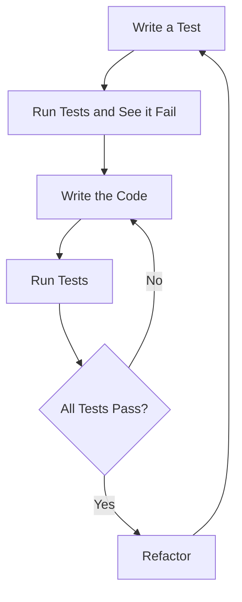

## 22.1. Test-Driven Development (TDD) with Rust

### Introduction to Test-Driven Development (TDD)

Test-Driven Development (TDD) is a software development methodology that emphasizes writing tests before writing the actual code. This approach ensures that the code is thoroughly tested and meets the specified requirements. TDD is not just about testing; it's a design philosophy that encourages developers to think about the desired behavior of their code before implementation.

#### Principles of TDD

1. **Write a Test**: Begin by writing a test for the next bit of functionality you want to add.
2. **Run All Tests and See if the New Test Fails**: This step ensures that the test is valid and that the feature is not already present.
3. **Write the Code**: Implement the minimal amount of code necessary to pass the test.
4. **Run Tests**: Ensure all tests pass, confirming that the new code meets the requirements.
5. **Refactor**: Clean up the code, optimizing it without changing its behavior.
6. **Repeat**: Continue the cycle, gradually building up the functionality.

#### Benefits of TDD

- **Improved Code Quality**: By writing tests first, developers are forced to consider edge cases and potential issues upfront.
- **Reduced Debugging Time**: Tests catch bugs early, reducing the time spent on debugging later.
- **Better Design**: TDD encourages modular, flexible, and maintainable code.
- **Documentation**: Tests serve as documentation for the code, explaining its intended behavior.

### Rust's Testing Framework and TDD

Rust provides a robust testing framework built into its ecosystem, making it an excellent choice for TDD. The `cargo test` command is used to run tests, and Rust's standard library includes the `test` module, which provides macros and functions for writing tests.

#### Writing Tests in Rust

Rust tests are functions annotated with the `#[test]` attribute. Here's a simple example:

```rust
#[cfg(test)]
mod tests {
    #[test]
    fn it_works() {
        assert_eq!(2 + 2, 4);
    }
}
```

- **`#[cfg(test)]`**: This attribute ensures that the module is only compiled when running tests.
- **`#[test]`**: Marks a function as a test function.
- **`assert_eq!`**: A macro used to assert that two expressions are equal.

### Implementing TDD in Rust: A Step-by-Step Guide

Let's walk through a simple example of TDD in Rust by implementing a basic calculator.

#### Step 1: Write a Test

First, we write a test for the addition functionality:

```rust
#[cfg(test)]
mod tests {
    use super::*;

    #[test]
    fn test_add() {
        assert_eq!(add(2, 3), 5);
    }
}
```

#### Step 2: Run the Test and See it Fail

At this point, the `add` function doesn't exist, so the test will fail. This failure confirms that the test is valid and that the functionality is not yet implemented.

#### Step 3: Write the Code

Now, we implement the `add` function:

```rust
pub fn add(a: i32, b: i32) -> i32 {
    a + b
}
```

#### Step 4: Run Tests

Run `cargo test` to execute the tests. The test should pass, indicating that the `add` function works as expected.

#### Step 5: Refactor

Review the code and make any necessary improvements. In this simple case, the code is already optimal.

#### Step 6: Repeat

Continue the cycle by writing tests for other operations like subtraction, multiplication, and division.

### Best Practices for TDD in Rust

- **Small Iteration Cycles**: Keep the TDD cycle short to maintain focus and momentum.
- **Refactor Regularly**: Clean up code frequently to prevent technical debt.
- **Test Edge Cases**: Consider edge cases and potential errors when writing tests.
- **Use Descriptive Test Names**: Clearly describe what each test is verifying.
- **Leverage Rust's Type System**: Use Rust's strong type system to catch errors at compile time.

### TDD's Impact on Code Design and Maintainability

TDD encourages developers to write modular and decoupled code, as tests are easier to write and maintain for small, independent units. This leads to a more maintainable codebase, as changes in one part of the system are less likely to affect others.

#### Code Design

- **Modularity**: TDD promotes breaking down functionality into small, testable units.
- **Encapsulation**: Tests encourage encapsulation, as they require clear interfaces.
- **Flexibility**: Well-tested code is easier to refactor and extend.

#### Maintainability

- **Reduced Bugs**: Tests catch bugs early, reducing the likelihood of defects in production.
- **Easier Refactoring**: With a comprehensive test suite, developers can refactor code with confidence.
- **Improved Collaboration**: Tests serve as documentation, making it easier for new team members to understand the codebase.

### Encouraging TDD Adoption in Rust Projects

To successfully adopt TDD in Rust projects, consider the following strategies:

- **Start Small**: Begin with small, manageable projects to build confidence and experience.
- **Educate the Team**: Provide training and resources to help team members understand TDD.
- **Integrate TDD into the Workflow**: Make TDD a part of the development process, not an afterthought.
- **Celebrate Successes**: Highlight the benefits of TDD, such as reduced bugs and improved code quality.

### Try It Yourself

Experiment with TDD by modifying the calculator example:

- **Add New Operations**: Implement subtraction, multiplication, and division.
- **Handle Edge Cases**: Write tests for edge cases, such as division by zero.
- **Refactor**: Improve the code structure and readability.

### Visualizing TDD Workflow

Below is a flowchart illustrating the TDD cycle:



**Figure 1**: The TDD cycle involves writing a test, running it to see it fail, writing the minimal code to pass the test, running the tests again, and refactoring the code.

### References and Further Reading

- [Rust Documentation on Testing](https://doc.rust-lang.org/book/ch11-01-writing-tests.html)
- [Test-Driven Development by Example by Kent Beck](https://www.amazon.com/Test-Driven-Development-Kent-Beck/dp/0321146530)
- [The Rust Programming Language Book](https://doc.rust-lang.org/book/)

### Knowledge Check

- **What are the main steps in the TDD cycle?**
- **How does Rust's testing framework support TDD?**
- **What are the benefits of using TDD in software development?**

### Embrace the Journey

Remember, adopting TDD is a journey. Start small, practice regularly, and gradually integrate TDD into your workflow. As you become more comfortable with TDD, you'll find that it not only improves code quality but also enhances your overall development process. Keep experimenting, stay curious, and enjoy the journey!

## Quiz Time!



### What is the first step in the TDD cycle?

- [x] Write a test
- [ ] Write the code
- [ ] Refactor the code
- [ ] Run all tests

> **Explanation:** The first step in the TDD cycle is to write a test for the functionality you want to add.

### How does Rust's testing framework support TDD?

- [x] By providing built-in test macros and functions
- [ ] By requiring external libraries for testing
- [ ] By automatically generating tests
- [ ] By using a separate testing language

> **Explanation:** Rust's testing framework supports TDD by providing built-in test macros and functions, making it easy to write and run tests.

### What is a key benefit of TDD?

- [x] Improved code quality
- [ ] Faster development time
- [ ] Less code to write
- [ ] Automatic code generation

> **Explanation:** A key benefit of TDD is improved code quality, as it encourages thorough testing and consideration of edge cases.

### What does the `#[test]` attribute do in Rust?

- [x] Marks a function as a test function
- [ ] Compiles the function only in release mode
- [ ] Optimizes the function for performance
- [ ] Excludes the function from compilation

> **Explanation:** The `#[test]` attribute in Rust marks a function as a test function, which will be executed when running `cargo test`.

### Why is refactoring an important part of TDD?

- [x] It improves code structure and readability
- [ ] It reduces the number of tests needed
- [ ] It speeds up the development process
- [ ] It automatically fixes bugs

> **Explanation:** Refactoring is important in TDD because it improves code structure and readability without changing its behavior.

### What is the purpose of the `assert_eq!` macro in Rust tests?

- [x] To assert that two expressions are equal
- [ ] To assert that a condition is true
- [ ] To skip a test
- [ ] To log a message

> **Explanation:** The `assert_eq!` macro in Rust is used to assert that two expressions are equal, which is a common way to verify test outcomes.

### How does TDD impact code design?

- [x] Encourages modular and decoupled code
- [ ] Leads to more complex code
- [ ] Requires more dependencies
- [ ] Slows down the design process

> **Explanation:** TDD encourages modular and decoupled code, as tests are easier to write and maintain for small, independent units.

### What is a common practice in TDD to ensure code quality?

- [x] Small iteration cycles
- [ ] Large iteration cycles
- [ ] Skipping tests
- [ ] Writing code before tests

> **Explanation:** A common practice in TDD is to use small iteration cycles, which helps maintain focus and ensures thorough testing.

### What role do tests play in TDD beyond verifying functionality?

- [x] They serve as documentation
- [ ] They replace the need for comments
- [ ] They increase code complexity
- [ ] They are optional

> **Explanation:** In TDD, tests serve as documentation, explaining the intended behavior of the code and making it easier for others to understand.

### True or False: TDD can reduce debugging time.

- [x] True
- [ ] False

> **Explanation:** True. TDD can reduce debugging time by catching bugs early in the development process through comprehensive testing.




