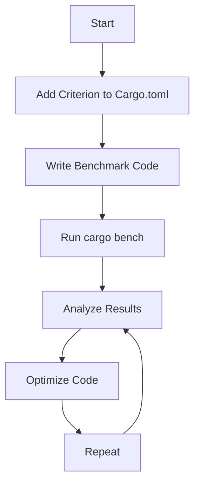

## 22.10. Performance Testing and Benchmarking with Criterion

In the world of software development, performance is often as critical as functionality. As Rust developers, we are fortunate to have a language that emphasizes safety and performance. However, writing performant code is not just about using the right language; it requires careful measurement and analysis. This is where performance testing and benchmarking come into play.

### The Importance of Performance Testing and Benchmarking

Performance testing and benchmarking are essential practices in software development. They help us:

- **Identify Bottlenecks**: By measuring the execution time of code, we can pinpoint slow sections that need optimization.
- **Validate Optimizations**: After making changes to improve performance, benchmarks can confirm whether the changes had the desired effect.
- **Compare Implementations**: When considering different algorithms or data structures, benchmarks provide empirical data to guide decisions.
- **Track Performance Over Time**: Regular benchmarking helps ensure that performance regressions are caught early in the development process.

### Introducing the Criterion Crate

Rust's standard library includes basic benchmarking capabilities, but for more advanced needs, the [Criterion.rs](https://github.com/bheisler/criterion.rs) crate is an excellent choice. Criterion provides a powerful and flexible framework for benchmarking Rust code, offering features such as:

- **Statistical Analysis**: Criterion uses statistical methods to provide more reliable results.
- **Customizable Measurement**: You can adjust the measurement parameters to suit your needs.
- **Comparison of Results**: Criterion can compare the performance of different versions of your code.
- **Graphical Reports**: It generates detailed reports with graphs to visualize performance data.

### Writing Benchmarks with Criterion

Let's dive into how we can write benchmarks using Criterion. We'll start with a simple example to illustrate the basic setup and usage.

#### Setting Up Criterion

First, add Criterion to your `Cargo.toml`:

```toml
[dev-dependencies]
criterion = "0.3"
```

Next, create a new file in your `tests` directory, for example, `bench.rs`, and include the following setup:

```rust
use criterion::{black_box, criterion_group, criterion_main, Criterion};

fn fibonacci(n: u64) -> u64 {
    match n {
        0 => 0,
        1 => 1,
        _ => fibonacci(n - 1) + fibonacci(n - 2),
    }
}

fn criterion_benchmark(c: &mut Criterion) {
    c.bench_function("fibonacci 20", |b| b.iter(|| fibonacci(black_box(20))));
}

criterion_group!(benches, criterion_benchmark);
criterion_main!(benches);
```

#### Explanation of the Code

- **Criterion Setup**: We import necessary components from the Criterion crate.
- **Benchmark Function**: The `fibonacci` function is a simple recursive implementation used for demonstration.
- **Benchmark Definition**: The `criterion_benchmark` function defines a benchmark using `c.bench_function`.
- **Black Box**: The `black_box` function is used to prevent the compiler from optimizing away the code being benchmarked.
- **Criterion Group and Main**: `criterion_group!` and `criterion_main!` macros are used to define and run the benchmarks.

#### Running the Benchmark

To run the benchmark, execute the following command in your terminal:

```bash
cargo bench
```

Criterion will execute the benchmark and provide a detailed report of the results.

### Interpreting Benchmark Results

Criterion provides output that includes statistical analysis of the benchmark results. Here's how to interpret some of the key metrics:

- **Mean Time**: The average time taken for the benchmark to complete.
- **Standard Deviation**: Indicates the variability of the benchmark results.
- **Median Time**: The middle value of the sorted benchmark times, providing a robust measure of central tendency.
- **Graphs**: Criterion generates graphs that visualize the distribution of benchmark times, making it easier to spot anomalies or trends.

### Comparing Alternative Implementations

One of the powerful features of Criterion is its ability to compare different implementations. Let's see how we can benchmark two different implementations of a function and compare their performance.

#### Example: Comparing Sorting Algorithms

Suppose we have two sorting functions, `bubble_sort` and `quick_sort`, and we want to determine which is faster for a given dataset.

```rust
fn bubble_sort(arr: &mut [i32]) {
    let mut n = arr.len();
    while n > 0 {
        let mut new_n = 0;
        for i in 1..n {
            if arr[i - 1] > arr[i] {
                arr.swap(i - 1, i);
                new_n = i;
            }
        }
        n = new_n;
    }
}

fn quick_sort(arr: &mut [i32]) {
    if arr.len() <= 1 {
        return;
    }
    let pivot = arr[arr.len() / 2];
    let (mut left, mut right) = (0, arr.len() - 1);
    while left <= right {
        while arr[left] < pivot {
            left += 1;
        }
        while arr[right] > pivot {
            right = right.wrapping_sub(1);
        }
        if left <= right {
            arr.swap(left, right);
            left += 1;
            right = right.wrapping_sub(1);
        }
    }
    quick_sort(&mut arr[0..right + 1]);
    quick_sort(&mut arr[left..]);
}

fn criterion_benchmark(c: &mut Criterion) {
    let mut group = c.benchmark_group("Sorting Algorithms");
    let mut data = vec![5, 4, 3, 2, 1];
    
    group.bench_function("bubble_sort", |b| b.iter(|| bubble_sort(black_box(&mut data))));
    group.bench_function("quick_sort", |b| b.iter(|| quick_sort(black_box(&mut data))));
    
    group.finish();
}
```

#### Running and Analyzing the Comparison

After running the benchmarks, Criterion will provide a comparison of the two functions. Look for differences in mean times and other statistical measures to determine which implementation is more efficient.

### Integrating Benchmarks into the Development Workflow

To maximize the benefits of benchmarking, integrate it into your development workflow. Here are some best practices:

- **Automate Benchmarks**: Use continuous integration (CI) tools to run benchmarks automatically on each commit.
- **Track Changes Over Time**: Store benchmark results to track performance changes over time and catch regressions early.
- **Use Benchmarks for Decision Making**: Let empirical data guide your decisions on optimizations and refactoring.

### Encouragement to Experiment

Remember, performance testing and benchmarking are iterative processes. As you gain experience, you'll develop an intuition for where bottlenecks might occur and how to address them. Keep experimenting, stay curious, and enjoy the journey of making your Rust code as efficient as possible!

### Try It Yourself

To deepen your understanding, try modifying the code examples:

- **Experiment with Different Data Sizes**: Change the size of the input data to see how it affects performance.
- **Add More Implementations**: Implement additional sorting algorithms and compare their performance.
- **Visualize Results**: Use Criterion's output to create your own visualizations of the performance data.

### Visualizing Benchmark Results

To help visualize the benchmarking process, let's use a Mermaid.js diagram to represent the workflow of setting up and running a benchmark with Criterion.



**Diagram Description**: This flowchart illustrates the iterative process of performance testing with Criterion. Start by adding Criterion to your project, write benchmark code, run the benchmarks, analyze the results, optimize the code, and repeat the process.

### References and Further Reading

For more information on Criterion and performance testing in Rust, consider the following resources:

- [Criterion.rs GitHub Repository](https://github.com/bheisler/criterion.rs)
- [Rust Performance Book](https://nnethercote.github.io/perf-book/)
- [Rust Programming Language Official Documentation](https://doc.rust-lang.org/)

## Quiz Time!



### What is the primary purpose of performance testing and benchmarking?

- [x] To identify bottlenecks and validate optimizations
- [ ] To ensure code compiles without errors
- [ ] To check for syntax errors
- [ ] To verify code logic

> **Explanation:** Performance testing and benchmarking help identify bottlenecks and validate optimizations in code.

### Which crate is commonly used for advanced benchmarking in Rust?

- [x] Criterion
- [ ] Serde
- [ ] Rayon
- [ ] Tokio

> **Explanation:** Criterion is a popular crate used for advanced benchmarking in Rust.

### What function is used in Criterion to prevent the compiler from optimizing away code?

- [x] black_box
- [ ] bench_function
- [ ] criterion_group
- [ ] criterion_main

> **Explanation:** The `black_box` function is used to prevent the compiler from optimizing away the code being benchmarked.

### What statistical measure does Criterion provide to indicate variability in benchmark results?

- [x] Standard Deviation
- [ ] Mean Time
- [ ] Median Time
- [ ] Maximum Time

> **Explanation:** Standard deviation indicates the variability of the benchmark results.

### What is a best practice for integrating benchmarks into the development workflow?

- [x] Automate benchmarks with CI tools
- [ ] Run benchmarks manually once a year
- [ ] Ignore benchmark results
- [ ] Only benchmark after code is complete

> **Explanation:** Automating benchmarks with CI tools ensures they are run consistently and results are tracked over time.

### Which of the following is NOT a feature of Criterion?

- [ ] Statistical Analysis
- [ ] Customizable Measurement
- [ ] Graphical Reports
- [x] Code Compilation

> **Explanation:** Code compilation is not a feature of Criterion; it focuses on benchmarking and analysis.

### How can Criterion help in comparing different implementations?

- [x] By providing empirical data on performance
- [ ] By automatically choosing the best implementation
- [ ] By rewriting code for optimization
- [ ] By compiling code faster

> **Explanation:** Criterion provides empirical data on performance, allowing developers to compare different implementations.

### What command is used to run benchmarks with Criterion?

- [x] cargo bench
- [ ] cargo run
- [ ] cargo test
- [ ] cargo build

> **Explanation:** The `cargo bench` command is used to run benchmarks with Criterion.

### True or False: Criterion can generate graphical reports to visualize performance data.

- [x] True
- [ ] False

> **Explanation:** Criterion can generate graphical reports to help visualize performance data.

### What is the purpose of the `criterion_group!` macro in Criterion?

- [x] To define and organize benchmarks
- [ ] To compile benchmarks
- [ ] To run benchmarks
- [ ] To optimize code

> **Explanation:** The `criterion_group!` macro is used to define and organize benchmarks in Criterion.



Remember, this is just the beginning. As you progress, you'll build more complex and efficient Rust applications. Keep experimenting, stay curious, and enjoy the journey!
