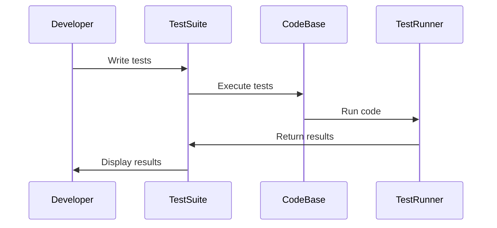

## 22.11. Writing Effective Tests

Testing is a crucial aspect of software development, ensuring that code behaves as expected and remains robust over time. In Rust, writing effective tests involves understanding the language's unique features and leveraging them to create tests that are fast, deterministic, and maintainable. In this section, we'll explore the characteristics of good tests, provide tips on test naming and structure, and discuss the importance of test coverage and avoiding common pitfalls.

### Characteristics of Good Tests

Effective tests share several key characteristics that make them valuable tools in the software development process:

1. **Fast**: Tests should execute quickly to provide immediate feedback. Slow tests can hinder development speed and discourage frequent testing.

2. **Deterministic**: Tests should produce the same results every time they are run, regardless of the environment or order of execution. This ensures reliability and trust in the test outcomes.

3. **Isolated**: Each test should be independent and not rely on the state or outcome of other tests. This isolation prevents cascading failures and makes it easier to identify the source of a problem.

4. **Clear and Concise**: Tests should be easy to read and understand, with clear intentions and minimal complexity. This clarity aids in maintaining and updating tests as the codebase evolves.

5. **Comprehensive**: While not exhaustive, tests should cover a wide range of scenarios, including edge cases and error conditions, to ensure robust code behavior.

6. **Maintainable**: Tests should be easy to update and refactor as the codebase changes. This involves avoiding over-reliance on implementation details and focusing on behavior.

### Test Naming, Structure, and Clarity

A well-structured test suite is easier to navigate and understand. Here are some tips for naming and organizing tests:

- **Descriptive Names**: Use descriptive names for test functions that clearly convey the purpose and expected outcome. For example, `test_addition_with_positive_numbers` is more informative than `test_add`.

- **Arrange-Act-Assert Pattern**: Structure tests using the Arrange-Act-Assert pattern to separate setup, execution, and verification phases. This pattern enhances readability and clarity.

- **Use Modules for Organization**: Group related tests into modules to improve organization and discoverability. Rust's module system allows for logical grouping of tests.

- **Comments and Documentation**: Include comments and documentation within tests to explain complex logic or the purpose of specific assertions. This aids in understanding and maintaining tests.

### Testing Edge Cases and Error Conditions

Testing edge cases and error conditions is essential for ensuring robust code behavior. Consider the following when designing tests:

- **Boundary Conditions**: Test the limits of input ranges to ensure correct handling of edge cases. For example, test both the minimum and maximum values for numeric inputs.

- **Invalid Inputs**: Include tests for invalid or unexpected inputs to verify that the code handles errors gracefully. This can involve testing for exceptions or specific error messages.

- **Concurrency and Race Conditions**: In concurrent code, test for race conditions and ensure thread safety. Use Rust's concurrency primitives to simulate and verify concurrent behavior.

### Test Coverage and Avoiding Over-Testing

Test coverage is an important metric, but it's essential to strike a balance between coverage and over-testing:

- **Focus on Critical Paths**: Prioritize testing critical paths and high-risk areas of the codebase. This ensures that the most important functionality is thoroughly verified.

- **Avoid Redundant Tests**: Avoid writing redundant tests that duplicate coverage without adding value. Each test should provide unique insights into the code's behavior.

- **Use Code Coverage Tools**: Leverage tools like `tarpaulin` to measure test coverage and identify untested code paths. This can help guide testing efforts and highlight areas for improvement.

### Avoiding Common Testing Pitfalls

Effective testing involves avoiding common pitfalls that can undermine test quality:

- **Brittle Tests**: Avoid tests that are overly sensitive to implementation details or minor changes in the codebase. Focus on testing behavior rather than specific implementations.

- **Over-Reliance on Mocks**: While mocks are useful for isolating tests, over-reliance on them can lead to tests that don't accurately reflect real-world scenarios. Use mocks judiciously and complement them with integration tests.

- **Neglecting Refactoring**: Regularly refactor tests to improve clarity and maintainability. This includes removing obsolete tests and updating tests to reflect changes in the codebase.

### The Role of Tests in Documentation and Code Understanding

Tests serve as a form of documentation, providing insights into how the code is expected to behave. They can also aid in understanding complex logic and serve as examples for using the code:

- **Executable Documentation**: Tests act as executable documentation, demonstrating how the code should be used and what outcomes to expect. This is particularly valuable for new team members or contributors.

- **Clarifying Intent**: Well-written tests clarify the intent behind code, making it easier to understand the rationale for specific implementations or design decisions.

- **Facilitating Code Reviews**: Tests can facilitate code reviews by providing concrete examples of expected behavior. Reviewers can use tests to verify that changes align with intended functionality.

### Code Example: Writing Effective Tests in Rust

Let's explore a simple example of writing effective tests in Rust. We'll create a basic calculator module and write tests to verify its functionality.

```rust
// calculator.rs

pub struct Calculator;

impl Calculator {
    pub fn add(a: i32, b: i32) -> i32 {
        a + b
    }

    pub fn subtract(a: i32, b: i32) -> i32 {
        a - b
    }

    pub fn multiply(a: i32, b: i32) -> i32 {
        a * b
    }

    pub fn divide(a: i32, b: i32) -> Result<i32, &'static str> {
        if b == 0 {
            Err("Cannot divide by zero")
        } else {
            Ok(a / b)
        }
    }
}

#[cfg(test)]
mod tests {
    use super::*;

    #[test]
    fn test_addition_with_positive_numbers() {
        assert_eq!(Calculator::add(2, 3), 5);
    }

    #[test]
    fn test_subtraction_with_negative_result() {
        assert_eq!(Calculator::subtract(2, 5), -3);
    }

    #[test]
    fn test_multiplication_with_zero() {
        assert_eq!(Calculator::multiply(0, 5), 0);
    }

    #[test]
    fn test_division_by_non_zero() {
        assert_eq!(Calculator::divide(10, 2).unwrap(), 5);
    }

    #[test]
    fn test_division_by_zero() {
        assert_eq!(Calculator::divide(10, 0), Err("Cannot divide by zero"));
    }
}
```

### Try It Yourself

Experiment with the code example by adding more tests to cover additional scenarios, such as:

- Testing the `add` function with negative numbers.
- Verifying the behavior of the `subtract` function with zero.
- Exploring edge cases for the `multiply` function with large numbers.

### Visualizing the Testing Process

To better understand the testing process, let's visualize the flow of a typical test using a sequence diagram:



**Diagram Description**: This sequence diagram illustrates the interaction between the developer, test suite, codebase, and test runner during the testing process. The developer writes tests, which are executed against the codebase. The test runner runs the code and returns the results to the test suite, which then displays the results to the developer.

### References and Links

For further reading on testing in Rust, consider exploring the following resources:

- [The Rust Programming Language Book - Testing](https://doc.rust-lang.org/book/ch11-00-testing.html)
- [Rust By Example - Testing](https://doc.rust-lang.org/rust-by-example/testing.html)
- [Rust Documentation - Testing](https://doc.rust-lang.org/stable/rust-by-example/testing/unit_testing.html)

### Knowledge Check

To reinforce your understanding of writing effective tests in Rust, consider the following questions and exercises:

- What are the key characteristics of effective tests?
- How can you ensure that tests are isolated and deterministic?
- Why is it important to test edge cases and error conditions?
- How can you avoid common testing pitfalls, such as brittle tests?
- Experiment with the provided code example by adding new tests and scenarios.

### Embrace the Journey

Remember, writing effective tests is an ongoing journey. As you continue to develop your Rust skills, you'll discover new techniques and strategies for creating robust and maintainable test suites. Keep experimenting, stay curious, and enjoy the process of building reliable software!

## Quiz Time!



### What is a key characteristic of effective tests?

- [x] Fast execution
- [ ] Complex logic
- [ ] Dependence on other tests
- [ ] Random outcomes

> **Explanation:** Effective tests should execute quickly to provide immediate feedback.

### How should tests be structured for clarity?

- [x] Using the Arrange-Act-Assert pattern
- [ ] Mixing setup and verification
- [ ] Avoiding comments
- [ ] Using random names

> **Explanation:** The Arrange-Act-Assert pattern separates setup, execution, and verification phases for clarity.

### Why is it important to test edge cases?

- [x] To ensure robust code behavior
- [ ] To increase code complexity
- [ ] To reduce test coverage
- [ ] To avoid testing invalid inputs

> **Explanation:** Testing edge cases ensures that the code handles boundary conditions correctly.

### What should be avoided to prevent brittle tests?

- [x] Over-reliance on implementation details
- [ ] Testing behavior
- [ ] Using descriptive names
- [ ] Testing critical paths

> **Explanation:** Brittle tests are overly sensitive to implementation details and can break easily.

### What role do tests play in documentation?

- [x] They act as executable documentation
- [ ] They increase code complexity
- [ ] They replace comments
- [ ] They are only for debugging

> **Explanation:** Tests demonstrate how the code should be used and what outcomes to expect.

### How can you measure test coverage in Rust?

- [x] Using tools like `tarpaulin`
- [ ] By counting test files
- [ ] By avoiding edge cases
- [ ] By writing more comments

> **Explanation:** Tools like `tarpaulin` help measure test coverage and identify untested code paths.

### What is a common pitfall in testing?

- [x] Over-reliance on mocks
- [ ] Testing edge cases
- [ ] Using the Arrange-Act-Assert pattern
- [ ] Writing descriptive names

> **Explanation:** Over-reliance on mocks can lead to tests that don't accurately reflect real-world scenarios.

### How can tests facilitate code reviews?

- [x] By providing concrete examples of expected behavior
- [ ] By increasing code complexity
- [ ] By replacing documentation
- [ ] By avoiding edge cases

> **Explanation:** Tests provide examples of expected behavior, aiding in verifying changes during code reviews.

### What is the benefit of isolated tests?

- [x] They prevent cascading failures
- [ ] They increase test complexity
- [ ] They depend on other tests
- [ ] They produce random outcomes

> **Explanation:** Isolated tests prevent cascading failures and make it easier to identify the source of a problem.

### True or False: Tests should focus on behavior rather than specific implementations.

- [x] True
- [ ] False

> **Explanation:** Focusing on behavior ensures that tests remain valid even if the implementation changes.


