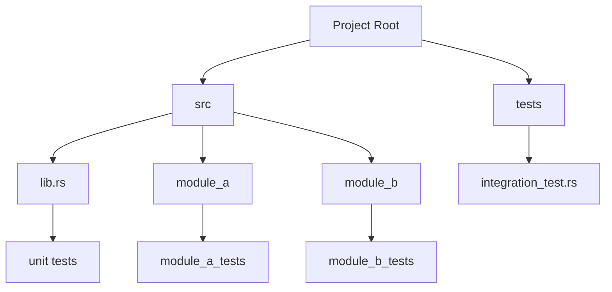

## 22.12. Test Organization and Management

In the world of software development, testing is not just a phase but a continuous process that ensures the reliability and quality of your code. As your Rust projects grow in complexity, organizing and managing tests becomes crucial. This section will guide you through best practices for structuring test modules, using test fixtures, managing test data, and maintaining efficient test suites.

### Structuring Test Modules and Files

Organizing your test code is as important as organizing your application code. A well-structured test suite can significantly enhance maintainability and readability. Let's explore how to achieve this in Rust.

#### Module-Based Organization

In Rust, tests are typically organized within the same module as the code they are testing. This approach keeps tests close to the code, making it easier to understand the context and purpose of each test.

```rust
// src/lib.rs

pub fn add(a: i32, b: i32) -> i32 {
    a + b
}

#[cfg(test)]
mod tests {
    use super::*;

    #[test]
    fn test_add() {
        assert_eq!(add(2, 3), 5);
    }
}
```

**Key Points:**
- **Use `#[cfg(test)]`**: This attribute ensures that the test module is only compiled when running tests, keeping your production code lean.
- **Place tests in the same module**: This proximity helps in understanding the relationship between the code and its tests.

#### Separate Test Files

For larger projects, it might be beneficial to separate tests into different files. Rust allows you to create a `tests` directory at the root of your project for integration tests.

```rust
// tests/integration_test.rs

use my_crate::add;

#[test]
fn integration_test_add() {
    assert_eq!(add(5, 5), 10);
}
```

**Advantages:**
- **Clear separation**: Integration tests are separated from unit tests, providing a clear distinction between different types of tests.
- **Scalability**: As your project grows, you can add more test files without cluttering your main codebase.

### Using Test Fixtures and Shared Utilities

Test fixtures and shared utilities help in setting up a consistent test environment and reusing common setup code.

#### Test Fixtures

Test fixtures are used to set up the necessary environment for tests. In Rust, you can create fixtures using functions or structs.

```rust
// src/lib.rs

pub struct Calculator {
    pub value: i32,
}

impl Calculator {
    pub fn new() -> Self {
        Calculator { value: 0 }
    }

    pub fn add(&mut self, val: i32) {
        self.value += val;
    }
}

#[cfg(test)]
mod tests {
    use super::*;

    fn setup() -> Calculator {
        Calculator::new()
    }

    #[test]
    fn test_add() {
        let mut calc = setup();
        calc.add(5);
        assert_eq!(calc.value, 5);
    }
}
```

**Benefits:**
- **Reusability**: Fixtures allow you to reuse setup code across multiple tests.
- **Clarity**: By abstracting setup code, tests become more focused on the actual logic being tested.

#### Shared Test Utilities

For common utilities that are used across multiple test modules, consider creating a `test_utils` module.

```rust
// src/test_utils.rs

pub fn common_setup() -> i32 {
    // Common setup logic
    42
}

// src/lib.rs

#[cfg(test)]
mod tests {
    use super::*;
    use crate::test_utils::common_setup;

    #[test]
    fn test_with_common_setup() {
        let value = common_setup();
        assert_eq!(value, 42);
    }
}
```

### Grouping Tests Logically

Grouping tests logically can enhance readability and maintainability. Consider grouping tests by feature or module.

#### Feature-Based Grouping

Organize tests based on the features they test. This approach is particularly useful for projects with distinct features.

```rust
// src/features/feature_a.rs

pub fn feature_a_function() -> bool {
    true
}

#[cfg(test)]
mod feature_a_tests {
    use super::*;

    #[test]
    fn test_feature_a_function() {
        assert!(feature_a_function());
    }
}
```

#### Module-Based Grouping

For projects with a modular architecture, group tests by module.

```rust
// src/module_a/mod.rs

pub fn module_a_function() -> i32 {
    10
}

#[cfg(test)]
mod module_a_tests {
    use super::*;

    #[test]
    fn test_module_a_function() {
        assert_eq!(module_a_function(), 10);
    }
}
```

### Managing Test Data and Resources

Handling test data efficiently is crucial for maintaining fast and reliable tests.

#### Using Mock Data

For tests that require data, use mock data to simulate real-world scenarios without relying on external resources.

```rust
// src/lib.rs

pub fn process_data(data: &str) -> usize {
    data.len()
}

#[cfg(test)]
mod tests {
    use super::*;

    #[test]
    fn test_process_data() {
        let mock_data = "mock data";
        assert_eq!(process_data(mock_data), 9);
    }
}
```

#### Cleaning Up Resources

Ensure that tests clean up any resources they use, such as files or network connections, to prevent side effects.

```rust
#[test]
fn test_file_operations() {
    let path = "test_file.txt";
    std::fs::write(path, "test content").unwrap();
    // Perform file operations
    std::fs::remove_file(path).unwrap(); // Clean up
}
```

### Handling Large Test Suites

As your test suite grows, managing its performance and reliability becomes essential.

#### Parallel Testing

Rust's test runner supports parallel execution of tests, which can significantly reduce test times.

```bash
cargo test -- --test-threads=4
```

**Considerations:**
- **Thread Safety**: Ensure that tests do not interfere with each other when run in parallel.
- **Resource Contention**: Be mindful of shared resources that might cause contention.

#### Test Categorization

Categorize tests based on their execution time or importance to optimize test runs.

```rust
#[test]
#[ignore] // Mark as ignored for regular test runs
fn slow_test() {
    // Long-running test
}
```

### Ensuring Fast and Reliable Tests

Fast and reliable tests are crucial for a productive development workflow.

#### Test Optimization

Identify and optimize slow tests by profiling and refactoring them.

```rust
#[test]
fn optimized_test() {
    // Use efficient algorithms or data structures
}
```

#### Continuous Integration

Integrate your test suite with a CI/CD pipeline to ensure tests are run automatically on every commit.

**Benefits:**
- **Early Detection**: Catch issues early in the development process.
- **Consistency**: Ensure that tests are run in a consistent environment.

### Visualizing Test Organization

To better understand the organization of tests, let's visualize a typical Rust project structure with tests.



**Diagram Explanation:**
- **Project Root**: Contains the main source directory (`src`) and the `tests` directory for integration tests.
- **src**: Houses the main application code and unit tests.
- **tests**: Contains integration tests that test the application as a whole.

### Conclusion

Organizing and managing tests in Rust is an essential practice for maintaining a scalable and reliable codebase. By structuring test modules effectively, using fixtures and shared utilities, and managing test data efficiently, you can ensure that your test suite remains clear and maintainable. As you continue to develop your Rust projects, remember that a well-organized test suite is a cornerstone of quality assurance.

### Try It Yourself

Experiment with the concepts discussed in this section by organizing your own Rust project's tests. Try creating a new feature and writing tests for it, using fixtures and shared utilities. Consider running your tests in parallel to see the performance benefits.

## Quiz Time!



### What is the primary benefit of organizing tests within the same module as the code they test?

- [x] It keeps tests close to the code, enhancing context and understanding.
- [ ] It reduces the overall size of the codebase.
- [ ] It allows tests to run faster.
- [ ] It eliminates the need for test fixtures.

> **Explanation:** Keeping tests close to the code they test helps in understanding the context and purpose of each test.

### How can you separate integration tests from unit tests in a Rust project?

- [x] By placing integration tests in the `tests` directory at the project root.
- [ ] By using a different naming convention for integration tests.
- [ ] By placing integration tests in a separate module within `src`.
- [ ] By using a different test runner for integration tests.

> **Explanation:** Integration tests are typically placed in the `tests` directory at the project root, separate from unit tests in `src`.

### What is a test fixture in Rust?

- [x] A setup function or struct used to prepare the test environment.
- [ ] A special type of test that runs only in production.
- [ ] A macro that generates test data.
- [ ] A tool for measuring test coverage.

> **Explanation:** A test fixture is used to set up the necessary environment for tests, often implemented as a function or struct.

### Why is it important to clean up resources in tests?

- [x] To prevent side effects that could affect other tests.
- [ ] To reduce the size of the test suite.
- [ ] To improve test execution speed.
- [ ] To ensure tests are run in parallel.

> **Explanation:** Cleaning up resources prevents side effects that could interfere with other tests, ensuring test reliability.

### How can you run tests in parallel in Rust?

- [x] By using the `--test-threads` option with `cargo test`.
- [ ] By writing tests in separate files.
- [ ] By using a different test runner.
- [ ] By marking tests with `#[parallel]`.

> **Explanation:** The `--test-threads` option allows you to specify the number of threads for running tests in parallel.

### What is the purpose of marking a test with `#[ignore]`?

- [x] To exclude it from regular test runs, often used for slow tests.
- [ ] To indicate that the test is incomplete.
- [ ] To prioritize the test in execution.
- [ ] To run the test only in production.

> **Explanation:** The `#[ignore]` attribute is used to exclude tests from regular runs, often for slow or optional tests.

### What is a shared test utility?

- [x] A module or function that provides common setup or utilities for multiple tests.
- [ ] A tool for generating test reports.
- [ ] A library for mocking external services.
- [ ] A framework for running tests in parallel.

> **Explanation:** Shared test utilities provide common setup or functions that can be reused across multiple tests.

### What is the advantage of using mock data in tests?

- [x] It simulates real-world scenarios without relying on external resources.
- [ ] It speeds up test execution.
- [ ] It reduces the size of the test suite.
- [ ] It ensures tests are run in a consistent environment.

> **Explanation:** Mock data allows tests to simulate real-world scenarios without the need for external dependencies.

### How can you optimize slow tests in Rust?

- [x] By profiling and refactoring them to use efficient algorithms or data structures.
- [ ] By running them in parallel.
- [ ] By marking them with `#[ignore]`.
- [ ] By reducing the number of assertions.

> **Explanation:** Profiling and refactoring slow tests to use more efficient algorithms or data structures can optimize their performance.

### True or False: Continuous Integration ensures tests are run automatically on every commit.

- [x] True
- [ ] False

> **Explanation:** Continuous Integration (CI) automates the process of running tests on every commit, ensuring consistency and early detection of issues.



Remember, this is just the beginning. As you progress, you'll build more complex and interactive test suites. Keep experimenting, stay curious, and enjoy the journey!
