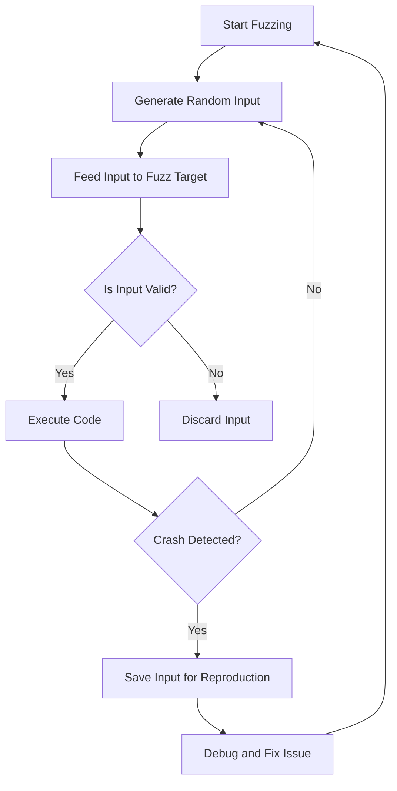

## 22.13. Fuzz Testing with `cargo-fuzz`

### Introduction to Fuzz Testing

Fuzz testing, or fuzzing, is an automated software testing technique that involves providing invalid, unexpected, or random data as inputs to a computer program. The primary goal of fuzz testing is to uncover vulnerabilities, bugs, and unexpected behaviors that might not be discovered through traditional testing methods. By bombarding the program with a wide array of inputs, fuzz testing can expose edge cases and security vulnerabilities that could lead to crashes, memory leaks, or other undesirable outcomes.

### Benefits of Fuzz Testing

1. **Uncover Hidden Bugs**: Fuzz testing can reveal bugs that are not easily detected through conventional testing methods.
2. **Enhance Security**: By identifying vulnerabilities, fuzz testing helps in securing applications against potential exploits.
3. **Improve Code Robustness**: Regular fuzz testing ensures that the code can handle unexpected inputs gracefully.
4. **Automated Testing**: Fuzz testing can be automated, making it a cost-effective way to test large codebases.

### Introducing `cargo-fuzz`

`cargo-fuzz` is a tool designed to integrate fuzz testing into Rust projects seamlessly. It leverages the power of LLVM's libFuzzer, a library for coverage-guided fuzz testing, to provide a robust framework for discovering bugs in Rust code. `cargo-fuzz` simplifies the process of setting up and running fuzz tests, making it accessible even to those new to fuzz testing.

#### Key Features of `cargo-fuzz`

- **Ease of Integration**: `cargo-fuzz` integrates smoothly with existing Rust projects.
- **Coverage-Guided Fuzzing**: Utilizes code coverage information to guide the fuzzing process, increasing the likelihood of discovering bugs.
- **Crash Reproduction**: Provides tools to reproduce crashes, aiding in debugging and fixing issues.
- **Customizable Fuzz Targets**: Allows developers to define specific parts of the code to fuzz.

### Setting Up `cargo-fuzz`

To start using `cargo-fuzz`, you need to have Rust and Cargo installed on your system. Follow these steps to set up `cargo-fuzz` in your Rust project:

1. **Install `cargo-fuzz`**: You can install `cargo-fuzz` using Cargo, the Rust package manager, with the following command:

   ```bash
   cargo install cargo-fuzz
   ```

2. **Add a Fuzz Target**: Navigate to your Rust project directory and add a new fuzz target using:

   ```bash
   cargo fuzz init
   ```

   This command creates a `fuzz` directory in your project with a default fuzz target.

3. **Define the Fuzz Target**: Open the `fuzz_targets` directory and edit the `fuzz_target_1.rs` file. This file contains the entry point for your fuzz test. Here's a simple example:

   ```rust
   // fuzz_targets/fuzz_target_1.rs
   extern crate libfuzzer_sys;
   extern crate your_crate;

   fuzz_target!(|data: &[u8]| {
       // Your fuzzing logic here
       if let Ok(input) = std::str::from_utf8(data) {
           your_crate::function_to_test(input);
       }
   });
   ```

   In this example, `function_to_test` is a function from your crate that you want to fuzz.

### Running Fuzz Tests

Once you have defined your fuzz target, you can start fuzzing using the following command:

```bash
cargo fuzz run fuzz_target_1
```

This command will start the fuzzing process, generating random inputs and feeding them to the specified fuzz target. The fuzzing process will continue until you manually stop it or until it discovers a crash.

### Interpreting Results and Reproducing Crashes

When `cargo-fuzz` discovers a crash, it will save the input that caused the crash in the `artifacts` directory. You can use this input to reproduce the crash and debug the issue.

#### Reproducing a Crash

To reproduce a crash, you can run the fuzz target with the specific input that caused the crash:

```bash
cargo fuzz run fuzz_target_1 -- path/to/crash/input
```

This command will execute the fuzz target with the provided input, allowing you to observe and debug the crash.

### Best Practices for Fuzz Testing

1. **Write Fuzz-Friendly Code**: Ensure your code can handle unexpected inputs gracefully. Use Rust's type system and error handling features to manage invalid inputs.
2. **Limit Side Effects**: Fuzz targets should be deterministic and free of side effects to ensure reproducibility of crashes.
3. **Use Coverage Information**: Leverage coverage reports to identify untested code paths and improve fuzzing effectiveness.
4. **Handle Untrusted Input Safely**: Always validate and sanitize inputs, especially when dealing with untrusted data sources.

### Handling Untrusted Input

When fuzz testing, it's crucial to handle untrusted input safely to prevent security vulnerabilities. Here are some tips:

- **Validate Input**: Use Rust's type system to enforce input constraints and validate data before processing.
- **Sanitize Data**: Remove or escape potentially harmful data to prevent injection attacks.
- **Use Safe APIs**: Prefer safe Rust APIs over unsafe ones to minimize the risk of memory safety issues.

### Visualizing the Fuzzing Process

To better understand the fuzzing process, let's visualize how `cargo-fuzz` interacts with your Rust code:



**Diagram Description**: This flowchart illustrates the fuzzing process, where random inputs are generated and fed to the fuzz target. If a crash is detected, the input is saved for reproduction and debugging.

### References and Further Reading

- [cargo-fuzz GitHub Repository](https://github.com/rust-fuzz/cargo-fuzz)
- [Rust Fuzz Book](https://rust-fuzz.github.io/book/)
- [LLVM's libFuzzer Documentation](https://llvm.org/docs/LibFuzzer.html)

### Knowledge Check

- **What is fuzz testing, and why is it important?**
- **How does `cargo-fuzz` integrate with Rust projects?**
- **What are some best practices for writing fuzz-friendly code?**

### Embrace the Journey

Remember, fuzz testing is a powerful tool in your testing arsenal. By integrating `cargo-fuzz` into your Rust projects, you can uncover hidden bugs and enhance the security and robustness of your applications. Keep experimenting, stay curious, and enjoy the journey of making your code more resilient!

## Quiz Time!



### What is the primary goal of fuzz testing?

- [x] To uncover vulnerabilities and unexpected behaviors
- [ ] To improve code readability
- [ ] To optimize performance
- [ ] To refactor code

> **Explanation:** Fuzz testing aims to uncover vulnerabilities and unexpected behaviors by providing random inputs to the program.

### Which tool does `cargo-fuzz` leverage for fuzz testing?

- [x] LLVM's libFuzzer
- [ ] Google's AFL
- [ ] Valgrind
- [ ] Clang Static Analyzer

> **Explanation:** `cargo-fuzz` uses LLVM's libFuzzer for coverage-guided fuzz testing.

### How do you install `cargo-fuzz`?

- [x] `cargo install cargo-fuzz`
- [ ] `rustup install cargo-fuzz`
- [ ] `apt-get install cargo-fuzz`
- [ ] `brew install cargo-fuzz`

> **Explanation:** `cargo-fuzz` is installed using Cargo with the command `cargo install cargo-fuzz`.

### What is the purpose of the `fuzz_target!` macro?

- [x] To define the entry point for a fuzz test
- [ ] To generate random inputs
- [ ] To compile the Rust project
- [ ] To run unit tests

> **Explanation:** The `fuzz_target!` macro defines the entry point for a fuzz test in `cargo-fuzz`.

### How can you reproduce a crash found by `cargo-fuzz`?

- [x] By running the fuzz target with the specific input that caused the crash
- [ ] By re-running the entire fuzzing process
- [ ] By analyzing the code manually
- [ ] By using a debugger

> **Explanation:** You can reproduce a crash by running the fuzz target with the specific input that caused the crash.

### What should you do if `cargo-fuzz` discovers a crash?

- [x] Save the input that caused the crash for reproduction and debugging
- [ ] Ignore it and continue fuzzing
- [ ] Immediately fix the code without further analysis
- [ ] Re-run the fuzzing process

> **Explanation:** When a crash is discovered, the input should be saved for reproduction and debugging.

### What is a best practice for writing fuzz-friendly code?

- [x] Ensure the code can handle unexpected inputs gracefully
- [ ] Use unsafe Rust APIs
- [ ] Avoid error handling
- [ ] Write code without tests

> **Explanation:** Fuzz-friendly code should handle unexpected inputs gracefully to prevent crashes and vulnerabilities.

### What is the role of coverage information in fuzz testing?

- [x] To guide the fuzzing process and increase the likelihood of discovering bugs
- [ ] To improve code readability
- [ ] To optimize performance
- [ ] To refactor code

> **Explanation:** Coverage information guides the fuzzing process, helping to discover more bugs.

### Which of the following is NOT a benefit of fuzz testing?

- [ ] Uncover hidden bugs
- [ ] Enhance security
- [ ] Improve code robustness
- [x] Increase code complexity

> **Explanation:** Fuzz testing aims to uncover bugs, enhance security, and improve robustness, not increase complexity.

### True or False: Fuzz testing can be automated.

- [x] True
- [ ] False

> **Explanation:** Fuzz testing can be automated, making it a cost-effective way to test large codebases.




